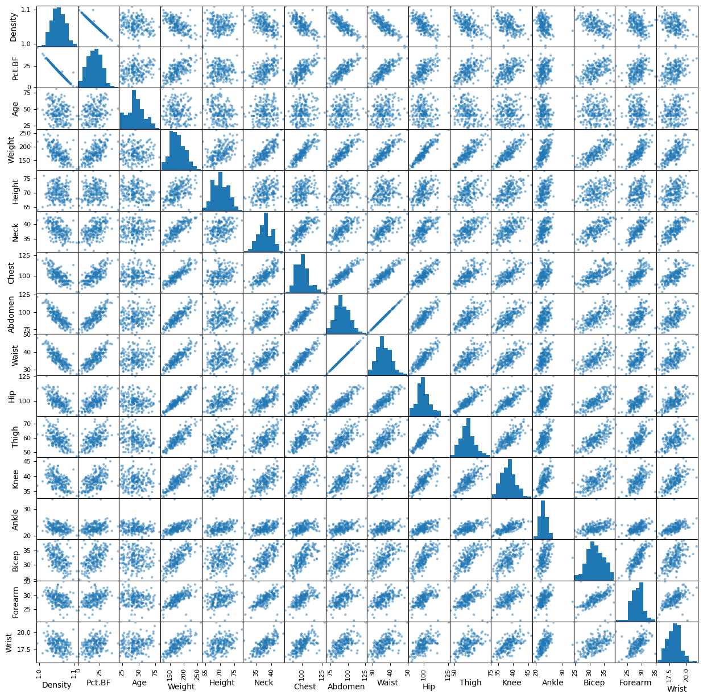
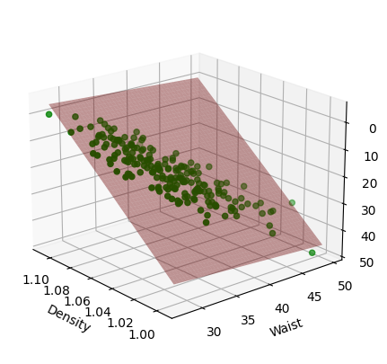
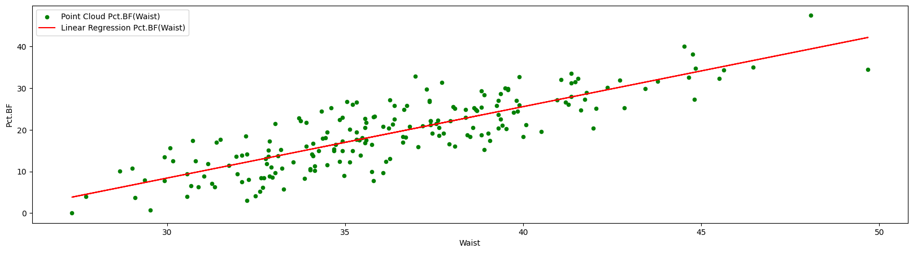
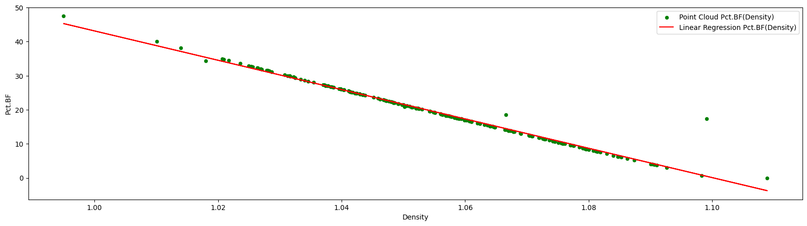

# Body Fat Percentage Prediction
Authors: [RedSkittleFox](https://github.com/RedSkittleFox), [DJAltair](https://github.com/DJAltair)

# Get the Data

## Load the Data


```python
import os
import pandas as pd
import numpy as np 

pctbf_all : pd.DataFrame = pd.read_csv(os.path.join("data", "pctbf_data.csv"), sep="\t")
pctbf_all.head()
```


<div>
<style scoped>
    .dataframe tbody tr th:only-of-type {
        vertical-align: middle;
    }

    .dataframe tbody tr th {
        vertical-align: top;
    }

    .dataframe thead th {
        text-align: right;
    }
</style>
<table border="1" class="dataframe">
  <thead>
    <tr style="text-align: right;">
      <th></th>
      <th>Density</th>
      <th>Pct.BF</th>
      <th>Age</th>
      <th>Weight</th>
      <th>Height</th>
      <th>Neck</th>
      <th>Chest</th>
      <th>Abdomen</th>
      <th>Waist</th>
      <th>Hip</th>
      <th>Thigh</th>
      <th>Knee</th>
      <th>Ankle</th>
      <th>Bicep</th>
      <th>Forearm</th>
      <th>Wrist</th>
    </tr>
  </thead>
  <tbody>
    <tr>
      <th>0</th>
      <td>1.0708</td>
      <td>12.3</td>
      <td>23</td>
      <td>154.25</td>
      <td>67.75</td>
      <td>36.2</td>
      <td>93.1</td>
      <td>85.2</td>
      <td>33.543307</td>
      <td>94.5</td>
      <td>59.0</td>
      <td>37.3</td>
      <td>21.9</td>
      <td>32.0</td>
      <td>27.4</td>
      <td>17.1</td>
    </tr>
    <tr>
      <th>1</th>
      <td>1.0853</td>
      <td>6.1</td>
      <td>22</td>
      <td>173.25</td>
      <td>72.25</td>
      <td>38.5</td>
      <td>93.6</td>
      <td>83.0</td>
      <td>32.677165</td>
      <td>98.7</td>
      <td>58.7</td>
      <td>37.3</td>
      <td>23.4</td>
      <td>30.5</td>
      <td>28.9</td>
      <td>18.2</td>
    </tr>
    <tr>
      <th>2</th>
      <td>1.0414</td>
      <td>25.3</td>
      <td>22</td>
      <td>154.00</td>
      <td>66.25</td>
      <td>34.0</td>
      <td>95.8</td>
      <td>87.9</td>
      <td>34.606299</td>
      <td>99.2</td>
      <td>59.6</td>
      <td>38.9</td>
      <td>24.0</td>
      <td>28.8</td>
      <td>25.2</td>
      <td>16.6</td>
    </tr>
    <tr>
      <th>3</th>
      <td>1.0751</td>
      <td>10.4</td>
      <td>26</td>
      <td>184.75</td>
      <td>72.25</td>
      <td>37.4</td>
      <td>101.8</td>
      <td>86.4</td>
      <td>34.015748</td>
      <td>101.2</td>
      <td>60.1</td>
      <td>37.3</td>
      <td>22.8</td>
      <td>32.4</td>
      <td>29.4</td>
      <td>18.2</td>
    </tr>
    <tr>
      <th>4</th>
      <td>1.0340</td>
      <td>28.7</td>
      <td>24</td>
      <td>184.25</td>
      <td>71.25</td>
      <td>34.4</td>
      <td>97.3</td>
      <td>100.0</td>
      <td>39.370079</td>
      <td>101.9</td>
      <td>63.2</td>
      <td>42.2</td>
      <td>24.0</td>
      <td>32.2</td>
      <td>27.7</td>
      <td>17.7</td>
    </tr>
  </tbody>
</table>
</div>


## Create the Test and Train Sets


```python
from sklearn.model_selection import train_test_split

pctbf_data, pctbf_test = train_test_split(pctbf_all, test_size=0.2, random_state=42)
```

## Discover the Data


```python
pctbf_all.describe()
```


<div>
<style scoped>
    .dataframe tbody tr th:only-of-type {
        vertical-align: middle;
    }

    .dataframe tbody tr th {
        vertical-align: top;
    }

    .dataframe thead th {
        text-align: right;
    }
</style>
<table border="1" class="dataframe">
  <thead>
    <tr style="text-align: right;">
      <th></th>
      <th>Density</th>
      <th>Pct.BF</th>
      <th>Age</th>
      <th>Weight</th>
      <th>Height</th>
      <th>Neck</th>
      <th>Chest</th>
      <th>Abdomen</th>
      <th>Waist</th>
      <th>Hip</th>
      <th>Thigh</th>
      <th>Knee</th>
      <th>Ankle</th>
      <th>Bicep</th>
      <th>Forearm</th>
      <th>Wrist</th>
    </tr>
  </thead>
  <tbody>
    <tr>
      <th>count</th>
      <td>250.000000</td>
      <td>250.0000</td>
      <td>250.000000</td>
      <td>250.000000</td>
      <td>250.000000</td>
      <td>250.000000</td>
      <td>250.000000</td>
      <td>250.000000</td>
      <td>250.000000</td>
      <td>250.000000</td>
      <td>250.000000</td>
      <td>250.000000</td>
      <td>250.000000</td>
      <td>250.000000</td>
      <td>250.000000</td>
      <td>250.000000</td>
    </tr>
    <tr>
      <th>mean</th>
      <td>1.055838</td>
      <td>19.0316</td>
      <td>44.884000</td>
      <td>178.083200</td>
      <td>70.303000</td>
      <td>37.944800</td>
      <td>100.662000</td>
      <td>92.286800</td>
      <td>36.333386</td>
      <td>99.651200</td>
      <td>59.249600</td>
      <td>38.532800</td>
      <td>23.074000</td>
      <td>32.217200</td>
      <td>28.662400</td>
      <td>18.220400</td>
    </tr>
    <tr>
      <th>std</th>
      <td>0.018875</td>
      <td>8.2940</td>
      <td>12.652227</td>
      <td>27.035488</td>
      <td>2.616644</td>
      <td>2.290454</td>
      <td>8.153765</td>
      <td>10.207444</td>
      <td>4.018679</td>
      <td>6.443634</td>
      <td>4.912309</td>
      <td>2.314136</td>
      <td>1.650436</td>
      <td>2.922449</td>
      <td>2.028677</td>
      <td>0.913983</td>
    </tr>
    <tr>
      <th>min</th>
      <td>0.995000</td>
      <td>0.0000</td>
      <td>22.000000</td>
      <td>118.500000</td>
      <td>64.000000</td>
      <td>31.100000</td>
      <td>79.300000</td>
      <td>69.400000</td>
      <td>27.322835</td>
      <td>85.000000</td>
      <td>47.200000</td>
      <td>33.000000</td>
      <td>19.100000</td>
      <td>24.800000</td>
      <td>21.000000</td>
      <td>15.800000</td>
    </tr>
    <tr>
      <th>25%</th>
      <td>1.041650</td>
      <td>12.4250</td>
      <td>35.250000</td>
      <td>158.500000</td>
      <td>68.250000</td>
      <td>36.400000</td>
      <td>94.250000</td>
      <td>84.525000</td>
      <td>33.277559</td>
      <td>95.500000</td>
      <td>56.000000</td>
      <td>36.925000</td>
      <td>22.000000</td>
      <td>30.200000</td>
      <td>27.300000</td>
      <td>17.600000</td>
    </tr>
    <tr>
      <th>50%</th>
      <td>1.054950</td>
      <td>19.2000</td>
      <td>43.000000</td>
      <td>176.125000</td>
      <td>70.000000</td>
      <td>38.000000</td>
      <td>99.600000</td>
      <td>90.900000</td>
      <td>35.787402</td>
      <td>99.300000</td>
      <td>58.950000</td>
      <td>38.450000</td>
      <td>22.800000</td>
      <td>32.000000</td>
      <td>28.700000</td>
      <td>18.300000</td>
    </tr>
    <tr>
      <th>75%</th>
      <td>1.070400</td>
      <td>25.2000</td>
      <td>54.000000</td>
      <td>196.750000</td>
      <td>72.250000</td>
      <td>39.400000</td>
      <td>105.300000</td>
      <td>99.175000</td>
      <td>39.045276</td>
      <td>103.175000</td>
      <td>62.250000</td>
      <td>39.875000</td>
      <td>24.000000</td>
      <td>34.300000</td>
      <td>30.000000</td>
      <td>18.800000</td>
    </tr>
    <tr>
      <th>max</th>
      <td>1.108900</td>
      <td>47.5000</td>
      <td>81.000000</td>
      <td>262.750000</td>
      <td>77.750000</td>
      <td>43.900000</td>
      <td>128.300000</td>
      <td>126.200000</td>
      <td>49.685039</td>
      <td>125.600000</td>
      <td>74.400000</td>
      <td>46.000000</td>
      <td>33.900000</td>
      <td>39.100000</td>
      <td>34.900000</td>
      <td>21.400000</td>
    </tr>
  </tbody>
</table>
</div>


```python
pctbf_all.corr()
```


<div>
<style scoped>
    .dataframe tbody tr th:only-of-type {
        vertical-align: middle;
    }

    .dataframe tbody tr th {
        vertical-align: top;
    }

    .dataframe thead th {
        text-align: right;
    }
</style>
<table border="1" class="dataframe">
  <thead>
    <tr style="text-align: right;">
      <th></th>
      <th>Density</th>
      <th>Pct.BF</th>
      <th>Age</th>
      <th>Weight</th>
      <th>Height</th>
      <th>Neck</th>
      <th>Chest</th>
      <th>Abdomen</th>
      <th>Waist</th>
      <th>Hip</th>
      <th>Thigh</th>
      <th>Knee</th>
      <th>Ankle</th>
      <th>Bicep</th>
      <th>Forearm</th>
      <th>Wrist</th>
    </tr>
  </thead>
  <tbody>
    <tr>
      <th>Density</th>
      <td>1.000000</td>
      <td>-0.987480</td>
      <td>-0.280862</td>
      <td>-0.598372</td>
      <td>0.043423</td>
      <td>-0.470465</td>
      <td>-0.680275</td>
      <td>-0.809042</td>
      <td>-0.809042</td>
      <td>-0.616443</td>
      <td>-0.542792</td>
      <td>-0.478874</td>
      <td>-0.244258</td>
      <td>-0.475840</td>
      <td>-0.354636</td>
      <td>-0.317813</td>
    </tr>
    <tr>
      <th>Pct.BF</th>
      <td>-0.987480</td>
      <td>1.000000</td>
      <td>0.295051</td>
      <td>0.617299</td>
      <td>-0.029390</td>
      <td>0.488524</td>
      <td>0.700670</td>
      <td>0.823685</td>
      <td>0.823685</td>
      <td>0.632675</td>
      <td>0.548550</td>
      <td>0.492308</td>
      <td>0.244556</td>
      <td>0.481538</td>
      <td>0.364709</td>
      <td>0.339008</td>
    </tr>
    <tr>
      <th>Age</th>
      <td>-0.280862</td>
      <td>0.295051</td>
      <td>1.000000</td>
      <td>-0.016055</td>
      <td>-0.245887</td>
      <td>0.118738</td>
      <td>0.181815</td>
      <td>0.242780</td>
      <td>0.242780</td>
      <td>-0.058134</td>
      <td>-0.216084</td>
      <td>0.017194</td>
      <td>-0.109616</td>
      <td>-0.044141</td>
      <td>-0.085116</td>
      <td>0.217506</td>
    </tr>
    <tr>
      <th>Weight</th>
      <td>-0.598372</td>
      <td>0.617299</td>
      <td>-0.016055</td>
      <td>1.000000</td>
      <td>0.512913</td>
      <td>0.810014</td>
      <td>0.891286</td>
      <td>0.873735</td>
      <td>0.873735</td>
      <td>0.932691</td>
      <td>0.852116</td>
      <td>0.842744</td>
      <td>0.580906</td>
      <td>0.785214</td>
      <td>0.683333</td>
      <td>0.725104</td>
    </tr>
    <tr>
      <th>Height</th>
      <td>0.043423</td>
      <td>-0.029390</td>
      <td>-0.245887</td>
      <td>0.512913</td>
      <td>1.000000</td>
      <td>0.324664</td>
      <td>0.223590</td>
      <td>0.186690</td>
      <td>0.186690</td>
      <td>0.396724</td>
      <td>0.349590</td>
      <td>0.512906</td>
      <td>0.394547</td>
      <td>0.318573</td>
      <td>0.321990</td>
      <td>0.396985</td>
    </tr>
    <tr>
      <th>Neck</th>
      <td>-0.470465</td>
      <td>0.488524</td>
      <td>0.118738</td>
      <td>0.810014</td>
      <td>0.324664</td>
      <td>1.000000</td>
      <td>0.768811</td>
      <td>0.728487</td>
      <td>0.728487</td>
      <td>0.707518</td>
      <td>0.668847</td>
      <td>0.648166</td>
      <td>0.434398</td>
      <td>0.708525</td>
      <td>0.660787</td>
      <td>0.731185</td>
    </tr>
    <tr>
      <th>Chest</th>
      <td>-0.680275</td>
      <td>0.700670</td>
      <td>0.181815</td>
      <td>0.891286</td>
      <td>0.223590</td>
      <td>0.768811</td>
      <td>1.000000</td>
      <td>0.910069</td>
      <td>0.910069</td>
      <td>0.824908</td>
      <td>0.707588</td>
      <td>0.697603</td>
      <td>0.447086</td>
      <td>0.706891</td>
      <td>0.599353</td>
      <td>0.644477</td>
    </tr>
    <tr>
      <th>Abdomen</th>
      <td>-0.809042</td>
      <td>0.823685</td>
      <td>0.242780</td>
      <td>0.873735</td>
      <td>0.186690</td>
      <td>0.728487</td>
      <td>0.910069</td>
      <td>1.000000</td>
      <td>1.000000</td>
      <td>0.860517</td>
      <td>0.737008</td>
      <td>0.710425</td>
      <td>0.407464</td>
      <td>0.656316</td>
      <td>0.530138</td>
      <td>0.602325</td>
    </tr>
    <tr>
      <th>Waist</th>
      <td>-0.809042</td>
      <td>0.823685</td>
      <td>0.242780</td>
      <td>0.873735</td>
      <td>0.186690</td>
      <td>0.728487</td>
      <td>0.910069</td>
      <td>1.000000</td>
      <td>1.000000</td>
      <td>0.860517</td>
      <td>0.737008</td>
      <td>0.710425</td>
      <td>0.407464</td>
      <td>0.656316</td>
      <td>0.530138</td>
      <td>0.602325</td>
    </tr>
    <tr>
      <th>Hip</th>
      <td>-0.616443</td>
      <td>0.632675</td>
      <td>-0.058134</td>
      <td>0.932691</td>
      <td>0.396724</td>
      <td>0.707518</td>
      <td>0.824908</td>
      <td>0.860517</td>
      <td>0.860517</td>
      <td>1.000000</td>
      <td>0.881130</td>
      <td>0.809155</td>
      <td>0.521185</td>
      <td>0.721649</td>
      <td>0.603274</td>
      <td>0.626401</td>
    </tr>
    <tr>
      <th>Thigh</th>
      <td>-0.542792</td>
      <td>0.548550</td>
      <td>-0.216084</td>
      <td>0.852116</td>
      <td>0.349590</td>
      <td>0.668847</td>
      <td>0.707588</td>
      <td>0.737008</td>
      <td>0.737008</td>
      <td>0.881130</td>
      <td>1.000000</td>
      <td>0.777474</td>
      <td>0.503554</td>
      <td>0.744016</td>
      <td>0.604301</td>
      <td>0.543670</td>
    </tr>
    <tr>
      <th>Knee</th>
      <td>-0.478874</td>
      <td>0.492308</td>
      <td>0.017194</td>
      <td>0.842744</td>
      <td>0.512906</td>
      <td>0.648166</td>
      <td>0.697603</td>
      <td>0.710425</td>
      <td>0.710425</td>
      <td>0.809155</td>
      <td>0.777474</td>
      <td>1.000000</td>
      <td>0.585158</td>
      <td>0.654161</td>
      <td>0.578554</td>
      <td>0.655728</td>
    </tr>
    <tr>
      <th>Ankle</th>
      <td>-0.244258</td>
      <td>0.244556</td>
      <td>-0.109616</td>
      <td>0.580906</td>
      <td>0.394547</td>
      <td>0.434398</td>
      <td>0.447086</td>
      <td>0.407464</td>
      <td>0.407464</td>
      <td>0.521185</td>
      <td>0.503554</td>
      <td>0.585158</td>
      <td>1.000000</td>
      <td>0.449042</td>
      <td>0.429429</td>
      <td>0.544988</td>
    </tr>
    <tr>
      <th>Bicep</th>
      <td>-0.475840</td>
      <td>0.481538</td>
      <td>-0.044141</td>
      <td>0.785214</td>
      <td>0.318573</td>
      <td>0.708525</td>
      <td>0.706891</td>
      <td>0.656316</td>
      <td>0.656316</td>
      <td>0.721649</td>
      <td>0.744016</td>
      <td>0.654161</td>
      <td>0.449042</td>
      <td>1.000000</td>
      <td>0.701097</td>
      <td>0.613674</td>
    </tr>
    <tr>
      <th>Forearm</th>
      <td>-0.354636</td>
      <td>0.364709</td>
      <td>-0.085116</td>
      <td>0.683333</td>
      <td>0.321990</td>
      <td>0.660787</td>
      <td>0.599353</td>
      <td>0.530138</td>
      <td>0.530138</td>
      <td>0.603274</td>
      <td>0.604301</td>
      <td>0.578554</td>
      <td>0.429429</td>
      <td>0.701097</td>
      <td>1.000000</td>
      <td>0.598328</td>
    </tr>
    <tr>
      <th>Wrist</th>
      <td>-0.317813</td>
      <td>0.339008</td>
      <td>0.217506</td>
      <td>0.725104</td>
      <td>0.396985</td>
      <td>0.731185</td>
      <td>0.644477</td>
      <td>0.602325</td>
      <td>0.602325</td>
      <td>0.626401</td>
      <td>0.543670</td>
      <td>0.655728</td>
      <td>0.544988</td>
      <td>0.613674</td>
      <td>0.598328</td>
      <td>1.000000</td>
    </tr>
  </tbody>
</table>
</div>


```python
from pandas.plotting import scatter_matrix
scatter_matrix(
    pctbf_data,
    figsize = [15, 15]
    );
```


    

    


# Prepare the Data for the Linear Regression

## Remove attributes with |CORR| < 0.5
We remove the attributes that have the correlation lower than 0.5 in relation to Pct.BF


```python
pctbf_data_corr_filtered = pctbf_data.copy()
pctbf_corr = pctbf_all.corr()
columns = pctbf_data.columns.copy()

for name_c in columns:
    if name_c == "Pct.BF":
        continue
    if abs(pctbf_corr[name_c]["Pct.BF"]) <= 0.5:
            if name_c in pctbf_data_corr_filtered.columns:
                pctbf_data_corr_filtered = pctbf_data_corr_filtered.drop(name_c, axis=1)
            
        
print(pctbf_data_corr_filtered)

```

         Density  Pct.BF  Weight  Chest  Abdomen      Waist    Hip  Thigh
    132   1.0435    24.4  168.25   98.4     87.2  34.330709   98.4   56.0
    225   1.0418    25.2  198.50  105.3     96.7  38.070866  106.6   64.0
    238   1.0599    17.0  127.50   93.0     79.7  31.377953   87.6   50.7
    119   1.0414    25.3  185.25   99.2     98.1  38.622047  101.4   57.1
    136   1.0481    22.4  168.25   98.3     88.5  34.842520   98.3   58.1
    ..       ...     ...     ...    ...      ...        ...    ...    ...
    106   1.0593    17.3  194.00  110.1     88.7  34.921260  102.1   57.5
    14    1.0484    22.1  187.75  101.3     96.4  37.952756  100.1   69.0
    92    1.0785     9.0  184.25   99.6     88.8  34.960630  101.4   57.4
    179   1.1089     0.0  118.50   79.3     69.4  27.322835   85.0   47.2
    102   1.0412    25.4  177.00  104.0     98.6  38.818898   99.5   59.5
    
    [200 rows x 8 columns]
    

## Remove attributes with high corelation in relation to each other
We remove these attributes, that are very highly correlated to each other, they can impair the end results.


```python
corr = pctbf_data_corr_filtered.corr()

for name_c in pctbf_data_corr_filtered.columns:
    if name_c == "Pct.BF": continue
    for name_r in pctbf_data_corr_filtered.columns:
        if name_r == "Pct.BF": continue
        if name_r == name_c: continue
        v = corr[name_c][name_r]
        if v > 0.99:
            print(f"{name_c} x {name_r} = {v}")
```

    Abdomen x Waist = 0.9999999999999979
    Waist x Abdomen = 0.9999999999999979
    

We decided to remove one of them - abdomen.


```python
pctbf_data_corr_filtered = pctbf_data_corr_filtered.drop("Abdomen", axis=1)
pctbf_data_corr_filtered
```


<div>
<style scoped>
    .dataframe tbody tr th:only-of-type {
        vertical-align: middle;
    }

    .dataframe tbody tr th {
        vertical-align: top;
    }

    .dataframe thead th {
        text-align: right;
    }
</style>
<table border="1" class="dataframe">
  <thead>
    <tr style="text-align: right;">
      <th></th>
      <th>Density</th>
      <th>Pct.BF</th>
      <th>Weight</th>
      <th>Chest</th>
      <th>Waist</th>
      <th>Hip</th>
      <th>Thigh</th>
    </tr>
  </thead>
  <tbody>
    <tr>
      <th>132</th>
      <td>1.0435</td>
      <td>24.4</td>
      <td>168.25</td>
      <td>98.4</td>
      <td>34.330709</td>
      <td>98.4</td>
      <td>56.0</td>
    </tr>
    <tr>
      <th>225</th>
      <td>1.0418</td>
      <td>25.2</td>
      <td>198.50</td>
      <td>105.3</td>
      <td>38.070866</td>
      <td>106.6</td>
      <td>64.0</td>
    </tr>
    <tr>
      <th>238</th>
      <td>1.0599</td>
      <td>17.0</td>
      <td>127.50</td>
      <td>93.0</td>
      <td>31.377953</td>
      <td>87.6</td>
      <td>50.7</td>
    </tr>
    <tr>
      <th>119</th>
      <td>1.0414</td>
      <td>25.3</td>
      <td>185.25</td>
      <td>99.2</td>
      <td>38.622047</td>
      <td>101.4</td>
      <td>57.1</td>
    </tr>
    <tr>
      <th>136</th>
      <td>1.0481</td>
      <td>22.4</td>
      <td>168.25</td>
      <td>98.3</td>
      <td>34.842520</td>
      <td>98.3</td>
      <td>58.1</td>
    </tr>
    <tr>
      <th>...</th>
      <td>...</td>
      <td>...</td>
      <td>...</td>
      <td>...</td>
      <td>...</td>
      <td>...</td>
      <td>...</td>
    </tr>
    <tr>
      <th>106</th>
      <td>1.0593</td>
      <td>17.3</td>
      <td>194.00</td>
      <td>110.1</td>
      <td>34.921260</td>
      <td>102.1</td>
      <td>57.5</td>
    </tr>
    <tr>
      <th>14</th>
      <td>1.0484</td>
      <td>22.1</td>
      <td>187.75</td>
      <td>101.3</td>
      <td>37.952756</td>
      <td>100.1</td>
      <td>69.0</td>
    </tr>
    <tr>
      <th>92</th>
      <td>1.0785</td>
      <td>9.0</td>
      <td>184.25</td>
      <td>99.6</td>
      <td>34.960630</td>
      <td>101.4</td>
      <td>57.4</td>
    </tr>
    <tr>
      <th>179</th>
      <td>1.1089</td>
      <td>0.0</td>
      <td>118.50</td>
      <td>79.3</td>
      <td>27.322835</td>
      <td>85.0</td>
      <td>47.2</td>
    </tr>
    <tr>
      <th>102</th>
      <td>1.0412</td>
      <td>25.4</td>
      <td>177.00</td>
      <td>104.0</td>
      <td>38.818898</td>
      <td>99.5</td>
      <td>59.5</td>
    </tr>
  </tbody>
</table>
<p>200 rows × 7 columns</p>
</div>


## Remove variables based on their significance

Based on this algorithm we create the extended version of the Linear Regression model which calculates p-values.
https://www.datacourses.com/find-p-value-significance-in-scikit-learn-3810/ (visited on 30-03-2024)


```python
from sklearn import linear_model
from scipy import stats
import scipy as sc
import numpy as np
from sklearn.metrics import mean_squared_error

class LinearRegression(linear_model.LinearRegression):

    def __init__(self,*, fit_intercept=True, copy_X=True, n_jobs=None, positive=False):
        super(LinearRegression,self).__init__(fit_intercept=fit_intercept,copy_X=copy_X,n_jobs=n_jobs,positive=positive)

    # Adding in t-statistics for the coefficients.
    def fit(self,X,y):
        self = super(LinearRegression, self).fit(X,y)
        params = np.append(self.intercept_, self.coef_)
        predictions = self.predict(X)
        new_X = np.append(np.ones((len(X),1)), X, axis=1) # Add row of ones
        M_S_E = (sum((y-predictions)**2))/(len(new_X)-len(new_X[0]))

        # Compute the variance
        # Var = MSE + y^(-2)
        v_b = M_S_E*(np.linalg.inv(
            np.dot(new_X.T,new_X) # Multiply two 2D matrices
            ).diagonal())

        # STD = SQRT(Var)
        s_b = np.sqrt(v_b)

        # Compute t-statistics
        t_b = params / s_b

        # Compute p-valeus
        # p-value = 2 * P(TS >= |ts| | H0 is true) = 2 * (1 - cdf(|ts|))
        p_val =[2*(1-stats.t.cdf(np.abs(i),(len(new_X)-len(new_X[0])))) for i in t_b]
        p_val = np.round(p_val,3)
        self.p_values = p_val[1:]
        self.intercept_p_value = p_val[0]
```

Compute the significance of the parameters.


```python
import matplotlib.pyplot as plt
import sys

from sklearn.feature_selection import f_regression
from sklearn.metrics import mean_squared_error

pctbf_elim1 = pctbf_data_corr_filtered.drop(["Pct.BF"], axis=1)
pctbf_var = pctbf_data_corr_filtered["Pct.BF"]

X = pctbf_data_corr_filtered.drop(["Pct.BF"], axis=1).copy()
Y = pctbf_data_corr_filtered["Pct.BF"]

reg = LinearRegression()
reg.fit(X, Y)
print(reg.p_values)

for i, v in enumerate(X.columns):
    print(f"{v} = {reg.p_values[i]}")
```

    [0.    0.629 0.62  0.186 0.38  0.039]
    Density = 0.0
    Weight = 0.629
    Chest = 0.62
    Waist = 0.186
    Hip = 0.38
    Thigh = 0.039
    

Recursively remove the parameters that are the least significant (the lowest p-value).


```python
p_significant = 0.05

while True:
    if len(X.columns) <= 1:
        break

    idx = pd.Series(reg.p_values).idxmax()

    print(f"Variables = {X.columns}")
    print(f"Max p_value : { X.columns[idx] } => { reg.p_values[idx] } ")

    if(reg.p_values[idx] <= p_significant):
        break

    X_tmp = X.copy()
    X_tmp = X_tmp.drop([X.columns[idx]], axis=1)

    reg = LinearRegression()
    reg.fit(X_tmp, Y)

    X = X_tmp
```

    Variables = Index(['Density', 'Weight', 'Chest', 'Waist', 'Hip', 'Thigh'], dtype='object')
    Max p_value : Weight => 0.629 
    Variables = Index(['Density', 'Chest', 'Waist', 'Hip', 'Thigh'], dtype='object')
    Max p_value : Chest => 0.412 
    Variables = Index(['Density', 'Waist', 'Hip', 'Thigh'], dtype='object')
    Max p_value : Hip => 0.196 
    Variables = Index(['Density', 'Waist', 'Thigh'], dtype='object')
    Max p_value : Thigh => 0.106 
    Variables = Index(['Density', 'Waist'], dtype='object')
    Max p_value : Density => 0.0 
    

# Evaluate Models

## Evaluate `Pct.BF(Density, Waist)`


```python
from sklearn.metrics import mean_squared_error

X = pctbf_data[["Density", "Waist"]].copy()
Y = pctbf_data["Pct.BF"].copy()
lin_reg = LinearRegression()
lin_reg.fit(X, Y)
Y_predicted = lin_reg.predict(X)

mse = mean_squared_error(Y, Y_predicted)
print(f"Train Set RMSE Pct.BF(Density, Waist) = {np.sqrt(mse)}")
print(f"Train Set R^2 = {lin_reg.score(X, Y)}")

fig = plt.figure(figsize = (20, 5))
ax = fig.add_subplot(111, projection='3d')
ax.scatter(X["Density"], X["Waist"], Y, color = 'g', label="Point Cloud Pct.BF(Density, Waist)")

X1 = np.linspace(X["Density"].min(), X["Density"].max(), 100)
X2 = np.linspace(X["Waist"].min(), X["Waist"].max(), 100)
X1, X2 = np.meshgrid(X1, X2)
func = lambda x1, x2 : lin_reg.coef_[0] * x1 + lin_reg.coef_[1] * x2 + lin_reg.intercept_
ZS = np.array(func(np.ravel(X1), np.ravel(X2)))
Z = ZS.reshape(X1.shape)

ax.set_xlabel('Density') 
ax.set_ylabel('Waist') 
ax.set_zlabel('Pct.BF') 

ax.plot_surface(X1, X2, Z, alpha = 0.4, color='r', shade = True, label="Linear Regression Pct.BF(Density, Waist)")
ax.view_init(-160, 40) 
plt.show()

X_test = pctbf_test[["Density", "Waist"]].copy()
Y_test = pctbf_test["Pct.BF"].copy()
Y_test_predicted = lin_reg.predict(X_test)

test_mse = mean_squared_error(Y_test, Y_test_predicted)
print(f"Test Set RMSE Pct.BF(Density, Waist) = {np.sqrt(test_mse)}")
print(f"Test Set R^2 = {lin_reg.score(X_test, Y_test)}")
```

    Train Set RMSE Pct.BF(Density, Waist) = 1.2545522071094009
    Train Set R^2 = 0.9776165874798942
    


    

    


    Test Set RMSE Pct.BF(Density, Waist) = 1.2954493649222067
    Test Set R^2 = 0.9719119579404796
    

## Evaluate `Pct.BF(Waist)`


```python
X = pctbf_data[["Waist"]].copy()
Y = pctbf_data["Pct.BF"].copy()
lin_reg = LinearRegression()
lin_reg.fit(X, Y)
Y_predicted = lin_reg.predict(X)

mse = mean_squared_error(Y, Y_predicted)
print(f"RMSE Pct.BF(Waist) = {np.sqrt(mse)}")
print(f"Correlation Pct.BF x Waist = {pctbf_corr['Pct.BF']['Waist']}")
print(f"R^2 = {lin_reg.score(X, Y)}")
plot = pctbf_data[["Waist","Pct.BF"]].plot.scatter(x="Waist", y="Pct.BF", figsize=(20, 5), color='g', label="Point Cloud Pct.BF(Waist)")
plot.plot(X, Y_predicted, color='r', label="Linear Regression Pct.BF(Waist)")
plot.legend()
print(plot)

X_test = pctbf_test[["Waist"]].copy()
Y_test = pctbf_test["Pct.BF"].copy()
Y_test_predicted = lin_reg.predict(X_test)

test_mse = mean_squared_error(Y_test, Y_test_predicted)
print(f"Test Set RMSE Pct.BF(Waist) = {np.sqrt(test_mse)}")
print(f"Test Set R^2 = {lin_reg.score(X_test, Y_test)}")
```

    RMSE Pct.BF(Waist) = 4.639244872257173
    Correlation Pct.BF x Waist = 0.8236846526506235
    R^2 = 0.6939140367097066
    Axes(0.125,0.11;0.775x0.77)
    Test Set RMSE Pct.BF(Waist) = 4.939974976975954
    Test Set R^2 = 0.5915582954168195
    


    

    


This model has significantly worse performance compared to the `Pct.BF(Density, Waist)` model.

## Evaluate `Pct.BF(Density)`


```python
X = pctbf_data[["Density"]].copy()
Y = pctbf_data["Pct.BF"].copy()
lin_reg = LinearRegression()
lin_reg.fit(X, Y)
Y_predicted = lin_reg.predict(X)

mse = mean_squared_error(Y, Y_predicted)
print(f"RMSE Pct.BF(Density) = {np.sqrt(mse)}")
print(f"Correlation Pct.BF x Density = {pctbf_corr['Pct.BF']['Density']}")
print(f"R^2 = {lin_reg.score(X, Y)}")
plot = pctbf_data[["Density","Pct.BF"]].plot.scatter(x="Density", y="Pct.BF", figsize=(20, 5), color='g', label="Point Cloud Pct.BF(Density)")
plot.plot(X, Y_predicted, color='r', label="Linear Regression Pct.BF(Density)")
plot.legend()
print(plot)

X_test = pctbf_test[["Density"]].copy()
Y_test = pctbf_test["Pct.BF"].copy()
Y_test_predicted = lin_reg.predict(X_test)

test_mse = mean_squared_error(Y_test, Y_test_predicted)
print(f"Test Set RMSE Pct.BF(Density) = {np.sqrt(test_mse)}")
print(f"Test Set R^2 = {lin_reg.score(X_test, Y_test)}")
```

    RMSE Pct.BF(Density) = 1.3122715039320414
    Correlation Pct.BF x Density = -0.987480274937691
    R^2 = 0.9755095808843409
    Axes(0.125,0.11;0.775x0.77)
    Test Set RMSE Pct.BF(Density) = 1.2952698966051397
    Test Set R^2 = 0.9719197398956787
    


    

    


# Conclusion

The best performing models are `Pct.BF(Density, Waist)` and `Pct.BF(Density)`. This models have almost exactly the same performance thus we can assume, that `Waist` parameter is insignificant.
