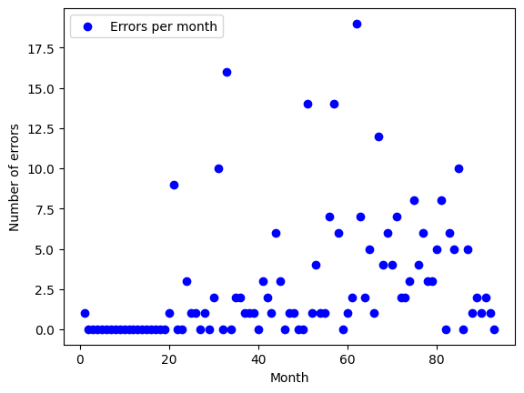
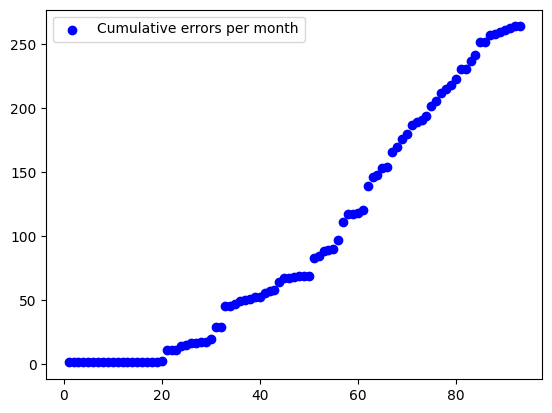
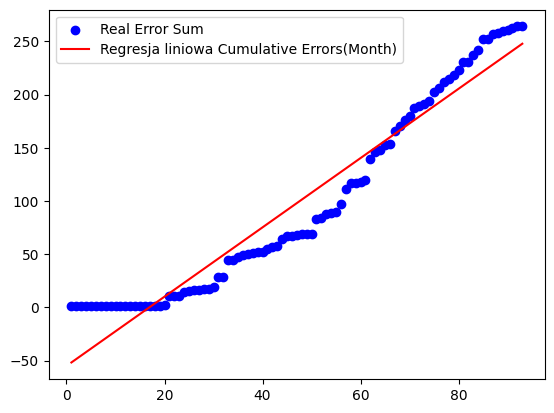
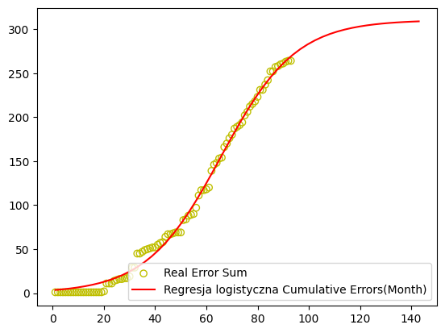
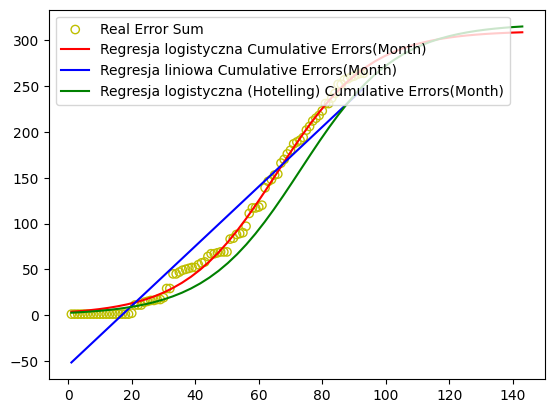

# Number of Errors
Authors: [RedSkittleFox](https://github.com/RedSkittleFox), [DJAltair](https://github.com/DJAltair)

# Get the Data


```python
import os
import pandas as pd
import numpy as np 

critical_errors_data : pd.DataFrame = pd.read_csv(os.path.join("data", "critical_errors.csv"), sep=",")
critical_errors_data.head()
```


<div>
<style scoped>
    .dataframe tbody tr th:only-of-type {
        vertical-align: middle;
    }

    .dataframe tbody tr th {
        vertical-align: top;
    }

    .dataframe thead th {
        text-align: right;
    }
</style>
<table border="1" class="dataframe">
  <thead>
    <tr style="text-align: right;">
      <th></th>
      <th>Month</th>
      <th>Errors</th>
    </tr>
  </thead>
  <tbody>
    <tr>
      <th>0</th>
      <td>1</td>
      <td>1</td>
    </tr>
    <tr>
      <th>1</th>
      <td>2</td>
      <td>0</td>
    </tr>
    <tr>
      <th>2</th>
      <td>3</td>
      <td>0</td>
    </tr>
    <tr>
      <th>3</th>
      <td>4</td>
      <td>0</td>
    </tr>
    <tr>
      <th>4</th>
      <td>5</td>
      <td>0</td>
    </tr>
  </tbody>
</table>
</div>


```python
critical_errors_data.describe()
```


<div>
<style scoped>
    .dataframe tbody tr th:only-of-type {
        vertical-align: middle;
    }

    .dataframe tbody tr th {
        vertical-align: top;
    }

    .dataframe thead th {
        text-align: right;
    }
</style>
<table border="1" class="dataframe">
  <thead>
    <tr style="text-align: right;">
      <th></th>
      <th>Month</th>
      <th>Errors</th>
    </tr>
  </thead>
  <tbody>
    <tr>
      <th>count</th>
      <td>93.000000</td>
      <td>93.00000</td>
    </tr>
    <tr>
      <th>mean</th>
      <td>47.000000</td>
      <td>2.83871</td>
    </tr>
    <tr>
      <th>std</th>
      <td>26.990739</td>
      <td>3.92398</td>
    </tr>
    <tr>
      <th>min</th>
      <td>1.000000</td>
      <td>0.00000</td>
    </tr>
    <tr>
      <th>25%</th>
      <td>24.000000</td>
      <td>0.00000</td>
    </tr>
    <tr>
      <th>50%</th>
      <td>47.000000</td>
      <td>1.00000</td>
    </tr>
    <tr>
      <th>75%</th>
      <td>70.000000</td>
      <td>4.00000</td>
    </tr>
    <tr>
      <th>max</th>
      <td>93.000000</td>
      <td>19.00000</td>
    </tr>
  </tbody>
</table>
</div>


# Data Preparation


```python
import matplotlib.pyplot as plt
plt.scatter(critical_errors_data["Month"], critical_errors_data["Errors"], color='b', label="Errors per month");
plt.xlabel("Month")
plt.ylabel("Number of errors")
plt.legend();
```


    

    


We generate new variable called `Cumulative Errors` which expresses how many errors have accumulated since the program deployment till the given month.


```python
critical_errors_data["Cumulative Errors"] = critical_errors_data["Errors"]
for i in range(1, len(critical_errors_data["Errors"])):
    critical_errors_data["Cumulative Errors"][i] = critical_errors_data["Cumulative Errors"][i] + critical_errors_data["Cumulative Errors"][i - 1]

plt.scatter(critical_errors_data["Month"], critical_errors_data["Cumulative Errors"], color='b', label="Cumulative errors per month")
plt.legend()
plt.show()
```


    

    


# Linear Model
We start by preparing the linear regression model.
$$
\text{Cumulative errors}(\text{Month}) = 3.2562293 \cdot \text{Month} - 55.0320243
$$

$RMSE = 22.52615$

$R^2 = 0.93359$


```python
from sklearn.linear_model import LinearRegression
import matplotlib.pyplot as plt
from sklearn.metrics import r2_score
from sklearn.metrics import mean_squared_error

X = critical_errors_data[["Month"]].copy()
Y = critical_errors_data["Cumulative Errors"].copy()

lin_reg = LinearRegression()
lin_reg.fit(X, Y)
Y_predicted = lin_reg.predict(X)
print(f"coef = {lin_reg.coef_}")
print(f"intercept = {lin_reg.intercept_}")

X_lin = X.copy()
Y_lin = Y_predicted.copy()

R2 = r2_score(Y_predicted, Y)
RMSE = np.sqrt(mean_squared_error(Y_predicted, Y))

print(f"R2 = {R2} | RMSE = {RMSE}")

#rozmiar kropki
plt.scatter(critical_errors_data["Month"], critical_errors_data["Cumulative Errors"], color="b", label="Real Error Sum")
plt.plot(X, Y_predicted, color='r', label="Regresja liniowa Cumulative Errors(Month)")
plt.legend()
plt.show()
```

    coef = [3.2562293]
    intercept = -55.03202431042537
    R2 = 0.933593642138264 | RMSE = 22.526152904621625
    


    

    


# Logistic Model
Logistic regression is expressed with function
$$
\hat y_t = \frac{k}{1 + b \cdot \exp(-at) }
$$

We use scipy's optimized, which uses L-BFGS-B method to estimate parameters $(k, a, b)$. The minimized error function is expressed as follows
$$
f(k, a, t) = \sum_{t = 1}^n(\hat y_t - y_t)^2 = \sum_{t = 1}^n(\frac{k}{1 + b \cdot \exp(-at)} - y_t)^2
$$
We use Hotteling's estimation method to estimate the starting point for the optimized.


```python
from sklearn.base import BaseEstimator, ClassifierMixin
from scipy.optimize import minimize
import warnings

class OneClassLogisticRegression(BaseEstimator, ClassifierMixin):
    def __init__(self, k = None, b = None, a = None, method="L-BFGS-B"):
        self.k = k
        self.a = a
        self.b = b
        self.method = method

    def fit(self, X, y):
        if len(X.shape) != 2 or X.shape[1] != 1:
            raise Exception("Invalid array shape, use .reshape(-1, 1)")
        
        X = np.double(np.asarray(X).ravel())

        # Hotteling method to estimate the starting point
        if self.k == None or self.a[1] == None or self.b[2] == None:
            n = len(y)
            y_avg = np.average(y)
            dy = y.copy()
            dy[0] = 0
            for i in range(1, len(y)):
                dy[i] = ( y[i] - y[i - 1] ) / y[i]

            dy = dy[1:]
            Y = y[1:]
            x = X[1:]

            dy_avg = (1 / (n - 1) * np.sum(dy))

            self.a = dy_avg - (np.sum( ( Y - y_avg) * (dy - (dy_avg))) ) / np.sum((Y - y_avg)**2) * y_avg
            self.k = -self.a * np.sum((Y - y_avg) ** 2) / np.sum( ( Y - y_avg) * (dy - dy_avg))
            self.b = np.exp(( np.sum( np.log(self.k / y - 1) ) + self.a * np.sum(X) ) / n)
            self.h_a = self.a
            self.h_k = self.k
            self.h_b = self.b
            
        params = [self.k, self.a, self.b]

        def constraint(params):
            k = params[0]
            a = params[1]
            b = params[2]
            y_predicted = np.exp(-a * X)
            if(np.isnan(y_predicted).any()):
                return 0
            else:
                return 1

        def evaluate(params):
            k = params[0]
            a = params[1]
            b = params[2]
            y_predicted = k / (1.0 + b * np.exp(-a * X))
            
            mse = mean_squared_error(y_true=y, y_pred=y_predicted)
            return mse

        warnings.filterwarnings('ignore')
        result = minimize(evaluate, params, method=self.method)

        self.k = result.x[0]
        self.a = result.x[1]
        self.b = result.x[2]

        return self

    def predict(self, X):
        return self.k / (1.0 + self.b * np.exp(-self.a * X))
    
    def hotelling_predict(self, X):
        return self.h_k / (1.0 + self.h_b * np.exp(-self.h_a * X))
```


```python
from itertools import chain

X = critical_errors_data[["Month"]].copy()
Y = critical_errors_data["Cumulative Errors"].copy()

one_log_regression = OneClassLogisticRegression()
one_log_regression.fit(X, Y)

Y_predicted = one_log_regression.predict(X)

R2 = r2_score(Y_predicted, Y)
RMSE = np.sqrt(mean_squared_error(Y_predicted, Y))

print(f"Hottelling  | k = {one_log_regression.h_k} | a = {one_log_regression.h_a} | b = {one_log_regression.h_b}")
print(f"Final       | k = {one_log_regression.k} | a = {one_log_regression.a} | b = {one_log_regression.b}")

print(f"R2 = {R2} | RMSE = {RMSE}")

plt.scatter(critical_errors_data["Month"], critical_errors_data["Cumulative Errors"], color="y", label="Real Error Sum", marker="o", facecolors='none')
space = np.linspace(X.min(), X.max()+50)
Xg = pd.DataFrame({"Month" : list(chain.from_iterable(np.asarray(space).tolist())) })
Yg = one_log_regression.predict(Xg)

Xg2 = pd.DataFrame({"Month" : list(chain.from_iterable(np.asarray(space).tolist())) })
Yg2 = one_log_regression.hotelling_predict(Xg2)

plt.plot(Xg, Yg, color='r', label="Regresja logistyczna Cumulative Errors(Month)")
#plt.plot(Xg2, Yg2, color='b', label="Regresja liniowa (Hotelling) Cumulative Errors(Month)")
plt.legend()
plt.show()
```

    Hottelling  | k = 318.2293155927951 | a = 0.06649497935443306 | b = 130.2115047444905
    Final       | k = 310.3841142922193 | a = 0.06868055568943261 | b = 91.33511731675094
    R2 = 0.9954729178225207 | RMSE = 5.997974849775009
    


    

    


The problem of determining logistic regression coefficients proved to be non-trivial. We made several attempts to determine it - using the brute-force method and then the optimizer and selecting random optimizer starting points proved unsuccessful. Only the determination of the starting points using the Hotteling approximation gave a satisfactory result. To illustrate the accuracy of logistic regression, we created a linear regression model. The combination of the above models shows how well the logistic (sigmoid) model fits the data. In addition, our unconventional optimization method also allowed us to test the accuracy of the Hotteling method.


```python
def log_predict1(X_):
    return 310.396656658546 / (1 + 91.3185198718092 * np.exp(-(0.0686764526105394 * X_)))

Y_real = critical_errors_data["Cumulative Errors"]
Y_predicted = log_predict1(X)

R2 = r2_score(Y_predicted, Y_real)
RMSE = np.sqrt(mean_squared_error(Y_predicted, Y_real))

print(f"R2 = {R2} | RMSE = {RMSE}")

plt.scatter(critical_errors_data["Month"], critical_errors_data["Cumulative Errors"], color="y", label="Real Error Sum", marker="o", facecolors='none')
space = np.linspace(X.min(), X.max())
Xg1 = pd.DataFrame({"Month" : list(chain.from_iterable(np.asarray(space).tolist())) })
Yg1 = log_predict1(Xg)
plt.plot(Xg, Yg, color='r', label="Regresja logistyczna Cumulative Errors(Month)")
plt.plot(X_lin, Y_lin, color='b', label="Regresja liniowa Cumulative Errors(Month)")
#plt.plot(Xg1, Yg1, color='g', label="Regresja liniowa (EXCEL) Cumulative Errors(Month)", linestyle='dashed')
plt.plot(Xg2, Yg2, color='g', label="Regresja logistyczna (Hotelling) Cumulative Errors(Month)")
plt.legend()
plt.show()
```

    R2 = 0.9954728789079789 | RMSE = 5.997975140343347
    


    

    


As can be seen in the graph (green curve), the curve fits the data relatively well but is not as well fitted as the curve determined by numerical methods.
