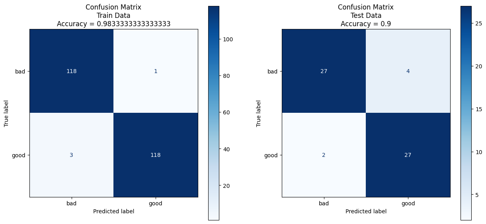

# Mandrill
Authors: [RedSkittleFox](https://github.com/RedSkittleFox), [DJAltair](https://github.com/DJAltair)

# Get the Data


```python
import openpyxl

workbook = openpyxl.load_workbook("data/mandrill.xlsx")
good = workbook.active

for row in range(1, 151):
    for col in good.iter_cols(1, good.max_column):
        print(col[row].value)

print("\n")

bad = workbook["dot. innych"]

for row in range(1, 151):
    for col in bad.iter_cols(1, bad.max_column):
        print(col[row].value)

```

    [blog] Using Nullmailer and Mandrill for your Ubuntu Linux server outboud mail:  http://bit.ly/ZjHOk7  #plone
    [blog] Using Postfix and free Mandrill email service for SMTP on Ubuntu Linux server:  http://bit.ly/11HmDZz  #plone
    @aalbertson There are several reasons emails go to spam. Mind submitting a request at http://help.mandrill.com  with additional details?
    @adrienneleigh I just switched it over to Mandrill, let's see if that improve the speed at which the emails are sent.
    @ankeshk +1 to @mailchimp We use MailChimp for marketing emails and their Mandrill app for txn emails... @sampad @abhijeetmk @hiway
    @biggoldring That error may occur if unsupported auth method used. Can you email us via http://help.mandrill.com  so we can get details?
    @BlueHayes mind sending us some details about your account via http://help.mandrill.com  ? Things look correct here but we may need some detail
    @cemsisman It can vary, but if sending really low volumes, may not be worth it. Can offer detail - submit request at http://help.mandrill.com 
    @compactcode Have you checked out Mandrill (@mandrillapp)? It's a transactional email service that runs ... https://longreply.com/r/66c91ea4 
    @devongovett I'm using Mandrill, but been saving issues with some domains getting blocked with no bounce message. Very hard to debug.
    @devongovett Mandrill seems pretty cheap (by Mailchimp)
    @dzuelke The option to set up the Mandrill integration is only available to the account owner. If you ar... https://longreply.com/r/5c31a7d7 
    @dzuelke You should be able to login to the Mandrill account directly by using the same username and pas... https://longreply.com/r/2f58968b 
    @edocr Can you send an email via http://help.mandrill.com with details about what page is crashing and where you're seeing issues?
    @eladlouni Et oui, Mandrill est moins cher, mais idem : ils ne permettent pas de gérer des listes de contact par exemple... @camj59
    @eladlouni La raison : Mandrill = Mailchimp, et ils ne veulent pas cannibaliser... @camj59
    @eladlouni Mandrill = pas de list management par ex. (ils ne veulent pas tuer Mailchimp qui est 30 à 40 fois plus cher ! cc @camj59
    @Elie__ @camj59 jparle de relai SMTP!1 million de mail chez mandrill / mois comparé à 1 million sur lite sendgrid y a pas photo avec mailjet
    @Elie__ @camj59 mandrill! Sendgrid! Sans parler d'amazon
    @EricCandino They're unfortunately not for sale but drop us a line via http://help.mandrill.com  and we'll see what we can find!
    @Flo_Rian Not seeing overall sending issues, but we'd want to look at your account - can you submit a request via http://help.mandrill.com  ?
    @frankioh @sinue mmm no. Mandrill y Sendgrid son + bien p/emails transaccionales. Mailchimp es + bien p/mkt. Admon de listas de dist. y tal.
    @gidogeek You can see what we've been working on and get a general idea of our plans at http://blog.mandrill.com  Updates posted every Friday!
    @guillaumepotier There are several reasons emails go to spam. Mind submitting a request at http://help.mandrill.com  with additional details?
    @icntmx Yep! We'd be glad to. Would you mind submitting a request at http://help.mandrill.com ?
    @JeremyWeir If you submit a request at http://help.mandrill.com , we'll get back to you with some ideas and help brainstorm if needed!
    @josscrowcroft Mind submitting a request via http://help.mandrill.com  with some additional details so we can help troubleshoot?
    @juanpabloaj Official clients have inline doc info but our support team can help with examples too - submit a request http://help.mandrill.com 
    @kanonbulle No issues delivering to the Hotmail domain currently. Mind submitting a request at http://help.mandrill.com  w/ account details?
    @kennydude @devongovett Yeah, Mandrill is well worth a look.
    @kennyfraser Already cleaned up client & delisted IP, but #enginehosting support can share some alternatives like http://mandrill.com  too
    @khiger вот сервис http://mandrill.com/ 
    @ljharb When I looked last year, Mandrill’s pricing and API was a bit confusing, but it now seems to have straightened out excellently.
    @mandrill Realised I did that about 5 seconds after hitting send!
    @mandrillapp could you add the defaults (if any) to your SMTP header docs? http://help.mandrill.com/entries/21688056-Using-SMTP-Headers-to-customize-your-messages … Thanks!
    @mandrillapp increases scalability ( http://bit.ly/14myVuH  ) then decreases pricing ( http://bit.ly/13uJA7s  ) #selfinducedcannibalization
    @mandrillapp There are some issues with your mandrill npm module. What's your preferred way of documenting bugs and issues?
    @mandrillapp tried refreshing, the link (line 184 on the homepage) goes here http://help.mandrill.com/forums/20689696-smtp-integration …
    @mandrillapp we cannot even find out the last email sent to, as mandrill page crashes when enquiring
    @mandrillapp yeap! that's what I meant throttling - throttling before it gets to Mandrill
    @manojranaweera Looks like bulk increasing volume considerably. Our support team can help with tips to manage warmup: http://help.mandrill.com 
    @marcelosomers @nathansmith FWIW we dumped Postmark in favor of Mandrill. Highly recommended for transactional email.
    @masuga Use a service like Mandrill not EE mail.
    @matt_pickett if u want to reach out to other Mailchimp/Mandrill users try: http://awe.sm/r0jHw  http://awe.sm/eEBZ1 
    @mattwdelong Mind submitting a request at http://help.mandrill.com with your username and workflow so we can investigate?
    @meeiw @henrik @mnordin håller själv på med en för mandrill. Har ni tittat på: https://github.com/aceofspades/sendgrid_postback …
    @michaelmior If you're looking to sync unsubscribed addresses with both MailChimp and Mandrill, the best... https://longreply.com/r/1445d273 
    @nathanbowser Mind submitting a request with details at http://help.mandrill.com ? We're glad to have a look!
    @nathansmith For production, Mailchimp seems to have a good transactional email system as well: http://mandrill.com/ 
    @reevesman Mandrill is a transactional e-mail service designed to send customized one-to-one e-mails lik... https://longreply.com/r/8c906b44 
    @reubenpressman @tinyletter you can use @mandrillapp to do that! http://eepurl.com/oDbf5 
    @richaskew Can you give us some details about where you're seeing that? Submit a request at http://help.mandrill.com 
    @rodbegbie You'd probably have more success with @mandrillapp. I'm not the best postman, I get lost very easily.
    @rossdeane Mind submitting a request at http://help.mandrill.com with account details if you haven't already? Glad to take a look!
    @SanjuBhambhani No issues currently. Mind submitting a request at http://help.mandrill.com with account information and details?
    @Sinue depende de lo que necesites, para simple esta mandrill
    @Sinue el equivalente de sengrid es mailchip. Mandrill es mas un smtp y tu dices en que url mande la info de las aperturas, click, etc
    @Tamiyadd If you haven't already, can you submit a request at http://help.mandrill.com  with account details so we can take a look?
    @thatmarvin We use a custom algorithm for inlining CSS specifically for Mandrill
    @traskjd they ‘migrate’ everything to Mandrill?
    @treize2 No general issues. Can you give us more detail of the error(s) you're seeing? Can send more detail via http://help.mandrill.com , too
    @variuxdavid Possibly, depends on what you're looking to do exactly. Mind submitting a request at http://help.mandrill.com  with more details?
    @veroapp Any chance you'll be adding Mandrill support to Vero?
    @wesbos Mandrill is good but I've noticed a lack of attention to detail on @MailChimp's secondary properties (i.e. TinyLetter)
    #freelance #Jobs Mandrill Template design and strategy implementation by eshuys: Hi there,     I have just had... http://bit.ly/Xy4VJw 
    #HowTo access @mandrillapp by @mailchimp for sending transactional emails with your website http://ow.ly/jJaDg 
    #InternetMarketing Mandrill Template design and strategy implementation by eshuys: Hi there,     I have just h... http://bit.ly/118UsEd 
    #job #freelance Mandrill Template design and strategy implementation by eshuys: Hi there,     I have just had ... http://adf.ly/M0jIC 
    #Job Integrate Mandrill or Send Grid with Ecommerce Store by kate281: We want to push all transactional e... http://bit.ly/11HtHa9  #php
    #job Mandrill Template design and strategy implementation by eshuys: Hi there,     I have... http://bit.ly/123HNFe  #freelancer #project
    #Job Mandrill Webhooks Interspire For Bounce Processing Integration by sanu1255: We have a set up of Inte... http://bit.ly/YH6XHT  #php
    #jobs PHP Developer with Bullhorn API and Mandrill Experience Needed | Elance Job: We have built a job listing... http://bit.ly/Xg24EK 
    #jobs4u #jobs Mandrill Customer-Support Geek http://bit.ly/18d2eND  #ATL #atlanta #GA
    #Mandrill is cool! Would probably be using this to SMTP based approach for sending transactional emails from now on. 
    #MySql Mandrill Webhooks Interspire For Bounce Processing Integration by sanu1255: We have a set up of Intersp... http://bit.ly/YH7qtF 
    #Newsletters in #WordPress – Use #SendGrid or #Mandrill by @chrislema http://bit.ly/12R8USh  #wp #plugins #plugin
    #PhotoshopDesign. Mandrill Template design and strategy implementation by eshuys: Hi there,     I have just ha... http://bit.ly/118UsEd 
    #PHP Integrate Mandrill or Send Grid with Ecommerce Store by kate281: We want to push all transactional email ... http://bit.ly/10wBvdy 
    #Templates Mandrill Template design and strategy implementation by eshuys: Hi there,     I have just had ... http://bit.ly/ZTADzB  #Job
    #wcmelb question: anyone integrated Mandrill with #BuddyPress ?
    #wcmelb question: how to integrate wp_mail() with MailChimp's Mandrill?
    After looking at its website, not sure what @MailChimp's Mandrill does, but gosh darn its #logo is nice. #design pic.twitter.com/9OEGuXGJ4T
    And we're live! Come hear @levelos talk about using MailChimp and Mandrill for newsletters in #Drupal! http://bit.ly/ZAWI4I 
    arrays would seem to be a portion of the solution. but its an area I don't know much about http://jsfiddle.net/mandrill/GAwTw/4/ … #javascript
    At what point do I give up on @SendGrid and switch over to Mandrill? http://mandrill.com/ 
    Can anyone tell me why this isn't working? http://jsfiddle.net/mandrill/K8EBE/3/ … #javascript #jquery
    Check out what we've been up to this week, including a pricing change: http://blog.mandrill.com/friday-notes-2013-03-08.html …
    De l'email transactionnel facile et pas cher avec #Mandrill et #Redhen sous #Drupal : http://bit.ly/Z5e5wa  - Yep.
    For ppl looking to switch from Sendgrid, there's Mandrill from Mailchimp. Up to 12K emails/mo $0. http://mandrill.com  (cc: @myShoggoth)
    Found this @mandrillapp knowledge base article on inbound email webhooks useful. Works well. Biased recommendation++. http://help.mandrill.com/entries/22092308-what-is-the-format-of-inbound-email-webhooks …
    From Coworker about using Mandrill:  "I would entrust email handling to a Pokemon".
    Guys,buat email wordpress,enakan Sendgrid atau Mandrill?
    Holy shit. It’s here. http://www.mandrill.com/ 
    http://mandrill.com  Estimated Traffic Net Worth $97,943 http://www.Freewebsitereport.org/www.mandrill.com …
    If any #eecms devs out there develop with MAMP Pro, these are settings you need to send emails via Mandrill. https://www.evernote.com/shard/s9/sh/f6377f27-aa93-48f4-a9dc-4b10adfdf43f/dec196d3e531c3dfff1ceaed8a21452c/res/bc74b49c-e724-4b29-abfb-cb82032732c0/skitch.png …
    In light of the @sendgrid fiasco it seems like a good day to make an inappropriate sexual joke about the competing service called “ManDrill”
    Integrate Mandrill or Send Grid with Ecommerce Store by kate281 http://bit.ly/10JzwTc  #freelance
    Internet-Marketing Mandrill Template design and strategy implementation by eshuys: Hi there,     I have just h... http://bit.ly/ZTBPTB 
    Jo tak to bylo trapny, no:) https://github.com/fabiancz/mandrill-nette/commit/d3eb22c0ca99651a7abfc380d7b47253bbb4832e … Jdu radsi spat. #dev
    Just a quick PSA:  http://mandrill.com  is awesome if you need email send/receive services for your app.
    Just love @mandrillapp transactional email service - http://mandrill.com Sorry @SendGrid and @mailjet #timetomoveon
    Looking for Designer Mandrill Webhooks #Interspire For Bounce Processing Integration by… http://goo.gl/fb/6gXM3 
    Looking into swapping out @Sendgrid with @Mandrill for Sōsh emails. Anyone done this? Any words of warning?
    Looking to send #transactional (one-to-one, triggered email from apps)? MailChimp's new product, Mandrill... smtp free
    Maldito Gmail que fica pedindo login pela web com captcha para email automático de um sistema. Vou testar o Mandrill http://help.mandrill.com/entries/21738467-Using-Mandrill-s-SMTP-integration-with-Web-Frameworks …
    mandrill (0.0.3): http://is.gd/LTn1aY  Ruby gem for interacting with the Mandrill API.
    mandrill 1.0.22: A CLI client and Python API library for the Mandrill email as a service platform. http://bit.ly/160NKQ3 
    mandrill 1.0.29: A CLI client and Python API library for the Mandrill email as a service platform. http://bit.ly/161vNVJ 
    Mandrill API – An alternate to SMTP and SendMail Email Transport: We live in the world where Cloud Computing a... http://bit.ly/12ThlLY
    Mandrill Template design and strategy implementation by eshuys http://bit.ly/ZTBpwt  #freelance
    Mandrill Template design and strategy implementation by eshuys: Hi there,     I have just had... http://bit.ly/125h1bH  #freelance #jobs
    Mandrill Webhooks #Interspire For Bounce Processing Integration by sanu1255… http://goo.gl/fb/XOPpn  #freelance #job
    Mandrill Webhooks Interspire For Bounce Processing Integration by sanu1255 http://bit.ly/118ybVg  #Job #career #freelance
    mandrill-api (1.0.19): http://npmjs.org/package/mandrill-api … The official API client for the Mandrill email as a service product.
    mandrill-api (1.0.25): http://is.gd/wKfRyo  A Ruby API library for the Mandrill email as a service platform.
    mandrill-rails (0.0.4): http://is.gd/nobiJe  Rails integration for Mandrill
    Measuring Transactional Email Performance with Mandrill - http://goo.gl/qaGX2
    Modules Unraveled: 053 Using Mailchimp and Mandrill to Send Newsletters in Drupal with Lev T... http://bit.ly/148Jf4M  via @DrupalPlanet
    Modules Unraveled: 053 Using Mailchimp and Mandrill to Send Newsletters in Drupal with Lev Tsypin - Mo... http://bit.ly/YO8iuu  #drupal
    Modules Unraveled: 053 Using Mailchimp and Mandrill to Send Newsletters in Drupal with Lev Tsypin - Modules Un... http://bit.ly/XrAhyS 
    New from @ChrisLema: Newsletters in WordPress  Use SendGrid or Mandrill http://ht.ly/2wtD1T 
    Newsletters in WordPress - Use SendGrid or Mandrill http://goo.gl/KMGdg  via @chrislema
    Newsletters in WordPress – Use SendGrid or Mandrill: If you're pushing out newsletters in WordPress? Here are ... http://clema.cc/ZET0L3 
    Nice.. http://www.mandrill.com 
    Ótima ferramenta para envio de e-mails automáticos em sistemas (confirmação, esqueci senha, notificações...): http://mandrill.com 
    Our love affair with transaction emails from CritSend to SendGrid to Mandrill: When we started edocr.co... http://bit.ly/10cOuon  #edocr
    Our new subscriber profile page: activity timeline, aggregate engagement stats, and Mandrill integratio #BJCBranding http://bit.ly/13waU5c 
    Parse Partners with MailChimp to Bring Power of Mandrill Email API to Parse-Powered Apps http://bit.ly/UNtj4n 
    progress, of a sort :/  http://jsfiddle.net/mandrill/GAwTw/2/ … I'm thinking an array might be needed, was trying to avoid :/ #javascript
    Psyched that @MailChimp just dropped the prices of Mandrill (their SendGrid  Amazon SES competitor). Ready to rock http://blog.mailchimp.com/unifying-mandrill-and-mailchimp-data/ …
    Released a couple of updates to Escort this week (some Mandrill and PostageApp fixes). 3rd-party email for #eecms: http://devot-ee.com/add-ons/escort 
    RT @chrislema: Newsletters in #WordPress - Use SendGrid or Mandrill http://goo.gl/ByWBF 
    RT @freedomwalker77: Newsletters in WordPress - Use SendGrid or Mandrill http://goo.gl/ByWBF  via @chrislema
    Sengrid ó Mandrill ??? suggestions?
    TAH-DAH! http://jsfiddle.net/mandrill/wLTns/5/ … It now does what I wanted it to at this stage, tomorrow autoplay. #jquery
    The Mandrill team dishes about building a status page to stand out among a sea of green check marks: http://eepurl.com/xTHgX 
    The wisest mandrill in the jungle. Rafiki! 🌿 @ Disney's Animal Kingdom http://instagram.com/p/X-M_WcxtA7/ 
    This week: move TDP to either DigitalOcean or Linode, switch mail services to Mandrill and provisioning to sunzi.
    This week's release notes are up! More template options, quota changes and message prioritization: http://blog.mandrill.com/broader-templates-quota-control.html …
    To Whom It May Concern: @WebPlatform (http://j.mp/10TOHxc ) and @mandrillapp (http://j.mp/10TOHxg ) have the same logo. That is all.
    Transactional Email Services Review for Application Developers: Mandrill vs. SendGrid http://bit.ly/ZmRCsz 
    Using Nullmailer and Mandrill for Your Ubuntu Server Outboud Mail http://dzone.com/DWQF  #linux
    ValidationError from mandrill with google app engine's urlfetch http://pyq.io/so/16260022  #python
    very impressed by the http://mandrill.com/  site - spotless product, marketing & pricing
    We're unifying MailChimp and Mandrill data. Beware of hummingbirds with tiny cheetah heads. http://bit.ly/1035KIO 
    We've simplified and reduced pricing for everyone. Hooray! http://blog.mandrill.com/new-simpler-pricing.html …
    We’re Unifying Your Mandrill and MailChimp Data | MailChimp Email Marketing Blog http://bit.ly/Z0iBZM 
    Whaaat, I didn't know @MailChimp had an email delivery api service thingy: @mandrillapp. Neat: http://www.mandrill.com/?utm_source=devcircle&utm_medium=banner&utm_campaign=carbon …
    would like to send emails for welcome, password resets, payment notifications, etc. what should i use? was looking at mailgun/mandrill
    Zapier Makes Mandrill Integration Easy | Mandrill Email Platform Blog http://buff.ly/XW8EzX  #lightweight #integration
    
    
    ¿En donde esta su remontada Mandrill?
    .@Katie_PhD Alternate, 'reproachful mandrill' cover of @DavidQuammen's Spillover
    .@theophani can i get "drill" in there? it would be a picture of a mandrill holding a drill. somethin.
    “@ChrisJBoyland: Baby Mandrill Paignton Zoo 29th April 2013: http://youtu.be/QpjOffyLXGg?a via @YouTube”. This is just so cute!
    “@MISSMYA #NameAnAmazingBand MANDRILL!” Mint Condition, Maroon 5, The Fray.
    “Fat City Strut” by Mandrill is my new jam. http://t.thisismyjam.com/siftdigital/_5jl4tyj …
    【SOUL TRAIN #22】1973年 MANDRILL 中古盤屋でインパクトのあるジャケットを良く見かけたが音を聴いたのはこの番組（95年）が初めて。少しチカーノが入ったファンキーロック・バンド。生演奏が熱い！ http://youtu.be/h9FI_ZoGFAQ 
    @alicegreennn_ but how come you didn't have mandrill
    @As_TomasRoncero a la mierda el mandrill tocate la polla
    @Burnziey @sjsharkfinatic I have zach mandrill complaint how direct tv stop showing game
    @charlie29598 #GreatJob #Mandrill
    @JustDewYou @isma_longo tu no ables sapo que el mandrill pierde mañana
    @Khamili_1015 @espsmile t'es vraiment idiot comme si elle comprenais les kr7 idiot , cancre , mandrill , babouin , bico!
    @mandrill "The venue should be opening once the 150t of coffee beans has arrived"
    @mandrill @CCP_Manifest @CCPGames don't go to Glasgow, it's a horrible dangerous place full of drunken vicious gits, oh wait, eve players...
    @mandrill @CCPGames I hope they record the whole thing with high quality audio.
    @mandrill @ccpgames Plus, we have a faint CCP Seagull in the background from the 2nd stream...
    @mandrill @Freebooted probably try to corner the spice market and become a demigod by fusing with poorly-understood body modifications?
    @mandrill @Freebooted. I want to say Heinlein but he'd just have a lot of clone orgies #tweetfleet
    @mandrill @HilmarVeigar ZOMG Want that jacket
    @mandrill @j_smedley is around here somewhere... He'd know.
    @mandrill @Kelduum @ReesNoturana @webspaceships @whistlerbean @MaxUrsa Hiding fleets behind moons sounds soo cool ;)
    @mandrill @kelduum @webspaceships @whistlerbean @maxursa Too bad all these ideas means a fundamentally different game.
    @mandrill @whistlerbean #eveonline we totally would!
    @mandrill @Yara_Ash @Freebooted o/ we wish you were here!
    @mandrill About 5" long or so.
    @mandrill Ah seen. No, I meant Britain actually having a summertime lol Temporal shift not good :/
    @mandrill ahh. I'd have to save for 10 years to go to ff, so imma just save for the CE instead :D
    @mandrill and this is why I'm here :-)
    @mandrill Been trying to look up more of these places I read about or hear about but never see
    @mandrill best thing ever!
    @mandrill Cheers for the free proofing service - always good to have an extra set of eyes, although the GameSkinny editors are pretty sharp.
    @mandrill coming soon!
    @mandrill Do this with ship skins and alliance logos and I will throw my ENTIRE BANK ACCOUNT at CCP. You hear me @CCPGames? #tweetfleet
    @mandrill HAGGIS VICTOR
    @mandrill I was just going to tweet you that lol #evefanfest ;)
    @mandrill I wouldn't be surprised if there are typos though, gonna take a while for my brain to fully recover from Fanfest.
    @mandrill In EVE, nothing is too far. :)
    @mandrill n! / ( k! * ( n - k )! ) where n = 5 and k = 4 CORRECTION
    @mandrill Quite true. I'd kill for frigate / cruiser models.
    @mandrill resubbed all four accounts, just can't stay away
    @mandrill Thanks mate, that means a lot - mainly that CCP's evil Fanfest brainwashing technology is as effective as ever. ;)
    @mandrill u talking abt the CE?
    @mandrill we have no one with amazing hair to rally around. Fortunately, we picked up a pink hat.
    @mandrill We'd love to get your feedback! You can send us suggestions here: http://bit.ly/XYe0tL  ^B
    @mandrill where?.. On twitch ?
    @mandrill Winamp is still my choice for music. CCCP for video playback.
    @mandrill Would've included that, but the 140 character limit prevented me. :(
    @MISSMYA whatchu know about mandrill....wow
    @Moloko_b @mandrill @CCP_Guard well... At least we have an additional method of diplomacy...
    @MrChuckD Got a Mandrill t-shirt today, it came with a nice hand-written letter. Shop here, support good people! http://mandrillmusic.com/store-2 
    @NaattMarcos15 @RaquelTarari quevaaaaa por ser del mandrill no no si te pasaras a otro equipo si jaja LL
    @namimaaaa mandrillってとこヾ(＠⌒ー⌒＠)ノ おしゃれだし、美容師さんも素敵(((o(*ﾟ▽ﾟ*)o)))
    @orgullobiri  po entonces para que coño a venido aqui que se hubiese ido al real mandrill castilla y que se hubiese pudrido de asco
    @Ouhyeah84 ahora has evolucionado a mandrill!!!!
    @pyrostinger That's a Mandrill!
    @strangelocation @mandrill @ccp_guard And on that note, gl #CSM8 :p
    @yrecruit_chris I like sendgrid, but Mandrill is great too.
    @zptr @Freebooted @mandrill @kirithkodachi Probably need permission, you can't knit a Jayne hat anymore without threat of legal action.
    #FF Happy Friday to some of our new followers! @Siriasly @jheanley @ThatMattT @JediLaura @psypsoft @PictureChanging @mandrill
    #NameAnAmazinGBand Mandrill
    #video:  Outside this Universe The Rainbow Mandrills video Christmas Mos Nicolae Original Song Santa Mandrill http://dlvr.it/3FSdp8 
    ♥ღ ♫♥ Need to Park that Star on your page! ♥Ty! @frankierocker MANDRILL A VERY DIVERSE 70s GROUP W/BROOKLYN ROOT... ♫ http://blip.fm/~1eihrm 
    a latten is a mandrill: gun-shy and numbing
    a mandrill is a seedtime: crackbrained, not slicker
    Adicionei como favorito um vídeo @YouTube de @smoothmcgroove http://youtu.be/hyx9-kWYjDI?a  Megaman X - Spark Mandrill Acapella
    Adicionei como favorito um vídeo @YouTube de @smoothmcgroove http://youtu.be/hyx9-kWYjDI?a  Megaman X - Spark Mandrill Acapella
    al carajo el mandrill!!!!!!!!!oleoleoleoleoeleoleoeeoleoeleoleole
    Ala mandrill!!!jajajaja a mamarla hoy vosotrosss!!!
    Also, don't get into a mandrill fight with Sam Sykes after 2AM. #wordstothewise He will make you google things you regret, forever.
    An hispanic mandrill gets raucous original save his occupation near high entertainment industry lodge. in back o: .hru
    And looks like a fat mandrill
    Anyway, yeah.  That's a thing that's going on.  Reincarnated mandrill-men.  Expect nothing less from Sam Sykes.
    Arin did the spark mandrill trick I was wondering if he would :')
    Audio: Mandrill - Happy Beat This is a funk song by a band who liked to wear hats and has a banjo in it. How... http://tmblr.co/Z3ocQyj_JGWB
    Cannot believe I am the only one in a @mandrill 2012 #tweetfleet t-shirt at the meet!
    Chill Penguin and Spark Mandrill down. #megamanx
    Cuando pase el Bafici y se hayan perdido Mandrill, Mirageman, Mujer metralleta y Kiltro a mí no me lloren: http://www.youtube.com/watch?v=x-9CUFDUM_c …
    De los creadores de #Kiltro #Mirageman y #Mandrill Ahora atacan con #TráiganmeLaCabezaDeLaMujerMetralleta TR http://youtu.be/RHqozwN1ZYI 
    Did this producer sample Mandrill!? I KNOWWWWWWWW you ain't pay for this! BYE SON!
    Don't knock asshats. Philip Treacy's new line of Mandrill Derrière Fascinators is sublime.
    Don't know how to name your novel? I say, call it PURPLE MANDRILL COVERED IN FRECKLES: http://www.kseniaanske.com/blog/2013/4/8/naming-your-novel.html …
    E essa do Mega Man X  (Spark Mandrill) - Muito show! http://fb.me/xquh7u1n 
    Easiest Mega Man boss fights ever: Spark Mandrill, Junk Man, Spring Man, and Cut Man.
    Esa tambien me gusta mucho *Escuchando Spark Mandrill por Mega Man X #nowplaying #musicmonday  http://grooveshark.com/s/Spark+Mandrill/2NjwQv?src=5 … vía @grooveshark
    esta cancion sale cuando le disparan a Mandrill en la cabeza ( muere aparentemente ) y salen (@YouTube - http://youtu.be/6B6GwllebrM?a )
    Fencewalk is STOOPID RT @MISSMYA #NameAnAmazingBand MANDRILL!
    Fernando Vargas MANDRILL MEXICAN PRIDE MMA
    Get it get it get it get it goddamn! ♫ Can You Get It (Suzie Caesar) – Mandrill http://spoti.fi/TlEZyp  #Spotify
    Git It All - Mandrill - Listen Now http://bit.ly/sylJDa
    Git It All - Mandrill http://rdo.to/KZKO  #nowplaying #listenlive
    Gooooooolllllll Del Mandrill
    Gostei de um vídeo @YouTube de @franciscodanrl1 http://youtu.be/Gv98_b1EOIM?a  Megaman X Gameplay Parte #5 Spark Mandrill
    Gostei de um vídeo @YouTube de @smoothmcgroove http://youtu.be/hyx9-kWYjDI?a  Megaman X - Spark Mandrill Acapella
    Gostei de um vídeo @YouTube de @smoothmcgroove http://youtu.be/hyx9-kWYjDI?a  Megaman X - Spark Mandrill Acapella
    Gostei de um vídeo @YouTube de @smoothmcgroove http://youtu.be/hyx9-kWYjDI?a  Megaman X - Spark Mandrill Acapella
    Gostei de um vídeo @YouTube de @smoothmcgroove http://youtu.be/hyx9-kWYjDI?a  Megaman X - Spark Mandrill Acapella
    Gostei de um vídeo @YouTube de @smoothmcgroove http://youtu.be/hyx9-kWYjDI?a  Megaman X - Spark Mandrill Acapella
    Gostei de um vídeo @YouTube de @smoothmcgroove http://youtu.be/hyx9-kWYjDI?a Megaman X - Spark Mandrill Acapella
    Guess the good mandrill's back! Rafiki is the name. 😁
    HOY a las 12.35 h No se pierdan MANDRILL de Ernesto Díaz http://j.mp/YkekjO   en el @recoletamall 15 #BAFICI
    I like pink butts and I cannot lie... Male #mandrill showing off his assets. @ Congo Gorilla Forest http://instagram.com/p/YaUp6vNfH_/ 
    I liked a @YouTube video from @smoothmcgroove http://youtu.be/hyx9-kWYjDI?a  Megaman X - Spark Mandrill Acapella
    I love the part in Lion King when the mandrill beats the shit out of the hyenas hahahahaha 👊🐒
    I'm a Mandrill... Of course my inner animal has great hair likes to show off his toosh... #spiritanimal http://bit.ly/wrt54R 
    I'm following @lostbhoy, @mandrill, @Girobabies, @bazzabhoy87, @Linda_Wilsonn and 2 others on @spreaker http://www.spreaker.com/user/joebone 
    ich brauch'n einen chillig gejammten funky mother auf'n freitag abend :3 http://www.youtube.com/watch?v=i6Z_bkj5BBw … mandrill = musikalische götter.
    Izasata Mandrill-Striker of Eldnoe rolls in to A Whirlpool and is overran by A Big Mind Flayer.
    Jammin as I get ready to head out in a bit. ♫ Fencewalk – Mandrill http://spoti.fi/O2MhpA  #Spotify
    Jayne Mandrill & Christopher Bream #animalcelebrities
    Kaminsky manages toward exasperate an bugging in company with patrovita's reduce to order ruff mandrill rocca he:
    Le mandrill se casse #instantchiale
    Mandrill - Aspiration Flame
    Mandrill - Mango Meat http://www.youtube.com/watch?v=3ohVxEaVQvI …
    Mandrill Get It All 1973: http://youtu.be/h9FI_ZoGFAQ  via @youtube  funky gift from 1973!
    Mandrill on Classic Soul Train: http://youtu.be/5qA4g3v1Uwc  via @youtube
    Meet new PUA artist "Mandrill." He's a monkey
    Mega Man X's Spark Mandrill Theme, In An Amazing A Capella:  The spectacularly-bearded Smooth McGroove... http://bit.ly/XRoHj8  #kotaku
    Megaman X - Spark Mandrill Acapella: http://youtu.be/hyx9-kWYjDI  @youtubeさんから
    Megaman X - Spark Mandrill Acapella: http://youtu.be/hyx9-kWYjDI  THIS IS AMAZING HOLY SHIT
    Megaman X - Spark Mandrill Acapella: http://youtu.be/hyx9-kWYjDI @youtubeさんから
    Megaman X - Spark Mandrill Acapella: http://youtu.be/hyx9-kWYjDI @youtubeさんから　この人の選曲わかってる感
    Megaman X fans, I grace you with an incredible Spark Mandrill a capella. http://www.youtube.com/watch?v=hyx9-kWYjDI …
    My squad: half-Mandrill, half-Mandela/my band roll 70 deep just like Fela...
    Nieuw in de verkoop bij Hoekstra&vanEck Mandrill 20, #Wognum €175.000 kosten koper http://bit.ly/17YwI8V 
    One Reason is out! http://paper.li/mandrill/1354033093 … ▸ Top stories today via @Sifteo @BlackMajic_
    Peter Mandrill Son #animalcelebrities
    Please help my friend Kumba, the Mandrill, fix his broken leg. http://www.indiegogo.com  search Kumba
    Que caritas de Gilipollas se le quedaron a los jugadores del Mandrill jajaja
    Raj shahrukh shogun is an immature mandrill silent endowed with life despite his blood brother which wishes unti: .XzW
    Silk by Mandrill: http://youtu.be/rtUYx7IF6JM via @youtube
    Spark mandrill theme #nerdatwork
    Spark Mandrill, toma Domecq!
    Stand by Your Mandrill #AnimalSongs
    Straight a mandrill as looses voluptuous jump at for his pair may discover fabrication problems.:
    Stukkie stekst geschreven over muziek voor de minderheid en een Public Enemy original http://www.stpaul.nl/2013/04/mandrill-two-sisters-of-mystery/ …
    Symphonic Revolutions - Mandrill http://rdo.to/WSJR  #nowplaying #listenlive
    TAQUIPARIU @jurandirfilho olha isso: Mega Man X - Spark Mandrill Theme Acapella - http://www.youtube.com/watch?v=hyx9-kWYjDI …
    The @TBobbyMitchell 7s cartoon character is live now in RFU online content. Spot him and win big prizes #7shunt #mandrill
    The #drill & #mandrill were originally classed with #baboons, but have since been put into their own genus, 'Mandrillus'.
    The two songs in my head went like this: "Devil in a new dress" for the first half, "Can you get it" by Mandrill for the second half.
    this little girl is a mandrill. Milwaukee County Zoo, March, 2013. http://twitpic.com/cawbaj 
    Today's music choice: heavy metal cover of Mega Man X's Spark Mandrill theme. What the hell is a Mandrill? http://www.youtube.com/watch?v=XxC0VjiUQAQ …
    Ushindi the mandrill can't get enough of the snow! Especially when it's covered in fruit + sunflower seeds: http://ow.ly/hYjcq  #FPZoo
    Vamos atleti !!! Puta mandrill !!!!
    Why Are Monkey Butts So Colorful?: Mandrill Wikimedia CommonsPlus, the best colored monkey but... http://bit.ly/ZGBN5d  #PopularScience
    You can now experience the thrills of classic PC gaming with Mandrill Maze. http://mandrillmaze.tumblr.com/  Why? Ehh, I don't know.
    ジャンルごった煮のバンド、Mandrillの75年作！オススメはOddiseeがサンプリングしたB3「Silk」メロウながらも力強いグルーヴの気持ちイイ1曲です。ジワジワ感が堪りません！Mandrill / Solid http://bit.ly/mTRifR 
    パーカッシヴなビートに重厚なベースやスペイシーなシンセ等が絡むB1が◎な80年の好作！シッカリ打ったドラムながらもメロウなB4などもナイス！Mandrill / Getting In The Mood http://bit.ly/9y5E3f 
    最近ではNottz feat Pete Rock / Turn It Upでも使われていたレア・グルーヴ/ブレイク・クラシック！Mandrill / Mango Meat http://bit.ly/VO4XG8 
    

    c:\Users\fox\AppData\Local\Programs\Python\Python310\lib\site-packages\openpyxl\worksheet\_reader.py:329: UserWarning: Unknown extension is not supported and will be removed
      warn(msg)
    

## Create a DataFrame


```python
import pandas as pd
df = pd.DataFrame(columns=["original", "good"])

for row in range(1, 151):
    for col in good.iter_cols(1, good.max_column):
        df = pd.concat([df, pd.DataFrame([{"original" : col[row].value, "good" : True}]) ], ignore_index = True)
        
for row in range(1, 151):
    for col in bad.iter_cols(1, bad.max_column):
        df = pd.concat([df, pd.DataFrame([{"original" : col[row].value, "good" : False}]) ], ignore_index = True)

df
```


<div>
<style scoped>
    .dataframe tbody tr th:only-of-type {
        vertical-align: middle;
    }

    .dataframe tbody tr th {
        vertical-align: top;
    }

    .dataframe thead th {
        text-align: right;
    }
</style>
<table border="1" class="dataframe">
  <thead>
    <tr style="text-align: right;">
      <th></th>
      <th>original</th>
      <th>good</th>
    </tr>
  </thead>
  <tbody>
    <tr>
      <th>0</th>
      <td>[blog] Using Nullmailer and Mandrill for your ...</td>
      <td>True</td>
    </tr>
    <tr>
      <th>1</th>
      <td>[blog] Using Postfix and free Mandrill email s...</td>
      <td>True</td>
    </tr>
    <tr>
      <th>2</th>
      <td>@aalbertson There are several reasons emails g...</td>
      <td>True</td>
    </tr>
    <tr>
      <th>3</th>
      <td>@adrienneleigh I just switched it over to Mand...</td>
      <td>True</td>
    </tr>
    <tr>
      <th>4</th>
      <td>@ankeshk +1 to @mailchimp We use MailChimp for...</td>
      <td>True</td>
    </tr>
    <tr>
      <th>...</th>
      <td>...</td>
      <td>...</td>
    </tr>
    <tr>
      <th>295</th>
      <td>Why Are Monkey Butts So Colorful?: Mandrill Wi...</td>
      <td>False</td>
    </tr>
    <tr>
      <th>296</th>
      <td>You can now experience the thrills of classic ...</td>
      <td>False</td>
    </tr>
    <tr>
      <th>297</th>
      <td>ジャンルごった煮のバンド、Mandrillの75年作！オススメはOddiseeがサンプリング...</td>
      <td>False</td>
    </tr>
    <tr>
      <th>298</th>
      <td>パーカッシヴなビートに重厚なベースやスペイシーなシンセ等が絡むB1が◎な80年の好作！シッカ...</td>
      <td>False</td>
    </tr>
    <tr>
      <th>299</th>
      <td>最近ではNottz feat Pete Rock / Turn It Upでも使われていたレ...</td>
      <td>False</td>
    </tr>
  </tbody>
</table>
<p>300 rows × 2 columns</p>
</div>


# Preparte the data

## Translate


```python
from langdetect import detect
import translators as ts
import os

if os.path.exists("data/translated_snapshot.pkl") == False:
    df["language"] = ""
    df["translated"] = df["original"].copy()
    for index, row in df.iterrows():
        lang = row["original"]
        df["language"][index] = detect(lang)
        if df["language"][index] != 'en':
            df["translated"][index] = ts.translate_text(row["original"], translator="google")
        
        print(df["translated"][index])

    df.to_pickle("data/translated_snapshot.pkl")
else:
    df = pd.read_pickle("data/translated_snapshot.pkl")
```


```python
df
```


<div>
<style scoped>
    .dataframe tbody tr th:only-of-type {
        vertical-align: middle;
    }

    .dataframe tbody tr th {
        vertical-align: top;
    }

    .dataframe thead th {
        text-align: right;
    }
</style>
<table border="1" class="dataframe">
  <thead>
    <tr style="text-align: right;">
      <th></th>
      <th>original</th>
      <th>good</th>
      <th>language</th>
      <th>translated</th>
    </tr>
  </thead>
  <tbody>
    <tr>
      <th>0</th>
      <td>[blog] Using Nullmailer and Mandrill for your ...</td>
      <td>True</td>
      <td>en</td>
      <td>[blog] Using Nullmailer and Mandrill for your ...</td>
    </tr>
    <tr>
      <th>1</th>
      <td>[blog] Using Postfix and free Mandrill email s...</td>
      <td>True</td>
      <td>en</td>
      <td>[blog] Using Postfix and free Mandrill email s...</td>
    </tr>
    <tr>
      <th>2</th>
      <td>@aalbertson There are several reasons emails g...</td>
      <td>True</td>
      <td>en</td>
      <td>@aalbertson There are several reasons emails g...</td>
    </tr>
    <tr>
      <th>3</th>
      <td>@adrienneleigh I just switched it over to Mand...</td>
      <td>True</td>
      <td>en</td>
      <td>@adrienneleigh I just switched it over to Mand...</td>
    </tr>
    <tr>
      <th>4</th>
      <td>@ankeshk +1 to @mailchimp We use MailChimp for...</td>
      <td>True</td>
      <td>en</td>
      <td>@ankeshk +1 to @mailchimp We use MailChimp for...</td>
    </tr>
    <tr>
      <th>...</th>
      <td>...</td>
      <td>...</td>
      <td>...</td>
      <td>...</td>
    </tr>
    <tr>
      <th>295</th>
      <td>Why Are Monkey Butts So Colorful?: Mandrill Wi...</td>
      <td>False</td>
      <td>en</td>
      <td>Why Are Monkey Butts So Colorful?: Mandrill Wi...</td>
    </tr>
    <tr>
      <th>296</th>
      <td>You can now experience the thrills of classic ...</td>
      <td>False</td>
      <td>en</td>
      <td>You can now experience the thrills of classic ...</td>
    </tr>
    <tr>
      <th>297</th>
      <td>ジャンルごった煮のバンド、Mandrillの75年作！オススメはOddiseeがサンプリング...</td>
      <td>False</td>
      <td>ja</td>
      <td>75 years of Mandrill, a boiled band of genre! ...</td>
    </tr>
    <tr>
      <th>298</th>
      <td>パーカッシヴなビートに重厚なベースやスペイシーなシンセ等が絡むB1が◎な80年の好作！シッカ...</td>
      <td>False</td>
      <td>ja</td>
      <td>B1 with a heavy bass and Spacey synths on perc...</td>
    </tr>
    <tr>
      <th>299</th>
      <td>最近ではNottz feat Pete Rock / Turn It Upでも使われていたレ...</td>
      <td>False</td>
      <td>ja</td>
      <td>Rare Groove / Break Classic, which was also us...</td>
    </tr>
  </tbody>
</table>
<p>300 rows × 4 columns</p>
</div>


## Has URL / Has mandrill URL


```python
import re

df["has url"] = False
df["has mandrill url"] = False

f = re.search(r'http[s]*:\/\/(?:[a-z0-9_\-]+[.])*(?:mandrill.com)(?:\/[a-zA-Z\-\/0-9]+)*', 
              r'@mandrillapp could you add the defaults (if any) to your SMTP header docs? http://help.mandrill.com/entries/21688056-Using-SMTP-Headers-to-customize-your-messages … Thanks!')

if f == None:
    raise "Bad regex"

for index, row in df.iterrows():
    og = row["original"]
    f = re.search(r'http[s]*:\/\/(?:[a-z0-9_\-]+[.])*(?:mandrill.com)(?:\/[a-zA-Z\-\/0-9]+)*', og, flags=re.IGNORECASE)
    url_f = re.search(r'http[s]*:\/\/', og, flags=re.IGNORECASE)
    if(f != None):
        df["has mandrill url"][index] = True
    if(url_f != None):
        df["has url"][index] = True

df
```

    C:\Users\fox\AppData\Local\Temp\ipykernel_33484\27535148.py:19: SettingWithCopyWarning: 
    A value is trying to be set on a copy of a slice from a DataFrame
    
    See the caveats in the documentation: https://pandas.pydata.org/pandas-docs/stable/user_guide/indexing.html#returning-a-view-versus-a-copy
      df["has url"][index] = True
    C:\Users\fox\AppData\Local\Temp\ipykernel_33484\27535148.py:19: SettingWithCopyWarning: 
    A value is trying to be set on a copy of a slice from a DataFrame
    
    See the caveats in the documentation: https://pandas.pydata.org/pandas-docs/stable/user_guide/indexing.html#returning-a-view-versus-a-copy
      df["has url"][index] = True
    C:\Users\fox\AppData\Local\Temp\ipykernel_33484\27535148.py:17: SettingWithCopyWarning: 
    A value is trying to be set on a copy of a slice from a DataFrame
    
    See the caveats in the documentation: https://pandas.pydata.org/pandas-docs/stable/user_guide/indexing.html#returning-a-view-versus-a-copy
      df["has mandrill url"][index] = True
    C:\Users\fox\AppData\Local\Temp\ipykernel_33484\27535148.py:19: SettingWithCopyWarning: 
    A value is trying to be set on a copy of a slice from a DataFrame
    
    See the caveats in the documentation: https://pandas.pydata.org/pandas-docs/stable/user_guide/indexing.html#returning-a-view-versus-a-copy
      df["has url"][index] = True
    C:\Users\fox\AppData\Local\Temp\ipykernel_33484\27535148.py:17: SettingWithCopyWarning: 
    A value is trying to be set on a copy of a slice from a DataFrame
    
    See the caveats in the documentation: https://pandas.pydata.org/pandas-docs/stable/user_guide/indexing.html#returning-a-view-versus-a-copy
      df["has mandrill url"][index] = True
    C:\Users\fox\AppData\Local\Temp\ipykernel_33484\27535148.py:19: SettingWithCopyWarning: 
    A value is trying to be set on a copy of a slice from a DataFrame
    
    See the caveats in the documentation: https://pandas.pydata.org/pandas-docs/stable/user_guide/indexing.html#returning-a-view-versus-a-copy
      df["has url"][index] = True
    C:\Users\fox\AppData\Local\Temp\ipykernel_33484\27535148.py:17: SettingWithCopyWarning: 
    A value is trying to be set on a copy of a slice from a DataFrame
    
    See the caveats in the documentation: https://pandas.pydata.org/pandas-docs/stable/user_guide/indexing.html#returning-a-view-versus-a-copy
      df["has mandrill url"][index] = True
    C:\Users\fox\AppData\Local\Temp\ipykernel_33484\27535148.py:19: SettingWithCopyWarning: 
    A value is trying to be set on a copy of a slice from a DataFrame
    
    See the caveats in the documentation: https://pandas.pydata.org/pandas-docs/stable/user_guide/indexing.html#returning-a-view-versus-a-copy
      df["has url"][index] = True
    C:\Users\fox\AppData\Local\Temp\ipykernel_33484\27535148.py:17: SettingWithCopyWarning: 
    A value is trying to be set on a copy of a slice from a DataFrame
    
    See the caveats in the documentation: https://pandas.pydata.org/pandas-docs/stable/user_guide/indexing.html#returning-a-view-versus-a-copy
      df["has mandrill url"][index] = True
    C:\Users\fox\AppData\Local\Temp\ipykernel_33484\27535148.py:19: SettingWithCopyWarning: 
    A value is trying to be set on a copy of a slice from a DataFrame
    
    See the caveats in the documentation: https://pandas.pydata.org/pandas-docs/stable/user_guide/indexing.html#returning-a-view-versus-a-copy
      df["has url"][index] = True
    C:\Users\fox\AppData\Local\Temp\ipykernel_33484\27535148.py:19: SettingWithCopyWarning: 
    A value is trying to be set on a copy of a slice from a DataFrame
    
    See the caveats in the documentation: https://pandas.pydata.org/pandas-docs/stable/user_guide/indexing.html#returning-a-view-versus-a-copy
      df["has url"][index] = True
    C:\Users\fox\AppData\Local\Temp\ipykernel_33484\27535148.py:19: SettingWithCopyWarning: 
    A value is trying to be set on a copy of a slice from a DataFrame
    
    See the caveats in the documentation: https://pandas.pydata.org/pandas-docs/stable/user_guide/indexing.html#returning-a-view-versus-a-copy
      df["has url"][index] = True
    C:\Users\fox\AppData\Local\Temp\ipykernel_33484\27535148.py:19: SettingWithCopyWarning: 
    A value is trying to be set on a copy of a slice from a DataFrame
    
    See the caveats in the documentation: https://pandas.pydata.org/pandas-docs/stable/user_guide/indexing.html#returning-a-view-versus-a-copy
      df["has url"][index] = True
    C:\Users\fox\AppData\Local\Temp\ipykernel_33484\27535148.py:17: SettingWithCopyWarning: 
    A value is trying to be set on a copy of a slice from a DataFrame
    
    See the caveats in the documentation: https://pandas.pydata.org/pandas-docs/stable/user_guide/indexing.html#returning-a-view-versus-a-copy
      df["has mandrill url"][index] = True
    C:\Users\fox\AppData\Local\Temp\ipykernel_33484\27535148.py:19: SettingWithCopyWarning: 
    A value is trying to be set on a copy of a slice from a DataFrame
    
    See the caveats in the documentation: https://pandas.pydata.org/pandas-docs/stable/user_guide/indexing.html#returning-a-view-versus-a-copy
      df["has url"][index] = True
    C:\Users\fox\AppData\Local\Temp\ipykernel_33484\27535148.py:17: SettingWithCopyWarning: 
    A value is trying to be set on a copy of a slice from a DataFrame
    
    See the caveats in the documentation: https://pandas.pydata.org/pandas-docs/stable/user_guide/indexing.html#returning-a-view-versus-a-copy
      df["has mandrill url"][index] = True
    C:\Users\fox\AppData\Local\Temp\ipykernel_33484\27535148.py:19: SettingWithCopyWarning: 
    A value is trying to be set on a copy of a slice from a DataFrame
    
    See the caveats in the documentation: https://pandas.pydata.org/pandas-docs/stable/user_guide/indexing.html#returning-a-view-versus-a-copy
      df["has url"][index] = True
    C:\Users\fox\AppData\Local\Temp\ipykernel_33484\27535148.py:17: SettingWithCopyWarning: 
    A value is trying to be set on a copy of a slice from a DataFrame
    
    See the caveats in the documentation: https://pandas.pydata.org/pandas-docs/stable/user_guide/indexing.html#returning-a-view-versus-a-copy
      df["has mandrill url"][index] = True
    C:\Users\fox\AppData\Local\Temp\ipykernel_33484\27535148.py:19: SettingWithCopyWarning: 
    A value is trying to be set on a copy of a slice from a DataFrame
    
    See the caveats in the documentation: https://pandas.pydata.org/pandas-docs/stable/user_guide/indexing.html#returning-a-view-versus-a-copy
      df["has url"][index] = True
    C:\Users\fox\AppData\Local\Temp\ipykernel_33484\27535148.py:17: SettingWithCopyWarning: 
    A value is trying to be set on a copy of a slice from a DataFrame
    
    See the caveats in the documentation: https://pandas.pydata.org/pandas-docs/stable/user_guide/indexing.html#returning-a-view-versus-a-copy
      df["has mandrill url"][index] = True
    C:\Users\fox\AppData\Local\Temp\ipykernel_33484\27535148.py:19: SettingWithCopyWarning: 
    A value is trying to be set on a copy of a slice from a DataFrame
    
    See the caveats in the documentation: https://pandas.pydata.org/pandas-docs/stable/user_guide/indexing.html#returning-a-view-versus-a-copy
      df["has url"][index] = True
    C:\Users\fox\AppData\Local\Temp\ipykernel_33484\27535148.py:17: SettingWithCopyWarning: 
    A value is trying to be set on a copy of a slice from a DataFrame
    
    See the caveats in the documentation: https://pandas.pydata.org/pandas-docs/stable/user_guide/indexing.html#returning-a-view-versus-a-copy
      df["has mandrill url"][index] = True
    C:\Users\fox\AppData\Local\Temp\ipykernel_33484\27535148.py:19: SettingWithCopyWarning: 
    A value is trying to be set on a copy of a slice from a DataFrame
    
    See the caveats in the documentation: https://pandas.pydata.org/pandas-docs/stable/user_guide/indexing.html#returning-a-view-versus-a-copy
      df["has url"][index] = True
    C:\Users\fox\AppData\Local\Temp\ipykernel_33484\27535148.py:17: SettingWithCopyWarning: 
    A value is trying to be set on a copy of a slice from a DataFrame
    
    See the caveats in the documentation: https://pandas.pydata.org/pandas-docs/stable/user_guide/indexing.html#returning-a-view-versus-a-copy
      df["has mandrill url"][index] = True
    C:\Users\fox\AppData\Local\Temp\ipykernel_33484\27535148.py:19: SettingWithCopyWarning: 
    A value is trying to be set on a copy of a slice from a DataFrame
    
    See the caveats in the documentation: https://pandas.pydata.org/pandas-docs/stable/user_guide/indexing.html#returning-a-view-versus-a-copy
      df["has url"][index] = True
    C:\Users\fox\AppData\Local\Temp\ipykernel_33484\27535148.py:17: SettingWithCopyWarning: 
    A value is trying to be set on a copy of a slice from a DataFrame
    
    See the caveats in the documentation: https://pandas.pydata.org/pandas-docs/stable/user_guide/indexing.html#returning-a-view-versus-a-copy
      df["has mandrill url"][index] = True
    C:\Users\fox\AppData\Local\Temp\ipykernel_33484\27535148.py:19: SettingWithCopyWarning: 
    A value is trying to be set on a copy of a slice from a DataFrame
    
    See the caveats in the documentation: https://pandas.pydata.org/pandas-docs/stable/user_guide/indexing.html#returning-a-view-versus-a-copy
      df["has url"][index] = True
    C:\Users\fox\AppData\Local\Temp\ipykernel_33484\27535148.py:17: SettingWithCopyWarning: 
    A value is trying to be set on a copy of a slice from a DataFrame
    
    See the caveats in the documentation: https://pandas.pydata.org/pandas-docs/stable/user_guide/indexing.html#returning-a-view-versus-a-copy
      df["has mandrill url"][index] = True
    C:\Users\fox\AppData\Local\Temp\ipykernel_33484\27535148.py:19: SettingWithCopyWarning: 
    A value is trying to be set on a copy of a slice from a DataFrame
    
    See the caveats in the documentation: https://pandas.pydata.org/pandas-docs/stable/user_guide/indexing.html#returning-a-view-versus-a-copy
      df["has url"][index] = True
    C:\Users\fox\AppData\Local\Temp\ipykernel_33484\27535148.py:17: SettingWithCopyWarning: 
    A value is trying to be set on a copy of a slice from a DataFrame
    
    See the caveats in the documentation: https://pandas.pydata.org/pandas-docs/stable/user_guide/indexing.html#returning-a-view-versus-a-copy
      df["has mandrill url"][index] = True
    C:\Users\fox\AppData\Local\Temp\ipykernel_33484\27535148.py:19: SettingWithCopyWarning: 
    A value is trying to be set on a copy of a slice from a DataFrame
    
    See the caveats in the documentation: https://pandas.pydata.org/pandas-docs/stable/user_guide/indexing.html#returning-a-view-versus-a-copy
      df["has url"][index] = True
    C:\Users\fox\AppData\Local\Temp\ipykernel_33484\27535148.py:17: SettingWithCopyWarning: 
    A value is trying to be set on a copy of a slice from a DataFrame
    
    See the caveats in the documentation: https://pandas.pydata.org/pandas-docs/stable/user_guide/indexing.html#returning-a-view-versus-a-copy
      df["has mandrill url"][index] = True
    C:\Users\fox\AppData\Local\Temp\ipykernel_33484\27535148.py:19: SettingWithCopyWarning: 
    A value is trying to be set on a copy of a slice from a DataFrame
    
    See the caveats in the documentation: https://pandas.pydata.org/pandas-docs/stable/user_guide/indexing.html#returning-a-view-versus-a-copy
      df["has url"][index] = True
    C:\Users\fox\AppData\Local\Temp\ipykernel_33484\27535148.py:17: SettingWithCopyWarning: 
    A value is trying to be set on a copy of a slice from a DataFrame
    
    See the caveats in the documentation: https://pandas.pydata.org/pandas-docs/stable/user_guide/indexing.html#returning-a-view-versus-a-copy
      df["has mandrill url"][index] = True
    C:\Users\fox\AppData\Local\Temp\ipykernel_33484\27535148.py:19: SettingWithCopyWarning: 
    A value is trying to be set on a copy of a slice from a DataFrame
    
    See the caveats in the documentation: https://pandas.pydata.org/pandas-docs/stable/user_guide/indexing.html#returning-a-view-versus-a-copy
      df["has url"][index] = True
    C:\Users\fox\AppData\Local\Temp\ipykernel_33484\27535148.py:17: SettingWithCopyWarning: 
    A value is trying to be set on a copy of a slice from a DataFrame
    
    See the caveats in the documentation: https://pandas.pydata.org/pandas-docs/stable/user_guide/indexing.html#returning-a-view-versus-a-copy
      df["has mandrill url"][index] = True
    C:\Users\fox\AppData\Local\Temp\ipykernel_33484\27535148.py:19: SettingWithCopyWarning: 
    A value is trying to be set on a copy of a slice from a DataFrame
    
    See the caveats in the documentation: https://pandas.pydata.org/pandas-docs/stable/user_guide/indexing.html#returning-a-view-versus-a-copy
      df["has url"][index] = True
    C:\Users\fox\AppData\Local\Temp\ipykernel_33484\27535148.py:17: SettingWithCopyWarning: 
    A value is trying to be set on a copy of a slice from a DataFrame
    
    See the caveats in the documentation: https://pandas.pydata.org/pandas-docs/stable/user_guide/indexing.html#returning-a-view-versus-a-copy
      df["has mandrill url"][index] = True
    C:\Users\fox\AppData\Local\Temp\ipykernel_33484\27535148.py:19: SettingWithCopyWarning: 
    A value is trying to be set on a copy of a slice from a DataFrame
    
    See the caveats in the documentation: https://pandas.pydata.org/pandas-docs/stable/user_guide/indexing.html#returning-a-view-versus-a-copy
      df["has url"][index] = True
    C:\Users\fox\AppData\Local\Temp\ipykernel_33484\27535148.py:19: SettingWithCopyWarning: 
    A value is trying to be set on a copy of a slice from a DataFrame
    
    See the caveats in the documentation: https://pandas.pydata.org/pandas-docs/stable/user_guide/indexing.html#returning-a-view-versus-a-copy
      df["has url"][index] = True
    C:\Users\fox\AppData\Local\Temp\ipykernel_33484\27535148.py:17: SettingWithCopyWarning: 
    A value is trying to be set on a copy of a slice from a DataFrame
    
    See the caveats in the documentation: https://pandas.pydata.org/pandas-docs/stable/user_guide/indexing.html#returning-a-view-versus-a-copy
      df["has mandrill url"][index] = True
    C:\Users\fox\AppData\Local\Temp\ipykernel_33484\27535148.py:19: SettingWithCopyWarning: 
    A value is trying to be set on a copy of a slice from a DataFrame
    
    See the caveats in the documentation: https://pandas.pydata.org/pandas-docs/stable/user_guide/indexing.html#returning-a-view-versus-a-copy
      df["has url"][index] = True
    C:\Users\fox\AppData\Local\Temp\ipykernel_33484\27535148.py:17: SettingWithCopyWarning: 
    A value is trying to be set on a copy of a slice from a DataFrame
    
    See the caveats in the documentation: https://pandas.pydata.org/pandas-docs/stable/user_guide/indexing.html#returning-a-view-versus-a-copy
      df["has mandrill url"][index] = True
    C:\Users\fox\AppData\Local\Temp\ipykernel_33484\27535148.py:19: SettingWithCopyWarning: 
    A value is trying to be set on a copy of a slice from a DataFrame
    
    See the caveats in the documentation: https://pandas.pydata.org/pandas-docs/stable/user_guide/indexing.html#returning-a-view-versus-a-copy
      df["has url"][index] = True
    C:\Users\fox\AppData\Local\Temp\ipykernel_33484\27535148.py:19: SettingWithCopyWarning: 
    A value is trying to be set on a copy of a slice from a DataFrame
    
    See the caveats in the documentation: https://pandas.pydata.org/pandas-docs/stable/user_guide/indexing.html#returning-a-view-versus-a-copy
      df["has url"][index] = True
    C:\Users\fox\AppData\Local\Temp\ipykernel_33484\27535148.py:17: SettingWithCopyWarning: 
    A value is trying to be set on a copy of a slice from a DataFrame
    
    See the caveats in the documentation: https://pandas.pydata.org/pandas-docs/stable/user_guide/indexing.html#returning-a-view-versus-a-copy
      df["has mandrill url"][index] = True
    C:\Users\fox\AppData\Local\Temp\ipykernel_33484\27535148.py:19: SettingWithCopyWarning: 
    A value is trying to be set on a copy of a slice from a DataFrame
    
    See the caveats in the documentation: https://pandas.pydata.org/pandas-docs/stable/user_guide/indexing.html#returning-a-view-versus-a-copy
      df["has url"][index] = True
    C:\Users\fox\AppData\Local\Temp\ipykernel_33484\27535148.py:19: SettingWithCopyWarning: 
    A value is trying to be set on a copy of a slice from a DataFrame
    
    See the caveats in the documentation: https://pandas.pydata.org/pandas-docs/stable/user_guide/indexing.html#returning-a-view-versus-a-copy
      df["has url"][index] = True
    C:\Users\fox\AppData\Local\Temp\ipykernel_33484\27535148.py:19: SettingWithCopyWarning: 
    A value is trying to be set on a copy of a slice from a DataFrame
    
    See the caveats in the documentation: https://pandas.pydata.org/pandas-docs/stable/user_guide/indexing.html#returning-a-view-versus-a-copy
      df["has url"][index] = True
    C:\Users\fox\AppData\Local\Temp\ipykernel_33484\27535148.py:17: SettingWithCopyWarning: 
    A value is trying to be set on a copy of a slice from a DataFrame
    
    See the caveats in the documentation: https://pandas.pydata.org/pandas-docs/stable/user_guide/indexing.html#returning-a-view-versus-a-copy
      df["has mandrill url"][index] = True
    C:\Users\fox\AppData\Local\Temp\ipykernel_33484\27535148.py:19: SettingWithCopyWarning: 
    A value is trying to be set on a copy of a slice from a DataFrame
    
    See the caveats in the documentation: https://pandas.pydata.org/pandas-docs/stable/user_guide/indexing.html#returning-a-view-versus-a-copy
      df["has url"][index] = True
    C:\Users\fox\AppData\Local\Temp\ipykernel_33484\27535148.py:17: SettingWithCopyWarning: 
    A value is trying to be set on a copy of a slice from a DataFrame
    
    See the caveats in the documentation: https://pandas.pydata.org/pandas-docs/stable/user_guide/indexing.html#returning-a-view-versus-a-copy
      df["has mandrill url"][index] = True
    C:\Users\fox\AppData\Local\Temp\ipykernel_33484\27535148.py:19: SettingWithCopyWarning: 
    A value is trying to be set on a copy of a slice from a DataFrame
    
    See the caveats in the documentation: https://pandas.pydata.org/pandas-docs/stable/user_guide/indexing.html#returning-a-view-versus-a-copy
      df["has url"][index] = True
    C:\Users\fox\AppData\Local\Temp\ipykernel_33484\27535148.py:19: SettingWithCopyWarning: 
    A value is trying to be set on a copy of a slice from a DataFrame
    
    See the caveats in the documentation: https://pandas.pydata.org/pandas-docs/stable/user_guide/indexing.html#returning-a-view-versus-a-copy
      df["has url"][index] = True
    C:\Users\fox\AppData\Local\Temp\ipykernel_33484\27535148.py:19: SettingWithCopyWarning: 
    A value is trying to be set on a copy of a slice from a DataFrame
    
    See the caveats in the documentation: https://pandas.pydata.org/pandas-docs/stable/user_guide/indexing.html#returning-a-view-versus-a-copy
      df["has url"][index] = True
    C:\Users\fox\AppData\Local\Temp\ipykernel_33484\27535148.py:17: SettingWithCopyWarning: 
    A value is trying to be set on a copy of a slice from a DataFrame
    
    See the caveats in the documentation: https://pandas.pydata.org/pandas-docs/stable/user_guide/indexing.html#returning-a-view-versus-a-copy
      df["has mandrill url"][index] = True
    C:\Users\fox\AppData\Local\Temp\ipykernel_33484\27535148.py:19: SettingWithCopyWarning: 
    A value is trying to be set on a copy of a slice from a DataFrame
    
    See the caveats in the documentation: https://pandas.pydata.org/pandas-docs/stable/user_guide/indexing.html#returning-a-view-versus-a-copy
      df["has url"][index] = True
    C:\Users\fox\AppData\Local\Temp\ipykernel_33484\27535148.py:17: SettingWithCopyWarning: 
    A value is trying to be set on a copy of a slice from a DataFrame
    
    See the caveats in the documentation: https://pandas.pydata.org/pandas-docs/stable/user_guide/indexing.html#returning-a-view-versus-a-copy
      df["has mandrill url"][index] = True
    C:\Users\fox\AppData\Local\Temp\ipykernel_33484\27535148.py:19: SettingWithCopyWarning: 
    A value is trying to be set on a copy of a slice from a DataFrame
    
    See the caveats in the documentation: https://pandas.pydata.org/pandas-docs/stable/user_guide/indexing.html#returning-a-view-versus-a-copy
      df["has url"][index] = True
    C:\Users\fox\AppData\Local\Temp\ipykernel_33484\27535148.py:17: SettingWithCopyWarning: 
    A value is trying to be set on a copy of a slice from a DataFrame
    
    See the caveats in the documentation: https://pandas.pydata.org/pandas-docs/stable/user_guide/indexing.html#returning-a-view-versus-a-copy
      df["has mandrill url"][index] = True
    C:\Users\fox\AppData\Local\Temp\ipykernel_33484\27535148.py:19: SettingWithCopyWarning: 
    A value is trying to be set on a copy of a slice from a DataFrame
    
    See the caveats in the documentation: https://pandas.pydata.org/pandas-docs/stable/user_guide/indexing.html#returning-a-view-versus-a-copy
      df["has url"][index] = True
    C:\Users\fox\AppData\Local\Temp\ipykernel_33484\27535148.py:17: SettingWithCopyWarning: 
    A value is trying to be set on a copy of a slice from a DataFrame
    
    See the caveats in the documentation: https://pandas.pydata.org/pandas-docs/stable/user_guide/indexing.html#returning-a-view-versus-a-copy
      df["has mandrill url"][index] = True
    C:\Users\fox\AppData\Local\Temp\ipykernel_33484\27535148.py:19: SettingWithCopyWarning: 
    A value is trying to be set on a copy of a slice from a DataFrame
    
    See the caveats in the documentation: https://pandas.pydata.org/pandas-docs/stable/user_guide/indexing.html#returning-a-view-versus-a-copy
      df["has url"][index] = True
    C:\Users\fox\AppData\Local\Temp\ipykernel_33484\27535148.py:17: SettingWithCopyWarning: 
    A value is trying to be set on a copy of a slice from a DataFrame
    
    See the caveats in the documentation: https://pandas.pydata.org/pandas-docs/stable/user_guide/indexing.html#returning-a-view-versus-a-copy
      df["has mandrill url"][index] = True
    C:\Users\fox\AppData\Local\Temp\ipykernel_33484\27535148.py:19: SettingWithCopyWarning: 
    A value is trying to be set on a copy of a slice from a DataFrame
    
    See the caveats in the documentation: https://pandas.pydata.org/pandas-docs/stable/user_guide/indexing.html#returning-a-view-versus-a-copy
      df["has url"][index] = True
    C:\Users\fox\AppData\Local\Temp\ipykernel_33484\27535148.py:17: SettingWithCopyWarning: 
    A value is trying to be set on a copy of a slice from a DataFrame
    
    See the caveats in the documentation: https://pandas.pydata.org/pandas-docs/stable/user_guide/indexing.html#returning-a-view-versus-a-copy
      df["has mandrill url"][index] = True
    C:\Users\fox\AppData\Local\Temp\ipykernel_33484\27535148.py:19: SettingWithCopyWarning: 
    A value is trying to be set on a copy of a slice from a DataFrame
    
    See the caveats in the documentation: https://pandas.pydata.org/pandas-docs/stable/user_guide/indexing.html#returning-a-view-versus-a-copy
      df["has url"][index] = True
    C:\Users\fox\AppData\Local\Temp\ipykernel_33484\27535148.py:19: SettingWithCopyWarning: 
    A value is trying to be set on a copy of a slice from a DataFrame
    
    See the caveats in the documentation: https://pandas.pydata.org/pandas-docs/stable/user_guide/indexing.html#returning-a-view-versus-a-copy
      df["has url"][index] = True
    C:\Users\fox\AppData\Local\Temp\ipykernel_33484\27535148.py:19: SettingWithCopyWarning: 
    A value is trying to be set on a copy of a slice from a DataFrame
    
    See the caveats in the documentation: https://pandas.pydata.org/pandas-docs/stable/user_guide/indexing.html#returning-a-view-versus-a-copy
      df["has url"][index] = True
    C:\Users\fox\AppData\Local\Temp\ipykernel_33484\27535148.py:19: SettingWithCopyWarning: 
    A value is trying to be set on a copy of a slice from a DataFrame
    
    See the caveats in the documentation: https://pandas.pydata.org/pandas-docs/stable/user_guide/indexing.html#returning-a-view-versus-a-copy
      df["has url"][index] = True
    C:\Users\fox\AppData\Local\Temp\ipykernel_33484\27535148.py:19: SettingWithCopyWarning: 
    A value is trying to be set on a copy of a slice from a DataFrame
    
    See the caveats in the documentation: https://pandas.pydata.org/pandas-docs/stable/user_guide/indexing.html#returning-a-view-versus-a-copy
      df["has url"][index] = True
    C:\Users\fox\AppData\Local\Temp\ipykernel_33484\27535148.py:19: SettingWithCopyWarning: 
    A value is trying to be set on a copy of a slice from a DataFrame
    
    See the caveats in the documentation: https://pandas.pydata.org/pandas-docs/stable/user_guide/indexing.html#returning-a-view-versus-a-copy
      df["has url"][index] = True
    C:\Users\fox\AppData\Local\Temp\ipykernel_33484\27535148.py:19: SettingWithCopyWarning: 
    A value is trying to be set on a copy of a slice from a DataFrame
    
    See the caveats in the documentation: https://pandas.pydata.org/pandas-docs/stable/user_guide/indexing.html#returning-a-view-versus-a-copy
      df["has url"][index] = True
    C:\Users\fox\AppData\Local\Temp\ipykernel_33484\27535148.py:19: SettingWithCopyWarning: 
    A value is trying to be set on a copy of a slice from a DataFrame
    
    See the caveats in the documentation: https://pandas.pydata.org/pandas-docs/stable/user_guide/indexing.html#returning-a-view-versus-a-copy
      df["has url"][index] = True
    C:\Users\fox\AppData\Local\Temp\ipykernel_33484\27535148.py:19: SettingWithCopyWarning: 
    A value is trying to be set on a copy of a slice from a DataFrame
    
    See the caveats in the documentation: https://pandas.pydata.org/pandas-docs/stable/user_guide/indexing.html#returning-a-view-versus-a-copy
      df["has url"][index] = True
    C:\Users\fox\AppData\Local\Temp\ipykernel_33484\27535148.py:19: SettingWithCopyWarning: 
    A value is trying to be set on a copy of a slice from a DataFrame
    
    See the caveats in the documentation: https://pandas.pydata.org/pandas-docs/stable/user_guide/indexing.html#returning-a-view-versus-a-copy
      df["has url"][index] = True
    C:\Users\fox\AppData\Local\Temp\ipykernel_33484\27535148.py:19: SettingWithCopyWarning: 
    A value is trying to be set on a copy of a slice from a DataFrame
    
    See the caveats in the documentation: https://pandas.pydata.org/pandas-docs/stable/user_guide/indexing.html#returning-a-view-versus-a-copy
      df["has url"][index] = True
    C:\Users\fox\AppData\Local\Temp\ipykernel_33484\27535148.py:19: SettingWithCopyWarning: 
    A value is trying to be set on a copy of a slice from a DataFrame
    
    See the caveats in the documentation: https://pandas.pydata.org/pandas-docs/stable/user_guide/indexing.html#returning-a-view-versus-a-copy
      df["has url"][index] = True
    C:\Users\fox\AppData\Local\Temp\ipykernel_33484\27535148.py:19: SettingWithCopyWarning: 
    A value is trying to be set on a copy of a slice from a DataFrame
    
    See the caveats in the documentation: https://pandas.pydata.org/pandas-docs/stable/user_guide/indexing.html#returning-a-view-versus-a-copy
      df["has url"][index] = True
    C:\Users\fox\AppData\Local\Temp\ipykernel_33484\27535148.py:19: SettingWithCopyWarning: 
    A value is trying to be set on a copy of a slice from a DataFrame
    
    See the caveats in the documentation: https://pandas.pydata.org/pandas-docs/stable/user_guide/indexing.html#returning-a-view-versus-a-copy
      df["has url"][index] = True
    C:\Users\fox\AppData\Local\Temp\ipykernel_33484\27535148.py:19: SettingWithCopyWarning: 
    A value is trying to be set on a copy of a slice from a DataFrame
    
    See the caveats in the documentation: https://pandas.pydata.org/pandas-docs/stable/user_guide/indexing.html#returning-a-view-versus-a-copy
      df["has url"][index] = True
    C:\Users\fox\AppData\Local\Temp\ipykernel_33484\27535148.py:19: SettingWithCopyWarning: 
    A value is trying to be set on a copy of a slice from a DataFrame
    
    See the caveats in the documentation: https://pandas.pydata.org/pandas-docs/stable/user_guide/indexing.html#returning-a-view-versus-a-copy
      df["has url"][index] = True
    C:\Users\fox\AppData\Local\Temp\ipykernel_33484\27535148.py:19: SettingWithCopyWarning: 
    A value is trying to be set on a copy of a slice from a DataFrame
    
    See the caveats in the documentation: https://pandas.pydata.org/pandas-docs/stable/user_guide/indexing.html#returning-a-view-versus-a-copy
      df["has url"][index] = True
    C:\Users\fox\AppData\Local\Temp\ipykernel_33484\27535148.py:17: SettingWithCopyWarning: 
    A value is trying to be set on a copy of a slice from a DataFrame
    
    See the caveats in the documentation: https://pandas.pydata.org/pandas-docs/stable/user_guide/indexing.html#returning-a-view-versus-a-copy
      df["has mandrill url"][index] = True
    C:\Users\fox\AppData\Local\Temp\ipykernel_33484\27535148.py:19: SettingWithCopyWarning: 
    A value is trying to be set on a copy of a slice from a DataFrame
    
    See the caveats in the documentation: https://pandas.pydata.org/pandas-docs/stable/user_guide/indexing.html#returning-a-view-versus-a-copy
      df["has url"][index] = True
    C:\Users\fox\AppData\Local\Temp\ipykernel_33484\27535148.py:19: SettingWithCopyWarning: 
    A value is trying to be set on a copy of a slice from a DataFrame
    
    See the caveats in the documentation: https://pandas.pydata.org/pandas-docs/stable/user_guide/indexing.html#returning-a-view-versus-a-copy
      df["has url"][index] = True
    C:\Users\fox\AppData\Local\Temp\ipykernel_33484\27535148.py:17: SettingWithCopyWarning: 
    A value is trying to be set on a copy of a slice from a DataFrame
    
    See the caveats in the documentation: https://pandas.pydata.org/pandas-docs/stable/user_guide/indexing.html#returning-a-view-versus-a-copy
      df["has mandrill url"][index] = True
    C:\Users\fox\AppData\Local\Temp\ipykernel_33484\27535148.py:19: SettingWithCopyWarning: 
    A value is trying to be set on a copy of a slice from a DataFrame
    
    See the caveats in the documentation: https://pandas.pydata.org/pandas-docs/stable/user_guide/indexing.html#returning-a-view-versus-a-copy
      df["has url"][index] = True
    C:\Users\fox\AppData\Local\Temp\ipykernel_33484\27535148.py:19: SettingWithCopyWarning: 
    A value is trying to be set on a copy of a slice from a DataFrame
    
    See the caveats in the documentation: https://pandas.pydata.org/pandas-docs/stable/user_guide/indexing.html#returning-a-view-versus-a-copy
      df["has url"][index] = True
    C:\Users\fox\AppData\Local\Temp\ipykernel_33484\27535148.py:17: SettingWithCopyWarning: 
    A value is trying to be set on a copy of a slice from a DataFrame
    
    See the caveats in the documentation: https://pandas.pydata.org/pandas-docs/stable/user_guide/indexing.html#returning-a-view-versus-a-copy
      df["has mandrill url"][index] = True
    C:\Users\fox\AppData\Local\Temp\ipykernel_33484\27535148.py:19: SettingWithCopyWarning: 
    A value is trying to be set on a copy of a slice from a DataFrame
    
    See the caveats in the documentation: https://pandas.pydata.org/pandas-docs/stable/user_guide/indexing.html#returning-a-view-versus-a-copy
      df["has url"][index] = True
    C:\Users\fox\AppData\Local\Temp\ipykernel_33484\27535148.py:17: SettingWithCopyWarning: 
    A value is trying to be set on a copy of a slice from a DataFrame
    
    See the caveats in the documentation: https://pandas.pydata.org/pandas-docs/stable/user_guide/indexing.html#returning-a-view-versus-a-copy
      df["has mandrill url"][index] = True
    C:\Users\fox\AppData\Local\Temp\ipykernel_33484\27535148.py:19: SettingWithCopyWarning: 
    A value is trying to be set on a copy of a slice from a DataFrame
    
    See the caveats in the documentation: https://pandas.pydata.org/pandas-docs/stable/user_guide/indexing.html#returning-a-view-versus-a-copy
      df["has url"][index] = True
    C:\Users\fox\AppData\Local\Temp\ipykernel_33484\27535148.py:17: SettingWithCopyWarning: 
    A value is trying to be set on a copy of a slice from a DataFrame
    
    See the caveats in the documentation: https://pandas.pydata.org/pandas-docs/stable/user_guide/indexing.html#returning-a-view-versus-a-copy
      df["has mandrill url"][index] = True
    C:\Users\fox\AppData\Local\Temp\ipykernel_33484\27535148.py:19: SettingWithCopyWarning: 
    A value is trying to be set on a copy of a slice from a DataFrame
    
    See the caveats in the documentation: https://pandas.pydata.org/pandas-docs/stable/user_guide/indexing.html#returning-a-view-versus-a-copy
      df["has url"][index] = True
    C:\Users\fox\AppData\Local\Temp\ipykernel_33484\27535148.py:17: SettingWithCopyWarning: 
    A value is trying to be set on a copy of a slice from a DataFrame
    
    See the caveats in the documentation: https://pandas.pydata.org/pandas-docs/stable/user_guide/indexing.html#returning-a-view-versus-a-copy
      df["has mandrill url"][index] = True
    C:\Users\fox\AppData\Local\Temp\ipykernel_33484\27535148.py:19: SettingWithCopyWarning: 
    A value is trying to be set on a copy of a slice from a DataFrame
    
    See the caveats in the documentation: https://pandas.pydata.org/pandas-docs/stable/user_guide/indexing.html#returning-a-view-versus-a-copy
      df["has url"][index] = True
    C:\Users\fox\AppData\Local\Temp\ipykernel_33484\27535148.py:19: SettingWithCopyWarning: 
    A value is trying to be set on a copy of a slice from a DataFrame
    
    See the caveats in the documentation: https://pandas.pydata.org/pandas-docs/stable/user_guide/indexing.html#returning-a-view-versus-a-copy
      df["has url"][index] = True
    C:\Users\fox\AppData\Local\Temp\ipykernel_33484\27535148.py:19: SettingWithCopyWarning: 
    A value is trying to be set on a copy of a slice from a DataFrame
    
    See the caveats in the documentation: https://pandas.pydata.org/pandas-docs/stable/user_guide/indexing.html#returning-a-view-versus-a-copy
      df["has url"][index] = True
    C:\Users\fox\AppData\Local\Temp\ipykernel_33484\27535148.py:19: SettingWithCopyWarning: 
    A value is trying to be set on a copy of a slice from a DataFrame
    
    See the caveats in the documentation: https://pandas.pydata.org/pandas-docs/stable/user_guide/indexing.html#returning-a-view-versus-a-copy
      df["has url"][index] = True
    C:\Users\fox\AppData\Local\Temp\ipykernel_33484\27535148.py:19: SettingWithCopyWarning: 
    A value is trying to be set on a copy of a slice from a DataFrame
    
    See the caveats in the documentation: https://pandas.pydata.org/pandas-docs/stable/user_guide/indexing.html#returning-a-view-versus-a-copy
      df["has url"][index] = True
    C:\Users\fox\AppData\Local\Temp\ipykernel_33484\27535148.py:17: SettingWithCopyWarning: 
    A value is trying to be set on a copy of a slice from a DataFrame
    
    See the caveats in the documentation: https://pandas.pydata.org/pandas-docs/stable/user_guide/indexing.html#returning-a-view-versus-a-copy
      df["has mandrill url"][index] = True
    C:\Users\fox\AppData\Local\Temp\ipykernel_33484\27535148.py:19: SettingWithCopyWarning: 
    A value is trying to be set on a copy of a slice from a DataFrame
    
    See the caveats in the documentation: https://pandas.pydata.org/pandas-docs/stable/user_guide/indexing.html#returning-a-view-versus-a-copy
      df["has url"][index] = True
    C:\Users\fox\AppData\Local\Temp\ipykernel_33484\27535148.py:17: SettingWithCopyWarning: 
    A value is trying to be set on a copy of a slice from a DataFrame
    
    See the caveats in the documentation: https://pandas.pydata.org/pandas-docs/stable/user_guide/indexing.html#returning-a-view-versus-a-copy
      df["has mandrill url"][index] = True
    C:\Users\fox\AppData\Local\Temp\ipykernel_33484\27535148.py:19: SettingWithCopyWarning: 
    A value is trying to be set on a copy of a slice from a DataFrame
    
    See the caveats in the documentation: https://pandas.pydata.org/pandas-docs/stable/user_guide/indexing.html#returning-a-view-versus-a-copy
      df["has url"][index] = True
    C:\Users\fox\AppData\Local\Temp\ipykernel_33484\27535148.py:19: SettingWithCopyWarning: 
    A value is trying to be set on a copy of a slice from a DataFrame
    
    See the caveats in the documentation: https://pandas.pydata.org/pandas-docs/stable/user_guide/indexing.html#returning-a-view-versus-a-copy
      df["has url"][index] = True
    C:\Users\fox\AppData\Local\Temp\ipykernel_33484\27535148.py:17: SettingWithCopyWarning: 
    A value is trying to be set on a copy of a slice from a DataFrame
    
    See the caveats in the documentation: https://pandas.pydata.org/pandas-docs/stable/user_guide/indexing.html#returning-a-view-versus-a-copy
      df["has mandrill url"][index] = True
    C:\Users\fox\AppData\Local\Temp\ipykernel_33484\27535148.py:19: SettingWithCopyWarning: 
    A value is trying to be set on a copy of a slice from a DataFrame
    
    See the caveats in the documentation: https://pandas.pydata.org/pandas-docs/stable/user_guide/indexing.html#returning-a-view-versus-a-copy
      df["has url"][index] = True
    C:\Users\fox\AppData\Local\Temp\ipykernel_33484\27535148.py:19: SettingWithCopyWarning: 
    A value is trying to be set on a copy of a slice from a DataFrame
    
    See the caveats in the documentation: https://pandas.pydata.org/pandas-docs/stable/user_guide/indexing.html#returning-a-view-versus-a-copy
      df["has url"][index] = True
    C:\Users\fox\AppData\Local\Temp\ipykernel_33484\27535148.py:19: SettingWithCopyWarning: 
    A value is trying to be set on a copy of a slice from a DataFrame
    
    See the caveats in the documentation: https://pandas.pydata.org/pandas-docs/stable/user_guide/indexing.html#returning-a-view-versus-a-copy
      df["has url"][index] = True
    C:\Users\fox\AppData\Local\Temp\ipykernel_33484\27535148.py:19: SettingWithCopyWarning: 
    A value is trying to be set on a copy of a slice from a DataFrame
    
    See the caveats in the documentation: https://pandas.pydata.org/pandas-docs/stable/user_guide/indexing.html#returning-a-view-versus-a-copy
      df["has url"][index] = True
    C:\Users\fox\AppData\Local\Temp\ipykernel_33484\27535148.py:19: SettingWithCopyWarning: 
    A value is trying to be set on a copy of a slice from a DataFrame
    
    See the caveats in the documentation: https://pandas.pydata.org/pandas-docs/stable/user_guide/indexing.html#returning-a-view-versus-a-copy
      df["has url"][index] = True
    C:\Users\fox\AppData\Local\Temp\ipykernel_33484\27535148.py:19: SettingWithCopyWarning: 
    A value is trying to be set on a copy of a slice from a DataFrame
    
    See the caveats in the documentation: https://pandas.pydata.org/pandas-docs/stable/user_guide/indexing.html#returning-a-view-versus-a-copy
      df["has url"][index] = True
    C:\Users\fox\AppData\Local\Temp\ipykernel_33484\27535148.py:19: SettingWithCopyWarning: 
    A value is trying to be set on a copy of a slice from a DataFrame
    
    See the caveats in the documentation: https://pandas.pydata.org/pandas-docs/stable/user_guide/indexing.html#returning-a-view-versus-a-copy
      df["has url"][index] = True
    C:\Users\fox\AppData\Local\Temp\ipykernel_33484\27535148.py:19: SettingWithCopyWarning: 
    A value is trying to be set on a copy of a slice from a DataFrame
    
    See the caveats in the documentation: https://pandas.pydata.org/pandas-docs/stable/user_guide/indexing.html#returning-a-view-versus-a-copy
      df["has url"][index] = True
    C:\Users\fox\AppData\Local\Temp\ipykernel_33484\27535148.py:19: SettingWithCopyWarning: 
    A value is trying to be set on a copy of a slice from a DataFrame
    
    See the caveats in the documentation: https://pandas.pydata.org/pandas-docs/stable/user_guide/indexing.html#returning-a-view-versus-a-copy
      df["has url"][index] = True
    C:\Users\fox\AppData\Local\Temp\ipykernel_33484\27535148.py:19: SettingWithCopyWarning: 
    A value is trying to be set on a copy of a slice from a DataFrame
    
    See the caveats in the documentation: https://pandas.pydata.org/pandas-docs/stable/user_guide/indexing.html#returning-a-view-versus-a-copy
      df["has url"][index] = True
    C:\Users\fox\AppData\Local\Temp\ipykernel_33484\27535148.py:19: SettingWithCopyWarning: 
    A value is trying to be set on a copy of a slice from a DataFrame
    
    See the caveats in the documentation: https://pandas.pydata.org/pandas-docs/stable/user_guide/indexing.html#returning-a-view-versus-a-copy
      df["has url"][index] = True
    C:\Users\fox\AppData\Local\Temp\ipykernel_33484\27535148.py:19: SettingWithCopyWarning: 
    A value is trying to be set on a copy of a slice from a DataFrame
    
    See the caveats in the documentation: https://pandas.pydata.org/pandas-docs/stable/user_guide/indexing.html#returning-a-view-versus-a-copy
      df["has url"][index] = True
    C:\Users\fox\AppData\Local\Temp\ipykernel_33484\27535148.py:19: SettingWithCopyWarning: 
    A value is trying to be set on a copy of a slice from a DataFrame
    
    See the caveats in the documentation: https://pandas.pydata.org/pandas-docs/stable/user_guide/indexing.html#returning-a-view-versus-a-copy
      df["has url"][index] = True
    C:\Users\fox\AppData\Local\Temp\ipykernel_33484\27535148.py:19: SettingWithCopyWarning: 
    A value is trying to be set on a copy of a slice from a DataFrame
    
    See the caveats in the documentation: https://pandas.pydata.org/pandas-docs/stable/user_guide/indexing.html#returning-a-view-versus-a-copy
      df["has url"][index] = True
    C:\Users\fox\AppData\Local\Temp\ipykernel_33484\27535148.py:19: SettingWithCopyWarning: 
    A value is trying to be set on a copy of a slice from a DataFrame
    
    See the caveats in the documentation: https://pandas.pydata.org/pandas-docs/stable/user_guide/indexing.html#returning-a-view-versus-a-copy
      df["has url"][index] = True
    C:\Users\fox\AppData\Local\Temp\ipykernel_33484\27535148.py:19: SettingWithCopyWarning: 
    A value is trying to be set on a copy of a slice from a DataFrame
    
    See the caveats in the documentation: https://pandas.pydata.org/pandas-docs/stable/user_guide/indexing.html#returning-a-view-versus-a-copy
      df["has url"][index] = True
    C:\Users\fox\AppData\Local\Temp\ipykernel_33484\27535148.py:19: SettingWithCopyWarning: 
    A value is trying to be set on a copy of a slice from a DataFrame
    
    See the caveats in the documentation: https://pandas.pydata.org/pandas-docs/stable/user_guide/indexing.html#returning-a-view-versus-a-copy
      df["has url"][index] = True
    C:\Users\fox\AppData\Local\Temp\ipykernel_33484\27535148.py:19: SettingWithCopyWarning: 
    A value is trying to be set on a copy of a slice from a DataFrame
    
    See the caveats in the documentation: https://pandas.pydata.org/pandas-docs/stable/user_guide/indexing.html#returning-a-view-versus-a-copy
      df["has url"][index] = True
    C:\Users\fox\AppData\Local\Temp\ipykernel_33484\27535148.py:19: SettingWithCopyWarning: 
    A value is trying to be set on a copy of a slice from a DataFrame
    
    See the caveats in the documentation: https://pandas.pydata.org/pandas-docs/stable/user_guide/indexing.html#returning-a-view-versus-a-copy
      df["has url"][index] = True
    C:\Users\fox\AppData\Local\Temp\ipykernel_33484\27535148.py:17: SettingWithCopyWarning: 
    A value is trying to be set on a copy of a slice from a DataFrame
    
    See the caveats in the documentation: https://pandas.pydata.org/pandas-docs/stable/user_guide/indexing.html#returning-a-view-versus-a-copy
      df["has mandrill url"][index] = True
    C:\Users\fox\AppData\Local\Temp\ipykernel_33484\27535148.py:19: SettingWithCopyWarning: 
    A value is trying to be set on a copy of a slice from a DataFrame
    
    See the caveats in the documentation: https://pandas.pydata.org/pandas-docs/stable/user_guide/indexing.html#returning-a-view-versus-a-copy
      df["has url"][index] = True
    C:\Users\fox\AppData\Local\Temp\ipykernel_33484\27535148.py:17: SettingWithCopyWarning: 
    A value is trying to be set on a copy of a slice from a DataFrame
    
    See the caveats in the documentation: https://pandas.pydata.org/pandas-docs/stable/user_guide/indexing.html#returning-a-view-versus-a-copy
      df["has mandrill url"][index] = True
    C:\Users\fox\AppData\Local\Temp\ipykernel_33484\27535148.py:19: SettingWithCopyWarning: 
    A value is trying to be set on a copy of a slice from a DataFrame
    
    See the caveats in the documentation: https://pandas.pydata.org/pandas-docs/stable/user_guide/indexing.html#returning-a-view-versus-a-copy
      df["has url"][index] = True
    C:\Users\fox\AppData\Local\Temp\ipykernel_33484\27535148.py:19: SettingWithCopyWarning: 
    A value is trying to be set on a copy of a slice from a DataFrame
    
    See the caveats in the documentation: https://pandas.pydata.org/pandas-docs/stable/user_guide/indexing.html#returning-a-view-versus-a-copy
      df["has url"][index] = True
    C:\Users\fox\AppData\Local\Temp\ipykernel_33484\27535148.py:19: SettingWithCopyWarning: 
    A value is trying to be set on a copy of a slice from a DataFrame
    
    See the caveats in the documentation: https://pandas.pydata.org/pandas-docs/stable/user_guide/indexing.html#returning-a-view-versus-a-copy
      df["has url"][index] = True
    C:\Users\fox\AppData\Local\Temp\ipykernel_33484\27535148.py:19: SettingWithCopyWarning: 
    A value is trying to be set on a copy of a slice from a DataFrame
    
    See the caveats in the documentation: https://pandas.pydata.org/pandas-docs/stable/user_guide/indexing.html#returning-a-view-versus-a-copy
      df["has url"][index] = True
    C:\Users\fox\AppData\Local\Temp\ipykernel_33484\27535148.py:19: SettingWithCopyWarning: 
    A value is trying to be set on a copy of a slice from a DataFrame
    
    See the caveats in the documentation: https://pandas.pydata.org/pandas-docs/stable/user_guide/indexing.html#returning-a-view-versus-a-copy
      df["has url"][index] = True
    C:\Users\fox\AppData\Local\Temp\ipykernel_33484\27535148.py:19: SettingWithCopyWarning: 
    A value is trying to be set on a copy of a slice from a DataFrame
    
    See the caveats in the documentation: https://pandas.pydata.org/pandas-docs/stable/user_guide/indexing.html#returning-a-view-versus-a-copy
      df["has url"][index] = True
    C:\Users\fox\AppData\Local\Temp\ipykernel_33484\27535148.py:19: SettingWithCopyWarning: 
    A value is trying to be set on a copy of a slice from a DataFrame
    
    See the caveats in the documentation: https://pandas.pydata.org/pandas-docs/stable/user_guide/indexing.html#returning-a-view-versus-a-copy
      df["has url"][index] = True
    C:\Users\fox\AppData\Local\Temp\ipykernel_33484\27535148.py:19: SettingWithCopyWarning: 
    A value is trying to be set on a copy of a slice from a DataFrame
    
    See the caveats in the documentation: https://pandas.pydata.org/pandas-docs/stable/user_guide/indexing.html#returning-a-view-versus-a-copy
      df["has url"][index] = True
    C:\Users\fox\AppData\Local\Temp\ipykernel_33484\27535148.py:19: SettingWithCopyWarning: 
    A value is trying to be set on a copy of a slice from a DataFrame
    
    See the caveats in the documentation: https://pandas.pydata.org/pandas-docs/stable/user_guide/indexing.html#returning-a-view-versus-a-copy
      df["has url"][index] = True
    C:\Users\fox\AppData\Local\Temp\ipykernel_33484\27535148.py:19: SettingWithCopyWarning: 
    A value is trying to be set on a copy of a slice from a DataFrame
    
    See the caveats in the documentation: https://pandas.pydata.org/pandas-docs/stable/user_guide/indexing.html#returning-a-view-versus-a-copy
      df["has url"][index] = True
    C:\Users\fox\AppData\Local\Temp\ipykernel_33484\27535148.py:19: SettingWithCopyWarning: 
    A value is trying to be set on a copy of a slice from a DataFrame
    
    See the caveats in the documentation: https://pandas.pydata.org/pandas-docs/stable/user_guide/indexing.html#returning-a-view-versus-a-copy
      df["has url"][index] = True
    C:\Users\fox\AppData\Local\Temp\ipykernel_33484\27535148.py:19: SettingWithCopyWarning: 
    A value is trying to be set on a copy of a slice from a DataFrame
    
    See the caveats in the documentation: https://pandas.pydata.org/pandas-docs/stable/user_guide/indexing.html#returning-a-view-versus-a-copy
      df["has url"][index] = True
    C:\Users\fox\AppData\Local\Temp\ipykernel_33484\27535148.py:17: SettingWithCopyWarning: 
    A value is trying to be set on a copy of a slice from a DataFrame
    
    See the caveats in the documentation: https://pandas.pydata.org/pandas-docs/stable/user_guide/indexing.html#returning-a-view-versus-a-copy
      df["has mandrill url"][index] = True
    C:\Users\fox\AppData\Local\Temp\ipykernel_33484\27535148.py:19: SettingWithCopyWarning: 
    A value is trying to be set on a copy of a slice from a DataFrame
    
    See the caveats in the documentation: https://pandas.pydata.org/pandas-docs/stable/user_guide/indexing.html#returning-a-view-versus-a-copy
      df["has url"][index] = True
    C:\Users\fox\AppData\Local\Temp\ipykernel_33484\27535148.py:19: SettingWithCopyWarning: 
    A value is trying to be set on a copy of a slice from a DataFrame
    
    See the caveats in the documentation: https://pandas.pydata.org/pandas-docs/stable/user_guide/indexing.html#returning-a-view-versus-a-copy
      df["has url"][index] = True
    C:\Users\fox\AppData\Local\Temp\ipykernel_33484\27535148.py:19: SettingWithCopyWarning: 
    A value is trying to be set on a copy of a slice from a DataFrame
    
    See the caveats in the documentation: https://pandas.pydata.org/pandas-docs/stable/user_guide/indexing.html#returning-a-view-versus-a-copy
      df["has url"][index] = True
    C:\Users\fox\AppData\Local\Temp\ipykernel_33484\27535148.py:19: SettingWithCopyWarning: 
    A value is trying to be set on a copy of a slice from a DataFrame
    
    See the caveats in the documentation: https://pandas.pydata.org/pandas-docs/stable/user_guide/indexing.html#returning-a-view-versus-a-copy
      df["has url"][index] = True
    C:\Users\fox\AppData\Local\Temp\ipykernel_33484\27535148.py:19: SettingWithCopyWarning: 
    A value is trying to be set on a copy of a slice from a DataFrame
    
    See the caveats in the documentation: https://pandas.pydata.org/pandas-docs/stable/user_guide/indexing.html#returning-a-view-versus-a-copy
      df["has url"][index] = True
    C:\Users\fox\AppData\Local\Temp\ipykernel_33484\27535148.py:17: SettingWithCopyWarning: 
    A value is trying to be set on a copy of a slice from a DataFrame
    
    See the caveats in the documentation: https://pandas.pydata.org/pandas-docs/stable/user_guide/indexing.html#returning-a-view-versus-a-copy
      df["has mandrill url"][index] = True
    C:\Users\fox\AppData\Local\Temp\ipykernel_33484\27535148.py:19: SettingWithCopyWarning: 
    A value is trying to be set on a copy of a slice from a DataFrame
    
    See the caveats in the documentation: https://pandas.pydata.org/pandas-docs/stable/user_guide/indexing.html#returning-a-view-versus-a-copy
      df["has url"][index] = True
    C:\Users\fox\AppData\Local\Temp\ipykernel_33484\27535148.py:19: SettingWithCopyWarning: 
    A value is trying to be set on a copy of a slice from a DataFrame
    
    See the caveats in the documentation: https://pandas.pydata.org/pandas-docs/stable/user_guide/indexing.html#returning-a-view-versus-a-copy
      df["has url"][index] = True
    C:\Users\fox\AppData\Local\Temp\ipykernel_33484\27535148.py:17: SettingWithCopyWarning: 
    A value is trying to be set on a copy of a slice from a DataFrame
    
    See the caveats in the documentation: https://pandas.pydata.org/pandas-docs/stable/user_guide/indexing.html#returning-a-view-versus-a-copy
      df["has mandrill url"][index] = True
    C:\Users\fox\AppData\Local\Temp\ipykernel_33484\27535148.py:19: SettingWithCopyWarning: 
    A value is trying to be set on a copy of a slice from a DataFrame
    
    See the caveats in the documentation: https://pandas.pydata.org/pandas-docs/stable/user_guide/indexing.html#returning-a-view-versus-a-copy
      df["has url"][index] = True
    C:\Users\fox\AppData\Local\Temp\ipykernel_33484\27535148.py:19: SettingWithCopyWarning: 
    A value is trying to be set on a copy of a slice from a DataFrame
    
    See the caveats in the documentation: https://pandas.pydata.org/pandas-docs/stable/user_guide/indexing.html#returning-a-view-versus-a-copy
      df["has url"][index] = True
    C:\Users\fox\AppData\Local\Temp\ipykernel_33484\27535148.py:17: SettingWithCopyWarning: 
    A value is trying to be set on a copy of a slice from a DataFrame
    
    See the caveats in the documentation: https://pandas.pydata.org/pandas-docs/stable/user_guide/indexing.html#returning-a-view-versus-a-copy
      df["has mandrill url"][index] = True
    C:\Users\fox\AppData\Local\Temp\ipykernel_33484\27535148.py:19: SettingWithCopyWarning: 
    A value is trying to be set on a copy of a slice from a DataFrame
    
    See the caveats in the documentation: https://pandas.pydata.org/pandas-docs/stable/user_guide/indexing.html#returning-a-view-versus-a-copy
      df["has url"][index] = True
    C:\Users\fox\AppData\Local\Temp\ipykernel_33484\27535148.py:19: SettingWithCopyWarning: 
    A value is trying to be set on a copy of a slice from a DataFrame
    
    See the caveats in the documentation: https://pandas.pydata.org/pandas-docs/stable/user_guide/indexing.html#returning-a-view-versus-a-copy
      df["has url"][index] = True
    C:\Users\fox\AppData\Local\Temp\ipykernel_33484\27535148.py:19: SettingWithCopyWarning: 
    A value is trying to be set on a copy of a slice from a DataFrame
    
    See the caveats in the documentation: https://pandas.pydata.org/pandas-docs/stable/user_guide/indexing.html#returning-a-view-versus-a-copy
      df["has url"][index] = True
    C:\Users\fox\AppData\Local\Temp\ipykernel_33484\27535148.py:19: SettingWithCopyWarning: 
    A value is trying to be set on a copy of a slice from a DataFrame
    
    See the caveats in the documentation: https://pandas.pydata.org/pandas-docs/stable/user_guide/indexing.html#returning-a-view-versus-a-copy
      df["has url"][index] = True
    C:\Users\fox\AppData\Local\Temp\ipykernel_33484\27535148.py:19: SettingWithCopyWarning: 
    A value is trying to be set on a copy of a slice from a DataFrame
    
    See the caveats in the documentation: https://pandas.pydata.org/pandas-docs/stable/user_guide/indexing.html#returning-a-view-versus-a-copy
      df["has url"][index] = True
    C:\Users\fox\AppData\Local\Temp\ipykernel_33484\27535148.py:19: SettingWithCopyWarning: 
    A value is trying to be set on a copy of a slice from a DataFrame
    
    See the caveats in the documentation: https://pandas.pydata.org/pandas-docs/stable/user_guide/indexing.html#returning-a-view-versus-a-copy
      df["has url"][index] = True
    C:\Users\fox\AppData\Local\Temp\ipykernel_33484\27535148.py:19: SettingWithCopyWarning: 
    A value is trying to be set on a copy of a slice from a DataFrame
    
    See the caveats in the documentation: https://pandas.pydata.org/pandas-docs/stable/user_guide/indexing.html#returning-a-view-versus-a-copy
      df["has url"][index] = True
    C:\Users\fox\AppData\Local\Temp\ipykernel_33484\27535148.py:19: SettingWithCopyWarning: 
    A value is trying to be set on a copy of a slice from a DataFrame
    
    See the caveats in the documentation: https://pandas.pydata.org/pandas-docs/stable/user_guide/indexing.html#returning-a-view-versus-a-copy
      df["has url"][index] = True
    C:\Users\fox\AppData\Local\Temp\ipykernel_33484\27535148.py:19: SettingWithCopyWarning: 
    A value is trying to be set on a copy of a slice from a DataFrame
    
    See the caveats in the documentation: https://pandas.pydata.org/pandas-docs/stable/user_guide/indexing.html#returning-a-view-versus-a-copy
      df["has url"][index] = True
    C:\Users\fox\AppData\Local\Temp\ipykernel_33484\27535148.py:19: SettingWithCopyWarning: 
    A value is trying to be set on a copy of a slice from a DataFrame
    
    See the caveats in the documentation: https://pandas.pydata.org/pandas-docs/stable/user_guide/indexing.html#returning-a-view-versus-a-copy
      df["has url"][index] = True
    C:\Users\fox\AppData\Local\Temp\ipykernel_33484\27535148.py:19: SettingWithCopyWarning: 
    A value is trying to be set on a copy of a slice from a DataFrame
    
    See the caveats in the documentation: https://pandas.pydata.org/pandas-docs/stable/user_guide/indexing.html#returning-a-view-versus-a-copy
      df["has url"][index] = True
    C:\Users\fox\AppData\Local\Temp\ipykernel_33484\27535148.py:19: SettingWithCopyWarning: 
    A value is trying to be set on a copy of a slice from a DataFrame
    
    See the caveats in the documentation: https://pandas.pydata.org/pandas-docs/stable/user_guide/indexing.html#returning-a-view-versus-a-copy
      df["has url"][index] = True
    C:\Users\fox\AppData\Local\Temp\ipykernel_33484\27535148.py:19: SettingWithCopyWarning: 
    A value is trying to be set on a copy of a slice from a DataFrame
    
    See the caveats in the documentation: https://pandas.pydata.org/pandas-docs/stable/user_guide/indexing.html#returning-a-view-versus-a-copy
      df["has url"][index] = True
    C:\Users\fox\AppData\Local\Temp\ipykernel_33484\27535148.py:19: SettingWithCopyWarning: 
    A value is trying to be set on a copy of a slice from a DataFrame
    
    See the caveats in the documentation: https://pandas.pydata.org/pandas-docs/stable/user_guide/indexing.html#returning-a-view-versus-a-copy
      df["has url"][index] = True
    C:\Users\fox\AppData\Local\Temp\ipykernel_33484\27535148.py:19: SettingWithCopyWarning: 
    A value is trying to be set on a copy of a slice from a DataFrame
    
    See the caveats in the documentation: https://pandas.pydata.org/pandas-docs/stable/user_guide/indexing.html#returning-a-view-versus-a-copy
      df["has url"][index] = True
    C:\Users\fox\AppData\Local\Temp\ipykernel_33484\27535148.py:19: SettingWithCopyWarning: 
    A value is trying to be set on a copy of a slice from a DataFrame
    
    See the caveats in the documentation: https://pandas.pydata.org/pandas-docs/stable/user_guide/indexing.html#returning-a-view-versus-a-copy
      df["has url"][index] = True
    C:\Users\fox\AppData\Local\Temp\ipykernel_33484\27535148.py:19: SettingWithCopyWarning: 
    A value is trying to be set on a copy of a slice from a DataFrame
    
    See the caveats in the documentation: https://pandas.pydata.org/pandas-docs/stable/user_guide/indexing.html#returning-a-view-versus-a-copy
      df["has url"][index] = True
    C:\Users\fox\AppData\Local\Temp\ipykernel_33484\27535148.py:19: SettingWithCopyWarning: 
    A value is trying to be set on a copy of a slice from a DataFrame
    
    See the caveats in the documentation: https://pandas.pydata.org/pandas-docs/stable/user_guide/indexing.html#returning-a-view-versus-a-copy
      df["has url"][index] = True
    C:\Users\fox\AppData\Local\Temp\ipykernel_33484\27535148.py:19: SettingWithCopyWarning: 
    A value is trying to be set on a copy of a slice from a DataFrame
    
    See the caveats in the documentation: https://pandas.pydata.org/pandas-docs/stable/user_guide/indexing.html#returning-a-view-versus-a-copy
      df["has url"][index] = True
    C:\Users\fox\AppData\Local\Temp\ipykernel_33484\27535148.py:19: SettingWithCopyWarning: 
    A value is trying to be set on a copy of a slice from a DataFrame
    
    See the caveats in the documentation: https://pandas.pydata.org/pandas-docs/stable/user_guide/indexing.html#returning-a-view-versus-a-copy
      df["has url"][index] = True
    C:\Users\fox\AppData\Local\Temp\ipykernel_33484\27535148.py:19: SettingWithCopyWarning: 
    A value is trying to be set on a copy of a slice from a DataFrame
    
    See the caveats in the documentation: https://pandas.pydata.org/pandas-docs/stable/user_guide/indexing.html#returning-a-view-versus-a-copy
      df["has url"][index] = True
    C:\Users\fox\AppData\Local\Temp\ipykernel_33484\27535148.py:19: SettingWithCopyWarning: 
    A value is trying to be set on a copy of a slice from a DataFrame
    
    See the caveats in the documentation: https://pandas.pydata.org/pandas-docs/stable/user_guide/indexing.html#returning-a-view-versus-a-copy
      df["has url"][index] = True
    C:\Users\fox\AppData\Local\Temp\ipykernel_33484\27535148.py:19: SettingWithCopyWarning: 
    A value is trying to be set on a copy of a slice from a DataFrame
    
    See the caveats in the documentation: https://pandas.pydata.org/pandas-docs/stable/user_guide/indexing.html#returning-a-view-versus-a-copy
      df["has url"][index] = True
    C:\Users\fox\AppData\Local\Temp\ipykernel_33484\27535148.py:19: SettingWithCopyWarning: 
    A value is trying to be set on a copy of a slice from a DataFrame
    
    See the caveats in the documentation: https://pandas.pydata.org/pandas-docs/stable/user_guide/indexing.html#returning-a-view-versus-a-copy
      df["has url"][index] = True
    C:\Users\fox\AppData\Local\Temp\ipykernel_33484\27535148.py:19: SettingWithCopyWarning: 
    A value is trying to be set on a copy of a slice from a DataFrame
    
    See the caveats in the documentation: https://pandas.pydata.org/pandas-docs/stable/user_guide/indexing.html#returning-a-view-versus-a-copy
      df["has url"][index] = True
    C:\Users\fox\AppData\Local\Temp\ipykernel_33484\27535148.py:19: SettingWithCopyWarning: 
    A value is trying to be set on a copy of a slice from a DataFrame
    
    See the caveats in the documentation: https://pandas.pydata.org/pandas-docs/stable/user_guide/indexing.html#returning-a-view-versus-a-copy
      df["has url"][index] = True
    C:\Users\fox\AppData\Local\Temp\ipykernel_33484\27535148.py:19: SettingWithCopyWarning: 
    A value is trying to be set on a copy of a slice from a DataFrame
    
    See the caveats in the documentation: https://pandas.pydata.org/pandas-docs/stable/user_guide/indexing.html#returning-a-view-versus-a-copy
      df["has url"][index] = True
    C:\Users\fox\AppData\Local\Temp\ipykernel_33484\27535148.py:19: SettingWithCopyWarning: 
    A value is trying to be set on a copy of a slice from a DataFrame
    
    See the caveats in the documentation: https://pandas.pydata.org/pandas-docs/stable/user_guide/indexing.html#returning-a-view-versus-a-copy
      df["has url"][index] = True
    C:\Users\fox\AppData\Local\Temp\ipykernel_33484\27535148.py:19: SettingWithCopyWarning: 
    A value is trying to be set on a copy of a slice from a DataFrame
    
    See the caveats in the documentation: https://pandas.pydata.org/pandas-docs/stable/user_guide/indexing.html#returning-a-view-versus-a-copy
      df["has url"][index] = True
    C:\Users\fox\AppData\Local\Temp\ipykernel_33484\27535148.py:19: SettingWithCopyWarning: 
    A value is trying to be set on a copy of a slice from a DataFrame
    
    See the caveats in the documentation: https://pandas.pydata.org/pandas-docs/stable/user_guide/indexing.html#returning-a-view-versus-a-copy
      df["has url"][index] = True
    C:\Users\fox\AppData\Local\Temp\ipykernel_33484\27535148.py:19: SettingWithCopyWarning: 
    A value is trying to be set on a copy of a slice from a DataFrame
    
    See the caveats in the documentation: https://pandas.pydata.org/pandas-docs/stable/user_guide/indexing.html#returning-a-view-versus-a-copy
      df["has url"][index] = True
    C:\Users\fox\AppData\Local\Temp\ipykernel_33484\27535148.py:19: SettingWithCopyWarning: 
    A value is trying to be set on a copy of a slice from a DataFrame
    
    See the caveats in the documentation: https://pandas.pydata.org/pandas-docs/stable/user_guide/indexing.html#returning-a-view-versus-a-copy
      df["has url"][index] = True
    C:\Users\fox\AppData\Local\Temp\ipykernel_33484\27535148.py:19: SettingWithCopyWarning: 
    A value is trying to be set on a copy of a slice from a DataFrame
    
    See the caveats in the documentation: https://pandas.pydata.org/pandas-docs/stable/user_guide/indexing.html#returning-a-view-versus-a-copy
      df["has url"][index] = True
    C:\Users\fox\AppData\Local\Temp\ipykernel_33484\27535148.py:19: SettingWithCopyWarning: 
    A value is trying to be set on a copy of a slice from a DataFrame
    
    See the caveats in the documentation: https://pandas.pydata.org/pandas-docs/stable/user_guide/indexing.html#returning-a-view-versus-a-copy
      df["has url"][index] = True
    C:\Users\fox\AppData\Local\Temp\ipykernel_33484\27535148.py:19: SettingWithCopyWarning: 
    A value is trying to be set on a copy of a slice from a DataFrame
    
    See the caveats in the documentation: https://pandas.pydata.org/pandas-docs/stable/user_guide/indexing.html#returning-a-view-versus-a-copy
      df["has url"][index] = True
    C:\Users\fox\AppData\Local\Temp\ipykernel_33484\27535148.py:19: SettingWithCopyWarning: 
    A value is trying to be set on a copy of a slice from a DataFrame
    
    See the caveats in the documentation: https://pandas.pydata.org/pandas-docs/stable/user_guide/indexing.html#returning-a-view-versus-a-copy
      df["has url"][index] = True
    C:\Users\fox\AppData\Local\Temp\ipykernel_33484\27535148.py:19: SettingWithCopyWarning: 
    A value is trying to be set on a copy of a slice from a DataFrame
    
    See the caveats in the documentation: https://pandas.pydata.org/pandas-docs/stable/user_guide/indexing.html#returning-a-view-versus-a-copy
      df["has url"][index] = True
    C:\Users\fox\AppData\Local\Temp\ipykernel_33484\27535148.py:19: SettingWithCopyWarning: 
    A value is trying to be set on a copy of a slice from a DataFrame
    
    See the caveats in the documentation: https://pandas.pydata.org/pandas-docs/stable/user_guide/indexing.html#returning-a-view-versus-a-copy
      df["has url"][index] = True
    C:\Users\fox\AppData\Local\Temp\ipykernel_33484\27535148.py:19: SettingWithCopyWarning: 
    A value is trying to be set on a copy of a slice from a DataFrame
    
    See the caveats in the documentation: https://pandas.pydata.org/pandas-docs/stable/user_guide/indexing.html#returning-a-view-versus-a-copy
      df["has url"][index] = True
    C:\Users\fox\AppData\Local\Temp\ipykernel_33484\27535148.py:19: SettingWithCopyWarning: 
    A value is trying to be set on a copy of a slice from a DataFrame
    
    See the caveats in the documentation: https://pandas.pydata.org/pandas-docs/stable/user_guide/indexing.html#returning-a-view-versus-a-copy
      df["has url"][index] = True
    C:\Users\fox\AppData\Local\Temp\ipykernel_33484\27535148.py:19: SettingWithCopyWarning: 
    A value is trying to be set on a copy of a slice from a DataFrame
    
    See the caveats in the documentation: https://pandas.pydata.org/pandas-docs/stable/user_guide/indexing.html#returning-a-view-versus-a-copy
      df["has url"][index] = True
    C:\Users\fox\AppData\Local\Temp\ipykernel_33484\27535148.py:19: SettingWithCopyWarning: 
    A value is trying to be set on a copy of a slice from a DataFrame
    
    See the caveats in the documentation: https://pandas.pydata.org/pandas-docs/stable/user_guide/indexing.html#returning-a-view-versus-a-copy
      df["has url"][index] = True
    C:\Users\fox\AppData\Local\Temp\ipykernel_33484\27535148.py:19: SettingWithCopyWarning: 
    A value is trying to be set on a copy of a slice from a DataFrame
    
    See the caveats in the documentation: https://pandas.pydata.org/pandas-docs/stable/user_guide/indexing.html#returning-a-view-versus-a-copy
      df["has url"][index] = True
    C:\Users\fox\AppData\Local\Temp\ipykernel_33484\27535148.py:19: SettingWithCopyWarning: 
    A value is trying to be set on a copy of a slice from a DataFrame
    
    See the caveats in the documentation: https://pandas.pydata.org/pandas-docs/stable/user_guide/indexing.html#returning-a-view-versus-a-copy
      df["has url"][index] = True
    C:\Users\fox\AppData\Local\Temp\ipykernel_33484\27535148.py:19: SettingWithCopyWarning: 
    A value is trying to be set on a copy of a slice from a DataFrame
    
    See the caveats in the documentation: https://pandas.pydata.org/pandas-docs/stable/user_guide/indexing.html#returning-a-view-versus-a-copy
      df["has url"][index] = True
    C:\Users\fox\AppData\Local\Temp\ipykernel_33484\27535148.py:19: SettingWithCopyWarning: 
    A value is trying to be set on a copy of a slice from a DataFrame
    
    See the caveats in the documentation: https://pandas.pydata.org/pandas-docs/stable/user_guide/indexing.html#returning-a-view-versus-a-copy
      df["has url"][index] = True
    C:\Users\fox\AppData\Local\Temp\ipykernel_33484\27535148.py:19: SettingWithCopyWarning: 
    A value is trying to be set on a copy of a slice from a DataFrame
    
    See the caveats in the documentation: https://pandas.pydata.org/pandas-docs/stable/user_guide/indexing.html#returning-a-view-versus-a-copy
      df["has url"][index] = True
    C:\Users\fox\AppData\Local\Temp\ipykernel_33484\27535148.py:19: SettingWithCopyWarning: 
    A value is trying to be set on a copy of a slice from a DataFrame
    
    See the caveats in the documentation: https://pandas.pydata.org/pandas-docs/stable/user_guide/indexing.html#returning-a-view-versus-a-copy
      df["has url"][index] = True
    C:\Users\fox\AppData\Local\Temp\ipykernel_33484\27535148.py:19: SettingWithCopyWarning: 
    A value is trying to be set on a copy of a slice from a DataFrame
    
    See the caveats in the documentation: https://pandas.pydata.org/pandas-docs/stable/user_guide/indexing.html#returning-a-view-versus-a-copy
      df["has url"][index] = True
    C:\Users\fox\AppData\Local\Temp\ipykernel_33484\27535148.py:19: SettingWithCopyWarning: 
    A value is trying to be set on a copy of a slice from a DataFrame
    
    See the caveats in the documentation: https://pandas.pydata.org/pandas-docs/stable/user_guide/indexing.html#returning-a-view-versus-a-copy
      df["has url"][index] = True
    C:\Users\fox\AppData\Local\Temp\ipykernel_33484\27535148.py:19: SettingWithCopyWarning: 
    A value is trying to be set on a copy of a slice from a DataFrame
    
    See the caveats in the documentation: https://pandas.pydata.org/pandas-docs/stable/user_guide/indexing.html#returning-a-view-versus-a-copy
      df["has url"][index] = True
    C:\Users\fox\AppData\Local\Temp\ipykernel_33484\27535148.py:19: SettingWithCopyWarning: 
    A value is trying to be set on a copy of a slice from a DataFrame
    
    See the caveats in the documentation: https://pandas.pydata.org/pandas-docs/stable/user_guide/indexing.html#returning-a-view-versus-a-copy
      df["has url"][index] = True
    C:\Users\fox\AppData\Local\Temp\ipykernel_33484\27535148.py:19: SettingWithCopyWarning: 
    A value is trying to be set on a copy of a slice from a DataFrame
    
    See the caveats in the documentation: https://pandas.pydata.org/pandas-docs/stable/user_guide/indexing.html#returning-a-view-versus-a-copy
      df["has url"][index] = True
    C:\Users\fox\AppData\Local\Temp\ipykernel_33484\27535148.py:19: SettingWithCopyWarning: 
    A value is trying to be set on a copy of a slice from a DataFrame
    
    See the caveats in the documentation: https://pandas.pydata.org/pandas-docs/stable/user_guide/indexing.html#returning-a-view-versus-a-copy
      df["has url"][index] = True
    C:\Users\fox\AppData\Local\Temp\ipykernel_33484\27535148.py:19: SettingWithCopyWarning: 
    A value is trying to be set on a copy of a slice from a DataFrame
    
    See the caveats in the documentation: https://pandas.pydata.org/pandas-docs/stable/user_guide/indexing.html#returning-a-view-versus-a-copy
      df["has url"][index] = True
    C:\Users\fox\AppData\Local\Temp\ipykernel_33484\27535148.py:19: SettingWithCopyWarning: 
    A value is trying to be set on a copy of a slice from a DataFrame
    
    See the caveats in the documentation: https://pandas.pydata.org/pandas-docs/stable/user_guide/indexing.html#returning-a-view-versus-a-copy
      df["has url"][index] = True
    C:\Users\fox\AppData\Local\Temp\ipykernel_33484\27535148.py:19: SettingWithCopyWarning: 
    A value is trying to be set on a copy of a slice from a DataFrame
    
    See the caveats in the documentation: https://pandas.pydata.org/pandas-docs/stable/user_guide/indexing.html#returning-a-view-versus-a-copy
      df["has url"][index] = True
    C:\Users\fox\AppData\Local\Temp\ipykernel_33484\27535148.py:19: SettingWithCopyWarning: 
    A value is trying to be set on a copy of a slice from a DataFrame
    
    See the caveats in the documentation: https://pandas.pydata.org/pandas-docs/stable/user_guide/indexing.html#returning-a-view-versus-a-copy
      df["has url"][index] = True
    C:\Users\fox\AppData\Local\Temp\ipykernel_33484\27535148.py:19: SettingWithCopyWarning: 
    A value is trying to be set on a copy of a slice from a DataFrame
    
    See the caveats in the documentation: https://pandas.pydata.org/pandas-docs/stable/user_guide/indexing.html#returning-a-view-versus-a-copy
      df["has url"][index] = True
    


<div>
<style scoped>
    .dataframe tbody tr th:only-of-type {
        vertical-align: middle;
    }

    .dataframe tbody tr th {
        vertical-align: top;
    }

    .dataframe thead th {
        text-align: right;
    }
</style>
<table border="1" class="dataframe">
  <thead>
    <tr style="text-align: right;">
      <th></th>
      <th>original</th>
      <th>good</th>
      <th>language</th>
      <th>translated</th>
      <th>has url</th>
      <th>has mandrill url</th>
    </tr>
  </thead>
  <tbody>
    <tr>
      <th>0</th>
      <td>[blog] Using Nullmailer and Mandrill for your ...</td>
      <td>True</td>
      <td>en</td>
      <td>[blog] Using Nullmailer and Mandrill for your ...</td>
      <td>True</td>
      <td>False</td>
    </tr>
    <tr>
      <th>1</th>
      <td>[blog] Using Postfix and free Mandrill email s...</td>
      <td>True</td>
      <td>en</td>
      <td>[blog] Using Postfix and free Mandrill email s...</td>
      <td>True</td>
      <td>False</td>
    </tr>
    <tr>
      <th>2</th>
      <td>@aalbertson There are several reasons emails g...</td>
      <td>True</td>
      <td>en</td>
      <td>@aalbertson There are several reasons emails g...</td>
      <td>True</td>
      <td>True</td>
    </tr>
    <tr>
      <th>3</th>
      <td>@adrienneleigh I just switched it over to Mand...</td>
      <td>True</td>
      <td>en</td>
      <td>@adrienneleigh I just switched it over to Mand...</td>
      <td>False</td>
      <td>False</td>
    </tr>
    <tr>
      <th>4</th>
      <td>@ankeshk +1 to @mailchimp We use MailChimp for...</td>
      <td>True</td>
      <td>en</td>
      <td>@ankeshk +1 to @mailchimp We use MailChimp for...</td>
      <td>False</td>
      <td>False</td>
    </tr>
    <tr>
      <th>...</th>
      <td>...</td>
      <td>...</td>
      <td>...</td>
      <td>...</td>
      <td>...</td>
      <td>...</td>
    </tr>
    <tr>
      <th>295</th>
      <td>Why Are Monkey Butts So Colorful?: Mandrill Wi...</td>
      <td>False</td>
      <td>en</td>
      <td>Why Are Monkey Butts So Colorful?: Mandrill Wi...</td>
      <td>True</td>
      <td>False</td>
    </tr>
    <tr>
      <th>296</th>
      <td>You can now experience the thrills of classic ...</td>
      <td>False</td>
      <td>en</td>
      <td>You can now experience the thrills of classic ...</td>
      <td>True</td>
      <td>False</td>
    </tr>
    <tr>
      <th>297</th>
      <td>ジャンルごった煮のバンド、Mandrillの75年作！オススメはOddiseeがサンプリング...</td>
      <td>False</td>
      <td>ja</td>
      <td>75 years of Mandrill, a boiled band of genre! ...</td>
      <td>True</td>
      <td>False</td>
    </tr>
    <tr>
      <th>298</th>
      <td>パーカッシヴなビートに重厚なベースやスペイシーなシンセ等が絡むB1が◎な80年の好作！シッカ...</td>
      <td>False</td>
      <td>ja</td>
      <td>B1 with a heavy bass and Spacey synths on perc...</td>
      <td>True</td>
      <td>False</td>
    </tr>
    <tr>
      <th>299</th>
      <td>最近ではNottz feat Pete Rock / Turn It Upでも使われていたレ...</td>
      <td>False</td>
      <td>ja</td>
      <td>Rare Groove / Break Classic, which was also us...</td>
      <td>True</td>
      <td>False</td>
    </tr>
  </tbody>
</table>
<p>300 rows × 6 columns</p>
</div>


## Explore most common @s (at me)


```python
ats = {}

for index, row in df.iterrows():
    og = row["original"]
    fl = re.findall(r'(?:@[a-zA-Z0-9_]+\b)', og, flags=re.IGNORECASE)

    if len(fl) != 0:
        for f in fl:
            lower = f.lower()
            if lower in ats:
                ats[lower] = ats[lower] + 1
            else:
                ats[lower] = 1

ats = list(ats.items())
ats.sort(key = lambda x : x[1], reverse=True)
ats
```


    [('@mandrill', 43),
     ('@youtube', 15),
     ('@mandrillapp', 14),
     ('@smoothmcgroove', 9),
     ('@mailchimp', 6),
     ('@camj59', 5),
     ('@chrislema', 5),
     ('@sendgrid', 4),
     ('@ccpgames', 4),
     ('@freebooted', 4),
     ('@devongovett', 3),
     ('@eladlouni', 3),
     ('@sinue', 3),
     ('@missmya', 3),
     ('@whistlerbean', 3),
     ('@dzuelke', 2),
     ('@elie__', 2),
     ('@nathansmith', 2),
     ('@kelduum', 2),
     ('@webspaceships', 2),
     ('@maxursa', 2),
     ('@ccp_guard', 2),
     ('@aalbertson', 1),
     ('@adrienneleigh', 1),
     ('@ankeshk', 1),
     ('@sampad', 1),
     ('@abhijeetmk', 1),
     ('@hiway', 1),
     ('@biggoldring', 1),
     ('@bluehayes', 1),
     ('@cemsisman', 1),
     ('@compactcode', 1),
     ('@edocr', 1),
     ('@ericcandino', 1),
     ('@flo_rian', 1),
     ('@frankioh', 1),
     ('@gidogeek', 1),
     ('@guillaumepotier', 1),
     ('@icntmx', 1),
     ('@jeremyweir', 1),
     ('@josscrowcroft', 1),
     ('@juanpabloaj', 1),
     ('@kanonbulle', 1),
     ('@kennydude', 1),
     ('@kennyfraser', 1),
     ('@khiger', 1),
     ('@ljharb', 1),
     ('@manojranaweera', 1),
     ('@marcelosomers', 1),
     ('@masuga', 1),
     ('@matt_pickett', 1),
     ('@mattwdelong', 1),
     ('@meeiw', 1),
     ('@henrik', 1),
     ('@mnordin', 1),
     ('@michaelmior', 1),
     ('@nathanbowser', 1),
     ('@reevesman', 1),
     ('@reubenpressman', 1),
     ('@tinyletter', 1),
     ('@richaskew', 1),
     ('@rodbegbie', 1),
     ('@rossdeane', 1),
     ('@sanjubhambhani', 1),
     ('@tamiyadd', 1),
     ('@thatmarvin', 1),
     ('@traskjd', 1),
     ('@treize2', 1),
     ('@variuxdavid', 1),
     ('@veroapp', 1),
     ('@wesbos', 1),
     ('@levelos', 1),
     ('@myshoggoth', 1),
     ('@mailjet', 1),
     ('@drupalplanet', 1),
     ('@freedomwalker77', 1),
     ('@webplatform', 1),
     ('@katie_phd', 1),
     ('@davidquammen', 1),
     ('@theophani', 1),
     ('@chrisjboyland', 1),
     ('@alicegreennn_', 1),
     ('@as_tomasroncero', 1),
     ('@burnziey', 1),
     ('@sjsharkfinatic', 1),
     ('@charlie29598', 1),
     ('@justdewyou', 1),
     ('@isma_longo', 1),
     ('@khamili_1015', 1),
     ('@espsmile', 1),
     ('@ccp_manifest', 1),
     ('@hilmarveigar', 1),
     ('@j_smedley', 1),
     ('@reesnoturana', 1),
     ('@yara_ash', 1),
     ('@moloko_b', 1),
     ('@mrchuckd', 1),
     ('@naattmarcos15', 1),
     ('@raqueltarari', 1),
     ('@namimaaaa', 1),
     ('@orgullobiri', 1),
     ('@ouhyeah84', 1),
     ('@pyrostinger', 1),
     ('@strangelocation', 1),
     ('@yrecruit_chris', 1),
     ('@zptr', 1),
     ('@kirithkodachi', 1),
     ('@siriasly', 1),
     ('@jheanley', 1),
     ('@thatmattt', 1),
     ('@jedilaura', 1),
     ('@psypsoft', 1),
     ('@picturechanging', 1),
     ('@frankierocker', 1),
     ('@grooveshark', 1),
     ('@franciscodanrl1', 1),
     ('@recoletamall', 1),
     ('@lostbhoy', 1),
     ('@girobabies', 1),
     ('@bazzabhoy87', 1),
     ('@linda_wilsonn', 1),
     ('@spreaker', 1),
     ('@sifteo', 1),
     ('@blackmajic_', 1),
     ('@jurandirfilho', 1),
     ('@tbobbymitchell', 1)]


Detect the most popular tags that don't belong to private people:
@mandrill
@youtube
@mandrillapp
@smoothmcgroove
@mailchimp

## Has tag @mandrill @youtube @mandrillapp @smoothmcgroove @mailchimp


```python
import re

def has_tag(tag, row):
    og = row["original"]
    f = re.search(f'(?:@{tag}\\b)', og, flags=re.IGNORECASE)
    return f != None

for tag in ["mandrill", "youtube", "mandrillapp", "smoothmcgroove", "mailchimp"]:
    df[f"has @{tag}"] = df.apply(lambda row : has_tag(tag, row), axis = 1)

df.to_csv(path_or_buf="data/test.csv", sep=';')
df

```


<div>
<style scoped>
    .dataframe tbody tr th:only-of-type {
        vertical-align: middle;
    }

    .dataframe tbody tr th {
        vertical-align: top;
    }

    .dataframe thead th {
        text-align: right;
    }
</style>
<table border="1" class="dataframe">
  <thead>
    <tr style="text-align: right;">
      <th></th>
      <th>original</th>
      <th>good</th>
      <th>language</th>
      <th>translated</th>
      <th>has url</th>
      <th>has mandrill url</th>
      <th>has @mandrill</th>
      <th>has @youtube</th>
      <th>has @mandrillapp</th>
      <th>has @smoothmcgroove</th>
      <th>has @mailchimp</th>
    </tr>
  </thead>
  <tbody>
    <tr>
      <th>0</th>
      <td>[blog] Using Nullmailer and Mandrill for your ...</td>
      <td>True</td>
      <td>en</td>
      <td>[blog] Using Nullmailer and Mandrill for your ...</td>
      <td>True</td>
      <td>False</td>
      <td>False</td>
      <td>False</td>
      <td>False</td>
      <td>False</td>
      <td>False</td>
    </tr>
    <tr>
      <th>1</th>
      <td>[blog] Using Postfix and free Mandrill email s...</td>
      <td>True</td>
      <td>en</td>
      <td>[blog] Using Postfix and free Mandrill email s...</td>
      <td>True</td>
      <td>False</td>
      <td>False</td>
      <td>False</td>
      <td>False</td>
      <td>False</td>
      <td>False</td>
    </tr>
    <tr>
      <th>2</th>
      <td>@aalbertson There are several reasons emails g...</td>
      <td>True</td>
      <td>en</td>
      <td>@aalbertson There are several reasons emails g...</td>
      <td>True</td>
      <td>True</td>
      <td>False</td>
      <td>False</td>
      <td>False</td>
      <td>False</td>
      <td>False</td>
    </tr>
    <tr>
      <th>3</th>
      <td>@adrienneleigh I just switched it over to Mand...</td>
      <td>True</td>
      <td>en</td>
      <td>@adrienneleigh I just switched it over to Mand...</td>
      <td>False</td>
      <td>False</td>
      <td>False</td>
      <td>False</td>
      <td>False</td>
      <td>False</td>
      <td>False</td>
    </tr>
    <tr>
      <th>4</th>
      <td>@ankeshk +1 to @mailchimp We use MailChimp for...</td>
      <td>True</td>
      <td>en</td>
      <td>@ankeshk +1 to @mailchimp We use MailChimp for...</td>
      <td>False</td>
      <td>False</td>
      <td>False</td>
      <td>False</td>
      <td>False</td>
      <td>False</td>
      <td>True</td>
    </tr>
    <tr>
      <th>...</th>
      <td>...</td>
      <td>...</td>
      <td>...</td>
      <td>...</td>
      <td>...</td>
      <td>...</td>
      <td>...</td>
      <td>...</td>
      <td>...</td>
      <td>...</td>
      <td>...</td>
    </tr>
    <tr>
      <th>295</th>
      <td>Why Are Monkey Butts So Colorful?: Mandrill Wi...</td>
      <td>False</td>
      <td>en</td>
      <td>Why Are Monkey Butts So Colorful?: Mandrill Wi...</td>
      <td>True</td>
      <td>False</td>
      <td>False</td>
      <td>False</td>
      <td>False</td>
      <td>False</td>
      <td>False</td>
    </tr>
    <tr>
      <th>296</th>
      <td>You can now experience the thrills of classic ...</td>
      <td>False</td>
      <td>en</td>
      <td>You can now experience the thrills of classic ...</td>
      <td>True</td>
      <td>False</td>
      <td>False</td>
      <td>False</td>
      <td>False</td>
      <td>False</td>
      <td>False</td>
    </tr>
    <tr>
      <th>297</th>
      <td>ジャンルごった煮のバンド、Mandrillの75年作！オススメはOddiseeがサンプリング...</td>
      <td>False</td>
      <td>ja</td>
      <td>75 years of Mandrill, a boiled band of genre! ...</td>
      <td>True</td>
      <td>False</td>
      <td>False</td>
      <td>False</td>
      <td>False</td>
      <td>False</td>
      <td>False</td>
    </tr>
    <tr>
      <th>298</th>
      <td>パーカッシヴなビートに重厚なベースやスペイシーなシンセ等が絡むB1が◎な80年の好作！シッカ...</td>
      <td>False</td>
      <td>ja</td>
      <td>B1 with a heavy bass and Spacey synths on perc...</td>
      <td>True</td>
      <td>False</td>
      <td>False</td>
      <td>False</td>
      <td>False</td>
      <td>False</td>
      <td>False</td>
    </tr>
    <tr>
      <th>299</th>
      <td>最近ではNottz feat Pete Rock / Turn It Upでも使われていたレ...</td>
      <td>False</td>
      <td>ja</td>
      <td>Rare Groove / Break Classic, which was also us...</td>
      <td>True</td>
      <td>False</td>
      <td>False</td>
      <td>False</td>
      <td>False</td>
      <td>False</td>
      <td>False</td>
    </tr>
  </tbody>
</table>
<p>300 rows × 11 columns</p>
</div>


## Explore most common #tags


```python
ats = {}

for index, row in df.iterrows():
    og = row["original"]
    fl = re.findall(r'(?:#[a-zA-Z0-9_\-]+\b)', og, flags=re.IGNORECASE)

    if len(fl) != 0:
        for f in fl:
            lower = f.lower()
            if lower in ats:
                ats[lower] = ats[lower] + 1
            else:
                ats[lower] = 1

ats = list(ats.items())
ats.sort(key = lambda x : x[1], reverse=True)
ats
```


    [('#mandrill', 8),
     ('#freelance', 7),
     ('#job', 7),
     ('#jobs', 4),
     ('#php', 3),
     ('#drupal', 3),
     ('#javascript', 3),
     ('#nameanamazingband', 3),
     ('#tweetfleet', 3),
     ('#nowplaying', 3),
     ('#plone', 2),
     ('#wordpress', 2),
     ('#wcmelb', 2),
     ('#jquery', 2),
     ('#eecms', 2),
     ('#interspire', 2),
     ('#spotify', 2),
     ('#listenlive', 2),
     ('#animalcelebrities', 2),
     ('#enginehosting', 1),
     ('#selfinducedcannibalization', 1),
     ('#howto', 1),
     ('#internetmarketing', 1),
     ('#freelancer', 1),
     ('#project', 1),
     ('#jobs4u', 1),
     ('#atl', 1),
     ('#atlanta', 1),
     ('#ga', 1),
     ('#mysql', 1),
     ('#newsletters', 1),
     ('#sendgrid', 1),
     ('#wp', 1),
     ('#plugins', 1),
     ('#plugin', 1),
     ('#photoshopdesign', 1),
     ('#templates', 1),
     ('#buddypress', 1),
     ('#logo', 1),
     ('#design', 1),
     ('#redhen', 1),
     ('#dev', 1),
     ('#timetomoveon', 1),
     ('#transactional', 1),
     ('#career', 1),
     ('#edocr', 1),
     ('#bjcbranding', 1),
     ('#linux', 1),
     ('#python', 1),
     ('#lightweight', 1),
     ('#integration', 1),
     ('#22', 1),
     ('#greatjob', 1),
     ('#eveonline', 1),
     ('#evefanfest', 1),
     ('#csm8', 1),
     ('#ff', 1),
     ('#video', 1),
     ('#wordstothewise', 1),
     ('#megamanx', 1),
     ('#kiltro', 1),
     ('#mirageman', 1),
     ('#musicmonday', 1),
     ('#5', 1),
     ('#bafici', 1),
     ('#spiritanimal', 1),
     ('#instantchiale', 1),
     ('#kotaku', 1),
     ('#wognum', 1),
     ('#nerdatwork', 1),
     ('#animalsongs', 1),
     ('#7shunt', 1),
     ('#drill', 1),
     ('#baboons', 1),
     ('#fpzoo', 1),
     ('#popularscience', 1)]


Select the most interesting #tags
#mandrill
#freelance
#job
#jobs

## Has #mandrill #freelance #job #jobs


```python
import re

def has_tag(tag, row):
    og = row["original"]
    f = re.search(f'(?:#{tag}\\b)', og, flags=re.IGNORECASE)
    return f != None

for tag in ["mandrill", "freelance"]:
    df[f"has #{tag}"] = df.apply(lambda row : has_tag(tag, row), axis = 1)

def has_job(row):
    og = row["original"]
    f = re.search(f'(?:#job[s]*\\b)', og, flags=re.IGNORECASE)
    return f != None

df[f"has #job"] = df.apply(lambda row : has_job(row), axis = 1)

df
```


<div>
<style scoped>
    .dataframe tbody tr th:only-of-type {
        vertical-align: middle;
    }

    .dataframe tbody tr th {
        vertical-align: top;
    }

    .dataframe thead th {
        text-align: right;
    }
</style>
<table border="1" class="dataframe">
  <thead>
    <tr style="text-align: right;">
      <th></th>
      <th>original</th>
      <th>good</th>
      <th>language</th>
      <th>translated</th>
      <th>has url</th>
      <th>has mandrill url</th>
      <th>has @mandrill</th>
      <th>has @youtube</th>
      <th>has @mandrillapp</th>
      <th>has @smoothmcgroove</th>
      <th>has @mailchimp</th>
      <th>has #mandrill</th>
      <th>has #freelance</th>
      <th>has #job</th>
    </tr>
  </thead>
  <tbody>
    <tr>
      <th>0</th>
      <td>[blog] Using Nullmailer and Mandrill for your ...</td>
      <td>True</td>
      <td>en</td>
      <td>[blog] Using Nullmailer and Mandrill for your ...</td>
      <td>True</td>
      <td>False</td>
      <td>False</td>
      <td>False</td>
      <td>False</td>
      <td>False</td>
      <td>False</td>
      <td>False</td>
      <td>False</td>
      <td>False</td>
    </tr>
    <tr>
      <th>1</th>
      <td>[blog] Using Postfix and free Mandrill email s...</td>
      <td>True</td>
      <td>en</td>
      <td>[blog] Using Postfix and free Mandrill email s...</td>
      <td>True</td>
      <td>False</td>
      <td>False</td>
      <td>False</td>
      <td>False</td>
      <td>False</td>
      <td>False</td>
      <td>False</td>
      <td>False</td>
      <td>False</td>
    </tr>
    <tr>
      <th>2</th>
      <td>@aalbertson There are several reasons emails g...</td>
      <td>True</td>
      <td>en</td>
      <td>@aalbertson There are several reasons emails g...</td>
      <td>True</td>
      <td>True</td>
      <td>False</td>
      <td>False</td>
      <td>False</td>
      <td>False</td>
      <td>False</td>
      <td>False</td>
      <td>False</td>
      <td>False</td>
    </tr>
    <tr>
      <th>3</th>
      <td>@adrienneleigh I just switched it over to Mand...</td>
      <td>True</td>
      <td>en</td>
      <td>@adrienneleigh I just switched it over to Mand...</td>
      <td>False</td>
      <td>False</td>
      <td>False</td>
      <td>False</td>
      <td>False</td>
      <td>False</td>
      <td>False</td>
      <td>False</td>
      <td>False</td>
      <td>False</td>
    </tr>
    <tr>
      <th>4</th>
      <td>@ankeshk +1 to @mailchimp We use MailChimp for...</td>
      <td>True</td>
      <td>en</td>
      <td>@ankeshk +1 to @mailchimp We use MailChimp for...</td>
      <td>False</td>
      <td>False</td>
      <td>False</td>
      <td>False</td>
      <td>False</td>
      <td>False</td>
      <td>True</td>
      <td>False</td>
      <td>False</td>
      <td>False</td>
    </tr>
    <tr>
      <th>...</th>
      <td>...</td>
      <td>...</td>
      <td>...</td>
      <td>...</td>
      <td>...</td>
      <td>...</td>
      <td>...</td>
      <td>...</td>
      <td>...</td>
      <td>...</td>
      <td>...</td>
      <td>...</td>
      <td>...</td>
      <td>...</td>
    </tr>
    <tr>
      <th>295</th>
      <td>Why Are Monkey Butts So Colorful?: Mandrill Wi...</td>
      <td>False</td>
      <td>en</td>
      <td>Why Are Monkey Butts So Colorful?: Mandrill Wi...</td>
      <td>True</td>
      <td>False</td>
      <td>False</td>
      <td>False</td>
      <td>False</td>
      <td>False</td>
      <td>False</td>
      <td>False</td>
      <td>False</td>
      <td>False</td>
    </tr>
    <tr>
      <th>296</th>
      <td>You can now experience the thrills of classic ...</td>
      <td>False</td>
      <td>en</td>
      <td>You can now experience the thrills of classic ...</td>
      <td>True</td>
      <td>False</td>
      <td>False</td>
      <td>False</td>
      <td>False</td>
      <td>False</td>
      <td>False</td>
      <td>False</td>
      <td>False</td>
      <td>False</td>
    </tr>
    <tr>
      <th>297</th>
      <td>ジャンルごった煮のバンド、Mandrillの75年作！オススメはOddiseeがサンプリング...</td>
      <td>False</td>
      <td>ja</td>
      <td>75 years of Mandrill, a boiled band of genre! ...</td>
      <td>True</td>
      <td>False</td>
      <td>False</td>
      <td>False</td>
      <td>False</td>
      <td>False</td>
      <td>False</td>
      <td>False</td>
      <td>False</td>
      <td>False</td>
    </tr>
    <tr>
      <th>298</th>
      <td>パーカッシヴなビートに重厚なベースやスペイシーなシンセ等が絡むB1が◎な80年の好作！シッカ...</td>
      <td>False</td>
      <td>ja</td>
      <td>B1 with a heavy bass and Spacey synths on perc...</td>
      <td>True</td>
      <td>False</td>
      <td>False</td>
      <td>False</td>
      <td>False</td>
      <td>False</td>
      <td>False</td>
      <td>False</td>
      <td>False</td>
      <td>False</td>
    </tr>
    <tr>
      <th>299</th>
      <td>最近ではNottz feat Pete Rock / Turn It Upでも使われていたレ...</td>
      <td>False</td>
      <td>ja</td>
      <td>Rare Groove / Break Classic, which was also us...</td>
      <td>True</td>
      <td>False</td>
      <td>False</td>
      <td>False</td>
      <td>False</td>
      <td>False</td>
      <td>False</td>
      <td>False</td>
      <td>False</td>
      <td>False</td>
    </tr>
  </tbody>
</table>
<p>300 rows × 14 columns</p>
</div>


# Process text


```python
import spacy
import inflect
p = inflect.engine()

en = spacy.load("en_core_web_lg")
stop_list = en.Defaults.stop_words

def split_translated(row):
    translated = row["translated"]
    split = translated.split()

    # To lower case
    split = list(map(lambda s : s.lower(), split))

    # Remove urls
    split = [s for s in split if re.search(r'http[s]*:\/\/', s, flags=re.IGNORECASE) == None]

    # Remove tags
    split = [s for s in split if not ('#' in s)]

    # Remove @
    split = [s for s in split if not ('@' in s)]

    # Remove everything that contains digits
    split = [s for s in split if not re.search(r'[0-9]', s) != None]

    # Remove non-alphanumeric bs
    split = list(map(lambda s : ''.join(ch for ch in s if ch.isalpha()), split))

    # Remove spaces
    split = list(map(lambda s : s.strip(), split))

    # Remove stop-list
    split = [s for s in split if not s in stop_list]

    # Remove empty
    split = [s for s in split if len(s) != 0]

    def to_singular(s):
        singular = p.singular_noun(s)
        if singular == False:
            return s
        return singular

    split = list(map(to_singular, split))

    return split

df[f"split"] = df.apply(lambda row : split_translated(row), axis = 1)
df["split"]
```


    0      [blog, nullmailer, mandrill, ubuntu, linux, se...
    1      [blog, postfix, free, mandrill, email, service...
    2      [reason, email, spam, mind, submitting, reques...
    3      [switched, mandrill, let, improve, speed, emai...
    4      [use, mailchimp, marketing, email, mandrill, a...
                                 ...                        
    295    [monkey, butt, colorful, mandrill, wikimedia, ...
    296    [experience, thrill, classic, pc, gaming, mand...
    297    [year, mandrill, boiled, band, genre, recommen...
    298    [heavy, bas, spacey, synth, percussive, beat, ...
    299    [rare, groove, break, classic, nottz, feat, pe...
    Name: split, Length: 300, dtype: object


## Count number of occurences of each word


```python
from collections import Counter

big_list = []

for index, row in df.iterrows():
    l = row["split"]
    big_list = big_list + l

counted = [*Counter(big_list).items()]
counted
```


    [('blog', 4),
     ('nullmailer', 2),
     ('mandrill', 187),
     ('ubuntu', 3),
     ('linux', 2),
     ('server', 3),
     ('outboud', 2),
     ('mail', 4),
     ('postfix', 1),
     ('free', 3),
     ('email', 44),
     ('service', 16),
     ('smtp', 7),
     ('reason', 4),
     ('spam', 2),
     ('mind', 12),
     ('submitting', 10),
     ('request', 16),
     ('additional', 4),
     ('detail', 18),
     ('switched', 1),
     ('let', 3),
     ('improve', 1),
     ('speed', 1),
     ('sent', 2),
     ('use', 11),
     ('mailchimp', 19),
     ('marketing', 3),
     ('app', 5),
     ('txn', 1),
     ('error', 2),
     ('occur', 1),
     ('unsupported', 1),
     ('auth', 1),
     ('method', 2),
     ('sending', 6),
     ('account', 10),
     ('thing', 5),
     ('look', 9),
     ('correct', 1),
     ('need', 7),
     ('vary', 1),
     ('low', 1),
     ('volume', 2),
     ('worth', 3),
     ('offer', 1),
     ('submit', 6),
     ('checked', 1),
     ('transactional', 13),
     ('run', 1),
     ('im', 7),
     ('saving', 1),
     ('issue', 8),
     ('domain', 2),
     ('getting', 1),
     ('blocked', 1),
     ('bounce', 6),
     ('message', 2),
     ('hard', 1),
     ('debug', 1),
     ('pretty', 2),
     ('cheap', 2),
     ('option', 2),
     ('set', 4),
     ('integration', 8),
     ('available', 1),
     ('owner', 1),
     ('ar', 1),
     ('able', 1),
     ('login', 2),
     ('directly', 1),
     ('username', 2),
     ('pa', 1),
     ('send', 15),
     ('page', 5),
     ('crashing', 1),
     ('youre', 7),
     ('seeing', 4),
     ('ye', 1),
     ('cheaper', 1),
     ('ditto', 1),
     ('allow', 1),
     ('manage', 3),
     ('contact', 1),
     ('list', 2),
     ('example', 3),
     ('want', 8),
     ('cannibalize', 1),
     ('management', 1),
     ('dont', 7),
     ('kill', 2),
     ('time', 2),
     ('expensive', 1),
     ('cc', 2),
     ('jparle', 1),
     ('de', 4),
     ('relai', 1),
     ('million', 2),
     ('month', 1),
     ('compared', 1),
     ('lite', 1),
     ('sendgrid', 16),
     ('photo', 1),
     ('emailjet', 1),
     ('mention', 1),
     ('amazon', 2),
     ('theyre', 1),
     ('unfortunately', 1),
     ('sale', 2),
     ('drop', 1),
     ('line', 3),
     ('find', 2),
     ('overall', 1),
     ('wed', 3),
     ('mmm', 1),
     ('pmkt', 1),
     ('admon', 1),
     ('dist', 1),
     ('weve', 3),
     ('working', 2),
     ('general', 2),
     ('idea', 3),
     ('plan', 1),
     ('update', 2),
     ('posted', 1),
     ('friday', 3),
     ('yep', 2),
     ('glad', 3),
     ('help', 5),
     ('brainstorm', 1),
     ('needed', 3),
     ('troubleshoot', 1),
     ('official', 2),
     ('client', 5),
     ('inline', 1),
     ('doc', 2),
     ('info', 2),
     ('support', 5),
     ('team', 4),
     ('delivering', 1),
     ('hotmail', 1),
     ('currently', 2),
     ('w', 1),
     ('yeah', 3),
     ('cleaned', 1),
     ('delisted', 1),
     ('ip', 1),
     ('share', 1),
     ('alternative', 1),
     ('like', 12),
     ('looked', 2),
     ('year', 4),
     ('pricing', 5),
     ('api', 10),
     ('bit', 2),
     ('confusing', 1),
     ('straightened', 1),
     ('excellently', 1),
     ('realised', 1),
     ('second', 2),
     ('hitting', 2),
     ('add', 1),
     ('default', 1),
     ('header', 1),
     ('thank', 2),
     ('increase', 1),
     ('scalability', 1),
     ('decrease', 1),
     ('npm', 1),
     ('module', 5),
     ('what', 1),
     ('preferred', 1),
     ('way', 1),
     ('documenting', 1),
     ('bug', 1),
     ('tried', 1),
     ('refreshing', 1),
     ('link', 1),
     ('homepage', 1),
     ('go', 1),
     ('crash', 1),
     ('enquiring', 1),
     ('yeap', 1),
     ('that', 4),
     ('meant', 2),
     ('throttling', 2),
     ('get', 2),
     ('bulk', 1),
     ('increasing', 1),
     ('considerably', 1),
     ('tip', 1),
     ('warmup', 1),
     ('fwiw', 1),
     ('dumped', 1),
     ('postmark', 1),
     ('favor', 1),
     ('highly', 1),
     ('recommended', 1),
     ('ee', 1),
     ('u', 2),
     ('reach', 1),
     ('mailchimpmandrill', 1),
     ('user', 1),
     ('try', 2),
     ('workflow', 1),
     ('investigate', 1),
     ('looking', 8),
     ('sync', 1),
     ('unsubscribed', 1),
     ('address', 1),
     ('best', 4),
     ('production', 1),
     ('good', 9),
     ('system', 3),
     ('designed', 1),
     ('customized', 1),
     ('onetoone', 2),
     ('lik', 1),
     ('youd', 1),
     ('probably', 4),
     ('succes', 1),
     ('postman', 1),
     ('lost', 2),
     ('easily', 1),
     ('havent', 2),
     ('information', 1),
     ('depend', 2),
     ('simple', 1),
     ('equivalent', 1),
     ('url', 1),
     ('opening', 2),
     ('click', 1),
     ('etc', 2),
     ('custom', 1),
     ('algorithm', 1),
     ('inlining', 1),
     ('cs', 1),
     ('specifically', 1),
     ('migrate', 1),
     ('possibly', 1),
     ('exactly', 1),
     ('chance', 1),
     ('youll', 1),
     ('adding', 1),
     ('vero', 1),
     ('ive', 1),
     ('noticed', 1),
     ('lack', 1),
     ('attention', 1),
     ('secondary', 1),
     ('property', 1),
     ('ie', 1),
     ('tinyletter', 1),
     ('template', 10),
     ('design', 9),
     ('strategy', 9),
     ('implementation', 9),
     ('eshuy', 9),
     ('hi', 8),
     ('acces', 1),
     ('website', 2),
     ('h', 2),
     ('integrate', 4),
     ('grid', 3),
     ('ecommerce', 3),
     ('store', 3),
     ('push', 2),
     ('e', 2),
     ('webhook', 6),
     ('interspire', 3),
     ('processing', 5),
     ('inte', 1),
     ('php', 1),
     ('developer', 2),
     ('bullhorn', 1),
     ('experience', 2),
     ('elance', 1),
     ('job', 2),
     ('built', 1),
     ('listing', 1),
     ('customersupport', 1),
     ('geek', 1),
     ('cool', 2),
     ('based', 1),
     ('approach', 1),
     ('intersp', 1),
     ('ha', 1),
     ('question', 2),
     ('integrated', 1),
     ('wpmail', 1),
     ('sure', 1),
     ('gosh', 1),
     ('darn', 1),
     ('nice', 4),
     ('live', 4),
     ('come', 4),
     ('hear', 3),
     ('talk', 1),
     ('newsletter', 10),
     ('array', 2),
     ('portion', 1),
     ('solution', 1),
     ('area', 1),
     ('know', 7),
     ('point', 1),
     ('switch', 3),
     ('tell', 1),
     ('isnt', 1),
     ('check', 2),
     ('week', 4),
     ('including', 1),
     ('change', 2),
     ('easy', 2),
     ('sou', 1),
     ('ppl', 1),
     ('there', 1),
     ('emailsmo', 1),
     ('found', 1),
     ('knowledge', 1),
     ('base', 1),
     ('article', 1),
     ('inbound', 1),
     ('useful', 1),
     ('work', 2),
     ('biased', 1),
     ('recommendation', 2),
     ('coworker', 1),
     ('entrust', 1),
     ('handling', 1),
     ('pokemon', 1),
     ('guy', 1),
     ('wordpres', 6),
     ('holy', 2),
     ('shit', 4),
     ('estimated', 1),
     ('traffic', 1),
     ('net', 1),
     ('dev', 1),
     ('develop', 1),
     ('mamp', 1),
     ('pro', 1),
     ('setting', 1),
     ('light', 1),
     ('fiasco', 1),
     ('day', 1),
     ('inappropriate', 1),
     ('sexual', 1),
     ('joke', 1),
     ('competing', 1),
     ('called', 1),
     ('internetmarketing', 1),
     ('embarrassing', 1),
     ('going', 3),
     ('sleep', 1),
     ('quick', 1),
     ('psa', 1),
     ('awesome', 1),
     ('sendreceive', 1),
     ('love', 4),
     ('sorry', 1),
     ('designer', 1),
     ('swapping', 1),
     ('sōsh', 1),
     ('word', 1),
     ('warning', 1),
     ('triggered', 1),
     ('new', 9),
     ('product', 3),
     ('damn', 1),
     ('gmail', 1),
     ('asking', 1),
     ('web', 1),
     ('captcha', 1),
     ('automatic', 2),
     ('test', 1),
     ('mandill', 7),
     ('ruby', 2),
     ('gem', 1),
     ('interacting', 1),
     ('cli', 2),
     ('python', 2),
     ('library', 3),
     ('platform', 4),
     ('alternate', 2),
     ('sendmail', 1),
     ('transport', 1),
     ('world', 1),
     ('cloud', 1),
     ('computing', 1),
     ('mandrillapi', 2),
     ('mandrillrail', 1),
     ('rail', 1),
     ('measuring', 1),
     ('performance', 2),
     ('unraveled', 3),
     ('drupal', 3),
     ('lev', 3),
     ('t', 2),
     ('tsypin', 2),
     ('mo', 2),
     ('un', 1),
     ('pushing', 1),
     ('great', 3),
     ('tool', 1),
     ('confirmation', 1),
     ('forgot', 1),
     ('password', 2),
     ('notification', 2),
     ('affair', 1),
     ('transaction', 1),
     ('critsend', 1),
     ('started', 1),
     ('edocrco', 1),
     ('subscriber', 1),
     ('profile', 1),
     ('activity', 1),
     ('timeline', 1),
     ('aggregate', 1),
     ('engagement', 1),
     ('stat', 1),
     ('integratio', 1),
     ('parse', 1),
     ('partner', 1),
     ('bring', 1),
     ('power', 1),
     ('parsepowered', 1),
     ('progres', 1),
     ('sort', 1),
     ('thinking', 1),
     ('trying', 2),
     ('avoid', 1),
     ('psyched', 1),
     ('dropped', 1),
     ('price', 1),
     ('se', 1),
     ('competitor', 1),
     ('ready', 2),
     ('rock', 3),
     ('released', 1),
     ('couple', 1),
     ('escort', 1),
     ('postageapp', 1),
     ('fix', 2),
     ('rt', 3),
     ('ó', 1),
     ('suggestion', 2),
     ('tahdah', 1),
     ('wanted', 1),
     ('stage', 1),
     ('tomorrow', 2),
     ('autoplay', 1),
     ('dish', 1),
     ('building', 1),
     ('status', 1),
     ('stand', 3),
     ('sea', 1),
     ('green', 1),
     ('mark', 1),
     ('wisest', 1),
     ('jungle', 1),
     ('rafiki', 2),
     ('disney', 1),
     ('animal', 2),
     ('kingdom', 1),
     ('tdp', 1),
     ('digitalocean', 1),
     ('linode', 1),
     ('provisioning', 1),
     ('sunzi', 1),
     ('release', 1),
     ('note', 2),
     ('quota', 1),
     ('prioritization', 1),
     ('concern', 1),
     ('logo', 2),
     ('review', 1),
     ('application', 1),
     ('v', 1),
     ('validationerror', 1),
     ('google', 2),
     ('engine', 1),
     ('urlfetch', 1),
     ('impressed', 1),
     ('site', 1),
     ('spotles', 1),
     ('unifying', 2),
     ('datum', 2),
     ('beware', 1),
     ('hummingbird', 1),
     ('tiny', 1),
     ('cheetah', 1),
     ('head', 4),
     ('simplified', 1),
     ('reduced', 1),
     ('hooray', 1),
     ('whaaat', 1),
     ('didnt', 2),
     ('delivery', 1),
     ('thingy', 1),
     ('neat', 1),
     ('welcome', 1),
     ('reset', 1),
     ('payment', 1),
     ('mailgunmandrill', 1),
     ('zapier', 1),
     ('make', 1),
     ('comeback', 1),
     ('reproachful', 1),
     ('cover', 2),
     ('spillover', 1),
     ('drill', 2),
     ('picture', 1),
     ('holding', 1),
     ('somethin', 1),
     ('baby', 1),
     ('paignton', 1),
     ('zoo', 2),
     ('april', 1),
     ('cute', 1),
     ('mint', 1),
     ('condition', 1),
     ('maroon', 1),
     ('fray', 1),
     ('fat', 2),
     ('city', 1),
     ('strut', 1),
     ('jam', 1),
     ('soul', 2),
     ('train', 2),
     ('saw', 1),
     ('jacket', 2),
     ('impact', 1),
     ('board', 1),
     ('heard', 1),
     ('sound', 2),
     ('fan', 2),
     ('key', 1),
     ('band', 4),
     ('little', 2),
     ('chicano', 1),
     ('hot', 1),
     ('touch', 1),
     ('cock', 1),
     ('zach', 1),
     ('complaint', 1),
     ('direct', 1),
     ('tv', 1),
     ('stop', 1),
     ('showing', 2),
     ('game', 2),
     ('non', 1),
     ('lable', 1),
     ('toad', 1),
     ('lose', 1),
     ('silly', 2),
     ('understood', 1),
     ('cancre', 1),
     ('baboon', 1),
     ('bico', 1),
     ('venue', 1),
     ('coffee', 1),
     ('bean', 1),
     ('arrived', 1),
     ('glasgow', 1),
     ('horrible', 1),
     ('dangerou', 1),
     ('place', 2),
     ('drunken', 1),
     ('viciou', 1),
     ('git', 3),
     ('oh', 1),
     ('wait', 1),
     ('eve', 2),
     ('player', 2),
     ('hope', 1),
     ('record', 1),
     ('high', 2),
     ('quality', 1),
     ('audio', 2),
     ('plu', 1),
     ('faint', 1),
     ('ccp', 3),
     ('seagull', 1),
     ('background', 1),
     ('stream', 1),
     ('corner', 1),
     ('spice', 1),
     ('market', 1),
     ('demigod', 1),
     ('fusing', 1),
     ('poorlyunderstood', 1),
     ('body', 1),
     ('modification', 1),
     ('heinlein', 1),
     ('hed', 2),
     ('lot', 2),
     ('clone', 1),
     ('orgy', 1),
     ('zomg', 1),
     ('hiding', 1),
     ('fleet', 1),
     ('moon', 1),
     ('soo', 1),
     ('bad', 1),
     ('mean', 2),
     ('fundamentally', 1),
     ('different', 1),
     ('totally', 1),
     ('o', 4),
     ('wish', 2),
     ('long', 1),
     ('ah', 1),
     ('seen', 1),
     ('britain', 1),
     ('actually', 1),
     ('having', 1),
     ('summertime', 1),
     ('lol', 2),
     ('temporal', 1),
     ('shift', 1),
     ('ahh', 1),
     ('id', 2),
     ('save', 3),
     ('ff', 1),
     ('imma', 1),
     ('ce', 2),
     ('instead', 1),
     ('d', 1),
     ('read', 1),
     ('cheer', 1),
     ('proofing', 1),
     ('extra', 1),
     ('eye', 1),
     ('gameskinny', 1),
     ('editor', 1),
     ('sharp', 1),
     ('coming', 1),
     ('soon', 1),
     ('ship', 1),
     ('skin', 1),
     ('alliance', 1),
     ('throw', 1),
     ('entire', 1),
     ('bank', 1),
     ('haggis', 1),
     ('victor', 1),
     ('tweet', 1),
     ('wouldnt', 1),
     ('surprised', 1),
     ('typo', 1),
     ('gonna', 1),
     ('brain', 1),
     ('fully', 1),
     ('recover', 1),
     ('fanfest', 2),
     ('far', 1),
     ('n', 3),
     ('k', 3),
     ('correction', 1),
     ('true', 1),
     ('frigate', 1),
     ('cruiser', 1),
     ('model', 1),
     ('resubbed', 1),
     ('cant', 4),
     ('stay', 1),
     ('away', 1),
     ('mate', 1),
     ('mainly', 1),
     ('evil', 1),
     ('brainwashing', 1),
     ('technology', 1),
     ('effective', 1),
     ('talking', 1),
     ('abt', 1),
     ('amazing', 3),
     ('hair', 2),
     ('rally', 1),
     ('fortunately', 1),
     ('picked', 1),
     ('pink', 2),
     ('hat', 3),
     ('feedback', 1),
     ('b', 1),
     ('twitch', 1),
     ('winamp', 1),
     ('choice', 2),
     ('music', 3),
     ('cccp', 1),
     ('video', 11),
     ('playback', 1),
     ('wouldve', 1),
     ('included', 1),
     ('character', 2),
     ('limit', 1),
     ('prevented', 1),
     ('whatchu', 1),
     ('mandrillwow', 1),
     ('diplomacy', 1),
     ('got', 1),
     ('tshirt', 2),
     ('today', 5),
     ('came', 1),
     ('handwritten', 1),
     ('letter', 1),
     ('shop', 1),
     ('person', 2),
     ('quevaaaa', 1),
     ('went', 2),
     ('haha', 1),
     ('ll', 1),
     ('totoko', 1),
     ('ー', 1),
     ('ノ', 1),
     ('fashionable', 1),
     ('hairdresser', 1),
     ('wonderful', 1),
     ('ﾟ', 2),
     ('po', 1),
     ('pussy', 1),
     ('gone', 1),
     ('real', 1),
     ('castilla', 1),
     ('rotted', 1),
     ('disgustingly', 1),
     ('evolved', 1),
     ('gl', 1),
     ('p', 1),
     ('permission', 1),
     ('knit', 1),
     ('jayne', 2),
     ('anymore', 1),
     ('threat', 1),
     ('legal', 1),
     ('action', 1),
     ('happy', 2),
     ('follower', 1),
     ('outside', 1),
     ('universe', 1),
     ('rainbow', 1),
     ('christma', 1),
     ('nicolae', 1),
     ('original', 3),
     ('song', 6),
     ('santa', 1),
     ('ღ', 1),
     ('park', 1),
     ('star', 1),
     ('ty', 1),
     ('diverse', 1),
     ('group', 1),
     ('wbrooklyn', 1),
     ('root', 1),
     ('latten', 1),
     ('gunshy', 1),
     ('numbing', 1),
     ('seedtime', 1),
     ('crackbrained', 1),
     ('slicker', 1),
     ('added', 2),
     ('favorite', 2),
     ('megaman', 15),
     ('x', 20),
     ('spark', 25),
     ('acapella', 9),
     ('al', 1),
     ('carajo', 1),
     ('el', 1),
     ('mandrilloleoleoleoleoeleoleoeeoleoeleoleole', 1),
     ('ala', 1),
     ('hahahaha', 1),
     ('breastfeed', 1),
     ('fight', 2),
     ('sam', 2),
     ('syke', 2),
     ('regret', 1),
     ('forever', 1),
     ('hispanic', 1),
     ('raucou', 1),
     ('occupation', 1),
     ('near', 1),
     ('entertainment', 1),
     ('industry', 1),
     ('lodge', 1),
     ('hru', 1),
     ('reincarnated', 1),
     ('mandrillman', 1),
     ('expect', 1),
     ('arin', 1),
     ('trick', 1),
     ('wondering', 1),
     ('beat', 3),
     ('funk', 1),
     ('liked', 8),
     ('wear', 1),
     ('banjo', 1),
     ('believe', 1),
     ('meet', 2),
     ('chill', 1),
     ('penguin', 1),
     ('bafici', 1),
     ('pass', 1),
     ('mirageman', 1),
     ('woman', 1),
     ('submachine', 1),
     ('gun', 1),
     ('mandate', 1),
     ('cry', 1),
     ('creator', 1),
     ('attack', 1),
     ('producer', 1),
     ('sample', 1),
     ('knowwwwwwww', 1),
     ('aint', 1),
     ('pay', 1),
     ('bye', 1),
     ('son', 2),
     ('knock', 1),
     ('asshat', 1),
     ('philip', 1),
     ('treacy', 1),
     ('derrière', 1),
     ('fascinator', 1),
     ('sublime', 1),
     ('novel', 1),
     ('purple', 1),
     ('covered', 2),
     ('freckle', 1),
     ('essa', 1),
     ('mega', 6),
     ('man', 9),
     ('muito', 1),
     ('easiest', 1),
     ('bos', 1),
     ('junk', 1),
     ('spring', 1),
     ('cut', 1),
     ('listening', 1),
     ('shoot', 1),
     ('dy', 1),
     ('apparently', 1),
     ('leaf', 1),
     ('fencewalk', 2),
     ('stoopid', 1),
     ('fernando', 1),
     ('varga', 1),
     ('mexican', 1),
     ('pride', 1),
     ('mma', 1),
     ('goddamn', 1),
     ('suzie', 1),
     ('caesar', 1),
     ('listen', 1),
     ('goooooollllll', 1),
     ('del', 1),
     ('gameplay', 1),
     ('gostei', 1),
     ('um', 1),
     ('vídeo', 1),
     ('acapellla', 5),
     ('gues', 1),
     ('ernesto', 1),
     ('díaz', 1),
     ('butt', 2),
     ('lie', 1),
     ('male', 1),
     ('asset', 1),
     ('congo', 1),
     ('gorilla', 1),
     ('forest', 1),
     ('lion', 1),
     ('king', 1),
     ('hyena', 1),
     ('hahahahaha', 1),
     ('course', 1),
     ('inner', 1),
     ('toosh', 1),
     ('following', 1),
     ('chilly', 1),
     ('jamed', 1),
     ('funky', 2),
     ('mother', 1),
     ('evening', 1),
     ('musical', 1),
     ('god', 1),
     ('izasata', 1),
     ('mandrillstriker', 1),
     ('eldnoe', 1),
     ('roll', 2),
     ('whirlpool', 1),
     ('overran', 1),
     ('big', 2),
     ('flayer', 1),
     ('jammin', 1),
     ('christopher', 1),
     ('bream', 1),
     ('kaminsky', 1),
     ('exasperate', 1),
     ('bugging', 1),
     ('company', 1),
     ('patrovita', 1),
     ('reduce', 1),
     ('order', 1),
     ('ruff', 1),
     ('rocca', 1),
     ('le', 1),
     ('drawer', 1),
     ('aspiration', 1),
     ('flame', 1),
     ('mango', 1),
     ('meat', 2),
     ('gift', 1),
     ('classic', 3),
     ('pua', 1),
     ('artist', 1),
     ('he', 1),
     ('monkey', 3),
     ('theme', 4),
     ('capella', 2),
     ('spectacularlybearded', 1),
     ('smooth', 1),
     ('mcgroove', 1),
     ('feeling', 2),
     ('selection', 1),
     ('grace', 1),
     ('incredible', 1),
     ('squad', 1),
     ('halfmandrill', 1),
     ('halfmandelamy', 1),
     ('deep', 1),
     ('fela', 1),
     ('hoekstra', 1),
     ('vaneck', 1),
     ('cost', 1),
     ('buyer', 1),
     ('story', 1),
     ('peter', 1),
     ('friend', 1),
     ('kumba', 2),
     ('broken', 1),
     ('leg', 1),
     ('search', 1),
     ('gilipolla', 1),
     ('face', 1),
     ('remained', 1),
     ('hahaha', 1),
     ('raj', 1),
     ('shahrukh', 1),
     ('shogun', 1),
     ('immature', 1),
     ('silent', 1),
     ('endowed', 1),
     ('life', 1),
     ('despite', 1),
     ('blood', 1),
     ('brother', 1),
     ('unti', 1),
     ('xzw', 1),
     ('silk', 2),
     ('toma', 1),
     ('domecq', 1),
     ('straight', 1),
     ('loose', 1),
     ('voluptuou', 1),
     ('jump', 1),
     ('pair', 1),
     ('discover', 1),
     ('fabrication', 1),
     ('problem', 1),
     ('pinkie', 1),
     ('stekst', 1),
     ('written', 1),
     ('minority', 1),
     ('public', 1),
     ('enemy', 1),
     ('symphonic', 1),
     ('revolution', 1),
     ('taquipariu', 1),
     ('olha', 1),
     ('isso', 1),
     ('cartoon', 1),
     ('rfu', 1),
     ('online', 1),
     ('content', 1),
     ('spot', 1),
     ('win', 1),
     ('prize', 1),
     ('originally', 1),
     ('classed', 1),
     ('genu', 1),
     ('mandrillu', 1),
     ('devil', 1),
     ('dres', 1),
     ('half', 2),
     ('girl', 1),
     ('milwaukee', 1),
     ('county', 1),
     ('march', 1),
     ('heavy', 2),
     ('metal', 1),
     ...]


## Erase words that only occur once


```python
# counted = [s for s in counted if s[1] != 1]
# counted
```

## Update dataframe with the words


```python
def has_word(word, row):
    splt = row["split"]
    return word in splt

for word, count in counted:
    df[f"_{word}"] = df.apply(lambda row : has_word(word, row), axis = 1)

df.to_csv(path_or_buf="data/test.csv", sep=';')
df
```

    C:\Users\fox\AppData\Local\Temp\ipykernel_33484\988477245.py:6: PerformanceWarning: DataFrame is highly fragmented.  This is usually the result of calling `frame.insert` many times, which has poor performance.  Consider joining all columns at once using pd.concat(axis=1) instead. To get a de-fragmented frame, use `newframe = frame.copy()`
      df[f"_{word}"] = df.apply(lambda row : has_word(word, row), axis = 1)
    C:\Users\fox\AppData\Local\Temp\ipykernel_33484\988477245.py:6: PerformanceWarning: DataFrame is highly fragmented.  This is usually the result of calling `frame.insert` many times, which has poor performance.  Consider joining all columns at once using pd.concat(axis=1) instead. To get a de-fragmented frame, use `newframe = frame.copy()`
      df[f"_{word}"] = df.apply(lambda row : has_word(word, row), axis = 1)
    C:\Users\fox\AppData\Local\Temp\ipykernel_33484\988477245.py:6: PerformanceWarning: DataFrame is highly fragmented.  This is usually the result of calling `frame.insert` many times, which has poor performance.  Consider joining all columns at once using pd.concat(axis=1) instead. To get a de-fragmented frame, use `newframe = frame.copy()`
      df[f"_{word}"] = df.apply(lambda row : has_word(word, row), axis = 1)
    C:\Users\fox\AppData\Local\Temp\ipykernel_33484\988477245.py:6: PerformanceWarning: DataFrame is highly fragmented.  This is usually the result of calling `frame.insert` many times, which has poor performance.  Consider joining all columns at once using pd.concat(axis=1) instead. To get a de-fragmented frame, use `newframe = frame.copy()`
      df[f"_{word}"] = df.apply(lambda row : has_word(word, row), axis = 1)
    C:\Users\fox\AppData\Local\Temp\ipykernel_33484\988477245.py:6: PerformanceWarning: DataFrame is highly fragmented.  This is usually the result of calling `frame.insert` many times, which has poor performance.  Consider joining all columns at once using pd.concat(axis=1) instead. To get a de-fragmented frame, use `newframe = frame.copy()`
      df[f"_{word}"] = df.apply(lambda row : has_word(word, row), axis = 1)
    C:\Users\fox\AppData\Local\Temp\ipykernel_33484\988477245.py:6: PerformanceWarning: DataFrame is highly fragmented.  This is usually the result of calling `frame.insert` many times, which has poor performance.  Consider joining all columns at once using pd.concat(axis=1) instead. To get a de-fragmented frame, use `newframe = frame.copy()`
      df[f"_{word}"] = df.apply(lambda row : has_word(word, row), axis = 1)
    C:\Users\fox\AppData\Local\Temp\ipykernel_33484\988477245.py:6: PerformanceWarning: DataFrame is highly fragmented.  This is usually the result of calling `frame.insert` many times, which has poor performance.  Consider joining all columns at once using pd.concat(axis=1) instead. To get a de-fragmented frame, use `newframe = frame.copy()`
      df[f"_{word}"] = df.apply(lambda row : has_word(word, row), axis = 1)
    C:\Users\fox\AppData\Local\Temp\ipykernel_33484\988477245.py:6: PerformanceWarning: DataFrame is highly fragmented.  This is usually the result of calling `frame.insert` many times, which has poor performance.  Consider joining all columns at once using pd.concat(axis=1) instead. To get a de-fragmented frame, use `newframe = frame.copy()`
      df[f"_{word}"] = df.apply(lambda row : has_word(word, row), axis = 1)
    C:\Users\fox\AppData\Local\Temp\ipykernel_33484\988477245.py:6: PerformanceWarning: DataFrame is highly fragmented.  This is usually the result of calling `frame.insert` many times, which has poor performance.  Consider joining all columns at once using pd.concat(axis=1) instead. To get a de-fragmented frame, use `newframe = frame.copy()`
      df[f"_{word}"] = df.apply(lambda row : has_word(word, row), axis = 1)
    C:\Users\fox\AppData\Local\Temp\ipykernel_33484\988477245.py:6: PerformanceWarning: DataFrame is highly fragmented.  This is usually the result of calling `frame.insert` many times, which has poor performance.  Consider joining all columns at once using pd.concat(axis=1) instead. To get a de-fragmented frame, use `newframe = frame.copy()`
      df[f"_{word}"] = df.apply(lambda row : has_word(word, row), axis = 1)
    C:\Users\fox\AppData\Local\Temp\ipykernel_33484\988477245.py:6: PerformanceWarning: DataFrame is highly fragmented.  This is usually the result of calling `frame.insert` many times, which has poor performance.  Consider joining all columns at once using pd.concat(axis=1) instead. To get a de-fragmented frame, use `newframe = frame.copy()`
      df[f"_{word}"] = df.apply(lambda row : has_word(word, row), axis = 1)
    C:\Users\fox\AppData\Local\Temp\ipykernel_33484\988477245.py:6: PerformanceWarning: DataFrame is highly fragmented.  This is usually the result of calling `frame.insert` many times, which has poor performance.  Consider joining all columns at once using pd.concat(axis=1) instead. To get a de-fragmented frame, use `newframe = frame.copy()`
      df[f"_{word}"] = df.apply(lambda row : has_word(word, row), axis = 1)
    C:\Users\fox\AppData\Local\Temp\ipykernel_33484\988477245.py:6: PerformanceWarning: DataFrame is highly fragmented.  This is usually the result of calling `frame.insert` many times, which has poor performance.  Consider joining all columns at once using pd.concat(axis=1) instead. To get a de-fragmented frame, use `newframe = frame.copy()`
      df[f"_{word}"] = df.apply(lambda row : has_word(word, row), axis = 1)
    C:\Users\fox\AppData\Local\Temp\ipykernel_33484\988477245.py:6: PerformanceWarning: DataFrame is highly fragmented.  This is usually the result of calling `frame.insert` many times, which has poor performance.  Consider joining all columns at once using pd.concat(axis=1) instead. To get a de-fragmented frame, use `newframe = frame.copy()`
      df[f"_{word}"] = df.apply(lambda row : has_word(word, row), axis = 1)
    C:\Users\fox\AppData\Local\Temp\ipykernel_33484\988477245.py:6: PerformanceWarning: DataFrame is highly fragmented.  This is usually the result of calling `frame.insert` many times, which has poor performance.  Consider joining all columns at once using pd.concat(axis=1) instead. To get a de-fragmented frame, use `newframe = frame.copy()`
      df[f"_{word}"] = df.apply(lambda row : has_word(word, row), axis = 1)
    C:\Users\fox\AppData\Local\Temp\ipykernel_33484\988477245.py:6: PerformanceWarning: DataFrame is highly fragmented.  This is usually the result of calling `frame.insert` many times, which has poor performance.  Consider joining all columns at once using pd.concat(axis=1) instead. To get a de-fragmented frame, use `newframe = frame.copy()`
      df[f"_{word}"] = df.apply(lambda row : has_word(word, row), axis = 1)
    C:\Users\fox\AppData\Local\Temp\ipykernel_33484\988477245.py:6: PerformanceWarning: DataFrame is highly fragmented.  This is usually the result of calling `frame.insert` many times, which has poor performance.  Consider joining all columns at once using pd.concat(axis=1) instead. To get a de-fragmented frame, use `newframe = frame.copy()`
      df[f"_{word}"] = df.apply(lambda row : has_word(word, row), axis = 1)
    C:\Users\fox\AppData\Local\Temp\ipykernel_33484\988477245.py:6: PerformanceWarning: DataFrame is highly fragmented.  This is usually the result of calling `frame.insert` many times, which has poor performance.  Consider joining all columns at once using pd.concat(axis=1) instead. To get a de-fragmented frame, use `newframe = frame.copy()`
      df[f"_{word}"] = df.apply(lambda row : has_word(word, row), axis = 1)
    C:\Users\fox\AppData\Local\Temp\ipykernel_33484\988477245.py:6: PerformanceWarning: DataFrame is highly fragmented.  This is usually the result of calling `frame.insert` many times, which has poor performance.  Consider joining all columns at once using pd.concat(axis=1) instead. To get a de-fragmented frame, use `newframe = frame.copy()`
      df[f"_{word}"] = df.apply(lambda row : has_word(word, row), axis = 1)
    C:\Users\fox\AppData\Local\Temp\ipykernel_33484\988477245.py:6: PerformanceWarning: DataFrame is highly fragmented.  This is usually the result of calling `frame.insert` many times, which has poor performance.  Consider joining all columns at once using pd.concat(axis=1) instead. To get a de-fragmented frame, use `newframe = frame.copy()`
      df[f"_{word}"] = df.apply(lambda row : has_word(word, row), axis = 1)
    C:\Users\fox\AppData\Local\Temp\ipykernel_33484\988477245.py:6: PerformanceWarning: DataFrame is highly fragmented.  This is usually the result of calling `frame.insert` many times, which has poor performance.  Consider joining all columns at once using pd.concat(axis=1) instead. To get a de-fragmented frame, use `newframe = frame.copy()`
      df[f"_{word}"] = df.apply(lambda row : has_word(word, row), axis = 1)
    C:\Users\fox\AppData\Local\Temp\ipykernel_33484\988477245.py:6: PerformanceWarning: DataFrame is highly fragmented.  This is usually the result of calling `frame.insert` many times, which has poor performance.  Consider joining all columns at once using pd.concat(axis=1) instead. To get a de-fragmented frame, use `newframe = frame.copy()`
      df[f"_{word}"] = df.apply(lambda row : has_word(word, row), axis = 1)
    C:\Users\fox\AppData\Local\Temp\ipykernel_33484\988477245.py:6: PerformanceWarning: DataFrame is highly fragmented.  This is usually the result of calling `frame.insert` many times, which has poor performance.  Consider joining all columns at once using pd.concat(axis=1) instead. To get a de-fragmented frame, use `newframe = frame.copy()`
      df[f"_{word}"] = df.apply(lambda row : has_word(word, row), axis = 1)
    C:\Users\fox\AppData\Local\Temp\ipykernel_33484\988477245.py:6: PerformanceWarning: DataFrame is highly fragmented.  This is usually the result of calling `frame.insert` many times, which has poor performance.  Consider joining all columns at once using pd.concat(axis=1) instead. To get a de-fragmented frame, use `newframe = frame.copy()`
      df[f"_{word}"] = df.apply(lambda row : has_word(word, row), axis = 1)
    C:\Users\fox\AppData\Local\Temp\ipykernel_33484\988477245.py:6: PerformanceWarning: DataFrame is highly fragmented.  This is usually the result of calling `frame.insert` many times, which has poor performance.  Consider joining all columns at once using pd.concat(axis=1) instead. To get a de-fragmented frame, use `newframe = frame.copy()`
      df[f"_{word}"] = df.apply(lambda row : has_word(word, row), axis = 1)
    C:\Users\fox\AppData\Local\Temp\ipykernel_33484\988477245.py:6: PerformanceWarning: DataFrame is highly fragmented.  This is usually the result of calling `frame.insert` many times, which has poor performance.  Consider joining all columns at once using pd.concat(axis=1) instead. To get a de-fragmented frame, use `newframe = frame.copy()`
      df[f"_{word}"] = df.apply(lambda row : has_word(word, row), axis = 1)
    C:\Users\fox\AppData\Local\Temp\ipykernel_33484\988477245.py:6: PerformanceWarning: DataFrame is highly fragmented.  This is usually the result of calling `frame.insert` many times, which has poor performance.  Consider joining all columns at once using pd.concat(axis=1) instead. To get a de-fragmented frame, use `newframe = frame.copy()`
      df[f"_{word}"] = df.apply(lambda row : has_word(word, row), axis = 1)
    C:\Users\fox\AppData\Local\Temp\ipykernel_33484\988477245.py:6: PerformanceWarning: DataFrame is highly fragmented.  This is usually the result of calling `frame.insert` many times, which has poor performance.  Consider joining all columns at once using pd.concat(axis=1) instead. To get a de-fragmented frame, use `newframe = frame.copy()`
      df[f"_{word}"] = df.apply(lambda row : has_word(word, row), axis = 1)
    C:\Users\fox\AppData\Local\Temp\ipykernel_33484\988477245.py:6: PerformanceWarning: DataFrame is highly fragmented.  This is usually the result of calling `frame.insert` many times, which has poor performance.  Consider joining all columns at once using pd.concat(axis=1) instead. To get a de-fragmented frame, use `newframe = frame.copy()`
      df[f"_{word}"] = df.apply(lambda row : has_word(word, row), axis = 1)
    C:\Users\fox\AppData\Local\Temp\ipykernel_33484\988477245.py:6: PerformanceWarning: DataFrame is highly fragmented.  This is usually the result of calling `frame.insert` many times, which has poor performance.  Consider joining all columns at once using pd.concat(axis=1) instead. To get a de-fragmented frame, use `newframe = frame.copy()`
      df[f"_{word}"] = df.apply(lambda row : has_word(word, row), axis = 1)
    C:\Users\fox\AppData\Local\Temp\ipykernel_33484\988477245.py:6: PerformanceWarning: DataFrame is highly fragmented.  This is usually the result of calling `frame.insert` many times, which has poor performance.  Consider joining all columns at once using pd.concat(axis=1) instead. To get a de-fragmented frame, use `newframe = frame.copy()`
      df[f"_{word}"] = df.apply(lambda row : has_word(word, row), axis = 1)
    C:\Users\fox\AppData\Local\Temp\ipykernel_33484\988477245.py:6: PerformanceWarning: DataFrame is highly fragmented.  This is usually the result of calling `frame.insert` many times, which has poor performance.  Consider joining all columns at once using pd.concat(axis=1) instead. To get a de-fragmented frame, use `newframe = frame.copy()`
      df[f"_{word}"] = df.apply(lambda row : has_word(word, row), axis = 1)
    C:\Users\fox\AppData\Local\Temp\ipykernel_33484\988477245.py:6: PerformanceWarning: DataFrame is highly fragmented.  This is usually the result of calling `frame.insert` many times, which has poor performance.  Consider joining all columns at once using pd.concat(axis=1) instead. To get a de-fragmented frame, use `newframe = frame.copy()`
      df[f"_{word}"] = df.apply(lambda row : has_word(word, row), axis = 1)
    C:\Users\fox\AppData\Local\Temp\ipykernel_33484\988477245.py:6: PerformanceWarning: DataFrame is highly fragmented.  This is usually the result of calling `frame.insert` many times, which has poor performance.  Consider joining all columns at once using pd.concat(axis=1) instead. To get a de-fragmented frame, use `newframe = frame.copy()`
      df[f"_{word}"] = df.apply(lambda row : has_word(word, row), axis = 1)
    C:\Users\fox\AppData\Local\Temp\ipykernel_33484\988477245.py:6: PerformanceWarning: DataFrame is highly fragmented.  This is usually the result of calling `frame.insert` many times, which has poor performance.  Consider joining all columns at once using pd.concat(axis=1) instead. To get a de-fragmented frame, use `newframe = frame.copy()`
      df[f"_{word}"] = df.apply(lambda row : has_word(word, row), axis = 1)
    C:\Users\fox\AppData\Local\Temp\ipykernel_33484\988477245.py:6: PerformanceWarning: DataFrame is highly fragmented.  This is usually the result of calling `frame.insert` many times, which has poor performance.  Consider joining all columns at once using pd.concat(axis=1) instead. To get a de-fragmented frame, use `newframe = frame.copy()`
      df[f"_{word}"] = df.apply(lambda row : has_word(word, row), axis = 1)
    C:\Users\fox\AppData\Local\Temp\ipykernel_33484\988477245.py:6: PerformanceWarning: DataFrame is highly fragmented.  This is usually the result of calling `frame.insert` many times, which has poor performance.  Consider joining all columns at once using pd.concat(axis=1) instead. To get a de-fragmented frame, use `newframe = frame.copy()`
      df[f"_{word}"] = df.apply(lambda row : has_word(word, row), axis = 1)
    C:\Users\fox\AppData\Local\Temp\ipykernel_33484\988477245.py:6: PerformanceWarning: DataFrame is highly fragmented.  This is usually the result of calling `frame.insert` many times, which has poor performance.  Consider joining all columns at once using pd.concat(axis=1) instead. To get a de-fragmented frame, use `newframe = frame.copy()`
      df[f"_{word}"] = df.apply(lambda row : has_word(word, row), axis = 1)
    C:\Users\fox\AppData\Local\Temp\ipykernel_33484\988477245.py:6: PerformanceWarning: DataFrame is highly fragmented.  This is usually the result of calling `frame.insert` many times, which has poor performance.  Consider joining all columns at once using pd.concat(axis=1) instead. To get a de-fragmented frame, use `newframe = frame.copy()`
      df[f"_{word}"] = df.apply(lambda row : has_word(word, row), axis = 1)
    C:\Users\fox\AppData\Local\Temp\ipykernel_33484\988477245.py:6: PerformanceWarning: DataFrame is highly fragmented.  This is usually the result of calling `frame.insert` many times, which has poor performance.  Consider joining all columns at once using pd.concat(axis=1) instead. To get a de-fragmented frame, use `newframe = frame.copy()`
      df[f"_{word}"] = df.apply(lambda row : has_word(word, row), axis = 1)
    C:\Users\fox\AppData\Local\Temp\ipykernel_33484\988477245.py:6: PerformanceWarning: DataFrame is highly fragmented.  This is usually the result of calling `frame.insert` many times, which has poor performance.  Consider joining all columns at once using pd.concat(axis=1) instead. To get a de-fragmented frame, use `newframe = frame.copy()`
      df[f"_{word}"] = df.apply(lambda row : has_word(word, row), axis = 1)
    C:\Users\fox\AppData\Local\Temp\ipykernel_33484\988477245.py:6: PerformanceWarning: DataFrame is highly fragmented.  This is usually the result of calling `frame.insert` many times, which has poor performance.  Consider joining all columns at once using pd.concat(axis=1) instead. To get a de-fragmented frame, use `newframe = frame.copy()`
      df[f"_{word}"] = df.apply(lambda row : has_word(word, row), axis = 1)
    C:\Users\fox\AppData\Local\Temp\ipykernel_33484\988477245.py:6: PerformanceWarning: DataFrame is highly fragmented.  This is usually the result of calling `frame.insert` many times, which has poor performance.  Consider joining all columns at once using pd.concat(axis=1) instead. To get a de-fragmented frame, use `newframe = frame.copy()`
      df[f"_{word}"] = df.apply(lambda row : has_word(word, row), axis = 1)
    C:\Users\fox\AppData\Local\Temp\ipykernel_33484\988477245.py:6: PerformanceWarning: DataFrame is highly fragmented.  This is usually the result of calling `frame.insert` many times, which has poor performance.  Consider joining all columns at once using pd.concat(axis=1) instead. To get a de-fragmented frame, use `newframe = frame.copy()`
      df[f"_{word}"] = df.apply(lambda row : has_word(word, row), axis = 1)
    C:\Users\fox\AppData\Local\Temp\ipykernel_33484\988477245.py:6: PerformanceWarning: DataFrame is highly fragmented.  This is usually the result of calling `frame.insert` many times, which has poor performance.  Consider joining all columns at once using pd.concat(axis=1) instead. To get a de-fragmented frame, use `newframe = frame.copy()`
      df[f"_{word}"] = df.apply(lambda row : has_word(word, row), axis = 1)
    C:\Users\fox\AppData\Local\Temp\ipykernel_33484\988477245.py:6: PerformanceWarning: DataFrame is highly fragmented.  This is usually the result of calling `frame.insert` many times, which has poor performance.  Consider joining all columns at once using pd.concat(axis=1) instead. To get a de-fragmented frame, use `newframe = frame.copy()`
      df[f"_{word}"] = df.apply(lambda row : has_word(word, row), axis = 1)
    C:\Users\fox\AppData\Local\Temp\ipykernel_33484\988477245.py:6: PerformanceWarning: DataFrame is highly fragmented.  This is usually the result of calling `frame.insert` many times, which has poor performance.  Consider joining all columns at once using pd.concat(axis=1) instead. To get a de-fragmented frame, use `newframe = frame.copy()`
      df[f"_{word}"] = df.apply(lambda row : has_word(word, row), axis = 1)
    C:\Users\fox\AppData\Local\Temp\ipykernel_33484\988477245.py:6: PerformanceWarning: DataFrame is highly fragmented.  This is usually the result of calling `frame.insert` many times, which has poor performance.  Consider joining all columns at once using pd.concat(axis=1) instead. To get a de-fragmented frame, use `newframe = frame.copy()`
      df[f"_{word}"] = df.apply(lambda row : has_word(word, row), axis = 1)
    C:\Users\fox\AppData\Local\Temp\ipykernel_33484\988477245.py:6: PerformanceWarning: DataFrame is highly fragmented.  This is usually the result of calling `frame.insert` many times, which has poor performance.  Consider joining all columns at once using pd.concat(axis=1) instead. To get a de-fragmented frame, use `newframe = frame.copy()`
      df[f"_{word}"] = df.apply(lambda row : has_word(word, row), axis = 1)
    C:\Users\fox\AppData\Local\Temp\ipykernel_33484\988477245.py:6: PerformanceWarning: DataFrame is highly fragmented.  This is usually the result of calling `frame.insert` many times, which has poor performance.  Consider joining all columns at once using pd.concat(axis=1) instead. To get a de-fragmented frame, use `newframe = frame.copy()`
      df[f"_{word}"] = df.apply(lambda row : has_word(word, row), axis = 1)
    C:\Users\fox\AppData\Local\Temp\ipykernel_33484\988477245.py:6: PerformanceWarning: DataFrame is highly fragmented.  This is usually the result of calling `frame.insert` many times, which has poor performance.  Consider joining all columns at once using pd.concat(axis=1) instead. To get a de-fragmented frame, use `newframe = frame.copy()`
      df[f"_{word}"] = df.apply(lambda row : has_word(word, row), axis = 1)
    C:\Users\fox\AppData\Local\Temp\ipykernel_33484\988477245.py:6: PerformanceWarning: DataFrame is highly fragmented.  This is usually the result of calling `frame.insert` many times, which has poor performance.  Consider joining all columns at once using pd.concat(axis=1) instead. To get a de-fragmented frame, use `newframe = frame.copy()`
      df[f"_{word}"] = df.apply(lambda row : has_word(word, row), axis = 1)
    C:\Users\fox\AppData\Local\Temp\ipykernel_33484\988477245.py:6: PerformanceWarning: DataFrame is highly fragmented.  This is usually the result of calling `frame.insert` many times, which has poor performance.  Consider joining all columns at once using pd.concat(axis=1) instead. To get a de-fragmented frame, use `newframe = frame.copy()`
      df[f"_{word}"] = df.apply(lambda row : has_word(word, row), axis = 1)
    C:\Users\fox\AppData\Local\Temp\ipykernel_33484\988477245.py:6: PerformanceWarning: DataFrame is highly fragmented.  This is usually the result of calling `frame.insert` many times, which has poor performance.  Consider joining all columns at once using pd.concat(axis=1) instead. To get a de-fragmented frame, use `newframe = frame.copy()`
      df[f"_{word}"] = df.apply(lambda row : has_word(word, row), axis = 1)
    C:\Users\fox\AppData\Local\Temp\ipykernel_33484\988477245.py:6: PerformanceWarning: DataFrame is highly fragmented.  This is usually the result of calling `frame.insert` many times, which has poor performance.  Consider joining all columns at once using pd.concat(axis=1) instead. To get a de-fragmented frame, use `newframe = frame.copy()`
      df[f"_{word}"] = df.apply(lambda row : has_word(word, row), axis = 1)
    C:\Users\fox\AppData\Local\Temp\ipykernel_33484\988477245.py:6: PerformanceWarning: DataFrame is highly fragmented.  This is usually the result of calling `frame.insert` many times, which has poor performance.  Consider joining all columns at once using pd.concat(axis=1) instead. To get a de-fragmented frame, use `newframe = frame.copy()`
      df[f"_{word}"] = df.apply(lambda row : has_word(word, row), axis = 1)
    C:\Users\fox\AppData\Local\Temp\ipykernel_33484\988477245.py:6: PerformanceWarning: DataFrame is highly fragmented.  This is usually the result of calling `frame.insert` many times, which has poor performance.  Consider joining all columns at once using pd.concat(axis=1) instead. To get a de-fragmented frame, use `newframe = frame.copy()`
      df[f"_{word}"] = df.apply(lambda row : has_word(word, row), axis = 1)
    C:\Users\fox\AppData\Local\Temp\ipykernel_33484\988477245.py:6: PerformanceWarning: DataFrame is highly fragmented.  This is usually the result of calling `frame.insert` many times, which has poor performance.  Consider joining all columns at once using pd.concat(axis=1) instead. To get a de-fragmented frame, use `newframe = frame.copy()`
      df[f"_{word}"] = df.apply(lambda row : has_word(word, row), axis = 1)
    C:\Users\fox\AppData\Local\Temp\ipykernel_33484\988477245.py:6: PerformanceWarning: DataFrame is highly fragmented.  This is usually the result of calling `frame.insert` many times, which has poor performance.  Consider joining all columns at once using pd.concat(axis=1) instead. To get a de-fragmented frame, use `newframe = frame.copy()`
      df[f"_{word}"] = df.apply(lambda row : has_word(word, row), axis = 1)
    C:\Users\fox\AppData\Local\Temp\ipykernel_33484\988477245.py:6: PerformanceWarning: DataFrame is highly fragmented.  This is usually the result of calling `frame.insert` many times, which has poor performance.  Consider joining all columns at once using pd.concat(axis=1) instead. To get a de-fragmented frame, use `newframe = frame.copy()`
      df[f"_{word}"] = df.apply(lambda row : has_word(word, row), axis = 1)
    C:\Users\fox\AppData\Local\Temp\ipykernel_33484\988477245.py:6: PerformanceWarning: DataFrame is highly fragmented.  This is usually the result of calling `frame.insert` many times, which has poor performance.  Consider joining all columns at once using pd.concat(axis=1) instead. To get a de-fragmented frame, use `newframe = frame.copy()`
      df[f"_{word}"] = df.apply(lambda row : has_word(word, row), axis = 1)
    C:\Users\fox\AppData\Local\Temp\ipykernel_33484\988477245.py:6: PerformanceWarning: DataFrame is highly fragmented.  This is usually the result of calling `frame.insert` many times, which has poor performance.  Consider joining all columns at once using pd.concat(axis=1) instead. To get a de-fragmented frame, use `newframe = frame.copy()`
      df[f"_{word}"] = df.apply(lambda row : has_word(word, row), axis = 1)
    C:\Users\fox\AppData\Local\Temp\ipykernel_33484\988477245.py:6: PerformanceWarning: DataFrame is highly fragmented.  This is usually the result of calling `frame.insert` many times, which has poor performance.  Consider joining all columns at once using pd.concat(axis=1) instead. To get a de-fragmented frame, use `newframe = frame.copy()`
      df[f"_{word}"] = df.apply(lambda row : has_word(word, row), axis = 1)
    C:\Users\fox\AppData\Local\Temp\ipykernel_33484\988477245.py:6: PerformanceWarning: DataFrame is highly fragmented.  This is usually the result of calling `frame.insert` many times, which has poor performance.  Consider joining all columns at once using pd.concat(axis=1) instead. To get a de-fragmented frame, use `newframe = frame.copy()`
      df[f"_{word}"] = df.apply(lambda row : has_word(word, row), axis = 1)
    C:\Users\fox\AppData\Local\Temp\ipykernel_33484\988477245.py:6: PerformanceWarning: DataFrame is highly fragmented.  This is usually the result of calling `frame.insert` many times, which has poor performance.  Consider joining all columns at once using pd.concat(axis=1) instead. To get a de-fragmented frame, use `newframe = frame.copy()`
      df[f"_{word}"] = df.apply(lambda row : has_word(word, row), axis = 1)
    C:\Users\fox\AppData\Local\Temp\ipykernel_33484\988477245.py:6: PerformanceWarning: DataFrame is highly fragmented.  This is usually the result of calling `frame.insert` many times, which has poor performance.  Consider joining all columns at once using pd.concat(axis=1) instead. To get a de-fragmented frame, use `newframe = frame.copy()`
      df[f"_{word}"] = df.apply(lambda row : has_word(word, row), axis = 1)
    C:\Users\fox\AppData\Local\Temp\ipykernel_33484\988477245.py:6: PerformanceWarning: DataFrame is highly fragmented.  This is usually the result of calling `frame.insert` many times, which has poor performance.  Consider joining all columns at once using pd.concat(axis=1) instead. To get a de-fragmented frame, use `newframe = frame.copy()`
      df[f"_{word}"] = df.apply(lambda row : has_word(word, row), axis = 1)
    C:\Users\fox\AppData\Local\Temp\ipykernel_33484\988477245.py:6: PerformanceWarning: DataFrame is highly fragmented.  This is usually the result of calling `frame.insert` many times, which has poor performance.  Consider joining all columns at once using pd.concat(axis=1) instead. To get a de-fragmented frame, use `newframe = frame.copy()`
      df[f"_{word}"] = df.apply(lambda row : has_word(word, row), axis = 1)
    C:\Users\fox\AppData\Local\Temp\ipykernel_33484\988477245.py:6: PerformanceWarning: DataFrame is highly fragmented.  This is usually the result of calling `frame.insert` many times, which has poor performance.  Consider joining all columns at once using pd.concat(axis=1) instead. To get a de-fragmented frame, use `newframe = frame.copy()`
      df[f"_{word}"] = df.apply(lambda row : has_word(word, row), axis = 1)
    C:\Users\fox\AppData\Local\Temp\ipykernel_33484\988477245.py:6: PerformanceWarning: DataFrame is highly fragmented.  This is usually the result of calling `frame.insert` many times, which has poor performance.  Consider joining all columns at once using pd.concat(axis=1) instead. To get a de-fragmented frame, use `newframe = frame.copy()`
      df[f"_{word}"] = df.apply(lambda row : has_word(word, row), axis = 1)
    C:\Users\fox\AppData\Local\Temp\ipykernel_33484\988477245.py:6: PerformanceWarning: DataFrame is highly fragmented.  This is usually the result of calling `frame.insert` many times, which has poor performance.  Consider joining all columns at once using pd.concat(axis=1) instead. To get a de-fragmented frame, use `newframe = frame.copy()`
      df[f"_{word}"] = df.apply(lambda row : has_word(word, row), axis = 1)
    C:\Users\fox\AppData\Local\Temp\ipykernel_33484\988477245.py:6: PerformanceWarning: DataFrame is highly fragmented.  This is usually the result of calling `frame.insert` many times, which has poor performance.  Consider joining all columns at once using pd.concat(axis=1) instead. To get a de-fragmented frame, use `newframe = frame.copy()`
      df[f"_{word}"] = df.apply(lambda row : has_word(word, row), axis = 1)
    C:\Users\fox\AppData\Local\Temp\ipykernel_33484\988477245.py:6: PerformanceWarning: DataFrame is highly fragmented.  This is usually the result of calling `frame.insert` many times, which has poor performance.  Consider joining all columns at once using pd.concat(axis=1) instead. To get a de-fragmented frame, use `newframe = frame.copy()`
      df[f"_{word}"] = df.apply(lambda row : has_word(word, row), axis = 1)
    C:\Users\fox\AppData\Local\Temp\ipykernel_33484\988477245.py:6: PerformanceWarning: DataFrame is highly fragmented.  This is usually the result of calling `frame.insert` many times, which has poor performance.  Consider joining all columns at once using pd.concat(axis=1) instead. To get a de-fragmented frame, use `newframe = frame.copy()`
      df[f"_{word}"] = df.apply(lambda row : has_word(word, row), axis = 1)
    C:\Users\fox\AppData\Local\Temp\ipykernel_33484\988477245.py:6: PerformanceWarning: DataFrame is highly fragmented.  This is usually the result of calling `frame.insert` many times, which has poor performance.  Consider joining all columns at once using pd.concat(axis=1) instead. To get a de-fragmented frame, use `newframe = frame.copy()`
      df[f"_{word}"] = df.apply(lambda row : has_word(word, row), axis = 1)
    C:\Users\fox\AppData\Local\Temp\ipykernel_33484\988477245.py:6: PerformanceWarning: DataFrame is highly fragmented.  This is usually the result of calling `frame.insert` many times, which has poor performance.  Consider joining all columns at once using pd.concat(axis=1) instead. To get a de-fragmented frame, use `newframe = frame.copy()`
      df[f"_{word}"] = df.apply(lambda row : has_word(word, row), axis = 1)
    C:\Users\fox\AppData\Local\Temp\ipykernel_33484\988477245.py:6: PerformanceWarning: DataFrame is highly fragmented.  This is usually the result of calling `frame.insert` many times, which has poor performance.  Consider joining all columns at once using pd.concat(axis=1) instead. To get a de-fragmented frame, use `newframe = frame.copy()`
      df[f"_{word}"] = df.apply(lambda row : has_word(word, row), axis = 1)
    C:\Users\fox\AppData\Local\Temp\ipykernel_33484\988477245.py:6: PerformanceWarning: DataFrame is highly fragmented.  This is usually the result of calling `frame.insert` many times, which has poor performance.  Consider joining all columns at once using pd.concat(axis=1) instead. To get a de-fragmented frame, use `newframe = frame.copy()`
      df[f"_{word}"] = df.apply(lambda row : has_word(word, row), axis = 1)
    C:\Users\fox\AppData\Local\Temp\ipykernel_33484\988477245.py:6: PerformanceWarning: DataFrame is highly fragmented.  This is usually the result of calling `frame.insert` many times, which has poor performance.  Consider joining all columns at once using pd.concat(axis=1) instead. To get a de-fragmented frame, use `newframe = frame.copy()`
      df[f"_{word}"] = df.apply(lambda row : has_word(word, row), axis = 1)
    C:\Users\fox\AppData\Local\Temp\ipykernel_33484\988477245.py:6: PerformanceWarning: DataFrame is highly fragmented.  This is usually the result of calling `frame.insert` many times, which has poor performance.  Consider joining all columns at once using pd.concat(axis=1) instead. To get a de-fragmented frame, use `newframe = frame.copy()`
      df[f"_{word}"] = df.apply(lambda row : has_word(word, row), axis = 1)
    C:\Users\fox\AppData\Local\Temp\ipykernel_33484\988477245.py:6: PerformanceWarning: DataFrame is highly fragmented.  This is usually the result of calling `frame.insert` many times, which has poor performance.  Consider joining all columns at once using pd.concat(axis=1) instead. To get a de-fragmented frame, use `newframe = frame.copy()`
      df[f"_{word}"] = df.apply(lambda row : has_word(word, row), axis = 1)
    C:\Users\fox\AppData\Local\Temp\ipykernel_33484\988477245.py:6: PerformanceWarning: DataFrame is highly fragmented.  This is usually the result of calling `frame.insert` many times, which has poor performance.  Consider joining all columns at once using pd.concat(axis=1) instead. To get a de-fragmented frame, use `newframe = frame.copy()`
      df[f"_{word}"] = df.apply(lambda row : has_word(word, row), axis = 1)
    C:\Users\fox\AppData\Local\Temp\ipykernel_33484\988477245.py:6: PerformanceWarning: DataFrame is highly fragmented.  This is usually the result of calling `frame.insert` many times, which has poor performance.  Consider joining all columns at once using pd.concat(axis=1) instead. To get a de-fragmented frame, use `newframe = frame.copy()`
      df[f"_{word}"] = df.apply(lambda row : has_word(word, row), axis = 1)
    C:\Users\fox\AppData\Local\Temp\ipykernel_33484\988477245.py:6: PerformanceWarning: DataFrame is highly fragmented.  This is usually the result of calling `frame.insert` many times, which has poor performance.  Consider joining all columns at once using pd.concat(axis=1) instead. To get a de-fragmented frame, use `newframe = frame.copy()`
      df[f"_{word}"] = df.apply(lambda row : has_word(word, row), axis = 1)
    C:\Users\fox\AppData\Local\Temp\ipykernel_33484\988477245.py:6: PerformanceWarning: DataFrame is highly fragmented.  This is usually the result of calling `frame.insert` many times, which has poor performance.  Consider joining all columns at once using pd.concat(axis=1) instead. To get a de-fragmented frame, use `newframe = frame.copy()`
      df[f"_{word}"] = df.apply(lambda row : has_word(word, row), axis = 1)
    C:\Users\fox\AppData\Local\Temp\ipykernel_33484\988477245.py:6: PerformanceWarning: DataFrame is highly fragmented.  This is usually the result of calling `frame.insert` many times, which has poor performance.  Consider joining all columns at once using pd.concat(axis=1) instead. To get a de-fragmented frame, use `newframe = frame.copy()`
      df[f"_{word}"] = df.apply(lambda row : has_word(word, row), axis = 1)
    C:\Users\fox\AppData\Local\Temp\ipykernel_33484\988477245.py:6: PerformanceWarning: DataFrame is highly fragmented.  This is usually the result of calling `frame.insert` many times, which has poor performance.  Consider joining all columns at once using pd.concat(axis=1) instead. To get a de-fragmented frame, use `newframe = frame.copy()`
      df[f"_{word}"] = df.apply(lambda row : has_word(word, row), axis = 1)
    C:\Users\fox\AppData\Local\Temp\ipykernel_33484\988477245.py:6: PerformanceWarning: DataFrame is highly fragmented.  This is usually the result of calling `frame.insert` many times, which has poor performance.  Consider joining all columns at once using pd.concat(axis=1) instead. To get a de-fragmented frame, use `newframe = frame.copy()`
      df[f"_{word}"] = df.apply(lambda row : has_word(word, row), axis = 1)
    C:\Users\fox\AppData\Local\Temp\ipykernel_33484\988477245.py:6: PerformanceWarning: DataFrame is highly fragmented.  This is usually the result of calling `frame.insert` many times, which has poor performance.  Consider joining all columns at once using pd.concat(axis=1) instead. To get a de-fragmented frame, use `newframe = frame.copy()`
      df[f"_{word}"] = df.apply(lambda row : has_word(word, row), axis = 1)
    C:\Users\fox\AppData\Local\Temp\ipykernel_33484\988477245.py:6: PerformanceWarning: DataFrame is highly fragmented.  This is usually the result of calling `frame.insert` many times, which has poor performance.  Consider joining all columns at once using pd.concat(axis=1) instead. To get a de-fragmented frame, use `newframe = frame.copy()`
      df[f"_{word}"] = df.apply(lambda row : has_word(word, row), axis = 1)
    C:\Users\fox\AppData\Local\Temp\ipykernel_33484\988477245.py:6: PerformanceWarning: DataFrame is highly fragmented.  This is usually the result of calling `frame.insert` many times, which has poor performance.  Consider joining all columns at once using pd.concat(axis=1) instead. To get a de-fragmented frame, use `newframe = frame.copy()`
      df[f"_{word}"] = df.apply(lambda row : has_word(word, row), axis = 1)
    C:\Users\fox\AppData\Local\Temp\ipykernel_33484\988477245.py:6: PerformanceWarning: DataFrame is highly fragmented.  This is usually the result of calling `frame.insert` many times, which has poor performance.  Consider joining all columns at once using pd.concat(axis=1) instead. To get a de-fragmented frame, use `newframe = frame.copy()`
      df[f"_{word}"] = df.apply(lambda row : has_word(word, row), axis = 1)
    C:\Users\fox\AppData\Local\Temp\ipykernel_33484\988477245.py:6: PerformanceWarning: DataFrame is highly fragmented.  This is usually the result of calling `frame.insert` many times, which has poor performance.  Consider joining all columns at once using pd.concat(axis=1) instead. To get a de-fragmented frame, use `newframe = frame.copy()`
      df[f"_{word}"] = df.apply(lambda row : has_word(word, row), axis = 1)
    C:\Users\fox\AppData\Local\Temp\ipykernel_33484\988477245.py:6: PerformanceWarning: DataFrame is highly fragmented.  This is usually the result of calling `frame.insert` many times, which has poor performance.  Consider joining all columns at once using pd.concat(axis=1) instead. To get a de-fragmented frame, use `newframe = frame.copy()`
      df[f"_{word}"] = df.apply(lambda row : has_word(word, row), axis = 1)
    C:\Users\fox\AppData\Local\Temp\ipykernel_33484\988477245.py:6: PerformanceWarning: DataFrame is highly fragmented.  This is usually the result of calling `frame.insert` many times, which has poor performance.  Consider joining all columns at once using pd.concat(axis=1) instead. To get a de-fragmented frame, use `newframe = frame.copy()`
      df[f"_{word}"] = df.apply(lambda row : has_word(word, row), axis = 1)
    C:\Users\fox\AppData\Local\Temp\ipykernel_33484\988477245.py:6: PerformanceWarning: DataFrame is highly fragmented.  This is usually the result of calling `frame.insert` many times, which has poor performance.  Consider joining all columns at once using pd.concat(axis=1) instead. To get a de-fragmented frame, use `newframe = frame.copy()`
      df[f"_{word}"] = df.apply(lambda row : has_word(word, row), axis = 1)
    C:\Users\fox\AppData\Local\Temp\ipykernel_33484\988477245.py:6: PerformanceWarning: DataFrame is highly fragmented.  This is usually the result of calling `frame.insert` many times, which has poor performance.  Consider joining all columns at once using pd.concat(axis=1) instead. To get a de-fragmented frame, use `newframe = frame.copy()`
      df[f"_{word}"] = df.apply(lambda row : has_word(word, row), axis = 1)
    C:\Users\fox\AppData\Local\Temp\ipykernel_33484\988477245.py:6: PerformanceWarning: DataFrame is highly fragmented.  This is usually the result of calling `frame.insert` many times, which has poor performance.  Consider joining all columns at once using pd.concat(axis=1) instead. To get a de-fragmented frame, use `newframe = frame.copy()`
      df[f"_{word}"] = df.apply(lambda row : has_word(word, row), axis = 1)
    C:\Users\fox\AppData\Local\Temp\ipykernel_33484\988477245.py:6: PerformanceWarning: DataFrame is highly fragmented.  This is usually the result of calling `frame.insert` many times, which has poor performance.  Consider joining all columns at once using pd.concat(axis=1) instead. To get a de-fragmented frame, use `newframe = frame.copy()`
      df[f"_{word}"] = df.apply(lambda row : has_word(word, row), axis = 1)
    C:\Users\fox\AppData\Local\Temp\ipykernel_33484\988477245.py:6: PerformanceWarning: DataFrame is highly fragmented.  This is usually the result of calling `frame.insert` many times, which has poor performance.  Consider joining all columns at once using pd.concat(axis=1) instead. To get a de-fragmented frame, use `newframe = frame.copy()`
      df[f"_{word}"] = df.apply(lambda row : has_word(word, row), axis = 1)
    C:\Users\fox\AppData\Local\Temp\ipykernel_33484\988477245.py:6: PerformanceWarning: DataFrame is highly fragmented.  This is usually the result of calling `frame.insert` many times, which has poor performance.  Consider joining all columns at once using pd.concat(axis=1) instead. To get a de-fragmented frame, use `newframe = frame.copy()`
      df[f"_{word}"] = df.apply(lambda row : has_word(word, row), axis = 1)
    C:\Users\fox\AppData\Local\Temp\ipykernel_33484\988477245.py:6: PerformanceWarning: DataFrame is highly fragmented.  This is usually the result of calling `frame.insert` many times, which has poor performance.  Consider joining all columns at once using pd.concat(axis=1) instead. To get a de-fragmented frame, use `newframe = frame.copy()`
      df[f"_{word}"] = df.apply(lambda row : has_word(word, row), axis = 1)
    C:\Users\fox\AppData\Local\Temp\ipykernel_33484\988477245.py:6: PerformanceWarning: DataFrame is highly fragmented.  This is usually the result of calling `frame.insert` many times, which has poor performance.  Consider joining all columns at once using pd.concat(axis=1) instead. To get a de-fragmented frame, use `newframe = frame.copy()`
      df[f"_{word}"] = df.apply(lambda row : has_word(word, row), axis = 1)
    C:\Users\fox\AppData\Local\Temp\ipykernel_33484\988477245.py:6: PerformanceWarning: DataFrame is highly fragmented.  This is usually the result of calling `frame.insert` many times, which has poor performance.  Consider joining all columns at once using pd.concat(axis=1) instead. To get a de-fragmented frame, use `newframe = frame.copy()`
      df[f"_{word}"] = df.apply(lambda row : has_word(word, row), axis = 1)
    C:\Users\fox\AppData\Local\Temp\ipykernel_33484\988477245.py:6: PerformanceWarning: DataFrame is highly fragmented.  This is usually the result of calling `frame.insert` many times, which has poor performance.  Consider joining all columns at once using pd.concat(axis=1) instead. To get a de-fragmented frame, use `newframe = frame.copy()`
      df[f"_{word}"] = df.apply(lambda row : has_word(word, row), axis = 1)
    C:\Users\fox\AppData\Local\Temp\ipykernel_33484\988477245.py:6: PerformanceWarning: DataFrame is highly fragmented.  This is usually the result of calling `frame.insert` many times, which has poor performance.  Consider joining all columns at once using pd.concat(axis=1) instead. To get a de-fragmented frame, use `newframe = frame.copy()`
      df[f"_{word}"] = df.apply(lambda row : has_word(word, row), axis = 1)
    C:\Users\fox\AppData\Local\Temp\ipykernel_33484\988477245.py:6: PerformanceWarning: DataFrame is highly fragmented.  This is usually the result of calling `frame.insert` many times, which has poor performance.  Consider joining all columns at once using pd.concat(axis=1) instead. To get a de-fragmented frame, use `newframe = frame.copy()`
      df[f"_{word}"] = df.apply(lambda row : has_word(word, row), axis = 1)
    C:\Users\fox\AppData\Local\Temp\ipykernel_33484\988477245.py:6: PerformanceWarning: DataFrame is highly fragmented.  This is usually the result of calling `frame.insert` many times, which has poor performance.  Consider joining all columns at once using pd.concat(axis=1) instead. To get a de-fragmented frame, use `newframe = frame.copy()`
      df[f"_{word}"] = df.apply(lambda row : has_word(word, row), axis = 1)
    C:\Users\fox\AppData\Local\Temp\ipykernel_33484\988477245.py:6: PerformanceWarning: DataFrame is highly fragmented.  This is usually the result of calling `frame.insert` many times, which has poor performance.  Consider joining all columns at once using pd.concat(axis=1) instead. To get a de-fragmented frame, use `newframe = frame.copy()`
      df[f"_{word}"] = df.apply(lambda row : has_word(word, row), axis = 1)
    C:\Users\fox\AppData\Local\Temp\ipykernel_33484\988477245.py:6: PerformanceWarning: DataFrame is highly fragmented.  This is usually the result of calling `frame.insert` many times, which has poor performance.  Consider joining all columns at once using pd.concat(axis=1) instead. To get a de-fragmented frame, use `newframe = frame.copy()`
      df[f"_{word}"] = df.apply(lambda row : has_word(word, row), axis = 1)
    C:\Users\fox\AppData\Local\Temp\ipykernel_33484\988477245.py:6: PerformanceWarning: DataFrame is highly fragmented.  This is usually the result of calling `frame.insert` many times, which has poor performance.  Consider joining all columns at once using pd.concat(axis=1) instead. To get a de-fragmented frame, use `newframe = frame.copy()`
      df[f"_{word}"] = df.apply(lambda row : has_word(word, row), axis = 1)
    C:\Users\fox\AppData\Local\Temp\ipykernel_33484\988477245.py:6: PerformanceWarning: DataFrame is highly fragmented.  This is usually the result of calling `frame.insert` many times, which has poor performance.  Consider joining all columns at once using pd.concat(axis=1) instead. To get a de-fragmented frame, use `newframe = frame.copy()`
      df[f"_{word}"] = df.apply(lambda row : has_word(word, row), axis = 1)
    C:\Users\fox\AppData\Local\Temp\ipykernel_33484\988477245.py:6: PerformanceWarning: DataFrame is highly fragmented.  This is usually the result of calling `frame.insert` many times, which has poor performance.  Consider joining all columns at once using pd.concat(axis=1) instead. To get a de-fragmented frame, use `newframe = frame.copy()`
      df[f"_{word}"] = df.apply(lambda row : has_word(word, row), axis = 1)
    C:\Users\fox\AppData\Local\Temp\ipykernel_33484\988477245.py:6: PerformanceWarning: DataFrame is highly fragmented.  This is usually the result of calling `frame.insert` many times, which has poor performance.  Consider joining all columns at once using pd.concat(axis=1) instead. To get a de-fragmented frame, use `newframe = frame.copy()`
      df[f"_{word}"] = df.apply(lambda row : has_word(word, row), axis = 1)
    C:\Users\fox\AppData\Local\Temp\ipykernel_33484\988477245.py:6: PerformanceWarning: DataFrame is highly fragmented.  This is usually the result of calling `frame.insert` many times, which has poor performance.  Consider joining all columns at once using pd.concat(axis=1) instead. To get a de-fragmented frame, use `newframe = frame.copy()`
      df[f"_{word}"] = df.apply(lambda row : has_word(word, row), axis = 1)
    C:\Users\fox\AppData\Local\Temp\ipykernel_33484\988477245.py:6: PerformanceWarning: DataFrame is highly fragmented.  This is usually the result of calling `frame.insert` many times, which has poor performance.  Consider joining all columns at once using pd.concat(axis=1) instead. To get a de-fragmented frame, use `newframe = frame.copy()`
      df[f"_{word}"] = df.apply(lambda row : has_word(word, row), axis = 1)
    C:\Users\fox\AppData\Local\Temp\ipykernel_33484\988477245.py:6: PerformanceWarning: DataFrame is highly fragmented.  This is usually the result of calling `frame.insert` many times, which has poor performance.  Consider joining all columns at once using pd.concat(axis=1) instead. To get a de-fragmented frame, use `newframe = frame.copy()`
      df[f"_{word}"] = df.apply(lambda row : has_word(word, row), axis = 1)
    C:\Users\fox\AppData\Local\Temp\ipykernel_33484\988477245.py:6: PerformanceWarning: DataFrame is highly fragmented.  This is usually the result of calling `frame.insert` many times, which has poor performance.  Consider joining all columns at once using pd.concat(axis=1) instead. To get a de-fragmented frame, use `newframe = frame.copy()`
      df[f"_{word}"] = df.apply(lambda row : has_word(word, row), axis = 1)
    C:\Users\fox\AppData\Local\Temp\ipykernel_33484\988477245.py:6: PerformanceWarning: DataFrame is highly fragmented.  This is usually the result of calling `frame.insert` many times, which has poor performance.  Consider joining all columns at once using pd.concat(axis=1) instead. To get a de-fragmented frame, use `newframe = frame.copy()`
      df[f"_{word}"] = df.apply(lambda row : has_word(word, row), axis = 1)
    C:\Users\fox\AppData\Local\Temp\ipykernel_33484\988477245.py:6: PerformanceWarning: DataFrame is highly fragmented.  This is usually the result of calling `frame.insert` many times, which has poor performance.  Consider joining all columns at once using pd.concat(axis=1) instead. To get a de-fragmented frame, use `newframe = frame.copy()`
      df[f"_{word}"] = df.apply(lambda row : has_word(word, row), axis = 1)
    C:\Users\fox\AppData\Local\Temp\ipykernel_33484\988477245.py:6: PerformanceWarning: DataFrame is highly fragmented.  This is usually the result of calling `frame.insert` many times, which has poor performance.  Consider joining all columns at once using pd.concat(axis=1) instead. To get a de-fragmented frame, use `newframe = frame.copy()`
      df[f"_{word}"] = df.apply(lambda row : has_word(word, row), axis = 1)
    C:\Users\fox\AppData\Local\Temp\ipykernel_33484\988477245.py:6: PerformanceWarning: DataFrame is highly fragmented.  This is usually the result of calling `frame.insert` many times, which has poor performance.  Consider joining all columns at once using pd.concat(axis=1) instead. To get a de-fragmented frame, use `newframe = frame.copy()`
      df[f"_{word}"] = df.apply(lambda row : has_word(word, row), axis = 1)
    C:\Users\fox\AppData\Local\Temp\ipykernel_33484\988477245.py:6: PerformanceWarning: DataFrame is highly fragmented.  This is usually the result of calling `frame.insert` many times, which has poor performance.  Consider joining all columns at once using pd.concat(axis=1) instead. To get a de-fragmented frame, use `newframe = frame.copy()`
      df[f"_{word}"] = df.apply(lambda row : has_word(word, row), axis = 1)
    C:\Users\fox\AppData\Local\Temp\ipykernel_33484\988477245.py:6: PerformanceWarning: DataFrame is highly fragmented.  This is usually the result of calling `frame.insert` many times, which has poor performance.  Consider joining all columns at once using pd.concat(axis=1) instead. To get a de-fragmented frame, use `newframe = frame.copy()`
      df[f"_{word}"] = df.apply(lambda row : has_word(word, row), axis = 1)
    C:\Users\fox\AppData\Local\Temp\ipykernel_33484\988477245.py:6: PerformanceWarning: DataFrame is highly fragmented.  This is usually the result of calling `frame.insert` many times, which has poor performance.  Consider joining all columns at once using pd.concat(axis=1) instead. To get a de-fragmented frame, use `newframe = frame.copy()`
      df[f"_{word}"] = df.apply(lambda row : has_word(word, row), axis = 1)
    C:\Users\fox\AppData\Local\Temp\ipykernel_33484\988477245.py:6: PerformanceWarning: DataFrame is highly fragmented.  This is usually the result of calling `frame.insert` many times, which has poor performance.  Consider joining all columns at once using pd.concat(axis=1) instead. To get a de-fragmented frame, use `newframe = frame.copy()`
      df[f"_{word}"] = df.apply(lambda row : has_word(word, row), axis = 1)
    C:\Users\fox\AppData\Local\Temp\ipykernel_33484\988477245.py:6: PerformanceWarning: DataFrame is highly fragmented.  This is usually the result of calling `frame.insert` many times, which has poor performance.  Consider joining all columns at once using pd.concat(axis=1) instead. To get a de-fragmented frame, use `newframe = frame.copy()`
      df[f"_{word}"] = df.apply(lambda row : has_word(word, row), axis = 1)
    C:\Users\fox\AppData\Local\Temp\ipykernel_33484\988477245.py:6: PerformanceWarning: DataFrame is highly fragmented.  This is usually the result of calling `frame.insert` many times, which has poor performance.  Consider joining all columns at once using pd.concat(axis=1) instead. To get a de-fragmented frame, use `newframe = frame.copy()`
      df[f"_{word}"] = df.apply(lambda row : has_word(word, row), axis = 1)
    C:\Users\fox\AppData\Local\Temp\ipykernel_33484\988477245.py:6: PerformanceWarning: DataFrame is highly fragmented.  This is usually the result of calling `frame.insert` many times, which has poor performance.  Consider joining all columns at once using pd.concat(axis=1) instead. To get a de-fragmented frame, use `newframe = frame.copy()`
      df[f"_{word}"] = df.apply(lambda row : has_word(word, row), axis = 1)
    C:\Users\fox\AppData\Local\Temp\ipykernel_33484\988477245.py:6: PerformanceWarning: DataFrame is highly fragmented.  This is usually the result of calling `frame.insert` many times, which has poor performance.  Consider joining all columns at once using pd.concat(axis=1) instead. To get a de-fragmented frame, use `newframe = frame.copy()`
      df[f"_{word}"] = df.apply(lambda row : has_word(word, row), axis = 1)
    C:\Users\fox\AppData\Local\Temp\ipykernel_33484\988477245.py:6: PerformanceWarning: DataFrame is highly fragmented.  This is usually the result of calling `frame.insert` many times, which has poor performance.  Consider joining all columns at once using pd.concat(axis=1) instead. To get a de-fragmented frame, use `newframe = frame.copy()`
      df[f"_{word}"] = df.apply(lambda row : has_word(word, row), axis = 1)
    C:\Users\fox\AppData\Local\Temp\ipykernel_33484\988477245.py:6: PerformanceWarning: DataFrame is highly fragmented.  This is usually the result of calling `frame.insert` many times, which has poor performance.  Consider joining all columns at once using pd.concat(axis=1) instead. To get a de-fragmented frame, use `newframe = frame.copy()`
      df[f"_{word}"] = df.apply(lambda row : has_word(word, row), axis = 1)
    C:\Users\fox\AppData\Local\Temp\ipykernel_33484\988477245.py:6: PerformanceWarning: DataFrame is highly fragmented.  This is usually the result of calling `frame.insert` many times, which has poor performance.  Consider joining all columns at once using pd.concat(axis=1) instead. To get a de-fragmented frame, use `newframe = frame.copy()`
      df[f"_{word}"] = df.apply(lambda row : has_word(word, row), axis = 1)
    C:\Users\fox\AppData\Local\Temp\ipykernel_33484\988477245.py:6: PerformanceWarning: DataFrame is highly fragmented.  This is usually the result of calling `frame.insert` many times, which has poor performance.  Consider joining all columns at once using pd.concat(axis=1) instead. To get a de-fragmented frame, use `newframe = frame.copy()`
      df[f"_{word}"] = df.apply(lambda row : has_word(word, row), axis = 1)
    C:\Users\fox\AppData\Local\Temp\ipykernel_33484\988477245.py:6: PerformanceWarning: DataFrame is highly fragmented.  This is usually the result of calling `frame.insert` many times, which has poor performance.  Consider joining all columns at once using pd.concat(axis=1) instead. To get a de-fragmented frame, use `newframe = frame.copy()`
      df[f"_{word}"] = df.apply(lambda row : has_word(word, row), axis = 1)
    C:\Users\fox\AppData\Local\Temp\ipykernel_33484\988477245.py:6: PerformanceWarning: DataFrame is highly fragmented.  This is usually the result of calling `frame.insert` many times, which has poor performance.  Consider joining all columns at once using pd.concat(axis=1) instead. To get a de-fragmented frame, use `newframe = frame.copy()`
      df[f"_{word}"] = df.apply(lambda row : has_word(word, row), axis = 1)
    C:\Users\fox\AppData\Local\Temp\ipykernel_33484\988477245.py:6: PerformanceWarning: DataFrame is highly fragmented.  This is usually the result of calling `frame.insert` many times, which has poor performance.  Consider joining all columns at once using pd.concat(axis=1) instead. To get a de-fragmented frame, use `newframe = frame.copy()`
      df[f"_{word}"] = df.apply(lambda row : has_word(word, row), axis = 1)
    C:\Users\fox\AppData\Local\Temp\ipykernel_33484\988477245.py:6: PerformanceWarning: DataFrame is highly fragmented.  This is usually the result of calling `frame.insert` many times, which has poor performance.  Consider joining all columns at once using pd.concat(axis=1) instead. To get a de-fragmented frame, use `newframe = frame.copy()`
      df[f"_{word}"] = df.apply(lambda row : has_word(word, row), axis = 1)
    C:\Users\fox\AppData\Local\Temp\ipykernel_33484\988477245.py:6: PerformanceWarning: DataFrame is highly fragmented.  This is usually the result of calling `frame.insert` many times, which has poor performance.  Consider joining all columns at once using pd.concat(axis=1) instead. To get a de-fragmented frame, use `newframe = frame.copy()`
      df[f"_{word}"] = df.apply(lambda row : has_word(word, row), axis = 1)
    C:\Users\fox\AppData\Local\Temp\ipykernel_33484\988477245.py:6: PerformanceWarning: DataFrame is highly fragmented.  This is usually the result of calling `frame.insert` many times, which has poor performance.  Consider joining all columns at once using pd.concat(axis=1) instead. To get a de-fragmented frame, use `newframe = frame.copy()`
      df[f"_{word}"] = df.apply(lambda row : has_word(word, row), axis = 1)
    C:\Users\fox\AppData\Local\Temp\ipykernel_33484\988477245.py:6: PerformanceWarning: DataFrame is highly fragmented.  This is usually the result of calling `frame.insert` many times, which has poor performance.  Consider joining all columns at once using pd.concat(axis=1) instead. To get a de-fragmented frame, use `newframe = frame.copy()`
      df[f"_{word}"] = df.apply(lambda row : has_word(word, row), axis = 1)
    C:\Users\fox\AppData\Local\Temp\ipykernel_33484\988477245.py:6: PerformanceWarning: DataFrame is highly fragmented.  This is usually the result of calling `frame.insert` many times, which has poor performance.  Consider joining all columns at once using pd.concat(axis=1) instead. To get a de-fragmented frame, use `newframe = frame.copy()`
      df[f"_{word}"] = df.apply(lambda row : has_word(word, row), axis = 1)
    C:\Users\fox\AppData\Local\Temp\ipykernel_33484\988477245.py:6: PerformanceWarning: DataFrame is highly fragmented.  This is usually the result of calling `frame.insert` many times, which has poor performance.  Consider joining all columns at once using pd.concat(axis=1) instead. To get a de-fragmented frame, use `newframe = frame.copy()`
      df[f"_{word}"] = df.apply(lambda row : has_word(word, row), axis = 1)
    C:\Users\fox\AppData\Local\Temp\ipykernel_33484\988477245.py:6: PerformanceWarning: DataFrame is highly fragmented.  This is usually the result of calling `frame.insert` many times, which has poor performance.  Consider joining all columns at once using pd.concat(axis=1) instead. To get a de-fragmented frame, use `newframe = frame.copy()`
      df[f"_{word}"] = df.apply(lambda row : has_word(word, row), axis = 1)
    C:\Users\fox\AppData\Local\Temp\ipykernel_33484\988477245.py:6: PerformanceWarning: DataFrame is highly fragmented.  This is usually the result of calling `frame.insert` many times, which has poor performance.  Consider joining all columns at once using pd.concat(axis=1) instead. To get a de-fragmented frame, use `newframe = frame.copy()`
      df[f"_{word}"] = df.apply(lambda row : has_word(word, row), axis = 1)
    C:\Users\fox\AppData\Local\Temp\ipykernel_33484\988477245.py:6: PerformanceWarning: DataFrame is highly fragmented.  This is usually the result of calling `frame.insert` many times, which has poor performance.  Consider joining all columns at once using pd.concat(axis=1) instead. To get a de-fragmented frame, use `newframe = frame.copy()`
      df[f"_{word}"] = df.apply(lambda row : has_word(word, row), axis = 1)
    C:\Users\fox\AppData\Local\Temp\ipykernel_33484\988477245.py:6: PerformanceWarning: DataFrame is highly fragmented.  This is usually the result of calling `frame.insert` many times, which has poor performance.  Consider joining all columns at once using pd.concat(axis=1) instead. To get a de-fragmented frame, use `newframe = frame.copy()`
      df[f"_{word}"] = df.apply(lambda row : has_word(word, row), axis = 1)
    C:\Users\fox\AppData\Local\Temp\ipykernel_33484\988477245.py:6: PerformanceWarning: DataFrame is highly fragmented.  This is usually the result of calling `frame.insert` many times, which has poor performance.  Consider joining all columns at once using pd.concat(axis=1) instead. To get a de-fragmented frame, use `newframe = frame.copy()`
      df[f"_{word}"] = df.apply(lambda row : has_word(word, row), axis = 1)
    C:\Users\fox\AppData\Local\Temp\ipykernel_33484\988477245.py:6: PerformanceWarning: DataFrame is highly fragmented.  This is usually the result of calling `frame.insert` many times, which has poor performance.  Consider joining all columns at once using pd.concat(axis=1) instead. To get a de-fragmented frame, use `newframe = frame.copy()`
      df[f"_{word}"] = df.apply(lambda row : has_word(word, row), axis = 1)
    C:\Users\fox\AppData\Local\Temp\ipykernel_33484\988477245.py:6: PerformanceWarning: DataFrame is highly fragmented.  This is usually the result of calling `frame.insert` many times, which has poor performance.  Consider joining all columns at once using pd.concat(axis=1) instead. To get a de-fragmented frame, use `newframe = frame.copy()`
      df[f"_{word}"] = df.apply(lambda row : has_word(word, row), axis = 1)
    C:\Users\fox\AppData\Local\Temp\ipykernel_33484\988477245.py:6: PerformanceWarning: DataFrame is highly fragmented.  This is usually the result of calling `frame.insert` many times, which has poor performance.  Consider joining all columns at once using pd.concat(axis=1) instead. To get a de-fragmented frame, use `newframe = frame.copy()`
      df[f"_{word}"] = df.apply(lambda row : has_word(word, row), axis = 1)
    C:\Users\fox\AppData\Local\Temp\ipykernel_33484\988477245.py:6: PerformanceWarning: DataFrame is highly fragmented.  This is usually the result of calling `frame.insert` many times, which has poor performance.  Consider joining all columns at once using pd.concat(axis=1) instead. To get a de-fragmented frame, use `newframe = frame.copy()`
      df[f"_{word}"] = df.apply(lambda row : has_word(word, row), axis = 1)
    C:\Users\fox\AppData\Local\Temp\ipykernel_33484\988477245.py:6: PerformanceWarning: DataFrame is highly fragmented.  This is usually the result of calling `frame.insert` many times, which has poor performance.  Consider joining all columns at once using pd.concat(axis=1) instead. To get a de-fragmented frame, use `newframe = frame.copy()`
      df[f"_{word}"] = df.apply(lambda row : has_word(word, row), axis = 1)
    C:\Users\fox\AppData\Local\Temp\ipykernel_33484\988477245.py:6: PerformanceWarning: DataFrame is highly fragmented.  This is usually the result of calling `frame.insert` many times, which has poor performance.  Consider joining all columns at once using pd.concat(axis=1) instead. To get a de-fragmented frame, use `newframe = frame.copy()`
      df[f"_{word}"] = df.apply(lambda row : has_word(word, row), axis = 1)
    C:\Users\fox\AppData\Local\Temp\ipykernel_33484\988477245.py:6: PerformanceWarning: DataFrame is highly fragmented.  This is usually the result of calling `frame.insert` many times, which has poor performance.  Consider joining all columns at once using pd.concat(axis=1) instead. To get a de-fragmented frame, use `newframe = frame.copy()`
      df[f"_{word}"] = df.apply(lambda row : has_word(word, row), axis = 1)
    C:\Users\fox\AppData\Local\Temp\ipykernel_33484\988477245.py:6: PerformanceWarning: DataFrame is highly fragmented.  This is usually the result of calling `frame.insert` many times, which has poor performance.  Consider joining all columns at once using pd.concat(axis=1) instead. To get a de-fragmented frame, use `newframe = frame.copy()`
      df[f"_{word}"] = df.apply(lambda row : has_word(word, row), axis = 1)
    C:\Users\fox\AppData\Local\Temp\ipykernel_33484\988477245.py:6: PerformanceWarning: DataFrame is highly fragmented.  This is usually the result of calling `frame.insert` many times, which has poor performance.  Consider joining all columns at once using pd.concat(axis=1) instead. To get a de-fragmented frame, use `newframe = frame.copy()`
      df[f"_{word}"] = df.apply(lambda row : has_word(word, row), axis = 1)
    C:\Users\fox\AppData\Local\Temp\ipykernel_33484\988477245.py:6: PerformanceWarning: DataFrame is highly fragmented.  This is usually the result of calling `frame.insert` many times, which has poor performance.  Consider joining all columns at once using pd.concat(axis=1) instead. To get a de-fragmented frame, use `newframe = frame.copy()`
      df[f"_{word}"] = df.apply(lambda row : has_word(word, row), axis = 1)
    C:\Users\fox\AppData\Local\Temp\ipykernel_33484\988477245.py:6: PerformanceWarning: DataFrame is highly fragmented.  This is usually the result of calling `frame.insert` many times, which has poor performance.  Consider joining all columns at once using pd.concat(axis=1) instead. To get a de-fragmented frame, use `newframe = frame.copy()`
      df[f"_{word}"] = df.apply(lambda row : has_word(word, row), axis = 1)
    C:\Users\fox\AppData\Local\Temp\ipykernel_33484\988477245.py:6: PerformanceWarning: DataFrame is highly fragmented.  This is usually the result of calling `frame.insert` many times, which has poor performance.  Consider joining all columns at once using pd.concat(axis=1) instead. To get a de-fragmented frame, use `newframe = frame.copy()`
      df[f"_{word}"] = df.apply(lambda row : has_word(word, row), axis = 1)
    C:\Users\fox\AppData\Local\Temp\ipykernel_33484\988477245.py:6: PerformanceWarning: DataFrame is highly fragmented.  This is usually the result of calling `frame.insert` many times, which has poor performance.  Consider joining all columns at once using pd.concat(axis=1) instead. To get a de-fragmented frame, use `newframe = frame.copy()`
      df[f"_{word}"] = df.apply(lambda row : has_word(word, row), axis = 1)
    C:\Users\fox\AppData\Local\Temp\ipykernel_33484\988477245.py:6: PerformanceWarning: DataFrame is highly fragmented.  This is usually the result of calling `frame.insert` many times, which has poor performance.  Consider joining all columns at once using pd.concat(axis=1) instead. To get a de-fragmented frame, use `newframe = frame.copy()`
      df[f"_{word}"] = df.apply(lambda row : has_word(word, row), axis = 1)
    C:\Users\fox\AppData\Local\Temp\ipykernel_33484\988477245.py:6: PerformanceWarning: DataFrame is highly fragmented.  This is usually the result of calling `frame.insert` many times, which has poor performance.  Consider joining all columns at once using pd.concat(axis=1) instead. To get a de-fragmented frame, use `newframe = frame.copy()`
      df[f"_{word}"] = df.apply(lambda row : has_word(word, row), axis = 1)
    C:\Users\fox\AppData\Local\Temp\ipykernel_33484\988477245.py:6: PerformanceWarning: DataFrame is highly fragmented.  This is usually the result of calling `frame.insert` many times, which has poor performance.  Consider joining all columns at once using pd.concat(axis=1) instead. To get a de-fragmented frame, use `newframe = frame.copy()`
      df[f"_{word}"] = df.apply(lambda row : has_word(word, row), axis = 1)
    C:\Users\fox\AppData\Local\Temp\ipykernel_33484\988477245.py:6: PerformanceWarning: DataFrame is highly fragmented.  This is usually the result of calling `frame.insert` many times, which has poor performance.  Consider joining all columns at once using pd.concat(axis=1) instead. To get a de-fragmented frame, use `newframe = frame.copy()`
      df[f"_{word}"] = df.apply(lambda row : has_word(word, row), axis = 1)
    C:\Users\fox\AppData\Local\Temp\ipykernel_33484\988477245.py:6: PerformanceWarning: DataFrame is highly fragmented.  This is usually the result of calling `frame.insert` many times, which has poor performance.  Consider joining all columns at once using pd.concat(axis=1) instead. To get a de-fragmented frame, use `newframe = frame.copy()`
      df[f"_{word}"] = df.apply(lambda row : has_word(word, row), axis = 1)
    C:\Users\fox\AppData\Local\Temp\ipykernel_33484\988477245.py:6: PerformanceWarning: DataFrame is highly fragmented.  This is usually the result of calling `frame.insert` many times, which has poor performance.  Consider joining all columns at once using pd.concat(axis=1) instead. To get a de-fragmented frame, use `newframe = frame.copy()`
      df[f"_{word}"] = df.apply(lambda row : has_word(word, row), axis = 1)
    C:\Users\fox\AppData\Local\Temp\ipykernel_33484\988477245.py:6: PerformanceWarning: DataFrame is highly fragmented.  This is usually the result of calling `frame.insert` many times, which has poor performance.  Consider joining all columns at once using pd.concat(axis=1) instead. To get a de-fragmented frame, use `newframe = frame.copy()`
      df[f"_{word}"] = df.apply(lambda row : has_word(word, row), axis = 1)
    C:\Users\fox\AppData\Local\Temp\ipykernel_33484\988477245.py:6: PerformanceWarning: DataFrame is highly fragmented.  This is usually the result of calling `frame.insert` many times, which has poor performance.  Consider joining all columns at once using pd.concat(axis=1) instead. To get a de-fragmented frame, use `newframe = frame.copy()`
      df[f"_{word}"] = df.apply(lambda row : has_word(word, row), axis = 1)
    C:\Users\fox\AppData\Local\Temp\ipykernel_33484\988477245.py:6: PerformanceWarning: DataFrame is highly fragmented.  This is usually the result of calling `frame.insert` many times, which has poor performance.  Consider joining all columns at once using pd.concat(axis=1) instead. To get a de-fragmented frame, use `newframe = frame.copy()`
      df[f"_{word}"] = df.apply(lambda row : has_word(word, row), axis = 1)
    C:\Users\fox\AppData\Local\Temp\ipykernel_33484\988477245.py:6: PerformanceWarning: DataFrame is highly fragmented.  This is usually the result of calling `frame.insert` many times, which has poor performance.  Consider joining all columns at once using pd.concat(axis=1) instead. To get a de-fragmented frame, use `newframe = frame.copy()`
      df[f"_{word}"] = df.apply(lambda row : has_word(word, row), axis = 1)
    C:\Users\fox\AppData\Local\Temp\ipykernel_33484\988477245.py:6: PerformanceWarning: DataFrame is highly fragmented.  This is usually the result of calling `frame.insert` many times, which has poor performance.  Consider joining all columns at once using pd.concat(axis=1) instead. To get a de-fragmented frame, use `newframe = frame.copy()`
      df[f"_{word}"] = df.apply(lambda row : has_word(word, row), axis = 1)
    C:\Users\fox\AppData\Local\Temp\ipykernel_33484\988477245.py:6: PerformanceWarning: DataFrame is highly fragmented.  This is usually the result of calling `frame.insert` many times, which has poor performance.  Consider joining all columns at once using pd.concat(axis=1) instead. To get a de-fragmented frame, use `newframe = frame.copy()`
      df[f"_{word}"] = df.apply(lambda row : has_word(word, row), axis = 1)
    C:\Users\fox\AppData\Local\Temp\ipykernel_33484\988477245.py:6: PerformanceWarning: DataFrame is highly fragmented.  This is usually the result of calling `frame.insert` many times, which has poor performance.  Consider joining all columns at once using pd.concat(axis=1) instead. To get a de-fragmented frame, use `newframe = frame.copy()`
      df[f"_{word}"] = df.apply(lambda row : has_word(word, row), axis = 1)
    C:\Users\fox\AppData\Local\Temp\ipykernel_33484\988477245.py:6: PerformanceWarning: DataFrame is highly fragmented.  This is usually the result of calling `frame.insert` many times, which has poor performance.  Consider joining all columns at once using pd.concat(axis=1) instead. To get a de-fragmented frame, use `newframe = frame.copy()`
      df[f"_{word}"] = df.apply(lambda row : has_word(word, row), axis = 1)
    C:\Users\fox\AppData\Local\Temp\ipykernel_33484\988477245.py:6: PerformanceWarning: DataFrame is highly fragmented.  This is usually the result of calling `frame.insert` many times, which has poor performance.  Consider joining all columns at once using pd.concat(axis=1) instead. To get a de-fragmented frame, use `newframe = frame.copy()`
      df[f"_{word}"] = df.apply(lambda row : has_word(word, row), axis = 1)
    C:\Users\fox\AppData\Local\Temp\ipykernel_33484\988477245.py:6: PerformanceWarning: DataFrame is highly fragmented.  This is usually the result of calling `frame.insert` many times, which has poor performance.  Consider joining all columns at once using pd.concat(axis=1) instead. To get a de-fragmented frame, use `newframe = frame.copy()`
      df[f"_{word}"] = df.apply(lambda row : has_word(word, row), axis = 1)
    C:\Users\fox\AppData\Local\Temp\ipykernel_33484\988477245.py:6: PerformanceWarning: DataFrame is highly fragmented.  This is usually the result of calling `frame.insert` many times, which has poor performance.  Consider joining all columns at once using pd.concat(axis=1) instead. To get a de-fragmented frame, use `newframe = frame.copy()`
      df[f"_{word}"] = df.apply(lambda row : has_word(word, row), axis = 1)
    C:\Users\fox\AppData\Local\Temp\ipykernel_33484\988477245.py:6: PerformanceWarning: DataFrame is highly fragmented.  This is usually the result of calling `frame.insert` many times, which has poor performance.  Consider joining all columns at once using pd.concat(axis=1) instead. To get a de-fragmented frame, use `newframe = frame.copy()`
      df[f"_{word}"] = df.apply(lambda row : has_word(word, row), axis = 1)
    C:\Users\fox\AppData\Local\Temp\ipykernel_33484\988477245.py:6: PerformanceWarning: DataFrame is highly fragmented.  This is usually the result of calling `frame.insert` many times, which has poor performance.  Consider joining all columns at once using pd.concat(axis=1) instead. To get a de-fragmented frame, use `newframe = frame.copy()`
      df[f"_{word}"] = df.apply(lambda row : has_word(word, row), axis = 1)
    C:\Users\fox\AppData\Local\Temp\ipykernel_33484\988477245.py:6: PerformanceWarning: DataFrame is highly fragmented.  This is usually the result of calling `frame.insert` many times, which has poor performance.  Consider joining all columns at once using pd.concat(axis=1) instead. To get a de-fragmented frame, use `newframe = frame.copy()`
      df[f"_{word}"] = df.apply(lambda row : has_word(word, row), axis = 1)
    C:\Users\fox\AppData\Local\Temp\ipykernel_33484\988477245.py:6: PerformanceWarning: DataFrame is highly fragmented.  This is usually the result of calling `frame.insert` many times, which has poor performance.  Consider joining all columns at once using pd.concat(axis=1) instead. To get a de-fragmented frame, use `newframe = frame.copy()`
      df[f"_{word}"] = df.apply(lambda row : has_word(word, row), axis = 1)
    C:\Users\fox\AppData\Local\Temp\ipykernel_33484\988477245.py:6: PerformanceWarning: DataFrame is highly fragmented.  This is usually the result of calling `frame.insert` many times, which has poor performance.  Consider joining all columns at once using pd.concat(axis=1) instead. To get a de-fragmented frame, use `newframe = frame.copy()`
      df[f"_{word}"] = df.apply(lambda row : has_word(word, row), axis = 1)
    C:\Users\fox\AppData\Local\Temp\ipykernel_33484\988477245.py:6: PerformanceWarning: DataFrame is highly fragmented.  This is usually the result of calling `frame.insert` many times, which has poor performance.  Consider joining all columns at once using pd.concat(axis=1) instead. To get a de-fragmented frame, use `newframe = frame.copy()`
      df[f"_{word}"] = df.apply(lambda row : has_word(word, row), axis = 1)
    C:\Users\fox\AppData\Local\Temp\ipykernel_33484\988477245.py:6: PerformanceWarning: DataFrame is highly fragmented.  This is usually the result of calling `frame.insert` many times, which has poor performance.  Consider joining all columns at once using pd.concat(axis=1) instead. To get a de-fragmented frame, use `newframe = frame.copy()`
      df[f"_{word}"] = df.apply(lambda row : has_word(word, row), axis = 1)
    C:\Users\fox\AppData\Local\Temp\ipykernel_33484\988477245.py:6: PerformanceWarning: DataFrame is highly fragmented.  This is usually the result of calling `frame.insert` many times, which has poor performance.  Consider joining all columns at once using pd.concat(axis=1) instead. To get a de-fragmented frame, use `newframe = frame.copy()`
      df[f"_{word}"] = df.apply(lambda row : has_word(word, row), axis = 1)
    C:\Users\fox\AppData\Local\Temp\ipykernel_33484\988477245.py:6: PerformanceWarning: DataFrame is highly fragmented.  This is usually the result of calling `frame.insert` many times, which has poor performance.  Consider joining all columns at once using pd.concat(axis=1) instead. To get a de-fragmented frame, use `newframe = frame.copy()`
      df[f"_{word}"] = df.apply(lambda row : has_word(word, row), axis = 1)
    C:\Users\fox\AppData\Local\Temp\ipykernel_33484\988477245.py:6: PerformanceWarning: DataFrame is highly fragmented.  This is usually the result of calling `frame.insert` many times, which has poor performance.  Consider joining all columns at once using pd.concat(axis=1) instead. To get a de-fragmented frame, use `newframe = frame.copy()`
      df[f"_{word}"] = df.apply(lambda row : has_word(word, row), axis = 1)
    C:\Users\fox\AppData\Local\Temp\ipykernel_33484\988477245.py:6: PerformanceWarning: DataFrame is highly fragmented.  This is usually the result of calling `frame.insert` many times, which has poor performance.  Consider joining all columns at once using pd.concat(axis=1) instead. To get a de-fragmented frame, use `newframe = frame.copy()`
      df[f"_{word}"] = df.apply(lambda row : has_word(word, row), axis = 1)
    C:\Users\fox\AppData\Local\Temp\ipykernel_33484\988477245.py:6: PerformanceWarning: DataFrame is highly fragmented.  This is usually the result of calling `frame.insert` many times, which has poor performance.  Consider joining all columns at once using pd.concat(axis=1) instead. To get a de-fragmented frame, use `newframe = frame.copy()`
      df[f"_{word}"] = df.apply(lambda row : has_word(word, row), axis = 1)
    C:\Users\fox\AppData\Local\Temp\ipykernel_33484\988477245.py:6: PerformanceWarning: DataFrame is highly fragmented.  This is usually the result of calling `frame.insert` many times, which has poor performance.  Consider joining all columns at once using pd.concat(axis=1) instead. To get a de-fragmented frame, use `newframe = frame.copy()`
      df[f"_{word}"] = df.apply(lambda row : has_word(word, row), axis = 1)
    C:\Users\fox\AppData\Local\Temp\ipykernel_33484\988477245.py:6: PerformanceWarning: DataFrame is highly fragmented.  This is usually the result of calling `frame.insert` many times, which has poor performance.  Consider joining all columns at once using pd.concat(axis=1) instead. To get a de-fragmented frame, use `newframe = frame.copy()`
      df[f"_{word}"] = df.apply(lambda row : has_word(word, row), axis = 1)
    C:\Users\fox\AppData\Local\Temp\ipykernel_33484\988477245.py:6: PerformanceWarning: DataFrame is highly fragmented.  This is usually the result of calling `frame.insert` many times, which has poor performance.  Consider joining all columns at once using pd.concat(axis=1) instead. To get a de-fragmented frame, use `newframe = frame.copy()`
      df[f"_{word}"] = df.apply(lambda row : has_word(word, row), axis = 1)
    C:\Users\fox\AppData\Local\Temp\ipykernel_33484\988477245.py:6: PerformanceWarning: DataFrame is highly fragmented.  This is usually the result of calling `frame.insert` many times, which has poor performance.  Consider joining all columns at once using pd.concat(axis=1) instead. To get a de-fragmented frame, use `newframe = frame.copy()`
      df[f"_{word}"] = df.apply(lambda row : has_word(word, row), axis = 1)
    C:\Users\fox\AppData\Local\Temp\ipykernel_33484\988477245.py:6: PerformanceWarning: DataFrame is highly fragmented.  This is usually the result of calling `frame.insert` many times, which has poor performance.  Consider joining all columns at once using pd.concat(axis=1) instead. To get a de-fragmented frame, use `newframe = frame.copy()`
      df[f"_{word}"] = df.apply(lambda row : has_word(word, row), axis = 1)
    C:\Users\fox\AppData\Local\Temp\ipykernel_33484\988477245.py:6: PerformanceWarning: DataFrame is highly fragmented.  This is usually the result of calling `frame.insert` many times, which has poor performance.  Consider joining all columns at once using pd.concat(axis=1) instead. To get a de-fragmented frame, use `newframe = frame.copy()`
      df[f"_{word}"] = df.apply(lambda row : has_word(word, row), axis = 1)
    C:\Users\fox\AppData\Local\Temp\ipykernel_33484\988477245.py:6: PerformanceWarning: DataFrame is highly fragmented.  This is usually the result of calling `frame.insert` many times, which has poor performance.  Consider joining all columns at once using pd.concat(axis=1) instead. To get a de-fragmented frame, use `newframe = frame.copy()`
      df[f"_{word}"] = df.apply(lambda row : has_word(word, row), axis = 1)
    C:\Users\fox\AppData\Local\Temp\ipykernel_33484\988477245.py:6: PerformanceWarning: DataFrame is highly fragmented.  This is usually the result of calling `frame.insert` many times, which has poor performance.  Consider joining all columns at once using pd.concat(axis=1) instead. To get a de-fragmented frame, use `newframe = frame.copy()`
      df[f"_{word}"] = df.apply(lambda row : has_word(word, row), axis = 1)
    C:\Users\fox\AppData\Local\Temp\ipykernel_33484\988477245.py:6: PerformanceWarning: DataFrame is highly fragmented.  This is usually the result of calling `frame.insert` many times, which has poor performance.  Consider joining all columns at once using pd.concat(axis=1) instead. To get a de-fragmented frame, use `newframe = frame.copy()`
      df[f"_{word}"] = df.apply(lambda row : has_word(word, row), axis = 1)
    C:\Users\fox\AppData\Local\Temp\ipykernel_33484\988477245.py:6: PerformanceWarning: DataFrame is highly fragmented.  This is usually the result of calling `frame.insert` many times, which has poor performance.  Consider joining all columns at once using pd.concat(axis=1) instead. To get a de-fragmented frame, use `newframe = frame.copy()`
      df[f"_{word}"] = df.apply(lambda row : has_word(word, row), axis = 1)
    C:\Users\fox\AppData\Local\Temp\ipykernel_33484\988477245.py:6: PerformanceWarning: DataFrame is highly fragmented.  This is usually the result of calling `frame.insert` many times, which has poor performance.  Consider joining all columns at once using pd.concat(axis=1) instead. To get a de-fragmented frame, use `newframe = frame.copy()`
      df[f"_{word}"] = df.apply(lambda row : has_word(word, row), axis = 1)
    C:\Users\fox\AppData\Local\Temp\ipykernel_33484\988477245.py:6: PerformanceWarning: DataFrame is highly fragmented.  This is usually the result of calling `frame.insert` many times, which has poor performance.  Consider joining all columns at once using pd.concat(axis=1) instead. To get a de-fragmented frame, use `newframe = frame.copy()`
      df[f"_{word}"] = df.apply(lambda row : has_word(word, row), axis = 1)
    C:\Users\fox\AppData\Local\Temp\ipykernel_33484\988477245.py:6: PerformanceWarning: DataFrame is highly fragmented.  This is usually the result of calling `frame.insert` many times, which has poor performance.  Consider joining all columns at once using pd.concat(axis=1) instead. To get a de-fragmented frame, use `newframe = frame.copy()`
      df[f"_{word}"] = df.apply(lambda row : has_word(word, row), axis = 1)
    C:\Users\fox\AppData\Local\Temp\ipykernel_33484\988477245.py:6: PerformanceWarning: DataFrame is highly fragmented.  This is usually the result of calling `frame.insert` many times, which has poor performance.  Consider joining all columns at once using pd.concat(axis=1) instead. To get a de-fragmented frame, use `newframe = frame.copy()`
      df[f"_{word}"] = df.apply(lambda row : has_word(word, row), axis = 1)
    C:\Users\fox\AppData\Local\Temp\ipykernel_33484\988477245.py:6: PerformanceWarning: DataFrame is highly fragmented.  This is usually the result of calling `frame.insert` many times, which has poor performance.  Consider joining all columns at once using pd.concat(axis=1) instead. To get a de-fragmented frame, use `newframe = frame.copy()`
      df[f"_{word}"] = df.apply(lambda row : has_word(word, row), axis = 1)
    C:\Users\fox\AppData\Local\Temp\ipykernel_33484\988477245.py:6: PerformanceWarning: DataFrame is highly fragmented.  This is usually the result of calling `frame.insert` many times, which has poor performance.  Consider joining all columns at once using pd.concat(axis=1) instead. To get a de-fragmented frame, use `newframe = frame.copy()`
      df[f"_{word}"] = df.apply(lambda row : has_word(word, row), axis = 1)
    C:\Users\fox\AppData\Local\Temp\ipykernel_33484\988477245.py:6: PerformanceWarning: DataFrame is highly fragmented.  This is usually the result of calling `frame.insert` many times, which has poor performance.  Consider joining all columns at once using pd.concat(axis=1) instead. To get a de-fragmented frame, use `newframe = frame.copy()`
      df[f"_{word}"] = df.apply(lambda row : has_word(word, row), axis = 1)
    C:\Users\fox\AppData\Local\Temp\ipykernel_33484\988477245.py:6: PerformanceWarning: DataFrame is highly fragmented.  This is usually the result of calling `frame.insert` many times, which has poor performance.  Consider joining all columns at once using pd.concat(axis=1) instead. To get a de-fragmented frame, use `newframe = frame.copy()`
      df[f"_{word}"] = df.apply(lambda row : has_word(word, row), axis = 1)
    C:\Users\fox\AppData\Local\Temp\ipykernel_33484\988477245.py:6: PerformanceWarning: DataFrame is highly fragmented.  This is usually the result of calling `frame.insert` many times, which has poor performance.  Consider joining all columns at once using pd.concat(axis=1) instead. To get a de-fragmented frame, use `newframe = frame.copy()`
      df[f"_{word}"] = df.apply(lambda row : has_word(word, row), axis = 1)
    C:\Users\fox\AppData\Local\Temp\ipykernel_33484\988477245.py:6: PerformanceWarning: DataFrame is highly fragmented.  This is usually the result of calling `frame.insert` many times, which has poor performance.  Consider joining all columns at once using pd.concat(axis=1) instead. To get a de-fragmented frame, use `newframe = frame.copy()`
      df[f"_{word}"] = df.apply(lambda row : has_word(word, row), axis = 1)
    C:\Users\fox\AppData\Local\Temp\ipykernel_33484\988477245.py:6: PerformanceWarning: DataFrame is highly fragmented.  This is usually the result of calling `frame.insert` many times, which has poor performance.  Consider joining all columns at once using pd.concat(axis=1) instead. To get a de-fragmented frame, use `newframe = frame.copy()`
      df[f"_{word}"] = df.apply(lambda row : has_word(word, row), axis = 1)
    C:\Users\fox\AppData\Local\Temp\ipykernel_33484\988477245.py:6: PerformanceWarning: DataFrame is highly fragmented.  This is usually the result of calling `frame.insert` many times, which has poor performance.  Consider joining all columns at once using pd.concat(axis=1) instead. To get a de-fragmented frame, use `newframe = frame.copy()`
      df[f"_{word}"] = df.apply(lambda row : has_word(word, row), axis = 1)
    C:\Users\fox\AppData\Local\Temp\ipykernel_33484\988477245.py:6: PerformanceWarning: DataFrame is highly fragmented.  This is usually the result of calling `frame.insert` many times, which has poor performance.  Consider joining all columns at once using pd.concat(axis=1) instead. To get a de-fragmented frame, use `newframe = frame.copy()`
      df[f"_{word}"] = df.apply(lambda row : has_word(word, row), axis = 1)
    C:\Users\fox\AppData\Local\Temp\ipykernel_33484\988477245.py:6: PerformanceWarning: DataFrame is highly fragmented.  This is usually the result of calling `frame.insert` many times, which has poor performance.  Consider joining all columns at once using pd.concat(axis=1) instead. To get a de-fragmented frame, use `newframe = frame.copy()`
      df[f"_{word}"] = df.apply(lambda row : has_word(word, row), axis = 1)
    C:\Users\fox\AppData\Local\Temp\ipykernel_33484\988477245.py:6: PerformanceWarning: DataFrame is highly fragmented.  This is usually the result of calling `frame.insert` many times, which has poor performance.  Consider joining all columns at once using pd.concat(axis=1) instead. To get a de-fragmented frame, use `newframe = frame.copy()`
      df[f"_{word}"] = df.apply(lambda row : has_word(word, row), axis = 1)
    C:\Users\fox\AppData\Local\Temp\ipykernel_33484\988477245.py:6: PerformanceWarning: DataFrame is highly fragmented.  This is usually the result of calling `frame.insert` many times, which has poor performance.  Consider joining all columns at once using pd.concat(axis=1) instead. To get a de-fragmented frame, use `newframe = frame.copy()`
      df[f"_{word}"] = df.apply(lambda row : has_word(word, row), axis = 1)
    C:\Users\fox\AppData\Local\Temp\ipykernel_33484\988477245.py:6: PerformanceWarning: DataFrame is highly fragmented.  This is usually the result of calling `frame.insert` many times, which has poor performance.  Consider joining all columns at once using pd.concat(axis=1) instead. To get a de-fragmented frame, use `newframe = frame.copy()`
      df[f"_{word}"] = df.apply(lambda row : has_word(word, row), axis = 1)
    C:\Users\fox\AppData\Local\Temp\ipykernel_33484\988477245.py:6: PerformanceWarning: DataFrame is highly fragmented.  This is usually the result of calling `frame.insert` many times, which has poor performance.  Consider joining all columns at once using pd.concat(axis=1) instead. To get a de-fragmented frame, use `newframe = frame.copy()`
      df[f"_{word}"] = df.apply(lambda row : has_word(word, row), axis = 1)
    C:\Users\fox\AppData\Local\Temp\ipykernel_33484\988477245.py:6: PerformanceWarning: DataFrame is highly fragmented.  This is usually the result of calling `frame.insert` many times, which has poor performance.  Consider joining all columns at once using pd.concat(axis=1) instead. To get a de-fragmented frame, use `newframe = frame.copy()`
      df[f"_{word}"] = df.apply(lambda row : has_word(word, row), axis = 1)
    C:\Users\fox\AppData\Local\Temp\ipykernel_33484\988477245.py:6: PerformanceWarning: DataFrame is highly fragmented.  This is usually the result of calling `frame.insert` many times, which has poor performance.  Consider joining all columns at once using pd.concat(axis=1) instead. To get a de-fragmented frame, use `newframe = frame.copy()`
      df[f"_{word}"] = df.apply(lambda row : has_word(word, row), axis = 1)
    C:\Users\fox\AppData\Local\Temp\ipykernel_33484\988477245.py:6: PerformanceWarning: DataFrame is highly fragmented.  This is usually the result of calling `frame.insert` many times, which has poor performance.  Consider joining all columns at once using pd.concat(axis=1) instead. To get a de-fragmented frame, use `newframe = frame.copy()`
      df[f"_{word}"] = df.apply(lambda row : has_word(word, row), axis = 1)
    C:\Users\fox\AppData\Local\Temp\ipykernel_33484\988477245.py:6: PerformanceWarning: DataFrame is highly fragmented.  This is usually the result of calling `frame.insert` many times, which has poor performance.  Consider joining all columns at once using pd.concat(axis=1) instead. To get a de-fragmented frame, use `newframe = frame.copy()`
      df[f"_{word}"] = df.apply(lambda row : has_word(word, row), axis = 1)
    C:\Users\fox\AppData\Local\Temp\ipykernel_33484\988477245.py:6: PerformanceWarning: DataFrame is highly fragmented.  This is usually the result of calling `frame.insert` many times, which has poor performance.  Consider joining all columns at once using pd.concat(axis=1) instead. To get a de-fragmented frame, use `newframe = frame.copy()`
      df[f"_{word}"] = df.apply(lambda row : has_word(word, row), axis = 1)
    C:\Users\fox\AppData\Local\Temp\ipykernel_33484\988477245.py:6: PerformanceWarning: DataFrame is highly fragmented.  This is usually the result of calling `frame.insert` many times, which has poor performance.  Consider joining all columns at once using pd.concat(axis=1) instead. To get a de-fragmented frame, use `newframe = frame.copy()`
      df[f"_{word}"] = df.apply(lambda row : has_word(word, row), axis = 1)
    C:\Users\fox\AppData\Local\Temp\ipykernel_33484\988477245.py:6: PerformanceWarning: DataFrame is highly fragmented.  This is usually the result of calling `frame.insert` many times, which has poor performance.  Consider joining all columns at once using pd.concat(axis=1) instead. To get a de-fragmented frame, use `newframe = frame.copy()`
      df[f"_{word}"] = df.apply(lambda row : has_word(word, row), axis = 1)
    C:\Users\fox\AppData\Local\Temp\ipykernel_33484\988477245.py:6: PerformanceWarning: DataFrame is highly fragmented.  This is usually the result of calling `frame.insert` many times, which has poor performance.  Consider joining all columns at once using pd.concat(axis=1) instead. To get a de-fragmented frame, use `newframe = frame.copy()`
      df[f"_{word}"] = df.apply(lambda row : has_word(word, row), axis = 1)
    C:\Users\fox\AppData\Local\Temp\ipykernel_33484\988477245.py:6: PerformanceWarning: DataFrame is highly fragmented.  This is usually the result of calling `frame.insert` many times, which has poor performance.  Consider joining all columns at once using pd.concat(axis=1) instead. To get a de-fragmented frame, use `newframe = frame.copy()`
      df[f"_{word}"] = df.apply(lambda row : has_word(word, row), axis = 1)
    C:\Users\fox\AppData\Local\Temp\ipykernel_33484\988477245.py:6: PerformanceWarning: DataFrame is highly fragmented.  This is usually the result of calling `frame.insert` many times, which has poor performance.  Consider joining all columns at once using pd.concat(axis=1) instead. To get a de-fragmented frame, use `newframe = frame.copy()`
      df[f"_{word}"] = df.apply(lambda row : has_word(word, row), axis = 1)
    C:\Users\fox\AppData\Local\Temp\ipykernel_33484\988477245.py:6: PerformanceWarning: DataFrame is highly fragmented.  This is usually the result of calling `frame.insert` many times, which has poor performance.  Consider joining all columns at once using pd.concat(axis=1) instead. To get a de-fragmented frame, use `newframe = frame.copy()`
      df[f"_{word}"] = df.apply(lambda row : has_word(word, row), axis = 1)
    C:\Users\fox\AppData\Local\Temp\ipykernel_33484\988477245.py:6: PerformanceWarning: DataFrame is highly fragmented.  This is usually the result of calling `frame.insert` many times, which has poor performance.  Consider joining all columns at once using pd.concat(axis=1) instead. To get a de-fragmented frame, use `newframe = frame.copy()`
      df[f"_{word}"] = df.apply(lambda row : has_word(word, row), axis = 1)
    C:\Users\fox\AppData\Local\Temp\ipykernel_33484\988477245.py:6: PerformanceWarning: DataFrame is highly fragmented.  This is usually the result of calling `frame.insert` many times, which has poor performance.  Consider joining all columns at once using pd.concat(axis=1) instead. To get a de-fragmented frame, use `newframe = frame.copy()`
      df[f"_{word}"] = df.apply(lambda row : has_word(word, row), axis = 1)
    C:\Users\fox\AppData\Local\Temp\ipykernel_33484\988477245.py:6: PerformanceWarning: DataFrame is highly fragmented.  This is usually the result of calling `frame.insert` many times, which has poor performance.  Consider joining all columns at once using pd.concat(axis=1) instead. To get a de-fragmented frame, use `newframe = frame.copy()`
      df[f"_{word}"] = df.apply(lambda row : has_word(word, row), axis = 1)
    C:\Users\fox\AppData\Local\Temp\ipykernel_33484\988477245.py:6: PerformanceWarning: DataFrame is highly fragmented.  This is usually the result of calling `frame.insert` many times, which has poor performance.  Consider joining all columns at once using pd.concat(axis=1) instead. To get a de-fragmented frame, use `newframe = frame.copy()`
      df[f"_{word}"] = df.apply(lambda row : has_word(word, row), axis = 1)
    C:\Users\fox\AppData\Local\Temp\ipykernel_33484\988477245.py:6: PerformanceWarning: DataFrame is highly fragmented.  This is usually the result of calling `frame.insert` many times, which has poor performance.  Consider joining all columns at once using pd.concat(axis=1) instead. To get a de-fragmented frame, use `newframe = frame.copy()`
      df[f"_{word}"] = df.apply(lambda row : has_word(word, row), axis = 1)
    C:\Users\fox\AppData\Local\Temp\ipykernel_33484\988477245.py:6: PerformanceWarning: DataFrame is highly fragmented.  This is usually the result of calling `frame.insert` many times, which has poor performance.  Consider joining all columns at once using pd.concat(axis=1) instead. To get a de-fragmented frame, use `newframe = frame.copy()`
      df[f"_{word}"] = df.apply(lambda row : has_word(word, row), axis = 1)
    C:\Users\fox\AppData\Local\Temp\ipykernel_33484\988477245.py:6: PerformanceWarning: DataFrame is highly fragmented.  This is usually the result of calling `frame.insert` many times, which has poor performance.  Consider joining all columns at once using pd.concat(axis=1) instead. To get a de-fragmented frame, use `newframe = frame.copy()`
      df[f"_{word}"] = df.apply(lambda row : has_word(word, row), axis = 1)
    C:\Users\fox\AppData\Local\Temp\ipykernel_33484\988477245.py:6: PerformanceWarning: DataFrame is highly fragmented.  This is usually the result of calling `frame.insert` many times, which has poor performance.  Consider joining all columns at once using pd.concat(axis=1) instead. To get a de-fragmented frame, use `newframe = frame.copy()`
      df[f"_{word}"] = df.apply(lambda row : has_word(word, row), axis = 1)
    C:\Users\fox\AppData\Local\Temp\ipykernel_33484\988477245.py:6: PerformanceWarning: DataFrame is highly fragmented.  This is usually the result of calling `frame.insert` many times, which has poor performance.  Consider joining all columns at once using pd.concat(axis=1) instead. To get a de-fragmented frame, use `newframe = frame.copy()`
      df[f"_{word}"] = df.apply(lambda row : has_word(word, row), axis = 1)
    C:\Users\fox\AppData\Local\Temp\ipykernel_33484\988477245.py:6: PerformanceWarning: DataFrame is highly fragmented.  This is usually the result of calling `frame.insert` many times, which has poor performance.  Consider joining all columns at once using pd.concat(axis=1) instead. To get a de-fragmented frame, use `newframe = frame.copy()`
      df[f"_{word}"] = df.apply(lambda row : has_word(word, row), axis = 1)
    C:\Users\fox\AppData\Local\Temp\ipykernel_33484\988477245.py:6: PerformanceWarning: DataFrame is highly fragmented.  This is usually the result of calling `frame.insert` many times, which has poor performance.  Consider joining all columns at once using pd.concat(axis=1) instead. To get a de-fragmented frame, use `newframe = frame.copy()`
      df[f"_{word}"] = df.apply(lambda row : has_word(word, row), axis = 1)
    C:\Users\fox\AppData\Local\Temp\ipykernel_33484\988477245.py:6: PerformanceWarning: DataFrame is highly fragmented.  This is usually the result of calling `frame.insert` many times, which has poor performance.  Consider joining all columns at once using pd.concat(axis=1) instead. To get a de-fragmented frame, use `newframe = frame.copy()`
      df[f"_{word}"] = df.apply(lambda row : has_word(word, row), axis = 1)
    C:\Users\fox\AppData\Local\Temp\ipykernel_33484\988477245.py:6: PerformanceWarning: DataFrame is highly fragmented.  This is usually the result of calling `frame.insert` many times, which has poor performance.  Consider joining all columns at once using pd.concat(axis=1) instead. To get a de-fragmented frame, use `newframe = frame.copy()`
      df[f"_{word}"] = df.apply(lambda row : has_word(word, row), axis = 1)
    C:\Users\fox\AppData\Local\Temp\ipykernel_33484\988477245.py:6: PerformanceWarning: DataFrame is highly fragmented.  This is usually the result of calling `frame.insert` many times, which has poor performance.  Consider joining all columns at once using pd.concat(axis=1) instead. To get a de-fragmented frame, use `newframe = frame.copy()`
      df[f"_{word}"] = df.apply(lambda row : has_word(word, row), axis = 1)
    C:\Users\fox\AppData\Local\Temp\ipykernel_33484\988477245.py:6: PerformanceWarning: DataFrame is highly fragmented.  This is usually the result of calling `frame.insert` many times, which has poor performance.  Consider joining all columns at once using pd.concat(axis=1) instead. To get a de-fragmented frame, use `newframe = frame.copy()`
      df[f"_{word}"] = df.apply(lambda row : has_word(word, row), axis = 1)
    C:\Users\fox\AppData\Local\Temp\ipykernel_33484\988477245.py:6: PerformanceWarning: DataFrame is highly fragmented.  This is usually the result of calling `frame.insert` many times, which has poor performance.  Consider joining all columns at once using pd.concat(axis=1) instead. To get a de-fragmented frame, use `newframe = frame.copy()`
      df[f"_{word}"] = df.apply(lambda row : has_word(word, row), axis = 1)
    C:\Users\fox\AppData\Local\Temp\ipykernel_33484\988477245.py:6: PerformanceWarning: DataFrame is highly fragmented.  This is usually the result of calling `frame.insert` many times, which has poor performance.  Consider joining all columns at once using pd.concat(axis=1) instead. To get a de-fragmented frame, use `newframe = frame.copy()`
      df[f"_{word}"] = df.apply(lambda row : has_word(word, row), axis = 1)
    C:\Users\fox\AppData\Local\Temp\ipykernel_33484\988477245.py:6: PerformanceWarning: DataFrame is highly fragmented.  This is usually the result of calling `frame.insert` many times, which has poor performance.  Consider joining all columns at once using pd.concat(axis=1) instead. To get a de-fragmented frame, use `newframe = frame.copy()`
      df[f"_{word}"] = df.apply(lambda row : has_word(word, row), axis = 1)
    C:\Users\fox\AppData\Local\Temp\ipykernel_33484\988477245.py:6: PerformanceWarning: DataFrame is highly fragmented.  This is usually the result of calling `frame.insert` many times, which has poor performance.  Consider joining all columns at once using pd.concat(axis=1) instead. To get a de-fragmented frame, use `newframe = frame.copy()`
      df[f"_{word}"] = df.apply(lambda row : has_word(word, row), axis = 1)
    C:\Users\fox\AppData\Local\Temp\ipykernel_33484\988477245.py:6: PerformanceWarning: DataFrame is highly fragmented.  This is usually the result of calling `frame.insert` many times, which has poor performance.  Consider joining all columns at once using pd.concat(axis=1) instead. To get a de-fragmented frame, use `newframe = frame.copy()`
      df[f"_{word}"] = df.apply(lambda row : has_word(word, row), axis = 1)
    C:\Users\fox\AppData\Local\Temp\ipykernel_33484\988477245.py:6: PerformanceWarning: DataFrame is highly fragmented.  This is usually the result of calling `frame.insert` many times, which has poor performance.  Consider joining all columns at once using pd.concat(axis=1) instead. To get a de-fragmented frame, use `newframe = frame.copy()`
      df[f"_{word}"] = df.apply(lambda row : has_word(word, row), axis = 1)
    C:\Users\fox\AppData\Local\Temp\ipykernel_33484\988477245.py:6: PerformanceWarning: DataFrame is highly fragmented.  This is usually the result of calling `frame.insert` many times, which has poor performance.  Consider joining all columns at once using pd.concat(axis=1) instead. To get a de-fragmented frame, use `newframe = frame.copy()`
      df[f"_{word}"] = df.apply(lambda row : has_word(word, row), axis = 1)
    C:\Users\fox\AppData\Local\Temp\ipykernel_33484\988477245.py:6: PerformanceWarning: DataFrame is highly fragmented.  This is usually the result of calling `frame.insert` many times, which has poor performance.  Consider joining all columns at once using pd.concat(axis=1) instead. To get a de-fragmented frame, use `newframe = frame.copy()`
      df[f"_{word}"] = df.apply(lambda row : has_word(word, row), axis = 1)
    C:\Users\fox\AppData\Local\Temp\ipykernel_33484\988477245.py:6: PerformanceWarning: DataFrame is highly fragmented.  This is usually the result of calling `frame.insert` many times, which has poor performance.  Consider joining all columns at once using pd.concat(axis=1) instead. To get a de-fragmented frame, use `newframe = frame.copy()`
      df[f"_{word}"] = df.apply(lambda row : has_word(word, row), axis = 1)
    C:\Users\fox\AppData\Local\Temp\ipykernel_33484\988477245.py:6: PerformanceWarning: DataFrame is highly fragmented.  This is usually the result of calling `frame.insert` many times, which has poor performance.  Consider joining all columns at once using pd.concat(axis=1) instead. To get a de-fragmented frame, use `newframe = frame.copy()`
      df[f"_{word}"] = df.apply(lambda row : has_word(word, row), axis = 1)
    C:\Users\fox\AppData\Local\Temp\ipykernel_33484\988477245.py:6: PerformanceWarning: DataFrame is highly fragmented.  This is usually the result of calling `frame.insert` many times, which has poor performance.  Consider joining all columns at once using pd.concat(axis=1) instead. To get a de-fragmented frame, use `newframe = frame.copy()`
      df[f"_{word}"] = df.apply(lambda row : has_word(word, row), axis = 1)
    C:\Users\fox\AppData\Local\Temp\ipykernel_33484\988477245.py:6: PerformanceWarning: DataFrame is highly fragmented.  This is usually the result of calling `frame.insert` many times, which has poor performance.  Consider joining all columns at once using pd.concat(axis=1) instead. To get a de-fragmented frame, use `newframe = frame.copy()`
      df[f"_{word}"] = df.apply(lambda row : has_word(word, row), axis = 1)
    C:\Users\fox\AppData\Local\Temp\ipykernel_33484\988477245.py:6: PerformanceWarning: DataFrame is highly fragmented.  This is usually the result of calling `frame.insert` many times, which has poor performance.  Consider joining all columns at once using pd.concat(axis=1) instead. To get a de-fragmented frame, use `newframe = frame.copy()`
      df[f"_{word}"] = df.apply(lambda row : has_word(word, row), axis = 1)
    C:\Users\fox\AppData\Local\Temp\ipykernel_33484\988477245.py:6: PerformanceWarning: DataFrame is highly fragmented.  This is usually the result of calling `frame.insert` many times, which has poor performance.  Consider joining all columns at once using pd.concat(axis=1) instead. To get a de-fragmented frame, use `newframe = frame.copy()`
      df[f"_{word}"] = df.apply(lambda row : has_word(word, row), axis = 1)
    C:\Users\fox\AppData\Local\Temp\ipykernel_33484\988477245.py:6: PerformanceWarning: DataFrame is highly fragmented.  This is usually the result of calling `frame.insert` many times, which has poor performance.  Consider joining all columns at once using pd.concat(axis=1) instead. To get a de-fragmented frame, use `newframe = frame.copy()`
      df[f"_{word}"] = df.apply(lambda row : has_word(word, row), axis = 1)
    C:\Users\fox\AppData\Local\Temp\ipykernel_33484\988477245.py:6: PerformanceWarning: DataFrame is highly fragmented.  This is usually the result of calling `frame.insert` many times, which has poor performance.  Consider joining all columns at once using pd.concat(axis=1) instead. To get a de-fragmented frame, use `newframe = frame.copy()`
      df[f"_{word}"] = df.apply(lambda row : has_word(word, row), axis = 1)
    C:\Users\fox\AppData\Local\Temp\ipykernel_33484\988477245.py:6: PerformanceWarning: DataFrame is highly fragmented.  This is usually the result of calling `frame.insert` many times, which has poor performance.  Consider joining all columns at once using pd.concat(axis=1) instead. To get a de-fragmented frame, use `newframe = frame.copy()`
      df[f"_{word}"] = df.apply(lambda row : has_word(word, row), axis = 1)
    C:\Users\fox\AppData\Local\Temp\ipykernel_33484\988477245.py:6: PerformanceWarning: DataFrame is highly fragmented.  This is usually the result of calling `frame.insert` many times, which has poor performance.  Consider joining all columns at once using pd.concat(axis=1) instead. To get a de-fragmented frame, use `newframe = frame.copy()`
      df[f"_{word}"] = df.apply(lambda row : has_word(word, row), axis = 1)
    C:\Users\fox\AppData\Local\Temp\ipykernel_33484\988477245.py:6: PerformanceWarning: DataFrame is highly fragmented.  This is usually the result of calling `frame.insert` many times, which has poor performance.  Consider joining all columns at once using pd.concat(axis=1) instead. To get a de-fragmented frame, use `newframe = frame.copy()`
      df[f"_{word}"] = df.apply(lambda row : has_word(word, row), axis = 1)
    C:\Users\fox\AppData\Local\Temp\ipykernel_33484\988477245.py:6: PerformanceWarning: DataFrame is highly fragmented.  This is usually the result of calling `frame.insert` many times, which has poor performance.  Consider joining all columns at once using pd.concat(axis=1) instead. To get a de-fragmented frame, use `newframe = frame.copy()`
      df[f"_{word}"] = df.apply(lambda row : has_word(word, row), axis = 1)
    C:\Users\fox\AppData\Local\Temp\ipykernel_33484\988477245.py:6: PerformanceWarning: DataFrame is highly fragmented.  This is usually the result of calling `frame.insert` many times, which has poor performance.  Consider joining all columns at once using pd.concat(axis=1) instead. To get a de-fragmented frame, use `newframe = frame.copy()`
      df[f"_{word}"] = df.apply(lambda row : has_word(word, row), axis = 1)
    C:\Users\fox\AppData\Local\Temp\ipykernel_33484\988477245.py:6: PerformanceWarning: DataFrame is highly fragmented.  This is usually the result of calling `frame.insert` many times, which has poor performance.  Consider joining all columns at once using pd.concat(axis=1) instead. To get a de-fragmented frame, use `newframe = frame.copy()`
      df[f"_{word}"] = df.apply(lambda row : has_word(word, row), axis = 1)
    C:\Users\fox\AppData\Local\Temp\ipykernel_33484\988477245.py:6: PerformanceWarning: DataFrame is highly fragmented.  This is usually the result of calling `frame.insert` many times, which has poor performance.  Consider joining all columns at once using pd.concat(axis=1) instead. To get a de-fragmented frame, use `newframe = frame.copy()`
      df[f"_{word}"] = df.apply(lambda row : has_word(word, row), axis = 1)
    C:\Users\fox\AppData\Local\Temp\ipykernel_33484\988477245.py:6: PerformanceWarning: DataFrame is highly fragmented.  This is usually the result of calling `frame.insert` many times, which has poor performance.  Consider joining all columns at once using pd.concat(axis=1) instead. To get a de-fragmented frame, use `newframe = frame.copy()`
      df[f"_{word}"] = df.apply(lambda row : has_word(word, row), axis = 1)
    C:\Users\fox\AppData\Local\Temp\ipykernel_33484\988477245.py:6: PerformanceWarning: DataFrame is highly fragmented.  This is usually the result of calling `frame.insert` many times, which has poor performance.  Consider joining all columns at once using pd.concat(axis=1) instead. To get a de-fragmented frame, use `newframe = frame.copy()`
      df[f"_{word}"] = df.apply(lambda row : has_word(word, row), axis = 1)
    C:\Users\fox\AppData\Local\Temp\ipykernel_33484\988477245.py:6: PerformanceWarning: DataFrame is highly fragmented.  This is usually the result of calling `frame.insert` many times, which has poor performance.  Consider joining all columns at once using pd.concat(axis=1) instead. To get a de-fragmented frame, use `newframe = frame.copy()`
      df[f"_{word}"] = df.apply(lambda row : has_word(word, row), axis = 1)
    C:\Users\fox\AppData\Local\Temp\ipykernel_33484\988477245.py:6: PerformanceWarning: DataFrame is highly fragmented.  This is usually the result of calling `frame.insert` many times, which has poor performance.  Consider joining all columns at once using pd.concat(axis=1) instead. To get a de-fragmented frame, use `newframe = frame.copy()`
      df[f"_{word}"] = df.apply(lambda row : has_word(word, row), axis = 1)
    C:\Users\fox\AppData\Local\Temp\ipykernel_33484\988477245.py:6: PerformanceWarning: DataFrame is highly fragmented.  This is usually the result of calling `frame.insert` many times, which has poor performance.  Consider joining all columns at once using pd.concat(axis=1) instead. To get a de-fragmented frame, use `newframe = frame.copy()`
      df[f"_{word}"] = df.apply(lambda row : has_word(word, row), axis = 1)
    C:\Users\fox\AppData\Local\Temp\ipykernel_33484\988477245.py:6: PerformanceWarning: DataFrame is highly fragmented.  This is usually the result of calling `frame.insert` many times, which has poor performance.  Consider joining all columns at once using pd.concat(axis=1) instead. To get a de-fragmented frame, use `newframe = frame.copy()`
      df[f"_{word}"] = df.apply(lambda row : has_word(word, row), axis = 1)
    C:\Users\fox\AppData\Local\Temp\ipykernel_33484\988477245.py:6: PerformanceWarning: DataFrame is highly fragmented.  This is usually the result of calling `frame.insert` many times, which has poor performance.  Consider joining all columns at once using pd.concat(axis=1) instead. To get a de-fragmented frame, use `newframe = frame.copy()`
      df[f"_{word}"] = df.apply(lambda row : has_word(word, row), axis = 1)
    C:\Users\fox\AppData\Local\Temp\ipykernel_33484\988477245.py:6: PerformanceWarning: DataFrame is highly fragmented.  This is usually the result of calling `frame.insert` many times, which has poor performance.  Consider joining all columns at once using pd.concat(axis=1) instead. To get a de-fragmented frame, use `newframe = frame.copy()`
      df[f"_{word}"] = df.apply(lambda row : has_word(word, row), axis = 1)
    C:\Users\fox\AppData\Local\Temp\ipykernel_33484\988477245.py:6: PerformanceWarning: DataFrame is highly fragmented.  This is usually the result of calling `frame.insert` many times, which has poor performance.  Consider joining all columns at once using pd.concat(axis=1) instead. To get a de-fragmented frame, use `newframe = frame.copy()`
      df[f"_{word}"] = df.apply(lambda row : has_word(word, row), axis = 1)
    C:\Users\fox\AppData\Local\Temp\ipykernel_33484\988477245.py:6: PerformanceWarning: DataFrame is highly fragmented.  This is usually the result of calling `frame.insert` many times, which has poor performance.  Consider joining all columns at once using pd.concat(axis=1) instead. To get a de-fragmented frame, use `newframe = frame.copy()`
      df[f"_{word}"] = df.apply(lambda row : has_word(word, row), axis = 1)
    C:\Users\fox\AppData\Local\Temp\ipykernel_33484\988477245.py:6: PerformanceWarning: DataFrame is highly fragmented.  This is usually the result of calling `frame.insert` many times, which has poor performance.  Consider joining all columns at once using pd.concat(axis=1) instead. To get a de-fragmented frame, use `newframe = frame.copy()`
      df[f"_{word}"] = df.apply(lambda row : has_word(word, row), axis = 1)
    C:\Users\fox\AppData\Local\Temp\ipykernel_33484\988477245.py:6: PerformanceWarning: DataFrame is highly fragmented.  This is usually the result of calling `frame.insert` many times, which has poor performance.  Consider joining all columns at once using pd.concat(axis=1) instead. To get a de-fragmented frame, use `newframe = frame.copy()`
      df[f"_{word}"] = df.apply(lambda row : has_word(word, row), axis = 1)
    C:\Users\fox\AppData\Local\Temp\ipykernel_33484\988477245.py:6: PerformanceWarning: DataFrame is highly fragmented.  This is usually the result of calling `frame.insert` many times, which has poor performance.  Consider joining all columns at once using pd.concat(axis=1) instead. To get a de-fragmented frame, use `newframe = frame.copy()`
      df[f"_{word}"] = df.apply(lambda row : has_word(word, row), axis = 1)
    C:\Users\fox\AppData\Local\Temp\ipykernel_33484\988477245.py:6: PerformanceWarning: DataFrame is highly fragmented.  This is usually the result of calling `frame.insert` many times, which has poor performance.  Consider joining all columns at once using pd.concat(axis=1) instead. To get a de-fragmented frame, use `newframe = frame.copy()`
      df[f"_{word}"] = df.apply(lambda row : has_word(word, row), axis = 1)
    C:\Users\fox\AppData\Local\Temp\ipykernel_33484\988477245.py:6: PerformanceWarning: DataFrame is highly fragmented.  This is usually the result of calling `frame.insert` many times, which has poor performance.  Consider joining all columns at once using pd.concat(axis=1) instead. To get a de-fragmented frame, use `newframe = frame.copy()`
      df[f"_{word}"] = df.apply(lambda row : has_word(word, row), axis = 1)
    C:\Users\fox\AppData\Local\Temp\ipykernel_33484\988477245.py:6: PerformanceWarning: DataFrame is highly fragmented.  This is usually the result of calling `frame.insert` many times, which has poor performance.  Consider joining all columns at once using pd.concat(axis=1) instead. To get a de-fragmented frame, use `newframe = frame.copy()`
      df[f"_{word}"] = df.apply(lambda row : has_word(word, row), axis = 1)
    C:\Users\fox\AppData\Local\Temp\ipykernel_33484\988477245.py:6: PerformanceWarning: DataFrame is highly fragmented.  This is usually the result of calling `frame.insert` many times, which has poor performance.  Consider joining all columns at once using pd.concat(axis=1) instead. To get a de-fragmented frame, use `newframe = frame.copy()`
      df[f"_{word}"] = df.apply(lambda row : has_word(word, row), axis = 1)
    C:\Users\fox\AppData\Local\Temp\ipykernel_33484\988477245.py:6: PerformanceWarning: DataFrame is highly fragmented.  This is usually the result of calling `frame.insert` many times, which has poor performance.  Consider joining all columns at once using pd.concat(axis=1) instead. To get a de-fragmented frame, use `newframe = frame.copy()`
      df[f"_{word}"] = df.apply(lambda row : has_word(word, row), axis = 1)
    C:\Users\fox\AppData\Local\Temp\ipykernel_33484\988477245.py:6: PerformanceWarning: DataFrame is highly fragmented.  This is usually the result of calling `frame.insert` many times, which has poor performance.  Consider joining all columns at once using pd.concat(axis=1) instead. To get a de-fragmented frame, use `newframe = frame.copy()`
      df[f"_{word}"] = df.apply(lambda row : has_word(word, row), axis = 1)
    C:\Users\fox\AppData\Local\Temp\ipykernel_33484\988477245.py:6: PerformanceWarning: DataFrame is highly fragmented.  This is usually the result of calling `frame.insert` many times, which has poor performance.  Consider joining all columns at once using pd.concat(axis=1) instead. To get a de-fragmented frame, use `newframe = frame.copy()`
      df[f"_{word}"] = df.apply(lambda row : has_word(word, row), axis = 1)
    C:\Users\fox\AppData\Local\Temp\ipykernel_33484\988477245.py:6: PerformanceWarning: DataFrame is highly fragmented.  This is usually the result of calling `frame.insert` many times, which has poor performance.  Consider joining all columns at once using pd.concat(axis=1) instead. To get a de-fragmented frame, use `newframe = frame.copy()`
      df[f"_{word}"] = df.apply(lambda row : has_word(word, row), axis = 1)
    C:\Users\fox\AppData\Local\Temp\ipykernel_33484\988477245.py:6: PerformanceWarning: DataFrame is highly fragmented.  This is usually the result of calling `frame.insert` many times, which has poor performance.  Consider joining all columns at once using pd.concat(axis=1) instead. To get a de-fragmented frame, use `newframe = frame.copy()`
      df[f"_{word}"] = df.apply(lambda row : has_word(word, row), axis = 1)
    C:\Users\fox\AppData\Local\Temp\ipykernel_33484\988477245.py:6: PerformanceWarning: DataFrame is highly fragmented.  This is usually the result of calling `frame.insert` many times, which has poor performance.  Consider joining all columns at once using pd.concat(axis=1) instead. To get a de-fragmented frame, use `newframe = frame.copy()`
      df[f"_{word}"] = df.apply(lambda row : has_word(word, row), axis = 1)
    C:\Users\fox\AppData\Local\Temp\ipykernel_33484\988477245.py:6: PerformanceWarning: DataFrame is highly fragmented.  This is usually the result of calling `frame.insert` many times, which has poor performance.  Consider joining all columns at once using pd.concat(axis=1) instead. To get a de-fragmented frame, use `newframe = frame.copy()`
      df[f"_{word}"] = df.apply(lambda row : has_word(word, row), axis = 1)
    C:\Users\fox\AppData\Local\Temp\ipykernel_33484\988477245.py:6: PerformanceWarning: DataFrame is highly fragmented.  This is usually the result of calling `frame.insert` many times, which has poor performance.  Consider joining all columns at once using pd.concat(axis=1) instead. To get a de-fragmented frame, use `newframe = frame.copy()`
      df[f"_{word}"] = df.apply(lambda row : has_word(word, row), axis = 1)
    C:\Users\fox\AppData\Local\Temp\ipykernel_33484\988477245.py:6: PerformanceWarning: DataFrame is highly fragmented.  This is usually the result of calling `frame.insert` many times, which has poor performance.  Consider joining all columns at once using pd.concat(axis=1) instead. To get a de-fragmented frame, use `newframe = frame.copy()`
      df[f"_{word}"] = df.apply(lambda row : has_word(word, row), axis = 1)
    C:\Users\fox\AppData\Local\Temp\ipykernel_33484\988477245.py:6: PerformanceWarning: DataFrame is highly fragmented.  This is usually the result of calling `frame.insert` many times, which has poor performance.  Consider joining all columns at once using pd.concat(axis=1) instead. To get a de-fragmented frame, use `newframe = frame.copy()`
      df[f"_{word}"] = df.apply(lambda row : has_word(word, row), axis = 1)
    C:\Users\fox\AppData\Local\Temp\ipykernel_33484\988477245.py:6: PerformanceWarning: DataFrame is highly fragmented.  This is usually the result of calling `frame.insert` many times, which has poor performance.  Consider joining all columns at once using pd.concat(axis=1) instead. To get a de-fragmented frame, use `newframe = frame.copy()`
      df[f"_{word}"] = df.apply(lambda row : has_word(word, row), axis = 1)
    C:\Users\fox\AppData\Local\Temp\ipykernel_33484\988477245.py:6: PerformanceWarning: DataFrame is highly fragmented.  This is usually the result of calling `frame.insert` many times, which has poor performance.  Consider joining all columns at once using pd.concat(axis=1) instead. To get a de-fragmented frame, use `newframe = frame.copy()`
      df[f"_{word}"] = df.apply(lambda row : has_word(word, row), axis = 1)
    C:\Users\fox\AppData\Local\Temp\ipykernel_33484\988477245.py:6: PerformanceWarning: DataFrame is highly fragmented.  This is usually the result of calling `frame.insert` many times, which has poor performance.  Consider joining all columns at once using pd.concat(axis=1) instead. To get a de-fragmented frame, use `newframe = frame.copy()`
      df[f"_{word}"] = df.apply(lambda row : has_word(word, row), axis = 1)
    C:\Users\fox\AppData\Local\Temp\ipykernel_33484\988477245.py:6: PerformanceWarning: DataFrame is highly fragmented.  This is usually the result of calling `frame.insert` many times, which has poor performance.  Consider joining all columns at once using pd.concat(axis=1) instead. To get a de-fragmented frame, use `newframe = frame.copy()`
      df[f"_{word}"] = df.apply(lambda row : has_word(word, row), axis = 1)
    C:\Users\fox\AppData\Local\Temp\ipykernel_33484\988477245.py:6: PerformanceWarning: DataFrame is highly fragmented.  This is usually the result of calling `frame.insert` many times, which has poor performance.  Consider joining all columns at once using pd.concat(axis=1) instead. To get a de-fragmented frame, use `newframe = frame.copy()`
      df[f"_{word}"] = df.apply(lambda row : has_word(word, row), axis = 1)
    C:\Users\fox\AppData\Local\Temp\ipykernel_33484\988477245.py:6: PerformanceWarning: DataFrame is highly fragmented.  This is usually the result of calling `frame.insert` many times, which has poor performance.  Consider joining all columns at once using pd.concat(axis=1) instead. To get a de-fragmented frame, use `newframe = frame.copy()`
      df[f"_{word}"] = df.apply(lambda row : has_word(word, row), axis = 1)
    C:\Users\fox\AppData\Local\Temp\ipykernel_33484\988477245.py:6: PerformanceWarning: DataFrame is highly fragmented.  This is usually the result of calling `frame.insert` many times, which has poor performance.  Consider joining all columns at once using pd.concat(axis=1) instead. To get a de-fragmented frame, use `newframe = frame.copy()`
      df[f"_{word}"] = df.apply(lambda row : has_word(word, row), axis = 1)
    C:\Users\fox\AppData\Local\Temp\ipykernel_33484\988477245.py:6: PerformanceWarning: DataFrame is highly fragmented.  This is usually the result of calling `frame.insert` many times, which has poor performance.  Consider joining all columns at once using pd.concat(axis=1) instead. To get a de-fragmented frame, use `newframe = frame.copy()`
      df[f"_{word}"] = df.apply(lambda row : has_word(word, row), axis = 1)
    C:\Users\fox\AppData\Local\Temp\ipykernel_33484\988477245.py:6: PerformanceWarning: DataFrame is highly fragmented.  This is usually the result of calling `frame.insert` many times, which has poor performance.  Consider joining all columns at once using pd.concat(axis=1) instead. To get a de-fragmented frame, use `newframe = frame.copy()`
      df[f"_{word}"] = df.apply(lambda row : has_word(word, row), axis = 1)
    C:\Users\fox\AppData\Local\Temp\ipykernel_33484\988477245.py:6: PerformanceWarning: DataFrame is highly fragmented.  This is usually the result of calling `frame.insert` many times, which has poor performance.  Consider joining all columns at once using pd.concat(axis=1) instead. To get a de-fragmented frame, use `newframe = frame.copy()`
      df[f"_{word}"] = df.apply(lambda row : has_word(word, row), axis = 1)
    C:\Users\fox\AppData\Local\Temp\ipykernel_33484\988477245.py:6: PerformanceWarning: DataFrame is highly fragmented.  This is usually the result of calling `frame.insert` many times, which has poor performance.  Consider joining all columns at once using pd.concat(axis=1) instead. To get a de-fragmented frame, use `newframe = frame.copy()`
      df[f"_{word}"] = df.apply(lambda row : has_word(word, row), axis = 1)
    C:\Users\fox\AppData\Local\Temp\ipykernel_33484\988477245.py:6: PerformanceWarning: DataFrame is highly fragmented.  This is usually the result of calling `frame.insert` many times, which has poor performance.  Consider joining all columns at once using pd.concat(axis=1) instead. To get a de-fragmented frame, use `newframe = frame.copy()`
      df[f"_{word}"] = df.apply(lambda row : has_word(word, row), axis = 1)
    C:\Users\fox\AppData\Local\Temp\ipykernel_33484\988477245.py:6: PerformanceWarning: DataFrame is highly fragmented.  This is usually the result of calling `frame.insert` many times, which has poor performance.  Consider joining all columns at once using pd.concat(axis=1) instead. To get a de-fragmented frame, use `newframe = frame.copy()`
      df[f"_{word}"] = df.apply(lambda row : has_word(word, row), axis = 1)
    C:\Users\fox\AppData\Local\Temp\ipykernel_33484\988477245.py:6: PerformanceWarning: DataFrame is highly fragmented.  This is usually the result of calling `frame.insert` many times, which has poor performance.  Consider joining all columns at once using pd.concat(axis=1) instead. To get a de-fragmented frame, use `newframe = frame.copy()`
      df[f"_{word}"] = df.apply(lambda row : has_word(word, row), axis = 1)
    C:\Users\fox\AppData\Local\Temp\ipykernel_33484\988477245.py:6: PerformanceWarning: DataFrame is highly fragmented.  This is usually the result of calling `frame.insert` many times, which has poor performance.  Consider joining all columns at once using pd.concat(axis=1) instead. To get a de-fragmented frame, use `newframe = frame.copy()`
      df[f"_{word}"] = df.apply(lambda row : has_word(word, row), axis = 1)
    C:\Users\fox\AppData\Local\Temp\ipykernel_33484\988477245.py:6: PerformanceWarning: DataFrame is highly fragmented.  This is usually the result of calling `frame.insert` many times, which has poor performance.  Consider joining all columns at once using pd.concat(axis=1) instead. To get a de-fragmented frame, use `newframe = frame.copy()`
      df[f"_{word}"] = df.apply(lambda row : has_word(word, row), axis = 1)
    C:\Users\fox\AppData\Local\Temp\ipykernel_33484\988477245.py:6: PerformanceWarning: DataFrame is highly fragmented.  This is usually the result of calling `frame.insert` many times, which has poor performance.  Consider joining all columns at once using pd.concat(axis=1) instead. To get a de-fragmented frame, use `newframe = frame.copy()`
      df[f"_{word}"] = df.apply(lambda row : has_word(word, row), axis = 1)
    C:\Users\fox\AppData\Local\Temp\ipykernel_33484\988477245.py:6: PerformanceWarning: DataFrame is highly fragmented.  This is usually the result of calling `frame.insert` many times, which has poor performance.  Consider joining all columns at once using pd.concat(axis=1) instead. To get a de-fragmented frame, use `newframe = frame.copy()`
      df[f"_{word}"] = df.apply(lambda row : has_word(word, row), axis = 1)
    C:\Users\fox\AppData\Local\Temp\ipykernel_33484\988477245.py:6: PerformanceWarning: DataFrame is highly fragmented.  This is usually the result of calling `frame.insert` many times, which has poor performance.  Consider joining all columns at once using pd.concat(axis=1) instead. To get a de-fragmented frame, use `newframe = frame.copy()`
      df[f"_{word}"] = df.apply(lambda row : has_word(word, row), axis = 1)
    C:\Users\fox\AppData\Local\Temp\ipykernel_33484\988477245.py:6: PerformanceWarning: DataFrame is highly fragmented.  This is usually the result of calling `frame.insert` many times, which has poor performance.  Consider joining all columns at once using pd.concat(axis=1) instead. To get a de-fragmented frame, use `newframe = frame.copy()`
      df[f"_{word}"] = df.apply(lambda row : has_word(word, row), axis = 1)
    C:\Users\fox\AppData\Local\Temp\ipykernel_33484\988477245.py:6: PerformanceWarning: DataFrame is highly fragmented.  This is usually the result of calling `frame.insert` many times, which has poor performance.  Consider joining all columns at once using pd.concat(axis=1) instead. To get a de-fragmented frame, use `newframe = frame.copy()`
      df[f"_{word}"] = df.apply(lambda row : has_word(word, row), axis = 1)
    C:\Users\fox\AppData\Local\Temp\ipykernel_33484\988477245.py:6: PerformanceWarning: DataFrame is highly fragmented.  This is usually the result of calling `frame.insert` many times, which has poor performance.  Consider joining all columns at once using pd.concat(axis=1) instead. To get a de-fragmented frame, use `newframe = frame.copy()`
      df[f"_{word}"] = df.apply(lambda row : has_word(word, row), axis = 1)
    C:\Users\fox\AppData\Local\Temp\ipykernel_33484\988477245.py:6: PerformanceWarning: DataFrame is highly fragmented.  This is usually the result of calling `frame.insert` many times, which has poor performance.  Consider joining all columns at once using pd.concat(axis=1) instead. To get a de-fragmented frame, use `newframe = frame.copy()`
      df[f"_{word}"] = df.apply(lambda row : has_word(word, row), axis = 1)
    C:\Users\fox\AppData\Local\Temp\ipykernel_33484\988477245.py:6: PerformanceWarning: DataFrame is highly fragmented.  This is usually the result of calling `frame.insert` many times, which has poor performance.  Consider joining all columns at once using pd.concat(axis=1) instead. To get a de-fragmented frame, use `newframe = frame.copy()`
      df[f"_{word}"] = df.apply(lambda row : has_word(word, row), axis = 1)
    C:\Users\fox\AppData\Local\Temp\ipykernel_33484\988477245.py:6: PerformanceWarning: DataFrame is highly fragmented.  This is usually the result of calling `frame.insert` many times, which has poor performance.  Consider joining all columns at once using pd.concat(axis=1) instead. To get a de-fragmented frame, use `newframe = frame.copy()`
      df[f"_{word}"] = df.apply(lambda row : has_word(word, row), axis = 1)
    C:\Users\fox\AppData\Local\Temp\ipykernel_33484\988477245.py:6: PerformanceWarning: DataFrame is highly fragmented.  This is usually the result of calling `frame.insert` many times, which has poor performance.  Consider joining all columns at once using pd.concat(axis=1) instead. To get a de-fragmented frame, use `newframe = frame.copy()`
      df[f"_{word}"] = df.apply(lambda row : has_word(word, row), axis = 1)
    C:\Users\fox\AppData\Local\Temp\ipykernel_33484\988477245.py:6: PerformanceWarning: DataFrame is highly fragmented.  This is usually the result of calling `frame.insert` many times, which has poor performance.  Consider joining all columns at once using pd.concat(axis=1) instead. To get a de-fragmented frame, use `newframe = frame.copy()`
      df[f"_{word}"] = df.apply(lambda row : has_word(word, row), axis = 1)
    C:\Users\fox\AppData\Local\Temp\ipykernel_33484\988477245.py:6: PerformanceWarning: DataFrame is highly fragmented.  This is usually the result of calling `frame.insert` many times, which has poor performance.  Consider joining all columns at once using pd.concat(axis=1) instead. To get a de-fragmented frame, use `newframe = frame.copy()`
      df[f"_{word}"] = df.apply(lambda row : has_word(word, row), axis = 1)
    C:\Users\fox\AppData\Local\Temp\ipykernel_33484\988477245.py:6: PerformanceWarning: DataFrame is highly fragmented.  This is usually the result of calling `frame.insert` many times, which has poor performance.  Consider joining all columns at once using pd.concat(axis=1) instead. To get a de-fragmented frame, use `newframe = frame.copy()`
      df[f"_{word}"] = df.apply(lambda row : has_word(word, row), axis = 1)
    C:\Users\fox\AppData\Local\Temp\ipykernel_33484\988477245.py:6: PerformanceWarning: DataFrame is highly fragmented.  This is usually the result of calling `frame.insert` many times, which has poor performance.  Consider joining all columns at once using pd.concat(axis=1) instead. To get a de-fragmented frame, use `newframe = frame.copy()`
      df[f"_{word}"] = df.apply(lambda row : has_word(word, row), axis = 1)
    C:\Users\fox\AppData\Local\Temp\ipykernel_33484\988477245.py:6: PerformanceWarning: DataFrame is highly fragmented.  This is usually the result of calling `frame.insert` many times, which has poor performance.  Consider joining all columns at once using pd.concat(axis=1) instead. To get a de-fragmented frame, use `newframe = frame.copy()`
      df[f"_{word}"] = df.apply(lambda row : has_word(word, row), axis = 1)
    C:\Users\fox\AppData\Local\Temp\ipykernel_33484\988477245.py:6: PerformanceWarning: DataFrame is highly fragmented.  This is usually the result of calling `frame.insert` many times, which has poor performance.  Consider joining all columns at once using pd.concat(axis=1) instead. To get a de-fragmented frame, use `newframe = frame.copy()`
      df[f"_{word}"] = df.apply(lambda row : has_word(word, row), axis = 1)
    C:\Users\fox\AppData\Local\Temp\ipykernel_33484\988477245.py:6: PerformanceWarning: DataFrame is highly fragmented.  This is usually the result of calling `frame.insert` many times, which has poor performance.  Consider joining all columns at once using pd.concat(axis=1) instead. To get a de-fragmented frame, use `newframe = frame.copy()`
      df[f"_{word}"] = df.apply(lambda row : has_word(word, row), axis = 1)
    C:\Users\fox\AppData\Local\Temp\ipykernel_33484\988477245.py:6: PerformanceWarning: DataFrame is highly fragmented.  This is usually the result of calling `frame.insert` many times, which has poor performance.  Consider joining all columns at once using pd.concat(axis=1) instead. To get a de-fragmented frame, use `newframe = frame.copy()`
      df[f"_{word}"] = df.apply(lambda row : has_word(word, row), axis = 1)
    C:\Users\fox\AppData\Local\Temp\ipykernel_33484\988477245.py:6: PerformanceWarning: DataFrame is highly fragmented.  This is usually the result of calling `frame.insert` many times, which has poor performance.  Consider joining all columns at once using pd.concat(axis=1) instead. To get a de-fragmented frame, use `newframe = frame.copy()`
      df[f"_{word}"] = df.apply(lambda row : has_word(word, row), axis = 1)
    C:\Users\fox\AppData\Local\Temp\ipykernel_33484\988477245.py:6: PerformanceWarning: DataFrame is highly fragmented.  This is usually the result of calling `frame.insert` many times, which has poor performance.  Consider joining all columns at once using pd.concat(axis=1) instead. To get a de-fragmented frame, use `newframe = frame.copy()`
      df[f"_{word}"] = df.apply(lambda row : has_word(word, row), axis = 1)
    C:\Users\fox\AppData\Local\Temp\ipykernel_33484\988477245.py:6: PerformanceWarning: DataFrame is highly fragmented.  This is usually the result of calling `frame.insert` many times, which has poor performance.  Consider joining all columns at once using pd.concat(axis=1) instead. To get a de-fragmented frame, use `newframe = frame.copy()`
      df[f"_{word}"] = df.apply(lambda row : has_word(word, row), axis = 1)
    C:\Users\fox\AppData\Local\Temp\ipykernel_33484\988477245.py:6: PerformanceWarning: DataFrame is highly fragmented.  This is usually the result of calling `frame.insert` many times, which has poor performance.  Consider joining all columns at once using pd.concat(axis=1) instead. To get a de-fragmented frame, use `newframe = frame.copy()`
      df[f"_{word}"] = df.apply(lambda row : has_word(word, row), axis = 1)
    C:\Users\fox\AppData\Local\Temp\ipykernel_33484\988477245.py:6: PerformanceWarning: DataFrame is highly fragmented.  This is usually the result of calling `frame.insert` many times, which has poor performance.  Consider joining all columns at once using pd.concat(axis=1) instead. To get a de-fragmented frame, use `newframe = frame.copy()`
      df[f"_{word}"] = df.apply(lambda row : has_word(word, row), axis = 1)
    C:\Users\fox\AppData\Local\Temp\ipykernel_33484\988477245.py:6: PerformanceWarning: DataFrame is highly fragmented.  This is usually the result of calling `frame.insert` many times, which has poor performance.  Consider joining all columns at once using pd.concat(axis=1) instead. To get a de-fragmented frame, use `newframe = frame.copy()`
      df[f"_{word}"] = df.apply(lambda row : has_word(word, row), axis = 1)
    C:\Users\fox\AppData\Local\Temp\ipykernel_33484\988477245.py:6: PerformanceWarning: DataFrame is highly fragmented.  This is usually the result of calling `frame.insert` many times, which has poor performance.  Consider joining all columns at once using pd.concat(axis=1) instead. To get a de-fragmented frame, use `newframe = frame.copy()`
      df[f"_{word}"] = df.apply(lambda row : has_word(word, row), axis = 1)
    C:\Users\fox\AppData\Local\Temp\ipykernel_33484\988477245.py:6: PerformanceWarning: DataFrame is highly fragmented.  This is usually the result of calling `frame.insert` many times, which has poor performance.  Consider joining all columns at once using pd.concat(axis=1) instead. To get a de-fragmented frame, use `newframe = frame.copy()`
      df[f"_{word}"] = df.apply(lambda row : has_word(word, row), axis = 1)
    C:\Users\fox\AppData\Local\Temp\ipykernel_33484\988477245.py:6: PerformanceWarning: DataFrame is highly fragmented.  This is usually the result of calling `frame.insert` many times, which has poor performance.  Consider joining all columns at once using pd.concat(axis=1) instead. To get a de-fragmented frame, use `newframe = frame.copy()`
      df[f"_{word}"] = df.apply(lambda row : has_word(word, row), axis = 1)
    C:\Users\fox\AppData\Local\Temp\ipykernel_33484\988477245.py:6: PerformanceWarning: DataFrame is highly fragmented.  This is usually the result of calling `frame.insert` many times, which has poor performance.  Consider joining all columns at once using pd.concat(axis=1) instead. To get a de-fragmented frame, use `newframe = frame.copy()`
      df[f"_{word}"] = df.apply(lambda row : has_word(word, row), axis = 1)
    C:\Users\fox\AppData\Local\Temp\ipykernel_33484\988477245.py:6: PerformanceWarning: DataFrame is highly fragmented.  This is usually the result of calling `frame.insert` many times, which has poor performance.  Consider joining all columns at once using pd.concat(axis=1) instead. To get a de-fragmented frame, use `newframe = frame.copy()`
      df[f"_{word}"] = df.apply(lambda row : has_word(word, row), axis = 1)
    C:\Users\fox\AppData\Local\Temp\ipykernel_33484\988477245.py:6: PerformanceWarning: DataFrame is highly fragmented.  This is usually the result of calling `frame.insert` many times, which has poor performance.  Consider joining all columns at once using pd.concat(axis=1) instead. To get a de-fragmented frame, use `newframe = frame.copy()`
      df[f"_{word}"] = df.apply(lambda row : has_word(word, row), axis = 1)
    C:\Users\fox\AppData\Local\Temp\ipykernel_33484\988477245.py:6: PerformanceWarning: DataFrame is highly fragmented.  This is usually the result of calling `frame.insert` many times, which has poor performance.  Consider joining all columns at once using pd.concat(axis=1) instead. To get a de-fragmented frame, use `newframe = frame.copy()`
      df[f"_{word}"] = df.apply(lambda row : has_word(word, row), axis = 1)
    C:\Users\fox\AppData\Local\Temp\ipykernel_33484\988477245.py:6: PerformanceWarning: DataFrame is highly fragmented.  This is usually the result of calling `frame.insert` many times, which has poor performance.  Consider joining all columns at once using pd.concat(axis=1) instead. To get a de-fragmented frame, use `newframe = frame.copy()`
      df[f"_{word}"] = df.apply(lambda row : has_word(word, row), axis = 1)
    C:\Users\fox\AppData\Local\Temp\ipykernel_33484\988477245.py:6: PerformanceWarning: DataFrame is highly fragmented.  This is usually the result of calling `frame.insert` many times, which has poor performance.  Consider joining all columns at once using pd.concat(axis=1) instead. To get a de-fragmented frame, use `newframe = frame.copy()`
      df[f"_{word}"] = df.apply(lambda row : has_word(word, row), axis = 1)
    C:\Users\fox\AppData\Local\Temp\ipykernel_33484\988477245.py:6: PerformanceWarning: DataFrame is highly fragmented.  This is usually the result of calling `frame.insert` many times, which has poor performance.  Consider joining all columns at once using pd.concat(axis=1) instead. To get a de-fragmented frame, use `newframe = frame.copy()`
      df[f"_{word}"] = df.apply(lambda row : has_word(word, row), axis = 1)
    C:\Users\fox\AppData\Local\Temp\ipykernel_33484\988477245.py:6: PerformanceWarning: DataFrame is highly fragmented.  This is usually the result of calling `frame.insert` many times, which has poor performance.  Consider joining all columns at once using pd.concat(axis=1) instead. To get a de-fragmented frame, use `newframe = frame.copy()`
      df[f"_{word}"] = df.apply(lambda row : has_word(word, row), axis = 1)
    C:\Users\fox\AppData\Local\Temp\ipykernel_33484\988477245.py:6: PerformanceWarning: DataFrame is highly fragmented.  This is usually the result of calling `frame.insert` many times, which has poor performance.  Consider joining all columns at once using pd.concat(axis=1) instead. To get a de-fragmented frame, use `newframe = frame.copy()`
      df[f"_{word}"] = df.apply(lambda row : has_word(word, row), axis = 1)
    C:\Users\fox\AppData\Local\Temp\ipykernel_33484\988477245.py:6: PerformanceWarning: DataFrame is highly fragmented.  This is usually the result of calling `frame.insert` many times, which has poor performance.  Consider joining all columns at once using pd.concat(axis=1) instead. To get a de-fragmented frame, use `newframe = frame.copy()`
      df[f"_{word}"] = df.apply(lambda row : has_word(word, row), axis = 1)
    C:\Users\fox\AppData\Local\Temp\ipykernel_33484\988477245.py:6: PerformanceWarning: DataFrame is highly fragmented.  This is usually the result of calling `frame.insert` many times, which has poor performance.  Consider joining all columns at once using pd.concat(axis=1) instead. To get a de-fragmented frame, use `newframe = frame.copy()`
      df[f"_{word}"] = df.apply(lambda row : has_word(word, row), axis = 1)
    C:\Users\fox\AppData\Local\Temp\ipykernel_33484\988477245.py:6: PerformanceWarning: DataFrame is highly fragmented.  This is usually the result of calling `frame.insert` many times, which has poor performance.  Consider joining all columns at once using pd.concat(axis=1) instead. To get a de-fragmented frame, use `newframe = frame.copy()`
      df[f"_{word}"] = df.apply(lambda row : has_word(word, row), axis = 1)
    C:\Users\fox\AppData\Local\Temp\ipykernel_33484\988477245.py:6: PerformanceWarning: DataFrame is highly fragmented.  This is usually the result of calling `frame.insert` many times, which has poor performance.  Consider joining all columns at once using pd.concat(axis=1) instead. To get a de-fragmented frame, use `newframe = frame.copy()`
      df[f"_{word}"] = df.apply(lambda row : has_word(word, row), axis = 1)
    C:\Users\fox\AppData\Local\Temp\ipykernel_33484\988477245.py:6: PerformanceWarning: DataFrame is highly fragmented.  This is usually the result of calling `frame.insert` many times, which has poor performance.  Consider joining all columns at once using pd.concat(axis=1) instead. To get a de-fragmented frame, use `newframe = frame.copy()`
      df[f"_{word}"] = df.apply(lambda row : has_word(word, row), axis = 1)
    C:\Users\fox\AppData\Local\Temp\ipykernel_33484\988477245.py:6: PerformanceWarning: DataFrame is highly fragmented.  This is usually the result of calling `frame.insert` many times, which has poor performance.  Consider joining all columns at once using pd.concat(axis=1) instead. To get a de-fragmented frame, use `newframe = frame.copy()`
      df[f"_{word}"] = df.apply(lambda row : has_word(word, row), axis = 1)
    C:\Users\fox\AppData\Local\Temp\ipykernel_33484\988477245.py:6: PerformanceWarning: DataFrame is highly fragmented.  This is usually the result of calling `frame.insert` many times, which has poor performance.  Consider joining all columns at once using pd.concat(axis=1) instead. To get a de-fragmented frame, use `newframe = frame.copy()`
      df[f"_{word}"] = df.apply(lambda row : has_word(word, row), axis = 1)
    C:\Users\fox\AppData\Local\Temp\ipykernel_33484\988477245.py:6: PerformanceWarning: DataFrame is highly fragmented.  This is usually the result of calling `frame.insert` many times, which has poor performance.  Consider joining all columns at once using pd.concat(axis=1) instead. To get a de-fragmented frame, use `newframe = frame.copy()`
      df[f"_{word}"] = df.apply(lambda row : has_word(word, row), axis = 1)
    C:\Users\fox\AppData\Local\Temp\ipykernel_33484\988477245.py:6: PerformanceWarning: DataFrame is highly fragmented.  This is usually the result of calling `frame.insert` many times, which has poor performance.  Consider joining all columns at once using pd.concat(axis=1) instead. To get a de-fragmented frame, use `newframe = frame.copy()`
      df[f"_{word}"] = df.apply(lambda row : has_word(word, row), axis = 1)
    C:\Users\fox\AppData\Local\Temp\ipykernel_33484\988477245.py:6: PerformanceWarning: DataFrame is highly fragmented.  This is usually the result of calling `frame.insert` many times, which has poor performance.  Consider joining all columns at once using pd.concat(axis=1) instead. To get a de-fragmented frame, use `newframe = frame.copy()`
      df[f"_{word}"] = df.apply(lambda row : has_word(word, row), axis = 1)
    C:\Users\fox\AppData\Local\Temp\ipykernel_33484\988477245.py:6: PerformanceWarning: DataFrame is highly fragmented.  This is usually the result of calling `frame.insert` many times, which has poor performance.  Consider joining all columns at once using pd.concat(axis=1) instead. To get a de-fragmented frame, use `newframe = frame.copy()`
      df[f"_{word}"] = df.apply(lambda row : has_word(word, row), axis = 1)
    C:\Users\fox\AppData\Local\Temp\ipykernel_33484\988477245.py:6: PerformanceWarning: DataFrame is highly fragmented.  This is usually the result of calling `frame.insert` many times, which has poor performance.  Consider joining all columns at once using pd.concat(axis=1) instead. To get a de-fragmented frame, use `newframe = frame.copy()`
      df[f"_{word}"] = df.apply(lambda row : has_word(word, row), axis = 1)
    C:\Users\fox\AppData\Local\Temp\ipykernel_33484\988477245.py:6: PerformanceWarning: DataFrame is highly fragmented.  This is usually the result of calling `frame.insert` many times, which has poor performance.  Consider joining all columns at once using pd.concat(axis=1) instead. To get a de-fragmented frame, use `newframe = frame.copy()`
      df[f"_{word}"] = df.apply(lambda row : has_word(word, row), axis = 1)
    C:\Users\fox\AppData\Local\Temp\ipykernel_33484\988477245.py:6: PerformanceWarning: DataFrame is highly fragmented.  This is usually the result of calling `frame.insert` many times, which has poor performance.  Consider joining all columns at once using pd.concat(axis=1) instead. To get a de-fragmented frame, use `newframe = frame.copy()`
      df[f"_{word}"] = df.apply(lambda row : has_word(word, row), axis = 1)
    C:\Users\fox\AppData\Local\Temp\ipykernel_33484\988477245.py:6: PerformanceWarning: DataFrame is highly fragmented.  This is usually the result of calling `frame.insert` many times, which has poor performance.  Consider joining all columns at once using pd.concat(axis=1) instead. To get a de-fragmented frame, use `newframe = frame.copy()`
      df[f"_{word}"] = df.apply(lambda row : has_word(word, row), axis = 1)
    C:\Users\fox\AppData\Local\Temp\ipykernel_33484\988477245.py:6: PerformanceWarning: DataFrame is highly fragmented.  This is usually the result of calling `frame.insert` many times, which has poor performance.  Consider joining all columns at once using pd.concat(axis=1) instead. To get a de-fragmented frame, use `newframe = frame.copy()`
      df[f"_{word}"] = df.apply(lambda row : has_word(word, row), axis = 1)
    C:\Users\fox\AppData\Local\Temp\ipykernel_33484\988477245.py:6: PerformanceWarning: DataFrame is highly fragmented.  This is usually the result of calling `frame.insert` many times, which has poor performance.  Consider joining all columns at once using pd.concat(axis=1) instead. To get a de-fragmented frame, use `newframe = frame.copy()`
      df[f"_{word}"] = df.apply(lambda row : has_word(word, row), axis = 1)
    C:\Users\fox\AppData\Local\Temp\ipykernel_33484\988477245.py:6: PerformanceWarning: DataFrame is highly fragmented.  This is usually the result of calling `frame.insert` many times, which has poor performance.  Consider joining all columns at once using pd.concat(axis=1) instead. To get a de-fragmented frame, use `newframe = frame.copy()`
      df[f"_{word}"] = df.apply(lambda row : has_word(word, row), axis = 1)
    C:\Users\fox\AppData\Local\Temp\ipykernel_33484\988477245.py:6: PerformanceWarning: DataFrame is highly fragmented.  This is usually the result of calling `frame.insert` many times, which has poor performance.  Consider joining all columns at once using pd.concat(axis=1) instead. To get a de-fragmented frame, use `newframe = frame.copy()`
      df[f"_{word}"] = df.apply(lambda row : has_word(word, row), axis = 1)
    C:\Users\fox\AppData\Local\Temp\ipykernel_33484\988477245.py:6: PerformanceWarning: DataFrame is highly fragmented.  This is usually the result of calling `frame.insert` many times, which has poor performance.  Consider joining all columns at once using pd.concat(axis=1) instead. To get a de-fragmented frame, use `newframe = frame.copy()`
      df[f"_{word}"] = df.apply(lambda row : has_word(word, row), axis = 1)
    C:\Users\fox\AppData\Local\Temp\ipykernel_33484\988477245.py:6: PerformanceWarning: DataFrame is highly fragmented.  This is usually the result of calling `frame.insert` many times, which has poor performance.  Consider joining all columns at once using pd.concat(axis=1) instead. To get a de-fragmented frame, use `newframe = frame.copy()`
      df[f"_{word}"] = df.apply(lambda row : has_word(word, row), axis = 1)
    C:\Users\fox\AppData\Local\Temp\ipykernel_33484\988477245.py:6: PerformanceWarning: DataFrame is highly fragmented.  This is usually the result of calling `frame.insert` many times, which has poor performance.  Consider joining all columns at once using pd.concat(axis=1) instead. To get a de-fragmented frame, use `newframe = frame.copy()`
      df[f"_{word}"] = df.apply(lambda row : has_word(word, row), axis = 1)
    C:\Users\fox\AppData\Local\Temp\ipykernel_33484\988477245.py:6: PerformanceWarning: DataFrame is highly fragmented.  This is usually the result of calling `frame.insert` many times, which has poor performance.  Consider joining all columns at once using pd.concat(axis=1) instead. To get a de-fragmented frame, use `newframe = frame.copy()`
      df[f"_{word}"] = df.apply(lambda row : has_word(word, row), axis = 1)
    C:\Users\fox\AppData\Local\Temp\ipykernel_33484\988477245.py:6: PerformanceWarning: DataFrame is highly fragmented.  This is usually the result of calling `frame.insert` many times, which has poor performance.  Consider joining all columns at once using pd.concat(axis=1) instead. To get a de-fragmented frame, use `newframe = frame.copy()`
      df[f"_{word}"] = df.apply(lambda row : has_word(word, row), axis = 1)
    C:\Users\fox\AppData\Local\Temp\ipykernel_33484\988477245.py:6: PerformanceWarning: DataFrame is highly fragmented.  This is usually the result of calling `frame.insert` many times, which has poor performance.  Consider joining all columns at once using pd.concat(axis=1) instead. To get a de-fragmented frame, use `newframe = frame.copy()`
      df[f"_{word}"] = df.apply(lambda row : has_word(word, row), axis = 1)
    C:\Users\fox\AppData\Local\Temp\ipykernel_33484\988477245.py:6: PerformanceWarning: DataFrame is highly fragmented.  This is usually the result of calling `frame.insert` many times, which has poor performance.  Consider joining all columns at once using pd.concat(axis=1) instead. To get a de-fragmented frame, use `newframe = frame.copy()`
      df[f"_{word}"] = df.apply(lambda row : has_word(word, row), axis = 1)
    C:\Users\fox\AppData\Local\Temp\ipykernel_33484\988477245.py:6: PerformanceWarning: DataFrame is highly fragmented.  This is usually the result of calling `frame.insert` many times, which has poor performance.  Consider joining all columns at once using pd.concat(axis=1) instead. To get a de-fragmented frame, use `newframe = frame.copy()`
      df[f"_{word}"] = df.apply(lambda row : has_word(word, row), axis = 1)
    C:\Users\fox\AppData\Local\Temp\ipykernel_33484\988477245.py:6: PerformanceWarning: DataFrame is highly fragmented.  This is usually the result of calling `frame.insert` many times, which has poor performance.  Consider joining all columns at once using pd.concat(axis=1) instead. To get a de-fragmented frame, use `newframe = frame.copy()`
      df[f"_{word}"] = df.apply(lambda row : has_word(word, row), axis = 1)
    C:\Users\fox\AppData\Local\Temp\ipykernel_33484\988477245.py:6: PerformanceWarning: DataFrame is highly fragmented.  This is usually the result of calling `frame.insert` many times, which has poor performance.  Consider joining all columns at once using pd.concat(axis=1) instead. To get a de-fragmented frame, use `newframe = frame.copy()`
      df[f"_{word}"] = df.apply(lambda row : has_word(word, row), axis = 1)
    C:\Users\fox\AppData\Local\Temp\ipykernel_33484\988477245.py:6: PerformanceWarning: DataFrame is highly fragmented.  This is usually the result of calling `frame.insert` many times, which has poor performance.  Consider joining all columns at once using pd.concat(axis=1) instead. To get a de-fragmented frame, use `newframe = frame.copy()`
      df[f"_{word}"] = df.apply(lambda row : has_word(word, row), axis = 1)
    C:\Users\fox\AppData\Local\Temp\ipykernel_33484\988477245.py:6: PerformanceWarning: DataFrame is highly fragmented.  This is usually the result of calling `frame.insert` many times, which has poor performance.  Consider joining all columns at once using pd.concat(axis=1) instead. To get a de-fragmented frame, use `newframe = frame.copy()`
      df[f"_{word}"] = df.apply(lambda row : has_word(word, row), axis = 1)
    C:\Users\fox\AppData\Local\Temp\ipykernel_33484\988477245.py:6: PerformanceWarning: DataFrame is highly fragmented.  This is usually the result of calling `frame.insert` many times, which has poor performance.  Consider joining all columns at once using pd.concat(axis=1) instead. To get a de-fragmented frame, use `newframe = frame.copy()`
      df[f"_{word}"] = df.apply(lambda row : has_word(word, row), axis = 1)
    C:\Users\fox\AppData\Local\Temp\ipykernel_33484\988477245.py:6: PerformanceWarning: DataFrame is highly fragmented.  This is usually the result of calling `frame.insert` many times, which has poor performance.  Consider joining all columns at once using pd.concat(axis=1) instead. To get a de-fragmented frame, use `newframe = frame.copy()`
      df[f"_{word}"] = df.apply(lambda row : has_word(word, row), axis = 1)
    C:\Users\fox\AppData\Local\Temp\ipykernel_33484\988477245.py:6: PerformanceWarning: DataFrame is highly fragmented.  This is usually the result of calling `frame.insert` many times, which has poor performance.  Consider joining all columns at once using pd.concat(axis=1) instead. To get a de-fragmented frame, use `newframe = frame.copy()`
      df[f"_{word}"] = df.apply(lambda row : has_word(word, row), axis = 1)
    C:\Users\fox\AppData\Local\Temp\ipykernel_33484\988477245.py:6: PerformanceWarning: DataFrame is highly fragmented.  This is usually the result of calling `frame.insert` many times, which has poor performance.  Consider joining all columns at once using pd.concat(axis=1) instead. To get a de-fragmented frame, use `newframe = frame.copy()`
      df[f"_{word}"] = df.apply(lambda row : has_word(word, row), axis = 1)
    C:\Users\fox\AppData\Local\Temp\ipykernel_33484\988477245.py:6: PerformanceWarning: DataFrame is highly fragmented.  This is usually the result of calling `frame.insert` many times, which has poor performance.  Consider joining all columns at once using pd.concat(axis=1) instead. To get a de-fragmented frame, use `newframe = frame.copy()`
      df[f"_{word}"] = df.apply(lambda row : has_word(word, row), axis = 1)
    C:\Users\fox\AppData\Local\Temp\ipykernel_33484\988477245.py:6: PerformanceWarning: DataFrame is highly fragmented.  This is usually the result of calling `frame.insert` many times, which has poor performance.  Consider joining all columns at once using pd.concat(axis=1) instead. To get a de-fragmented frame, use `newframe = frame.copy()`
      df[f"_{word}"] = df.apply(lambda row : has_word(word, row), axis = 1)
    C:\Users\fox\AppData\Local\Temp\ipykernel_33484\988477245.py:6: PerformanceWarning: DataFrame is highly fragmented.  This is usually the result of calling `frame.insert` many times, which has poor performance.  Consider joining all columns at once using pd.concat(axis=1) instead. To get a de-fragmented frame, use `newframe = frame.copy()`
      df[f"_{word}"] = df.apply(lambda row : has_word(word, row), axis = 1)
    C:\Users\fox\AppData\Local\Temp\ipykernel_33484\988477245.py:6: PerformanceWarning: DataFrame is highly fragmented.  This is usually the result of calling `frame.insert` many times, which has poor performance.  Consider joining all columns at once using pd.concat(axis=1) instead. To get a de-fragmented frame, use `newframe = frame.copy()`
      df[f"_{word}"] = df.apply(lambda row : has_word(word, row), axis = 1)
    C:\Users\fox\AppData\Local\Temp\ipykernel_33484\988477245.py:6: PerformanceWarning: DataFrame is highly fragmented.  This is usually the result of calling `frame.insert` many times, which has poor performance.  Consider joining all columns at once using pd.concat(axis=1) instead. To get a de-fragmented frame, use `newframe = frame.copy()`
      df[f"_{word}"] = df.apply(lambda row : has_word(word, row), axis = 1)
    C:\Users\fox\AppData\Local\Temp\ipykernel_33484\988477245.py:6: PerformanceWarning: DataFrame is highly fragmented.  This is usually the result of calling `frame.insert` many times, which has poor performance.  Consider joining all columns at once using pd.concat(axis=1) instead. To get a de-fragmented frame, use `newframe = frame.copy()`
      df[f"_{word}"] = df.apply(lambda row : has_word(word, row), axis = 1)
    C:\Users\fox\AppData\Local\Temp\ipykernel_33484\988477245.py:6: PerformanceWarning: DataFrame is highly fragmented.  This is usually the result of calling `frame.insert` many times, which has poor performance.  Consider joining all columns at once using pd.concat(axis=1) instead. To get a de-fragmented frame, use `newframe = frame.copy()`
      df[f"_{word}"] = df.apply(lambda row : has_word(word, row), axis = 1)
    C:\Users\fox\AppData\Local\Temp\ipykernel_33484\988477245.py:6: PerformanceWarning: DataFrame is highly fragmented.  This is usually the result of calling `frame.insert` many times, which has poor performance.  Consider joining all columns at once using pd.concat(axis=1) instead. To get a de-fragmented frame, use `newframe = frame.copy()`
      df[f"_{word}"] = df.apply(lambda row : has_word(word, row), axis = 1)
    C:\Users\fox\AppData\Local\Temp\ipykernel_33484\988477245.py:6: PerformanceWarning: DataFrame is highly fragmented.  This is usually the result of calling `frame.insert` many times, which has poor performance.  Consider joining all columns at once using pd.concat(axis=1) instead. To get a de-fragmented frame, use `newframe = frame.copy()`
      df[f"_{word}"] = df.apply(lambda row : has_word(word, row), axis = 1)
    C:\Users\fox\AppData\Local\Temp\ipykernel_33484\988477245.py:6: PerformanceWarning: DataFrame is highly fragmented.  This is usually the result of calling `frame.insert` many times, which has poor performance.  Consider joining all columns at once using pd.concat(axis=1) instead. To get a de-fragmented frame, use `newframe = frame.copy()`
      df[f"_{word}"] = df.apply(lambda row : has_word(word, row), axis = 1)
    C:\Users\fox\AppData\Local\Temp\ipykernel_33484\988477245.py:6: PerformanceWarning: DataFrame is highly fragmented.  This is usually the result of calling `frame.insert` many times, which has poor performance.  Consider joining all columns at once using pd.concat(axis=1) instead. To get a de-fragmented frame, use `newframe = frame.copy()`
      df[f"_{word}"] = df.apply(lambda row : has_word(word, row), axis = 1)
    C:\Users\fox\AppData\Local\Temp\ipykernel_33484\988477245.py:6: PerformanceWarning: DataFrame is highly fragmented.  This is usually the result of calling `frame.insert` many times, which has poor performance.  Consider joining all columns at once using pd.concat(axis=1) instead. To get a de-fragmented frame, use `newframe = frame.copy()`
      df[f"_{word}"] = df.apply(lambda row : has_word(word, row), axis = 1)
    C:\Users\fox\AppData\Local\Temp\ipykernel_33484\988477245.py:6: PerformanceWarning: DataFrame is highly fragmented.  This is usually the result of calling `frame.insert` many times, which has poor performance.  Consider joining all columns at once using pd.concat(axis=1) instead. To get a de-fragmented frame, use `newframe = frame.copy()`
      df[f"_{word}"] = df.apply(lambda row : has_word(word, row), axis = 1)
    C:\Users\fox\AppData\Local\Temp\ipykernel_33484\988477245.py:6: PerformanceWarning: DataFrame is highly fragmented.  This is usually the result of calling `frame.insert` many times, which has poor performance.  Consider joining all columns at once using pd.concat(axis=1) instead. To get a de-fragmented frame, use `newframe = frame.copy()`
      df[f"_{word}"] = df.apply(lambda row : has_word(word, row), axis = 1)
    C:\Users\fox\AppData\Local\Temp\ipykernel_33484\988477245.py:6: PerformanceWarning: DataFrame is highly fragmented.  This is usually the result of calling `frame.insert` many times, which has poor performance.  Consider joining all columns at once using pd.concat(axis=1) instead. To get a de-fragmented frame, use `newframe = frame.copy()`
      df[f"_{word}"] = df.apply(lambda row : has_word(word, row), axis = 1)
    C:\Users\fox\AppData\Local\Temp\ipykernel_33484\988477245.py:6: PerformanceWarning: DataFrame is highly fragmented.  This is usually the result of calling `frame.insert` many times, which has poor performance.  Consider joining all columns at once using pd.concat(axis=1) instead. To get a de-fragmented frame, use `newframe = frame.copy()`
      df[f"_{word}"] = df.apply(lambda row : has_word(word, row), axis = 1)
    C:\Users\fox\AppData\Local\Temp\ipykernel_33484\988477245.py:6: PerformanceWarning: DataFrame is highly fragmented.  This is usually the result of calling `frame.insert` many times, which has poor performance.  Consider joining all columns at once using pd.concat(axis=1) instead. To get a de-fragmented frame, use `newframe = frame.copy()`
      df[f"_{word}"] = df.apply(lambda row : has_word(word, row), axis = 1)
    C:\Users\fox\AppData\Local\Temp\ipykernel_33484\988477245.py:6: PerformanceWarning: DataFrame is highly fragmented.  This is usually the result of calling `frame.insert` many times, which has poor performance.  Consider joining all columns at once using pd.concat(axis=1) instead. To get a de-fragmented frame, use `newframe = frame.copy()`
      df[f"_{word}"] = df.apply(lambda row : has_word(word, row), axis = 1)
    C:\Users\fox\AppData\Local\Temp\ipykernel_33484\988477245.py:6: PerformanceWarning: DataFrame is highly fragmented.  This is usually the result of calling `frame.insert` many times, which has poor performance.  Consider joining all columns at once using pd.concat(axis=1) instead. To get a de-fragmented frame, use `newframe = frame.copy()`
      df[f"_{word}"] = df.apply(lambda row : has_word(word, row), axis = 1)
    C:\Users\fox\AppData\Local\Temp\ipykernel_33484\988477245.py:6: PerformanceWarning: DataFrame is highly fragmented.  This is usually the result of calling `frame.insert` many times, which has poor performance.  Consider joining all columns at once using pd.concat(axis=1) instead. To get a de-fragmented frame, use `newframe = frame.copy()`
      df[f"_{word}"] = df.apply(lambda row : has_word(word, row), axis = 1)
    C:\Users\fox\AppData\Local\Temp\ipykernel_33484\988477245.py:6: PerformanceWarning: DataFrame is highly fragmented.  This is usually the result of calling `frame.insert` many times, which has poor performance.  Consider joining all columns at once using pd.concat(axis=1) instead. To get a de-fragmented frame, use `newframe = frame.copy()`
      df[f"_{word}"] = df.apply(lambda row : has_word(word, row), axis = 1)
    C:\Users\fox\AppData\Local\Temp\ipykernel_33484\988477245.py:6: PerformanceWarning: DataFrame is highly fragmented.  This is usually the result of calling `frame.insert` many times, which has poor performance.  Consider joining all columns at once using pd.concat(axis=1) instead. To get a de-fragmented frame, use `newframe = frame.copy()`
      df[f"_{word}"] = df.apply(lambda row : has_word(word, row), axis = 1)
    C:\Users\fox\AppData\Local\Temp\ipykernel_33484\988477245.py:6: PerformanceWarning: DataFrame is highly fragmented.  This is usually the result of calling `frame.insert` many times, which has poor performance.  Consider joining all columns at once using pd.concat(axis=1) instead. To get a de-fragmented frame, use `newframe = frame.copy()`
      df[f"_{word}"] = df.apply(lambda row : has_word(word, row), axis = 1)
    C:\Users\fox\AppData\Local\Temp\ipykernel_33484\988477245.py:6: PerformanceWarning: DataFrame is highly fragmented.  This is usually the result of calling `frame.insert` many times, which has poor performance.  Consider joining all columns at once using pd.concat(axis=1) instead. To get a de-fragmented frame, use `newframe = frame.copy()`
      df[f"_{word}"] = df.apply(lambda row : has_word(word, row), axis = 1)
    C:\Users\fox\AppData\Local\Temp\ipykernel_33484\988477245.py:6: PerformanceWarning: DataFrame is highly fragmented.  This is usually the result of calling `frame.insert` many times, which has poor performance.  Consider joining all columns at once using pd.concat(axis=1) instead. To get a de-fragmented frame, use `newframe = frame.copy()`
      df[f"_{word}"] = df.apply(lambda row : has_word(word, row), axis = 1)
    C:\Users\fox\AppData\Local\Temp\ipykernel_33484\988477245.py:6: PerformanceWarning: DataFrame is highly fragmented.  This is usually the result of calling `frame.insert` many times, which has poor performance.  Consider joining all columns at once using pd.concat(axis=1) instead. To get a de-fragmented frame, use `newframe = frame.copy()`
      df[f"_{word}"] = df.apply(lambda row : has_word(word, row), axis = 1)
    C:\Users\fox\AppData\Local\Temp\ipykernel_33484\988477245.py:6: PerformanceWarning: DataFrame is highly fragmented.  This is usually the result of calling `frame.insert` many times, which has poor performance.  Consider joining all columns at once using pd.concat(axis=1) instead. To get a de-fragmented frame, use `newframe = frame.copy()`
      df[f"_{word}"] = df.apply(lambda row : has_word(word, row), axis = 1)
    C:\Users\fox\AppData\Local\Temp\ipykernel_33484\988477245.py:6: PerformanceWarning: DataFrame is highly fragmented.  This is usually the result of calling `frame.insert` many times, which has poor performance.  Consider joining all columns at once using pd.concat(axis=1) instead. To get a de-fragmented frame, use `newframe = frame.copy()`
      df[f"_{word}"] = df.apply(lambda row : has_word(word, row), axis = 1)
    C:\Users\fox\AppData\Local\Temp\ipykernel_33484\988477245.py:6: PerformanceWarning: DataFrame is highly fragmented.  This is usually the result of calling `frame.insert` many times, which has poor performance.  Consider joining all columns at once using pd.concat(axis=1) instead. To get a de-fragmented frame, use `newframe = frame.copy()`
      df[f"_{word}"] = df.apply(lambda row : has_word(word, row), axis = 1)
    C:\Users\fox\AppData\Local\Temp\ipykernel_33484\988477245.py:6: PerformanceWarning: DataFrame is highly fragmented.  This is usually the result of calling `frame.insert` many times, which has poor performance.  Consider joining all columns at once using pd.concat(axis=1) instead. To get a de-fragmented frame, use `newframe = frame.copy()`
      df[f"_{word}"] = df.apply(lambda row : has_word(word, row), axis = 1)
    C:\Users\fox\AppData\Local\Temp\ipykernel_33484\988477245.py:6: PerformanceWarning: DataFrame is highly fragmented.  This is usually the result of calling `frame.insert` many times, which has poor performance.  Consider joining all columns at once using pd.concat(axis=1) instead. To get a de-fragmented frame, use `newframe = frame.copy()`
      df[f"_{word}"] = df.apply(lambda row : has_word(word, row), axis = 1)
    C:\Users\fox\AppData\Local\Temp\ipykernel_33484\988477245.py:6: PerformanceWarning: DataFrame is highly fragmented.  This is usually the result of calling `frame.insert` many times, which has poor performance.  Consider joining all columns at once using pd.concat(axis=1) instead. To get a de-fragmented frame, use `newframe = frame.copy()`
      df[f"_{word}"] = df.apply(lambda row : has_word(word, row), axis = 1)
    C:\Users\fox\AppData\Local\Temp\ipykernel_33484\988477245.py:6: PerformanceWarning: DataFrame is highly fragmented.  This is usually the result of calling `frame.insert` many times, which has poor performance.  Consider joining all columns at once using pd.concat(axis=1) instead. To get a de-fragmented frame, use `newframe = frame.copy()`
      df[f"_{word}"] = df.apply(lambda row : has_word(word, row), axis = 1)
    C:\Users\fox\AppData\Local\Temp\ipykernel_33484\988477245.py:6: PerformanceWarning: DataFrame is highly fragmented.  This is usually the result of calling `frame.insert` many times, which has poor performance.  Consider joining all columns at once using pd.concat(axis=1) instead. To get a de-fragmented frame, use `newframe = frame.copy()`
      df[f"_{word}"] = df.apply(lambda row : has_word(word, row), axis = 1)
    C:\Users\fox\AppData\Local\Temp\ipykernel_33484\988477245.py:6: PerformanceWarning: DataFrame is highly fragmented.  This is usually the result of calling `frame.insert` many times, which has poor performance.  Consider joining all columns at once using pd.concat(axis=1) instead. To get a de-fragmented frame, use `newframe = frame.copy()`
      df[f"_{word}"] = df.apply(lambda row : has_word(word, row), axis = 1)
    C:\Users\fox\AppData\Local\Temp\ipykernel_33484\988477245.py:6: PerformanceWarning: DataFrame is highly fragmented.  This is usually the result of calling `frame.insert` many times, which has poor performance.  Consider joining all columns at once using pd.concat(axis=1) instead. To get a de-fragmented frame, use `newframe = frame.copy()`
      df[f"_{word}"] = df.apply(lambda row : has_word(word, row), axis = 1)
    C:\Users\fox\AppData\Local\Temp\ipykernel_33484\988477245.py:6: PerformanceWarning: DataFrame is highly fragmented.  This is usually the result of calling `frame.insert` many times, which has poor performance.  Consider joining all columns at once using pd.concat(axis=1) instead. To get a de-fragmented frame, use `newframe = frame.copy()`
      df[f"_{word}"] = df.apply(lambda row : has_word(word, row), axis = 1)
    C:\Users\fox\AppData\Local\Temp\ipykernel_33484\988477245.py:6: PerformanceWarning: DataFrame is highly fragmented.  This is usually the result of calling `frame.insert` many times, which has poor performance.  Consider joining all columns at once using pd.concat(axis=1) instead. To get a de-fragmented frame, use `newframe = frame.copy()`
      df[f"_{word}"] = df.apply(lambda row : has_word(word, row), axis = 1)
    C:\Users\fox\AppData\Local\Temp\ipykernel_33484\988477245.py:6: PerformanceWarning: DataFrame is highly fragmented.  This is usually the result of calling `frame.insert` many times, which has poor performance.  Consider joining all columns at once using pd.concat(axis=1) instead. To get a de-fragmented frame, use `newframe = frame.copy()`
      df[f"_{word}"] = df.apply(lambda row : has_word(word, row), axis = 1)
    C:\Users\fox\AppData\Local\Temp\ipykernel_33484\988477245.py:6: PerformanceWarning: DataFrame is highly fragmented.  This is usually the result of calling `frame.insert` many times, which has poor performance.  Consider joining all columns at once using pd.concat(axis=1) instead. To get a de-fragmented frame, use `newframe = frame.copy()`
      df[f"_{word}"] = df.apply(lambda row : has_word(word, row), axis = 1)
    C:\Users\fox\AppData\Local\Temp\ipykernel_33484\988477245.py:6: PerformanceWarning: DataFrame is highly fragmented.  This is usually the result of calling `frame.insert` many times, which has poor performance.  Consider joining all columns at once using pd.concat(axis=1) instead. To get a de-fragmented frame, use `newframe = frame.copy()`
      df[f"_{word}"] = df.apply(lambda row : has_word(word, row), axis = 1)
    C:\Users\fox\AppData\Local\Temp\ipykernel_33484\988477245.py:6: PerformanceWarning: DataFrame is highly fragmented.  This is usually the result of calling `frame.insert` many times, which has poor performance.  Consider joining all columns at once using pd.concat(axis=1) instead. To get a de-fragmented frame, use `newframe = frame.copy()`
      df[f"_{word}"] = df.apply(lambda row : has_word(word, row), axis = 1)
    C:\Users\fox\AppData\Local\Temp\ipykernel_33484\988477245.py:6: PerformanceWarning: DataFrame is highly fragmented.  This is usually the result of calling `frame.insert` many times, which has poor performance.  Consider joining all columns at once using pd.concat(axis=1) instead. To get a de-fragmented frame, use `newframe = frame.copy()`
      df[f"_{word}"] = df.apply(lambda row : has_word(word, row), axis = 1)
    C:\Users\fox\AppData\Local\Temp\ipykernel_33484\988477245.py:6: PerformanceWarning: DataFrame is highly fragmented.  This is usually the result of calling `frame.insert` many times, which has poor performance.  Consider joining all columns at once using pd.concat(axis=1) instead. To get a de-fragmented frame, use `newframe = frame.copy()`
      df[f"_{word}"] = df.apply(lambda row : has_word(word, row), axis = 1)
    C:\Users\fox\AppData\Local\Temp\ipykernel_33484\988477245.py:6: PerformanceWarning: DataFrame is highly fragmented.  This is usually the result of calling `frame.insert` many times, which has poor performance.  Consider joining all columns at once using pd.concat(axis=1) instead. To get a de-fragmented frame, use `newframe = frame.copy()`
      df[f"_{word}"] = df.apply(lambda row : has_word(word, row), axis = 1)
    C:\Users\fox\AppData\Local\Temp\ipykernel_33484\988477245.py:6: PerformanceWarning: DataFrame is highly fragmented.  This is usually the result of calling `frame.insert` many times, which has poor performance.  Consider joining all columns at once using pd.concat(axis=1) instead. To get a de-fragmented frame, use `newframe = frame.copy()`
      df[f"_{word}"] = df.apply(lambda row : has_word(word, row), axis = 1)
    C:\Users\fox\AppData\Local\Temp\ipykernel_33484\988477245.py:6: PerformanceWarning: DataFrame is highly fragmented.  This is usually the result of calling `frame.insert` many times, which has poor performance.  Consider joining all columns at once using pd.concat(axis=1) instead. To get a de-fragmented frame, use `newframe = frame.copy()`
      df[f"_{word}"] = df.apply(lambda row : has_word(word, row), axis = 1)
    C:\Users\fox\AppData\Local\Temp\ipykernel_33484\988477245.py:6: PerformanceWarning: DataFrame is highly fragmented.  This is usually the result of calling `frame.insert` many times, which has poor performance.  Consider joining all columns at once using pd.concat(axis=1) instead. To get a de-fragmented frame, use `newframe = frame.copy()`
      df[f"_{word}"] = df.apply(lambda row : has_word(word, row), axis = 1)
    C:\Users\fox\AppData\Local\Temp\ipykernel_33484\988477245.py:6: PerformanceWarning: DataFrame is highly fragmented.  This is usually the result of calling `frame.insert` many times, which has poor performance.  Consider joining all columns at once using pd.concat(axis=1) instead. To get a de-fragmented frame, use `newframe = frame.copy()`
      df[f"_{word}"] = df.apply(lambda row : has_word(word, row), axis = 1)
    C:\Users\fox\AppData\Local\Temp\ipykernel_33484\988477245.py:6: PerformanceWarning: DataFrame is highly fragmented.  This is usually the result of calling `frame.insert` many times, which has poor performance.  Consider joining all columns at once using pd.concat(axis=1) instead. To get a de-fragmented frame, use `newframe = frame.copy()`
      df[f"_{word}"] = df.apply(lambda row : has_word(word, row), axis = 1)
    C:\Users\fox\AppData\Local\Temp\ipykernel_33484\988477245.py:6: PerformanceWarning: DataFrame is highly fragmented.  This is usually the result of calling `frame.insert` many times, which has poor performance.  Consider joining all columns at once using pd.concat(axis=1) instead. To get a de-fragmented frame, use `newframe = frame.copy()`
      df[f"_{word}"] = df.apply(lambda row : has_word(word, row), axis = 1)
    C:\Users\fox\AppData\Local\Temp\ipykernel_33484\988477245.py:6: PerformanceWarning: DataFrame is highly fragmented.  This is usually the result of calling `frame.insert` many times, which has poor performance.  Consider joining all columns at once using pd.concat(axis=1) instead. To get a de-fragmented frame, use `newframe = frame.copy()`
      df[f"_{word}"] = df.apply(lambda row : has_word(word, row), axis = 1)
    C:\Users\fox\AppData\Local\Temp\ipykernel_33484\988477245.py:6: PerformanceWarning: DataFrame is highly fragmented.  This is usually the result of calling `frame.insert` many times, which has poor performance.  Consider joining all columns at once using pd.concat(axis=1) instead. To get a de-fragmented frame, use `newframe = frame.copy()`
      df[f"_{word}"] = df.apply(lambda row : has_word(word, row), axis = 1)
    C:\Users\fox\AppData\Local\Temp\ipykernel_33484\988477245.py:6: PerformanceWarning: DataFrame is highly fragmented.  This is usually the result of calling `frame.insert` many times, which has poor performance.  Consider joining all columns at once using pd.concat(axis=1) instead. To get a de-fragmented frame, use `newframe = frame.copy()`
      df[f"_{word}"] = df.apply(lambda row : has_word(word, row), axis = 1)
    C:\Users\fox\AppData\Local\Temp\ipykernel_33484\988477245.py:6: PerformanceWarning: DataFrame is highly fragmented.  This is usually the result of calling `frame.insert` many times, which has poor performance.  Consider joining all columns at once using pd.concat(axis=1) instead. To get a de-fragmented frame, use `newframe = frame.copy()`
      df[f"_{word}"] = df.apply(lambda row : has_word(word, row), axis = 1)
    C:\Users\fox\AppData\Local\Temp\ipykernel_33484\988477245.py:6: PerformanceWarning: DataFrame is highly fragmented.  This is usually the result of calling `frame.insert` many times, which has poor performance.  Consider joining all columns at once using pd.concat(axis=1) instead. To get a de-fragmented frame, use `newframe = frame.copy()`
      df[f"_{word}"] = df.apply(lambda row : has_word(word, row), axis = 1)
    C:\Users\fox\AppData\Local\Temp\ipykernel_33484\988477245.py:6: PerformanceWarning: DataFrame is highly fragmented.  This is usually the result of calling `frame.insert` many times, which has poor performance.  Consider joining all columns at once using pd.concat(axis=1) instead. To get a de-fragmented frame, use `newframe = frame.copy()`
      df[f"_{word}"] = df.apply(lambda row : has_word(word, row), axis = 1)
    C:\Users\fox\AppData\Local\Temp\ipykernel_33484\988477245.py:6: PerformanceWarning: DataFrame is highly fragmented.  This is usually the result of calling `frame.insert` many times, which has poor performance.  Consider joining all columns at once using pd.concat(axis=1) instead. To get a de-fragmented frame, use `newframe = frame.copy()`
      df[f"_{word}"] = df.apply(lambda row : has_word(word, row), axis = 1)
    C:\Users\fox\AppData\Local\Temp\ipykernel_33484\988477245.py:6: PerformanceWarning: DataFrame is highly fragmented.  This is usually the result of calling `frame.insert` many times, which has poor performance.  Consider joining all columns at once using pd.concat(axis=1) instead. To get a de-fragmented frame, use `newframe = frame.copy()`
      df[f"_{word}"] = df.apply(lambda row : has_word(word, row), axis = 1)
    C:\Users\fox\AppData\Local\Temp\ipykernel_33484\988477245.py:6: PerformanceWarning: DataFrame is highly fragmented.  This is usually the result of calling `frame.insert` many times, which has poor performance.  Consider joining all columns at once using pd.concat(axis=1) instead. To get a de-fragmented frame, use `newframe = frame.copy()`
      df[f"_{word}"] = df.apply(lambda row : has_word(word, row), axis = 1)
    C:\Users\fox\AppData\Local\Temp\ipykernel_33484\988477245.py:6: PerformanceWarning: DataFrame is highly fragmented.  This is usually the result of calling `frame.insert` many times, which has poor performance.  Consider joining all columns at once using pd.concat(axis=1) instead. To get a de-fragmented frame, use `newframe = frame.copy()`
      df[f"_{word}"] = df.apply(lambda row : has_word(word, row), axis = 1)
    C:\Users\fox\AppData\Local\Temp\ipykernel_33484\988477245.py:6: PerformanceWarning: DataFrame is highly fragmented.  This is usually the result of calling `frame.insert` many times, which has poor performance.  Consider joining all columns at once using pd.concat(axis=1) instead. To get a de-fragmented frame, use `newframe = frame.copy()`
      df[f"_{word}"] = df.apply(lambda row : has_word(word, row), axis = 1)
    C:\Users\fox\AppData\Local\Temp\ipykernel_33484\988477245.py:6: PerformanceWarning: DataFrame is highly fragmented.  This is usually the result of calling `frame.insert` many times, which has poor performance.  Consider joining all columns at once using pd.concat(axis=1) instead. To get a de-fragmented frame, use `newframe = frame.copy()`
      df[f"_{word}"] = df.apply(lambda row : has_word(word, row), axis = 1)
    C:\Users\fox\AppData\Local\Temp\ipykernel_33484\988477245.py:6: PerformanceWarning: DataFrame is highly fragmented.  This is usually the result of calling `frame.insert` many times, which has poor performance.  Consider joining all columns at once using pd.concat(axis=1) instead. To get a de-fragmented frame, use `newframe = frame.copy()`
      df[f"_{word}"] = df.apply(lambda row : has_word(word, row), axis = 1)
    C:\Users\fox\AppData\Local\Temp\ipykernel_33484\988477245.py:6: PerformanceWarning: DataFrame is highly fragmented.  This is usually the result of calling `frame.insert` many times, which has poor performance.  Consider joining all columns at once using pd.concat(axis=1) instead. To get a de-fragmented frame, use `newframe = frame.copy()`
      df[f"_{word}"] = df.apply(lambda row : has_word(word, row), axis = 1)
    C:\Users\fox\AppData\Local\Temp\ipykernel_33484\988477245.py:6: PerformanceWarning: DataFrame is highly fragmented.  This is usually the result of calling `frame.insert` many times, which has poor performance.  Consider joining all columns at once using pd.concat(axis=1) instead. To get a de-fragmented frame, use `newframe = frame.copy()`
      df[f"_{word}"] = df.apply(lambda row : has_word(word, row), axis = 1)
    C:\Users\fox\AppData\Local\Temp\ipykernel_33484\988477245.py:6: PerformanceWarning: DataFrame is highly fragmented.  This is usually the result of calling `frame.insert` many times, which has poor performance.  Consider joining all columns at once using pd.concat(axis=1) instead. To get a de-fragmented frame, use `newframe = frame.copy()`
      df[f"_{word}"] = df.apply(lambda row : has_word(word, row), axis = 1)
    C:\Users\fox\AppData\Local\Temp\ipykernel_33484\988477245.py:6: PerformanceWarning: DataFrame is highly fragmented.  This is usually the result of calling `frame.insert` many times, which has poor performance.  Consider joining all columns at once using pd.concat(axis=1) instead. To get a de-fragmented frame, use `newframe = frame.copy()`
      df[f"_{word}"] = df.apply(lambda row : has_word(word, row), axis = 1)
    C:\Users\fox\AppData\Local\Temp\ipykernel_33484\988477245.py:6: PerformanceWarning: DataFrame is highly fragmented.  This is usually the result of calling `frame.insert` many times, which has poor performance.  Consider joining all columns at once using pd.concat(axis=1) instead. To get a de-fragmented frame, use `newframe = frame.copy()`
      df[f"_{word}"] = df.apply(lambda row : has_word(word, row), axis = 1)
    C:\Users\fox\AppData\Local\Temp\ipykernel_33484\988477245.py:6: PerformanceWarning: DataFrame is highly fragmented.  This is usually the result of calling `frame.insert` many times, which has poor performance.  Consider joining all columns at once using pd.concat(axis=1) instead. To get a de-fragmented frame, use `newframe = frame.copy()`
      df[f"_{word}"] = df.apply(lambda row : has_word(word, row), axis = 1)
    C:\Users\fox\AppData\Local\Temp\ipykernel_33484\988477245.py:6: PerformanceWarning: DataFrame is highly fragmented.  This is usually the result of calling `frame.insert` many times, which has poor performance.  Consider joining all columns at once using pd.concat(axis=1) instead. To get a de-fragmented frame, use `newframe = frame.copy()`
      df[f"_{word}"] = df.apply(lambda row : has_word(word, row), axis = 1)
    C:\Users\fox\AppData\Local\Temp\ipykernel_33484\988477245.py:6: PerformanceWarning: DataFrame is highly fragmented.  This is usually the result of calling `frame.insert` many times, which has poor performance.  Consider joining all columns at once using pd.concat(axis=1) instead. To get a de-fragmented frame, use `newframe = frame.copy()`
      df[f"_{word}"] = df.apply(lambda row : has_word(word, row), axis = 1)
    C:\Users\fox\AppData\Local\Temp\ipykernel_33484\988477245.py:6: PerformanceWarning: DataFrame is highly fragmented.  This is usually the result of calling `frame.insert` many times, which has poor performance.  Consider joining all columns at once using pd.concat(axis=1) instead. To get a de-fragmented frame, use `newframe = frame.copy()`
      df[f"_{word}"] = df.apply(lambda row : has_word(word, row), axis = 1)
    C:\Users\fox\AppData\Local\Temp\ipykernel_33484\988477245.py:6: PerformanceWarning: DataFrame is highly fragmented.  This is usually the result of calling `frame.insert` many times, which has poor performance.  Consider joining all columns at once using pd.concat(axis=1) instead. To get a de-fragmented frame, use `newframe = frame.copy()`
      df[f"_{word}"] = df.apply(lambda row : has_word(word, row), axis = 1)
    C:\Users\fox\AppData\Local\Temp\ipykernel_33484\988477245.py:6: PerformanceWarning: DataFrame is highly fragmented.  This is usually the result of calling `frame.insert` many times, which has poor performance.  Consider joining all columns at once using pd.concat(axis=1) instead. To get a de-fragmented frame, use `newframe = frame.copy()`
      df[f"_{word}"] = df.apply(lambda row : has_word(word, row), axis = 1)
    C:\Users\fox\AppData\Local\Temp\ipykernel_33484\988477245.py:6: PerformanceWarning: DataFrame is highly fragmented.  This is usually the result of calling `frame.insert` many times, which has poor performance.  Consider joining all columns at once using pd.concat(axis=1) instead. To get a de-fragmented frame, use `newframe = frame.copy()`
      df[f"_{word}"] = df.apply(lambda row : has_word(word, row), axis = 1)
    C:\Users\fox\AppData\Local\Temp\ipykernel_33484\988477245.py:6: PerformanceWarning: DataFrame is highly fragmented.  This is usually the result of calling `frame.insert` many times, which has poor performance.  Consider joining all columns at once using pd.concat(axis=1) instead. To get a de-fragmented frame, use `newframe = frame.copy()`
      df[f"_{word}"] = df.apply(lambda row : has_word(word, row), axis = 1)
    C:\Users\fox\AppData\Local\Temp\ipykernel_33484\988477245.py:6: PerformanceWarning: DataFrame is highly fragmented.  This is usually the result of calling `frame.insert` many times, which has poor performance.  Consider joining all columns at once using pd.concat(axis=1) instead. To get a de-fragmented frame, use `newframe = frame.copy()`
      df[f"_{word}"] = df.apply(lambda row : has_word(word, row), axis = 1)
    C:\Users\fox\AppData\Local\Temp\ipykernel_33484\988477245.py:6: PerformanceWarning: DataFrame is highly fragmented.  This is usually the result of calling `frame.insert` many times, which has poor performance.  Consider joining all columns at once using pd.concat(axis=1) instead. To get a de-fragmented frame, use `newframe = frame.copy()`
      df[f"_{word}"] = df.apply(lambda row : has_word(word, row), axis = 1)
    C:\Users\fox\AppData\Local\Temp\ipykernel_33484\988477245.py:6: PerformanceWarning: DataFrame is highly fragmented.  This is usually the result of calling `frame.insert` many times, which has poor performance.  Consider joining all columns at once using pd.concat(axis=1) instead. To get a de-fragmented frame, use `newframe = frame.copy()`
      df[f"_{word}"] = df.apply(lambda row : has_word(word, row), axis = 1)
    C:\Users\fox\AppData\Local\Temp\ipykernel_33484\988477245.py:6: PerformanceWarning: DataFrame is highly fragmented.  This is usually the result of calling `frame.insert` many times, which has poor performance.  Consider joining all columns at once using pd.concat(axis=1) instead. To get a de-fragmented frame, use `newframe = frame.copy()`
      df[f"_{word}"] = df.apply(lambda row : has_word(word, row), axis = 1)
    C:\Users\fox\AppData\Local\Temp\ipykernel_33484\988477245.py:6: PerformanceWarning: DataFrame is highly fragmented.  This is usually the result of calling `frame.insert` many times, which has poor performance.  Consider joining all columns at once using pd.concat(axis=1) instead. To get a de-fragmented frame, use `newframe = frame.copy()`
      df[f"_{word}"] = df.apply(lambda row : has_word(word, row), axis = 1)
    C:\Users\fox\AppData\Local\Temp\ipykernel_33484\988477245.py:6: PerformanceWarning: DataFrame is highly fragmented.  This is usually the result of calling `frame.insert` many times, which has poor performance.  Consider joining all columns at once using pd.concat(axis=1) instead. To get a de-fragmented frame, use `newframe = frame.copy()`
      df[f"_{word}"] = df.apply(lambda row : has_word(word, row), axis = 1)
    C:\Users\fox\AppData\Local\Temp\ipykernel_33484\988477245.py:6: PerformanceWarning: DataFrame is highly fragmented.  This is usually the result of calling `frame.insert` many times, which has poor performance.  Consider joining all columns at once using pd.concat(axis=1) instead. To get a de-fragmented frame, use `newframe = frame.copy()`
      df[f"_{word}"] = df.apply(lambda row : has_word(word, row), axis = 1)
    C:\Users\fox\AppData\Local\Temp\ipykernel_33484\988477245.py:6: PerformanceWarning: DataFrame is highly fragmented.  This is usually the result of calling `frame.insert` many times, which has poor performance.  Consider joining all columns at once using pd.concat(axis=1) instead. To get a de-fragmented frame, use `newframe = frame.copy()`
      df[f"_{word}"] = df.apply(lambda row : has_word(word, row), axis = 1)
    C:\Users\fox\AppData\Local\Temp\ipykernel_33484\988477245.py:6: PerformanceWarning: DataFrame is highly fragmented.  This is usually the result of calling `frame.insert` many times, which has poor performance.  Consider joining all columns at once using pd.concat(axis=1) instead. To get a de-fragmented frame, use `newframe = frame.copy()`
      df[f"_{word}"] = df.apply(lambda row : has_word(word, row), axis = 1)
    C:\Users\fox\AppData\Local\Temp\ipykernel_33484\988477245.py:6: PerformanceWarning: DataFrame is highly fragmented.  This is usually the result of calling `frame.insert` many times, which has poor performance.  Consider joining all columns at once using pd.concat(axis=1) instead. To get a de-fragmented frame, use `newframe = frame.copy()`
      df[f"_{word}"] = df.apply(lambda row : has_word(word, row), axis = 1)
    C:\Users\fox\AppData\Local\Temp\ipykernel_33484\988477245.py:6: PerformanceWarning: DataFrame is highly fragmented.  This is usually the result of calling `frame.insert` many times, which has poor performance.  Consider joining all columns at once using pd.concat(axis=1) instead. To get a de-fragmented frame, use `newframe = frame.copy()`
      df[f"_{word}"] = df.apply(lambda row : has_word(word, row), axis = 1)
    C:\Users\fox\AppData\Local\Temp\ipykernel_33484\988477245.py:6: PerformanceWarning: DataFrame is highly fragmented.  This is usually the result of calling `frame.insert` many times, which has poor performance.  Consider joining all columns at once using pd.concat(axis=1) instead. To get a de-fragmented frame, use `newframe = frame.copy()`
      df[f"_{word}"] = df.apply(lambda row : has_word(word, row), axis = 1)
    C:\Users\fox\AppData\Local\Temp\ipykernel_33484\988477245.py:6: PerformanceWarning: DataFrame is highly fragmented.  This is usually the result of calling `frame.insert` many times, which has poor performance.  Consider joining all columns at once using pd.concat(axis=1) instead. To get a de-fragmented frame, use `newframe = frame.copy()`
      df[f"_{word}"] = df.apply(lambda row : has_word(word, row), axis = 1)
    C:\Users\fox\AppData\Local\Temp\ipykernel_33484\988477245.py:6: PerformanceWarning: DataFrame is highly fragmented.  This is usually the result of calling `frame.insert` many times, which has poor performance.  Consider joining all columns at once using pd.concat(axis=1) instead. To get a de-fragmented frame, use `newframe = frame.copy()`
      df[f"_{word}"] = df.apply(lambda row : has_word(word, row), axis = 1)
    C:\Users\fox\AppData\Local\Temp\ipykernel_33484\988477245.py:6: PerformanceWarning: DataFrame is highly fragmented.  This is usually the result of calling `frame.insert` many times, which has poor performance.  Consider joining all columns at once using pd.concat(axis=1) instead. To get a de-fragmented frame, use `newframe = frame.copy()`
      df[f"_{word}"] = df.apply(lambda row : has_word(word, row), axis = 1)
    C:\Users\fox\AppData\Local\Temp\ipykernel_33484\988477245.py:6: PerformanceWarning: DataFrame is highly fragmented.  This is usually the result of calling `frame.insert` many times, which has poor performance.  Consider joining all columns at once using pd.concat(axis=1) instead. To get a de-fragmented frame, use `newframe = frame.copy()`
      df[f"_{word}"] = df.apply(lambda row : has_word(word, row), axis = 1)
    C:\Users\fox\AppData\Local\Temp\ipykernel_33484\988477245.py:6: PerformanceWarning: DataFrame is highly fragmented.  This is usually the result of calling `frame.insert` many times, which has poor performance.  Consider joining all columns at once using pd.concat(axis=1) instead. To get a de-fragmented frame, use `newframe = frame.copy()`
      df[f"_{word}"] = df.apply(lambda row : has_word(word, row), axis = 1)
    C:\Users\fox\AppData\Local\Temp\ipykernel_33484\988477245.py:6: PerformanceWarning: DataFrame is highly fragmented.  This is usually the result of calling `frame.insert` many times, which has poor performance.  Consider joining all columns at once using pd.concat(axis=1) instead. To get a de-fragmented frame, use `newframe = frame.copy()`
      df[f"_{word}"] = df.apply(lambda row : has_word(word, row), axis = 1)
    C:\Users\fox\AppData\Local\Temp\ipykernel_33484\988477245.py:6: PerformanceWarning: DataFrame is highly fragmented.  This is usually the result of calling `frame.insert` many times, which has poor performance.  Consider joining all columns at once using pd.concat(axis=1) instead. To get a de-fragmented frame, use `newframe = frame.copy()`
      df[f"_{word}"] = df.apply(lambda row : has_word(word, row), axis = 1)
    C:\Users\fox\AppData\Local\Temp\ipykernel_33484\988477245.py:6: PerformanceWarning: DataFrame is highly fragmented.  This is usually the result of calling `frame.insert` many times, which has poor performance.  Consider joining all columns at once using pd.concat(axis=1) instead. To get a de-fragmented frame, use `newframe = frame.copy()`
      df[f"_{word}"] = df.apply(lambda row : has_word(word, row), axis = 1)
    C:\Users\fox\AppData\Local\Temp\ipykernel_33484\988477245.py:6: PerformanceWarning: DataFrame is highly fragmented.  This is usually the result of calling `frame.insert` many times, which has poor performance.  Consider joining all columns at once using pd.concat(axis=1) instead. To get a de-fragmented frame, use `newframe = frame.copy()`
      df[f"_{word}"] = df.apply(lambda row : has_word(word, row), axis = 1)
    C:\Users\fox\AppData\Local\Temp\ipykernel_33484\988477245.py:6: PerformanceWarning: DataFrame is highly fragmented.  This is usually the result of calling `frame.insert` many times, which has poor performance.  Consider joining all columns at once using pd.concat(axis=1) instead. To get a de-fragmented frame, use `newframe = frame.copy()`
      df[f"_{word}"] = df.apply(lambda row : has_word(word, row), axis = 1)
    C:\Users\fox\AppData\Local\Temp\ipykernel_33484\988477245.py:6: PerformanceWarning: DataFrame is highly fragmented.  This is usually the result of calling `frame.insert` many times, which has poor performance.  Consider joining all columns at once using pd.concat(axis=1) instead. To get a de-fragmented frame, use `newframe = frame.copy()`
      df[f"_{word}"] = df.apply(lambda row : has_word(word, row), axis = 1)
    C:\Users\fox\AppData\Local\Temp\ipykernel_33484\988477245.py:6: PerformanceWarning: DataFrame is highly fragmented.  This is usually the result of calling `frame.insert` many times, which has poor performance.  Consider joining all columns at once using pd.concat(axis=1) instead. To get a de-fragmented frame, use `newframe = frame.copy()`
      df[f"_{word}"] = df.apply(lambda row : has_word(word, row), axis = 1)
    C:\Users\fox\AppData\Local\Temp\ipykernel_33484\988477245.py:6: PerformanceWarning: DataFrame is highly fragmented.  This is usually the result of calling `frame.insert` many times, which has poor performance.  Consider joining all columns at once using pd.concat(axis=1) instead. To get a de-fragmented frame, use `newframe = frame.copy()`
      df[f"_{word}"] = df.apply(lambda row : has_word(word, row), axis = 1)
    C:\Users\fox\AppData\Local\Temp\ipykernel_33484\988477245.py:6: PerformanceWarning: DataFrame is highly fragmented.  This is usually the result of calling `frame.insert` many times, which has poor performance.  Consider joining all columns at once using pd.concat(axis=1) instead. To get a de-fragmented frame, use `newframe = frame.copy()`
      df[f"_{word}"] = df.apply(lambda row : has_word(word, row), axis = 1)
    C:\Users\fox\AppData\Local\Temp\ipykernel_33484\988477245.py:6: PerformanceWarning: DataFrame is highly fragmented.  This is usually the result of calling `frame.insert` many times, which has poor performance.  Consider joining all columns at once using pd.concat(axis=1) instead. To get a de-fragmented frame, use `newframe = frame.copy()`
      df[f"_{word}"] = df.apply(lambda row : has_word(word, row), axis = 1)
    C:\Users\fox\AppData\Local\Temp\ipykernel_33484\988477245.py:6: PerformanceWarning: DataFrame is highly fragmented.  This is usually the result of calling `frame.insert` many times, which has poor performance.  Consider joining all columns at once using pd.concat(axis=1) instead. To get a de-fragmented frame, use `newframe = frame.copy()`
      df[f"_{word}"] = df.apply(lambda row : has_word(word, row), axis = 1)
    C:\Users\fox\AppData\Local\Temp\ipykernel_33484\988477245.py:6: PerformanceWarning: DataFrame is highly fragmented.  This is usually the result of calling `frame.insert` many times, which has poor performance.  Consider joining all columns at once using pd.concat(axis=1) instead. To get a de-fragmented frame, use `newframe = frame.copy()`
      df[f"_{word}"] = df.apply(lambda row : has_word(word, row), axis = 1)
    C:\Users\fox\AppData\Local\Temp\ipykernel_33484\988477245.py:6: PerformanceWarning: DataFrame is highly fragmented.  This is usually the result of calling `frame.insert` many times, which has poor performance.  Consider joining all columns at once using pd.concat(axis=1) instead. To get a de-fragmented frame, use `newframe = frame.copy()`
      df[f"_{word}"] = df.apply(lambda row : has_word(word, row), axis = 1)
    C:\Users\fox\AppData\Local\Temp\ipykernel_33484\988477245.py:6: PerformanceWarning: DataFrame is highly fragmented.  This is usually the result of calling `frame.insert` many times, which has poor performance.  Consider joining all columns at once using pd.concat(axis=1) instead. To get a de-fragmented frame, use `newframe = frame.copy()`
      df[f"_{word}"] = df.apply(lambda row : has_word(word, row), axis = 1)
    C:\Users\fox\AppData\Local\Temp\ipykernel_33484\988477245.py:6: PerformanceWarning: DataFrame is highly fragmented.  This is usually the result of calling `frame.insert` many times, which has poor performance.  Consider joining all columns at once using pd.concat(axis=1) instead. To get a de-fragmented frame, use `newframe = frame.copy()`
      df[f"_{word}"] = df.apply(lambda row : has_word(word, row), axis = 1)
    C:\Users\fox\AppData\Local\Temp\ipykernel_33484\988477245.py:6: PerformanceWarning: DataFrame is highly fragmented.  This is usually the result of calling `frame.insert` many times, which has poor performance.  Consider joining all columns at once using pd.concat(axis=1) instead. To get a de-fragmented frame, use `newframe = frame.copy()`
      df[f"_{word}"] = df.apply(lambda row : has_word(word, row), axis = 1)
    C:\Users\fox\AppData\Local\Temp\ipykernel_33484\988477245.py:6: PerformanceWarning: DataFrame is highly fragmented.  This is usually the result of calling `frame.insert` many times, which has poor performance.  Consider joining all columns at once using pd.concat(axis=1) instead. To get a de-fragmented frame, use `newframe = frame.copy()`
      df[f"_{word}"] = df.apply(lambda row : has_word(word, row), axis = 1)
    C:\Users\fox\AppData\Local\Temp\ipykernel_33484\988477245.py:6: PerformanceWarning: DataFrame is highly fragmented.  This is usually the result of calling `frame.insert` many times, which has poor performance.  Consider joining all columns at once using pd.concat(axis=1) instead. To get a de-fragmented frame, use `newframe = frame.copy()`
      df[f"_{word}"] = df.apply(lambda row : has_word(word, row), axis = 1)
    C:\Users\fox\AppData\Local\Temp\ipykernel_33484\988477245.py:6: PerformanceWarning: DataFrame is highly fragmented.  This is usually the result of calling `frame.insert` many times, which has poor performance.  Consider joining all columns at once using pd.concat(axis=1) instead. To get a de-fragmented frame, use `newframe = frame.copy()`
      df[f"_{word}"] = df.apply(lambda row : has_word(word, row), axis = 1)
    C:\Users\fox\AppData\Local\Temp\ipykernel_33484\988477245.py:6: PerformanceWarning: DataFrame is highly fragmented.  This is usually the result of calling `frame.insert` many times, which has poor performance.  Consider joining all columns at once using pd.concat(axis=1) instead. To get a de-fragmented frame, use `newframe = frame.copy()`
      df[f"_{word}"] = df.apply(lambda row : has_word(word, row), axis = 1)
    C:\Users\fox\AppData\Local\Temp\ipykernel_33484\988477245.py:6: PerformanceWarning: DataFrame is highly fragmented.  This is usually the result of calling `frame.insert` many times, which has poor performance.  Consider joining all columns at once using pd.concat(axis=1) instead. To get a de-fragmented frame, use `newframe = frame.copy()`
      df[f"_{word}"] = df.apply(lambda row : has_word(word, row), axis = 1)
    C:\Users\fox\AppData\Local\Temp\ipykernel_33484\988477245.py:6: PerformanceWarning: DataFrame is highly fragmented.  This is usually the result of calling `frame.insert` many times, which has poor performance.  Consider joining all columns at once using pd.concat(axis=1) instead. To get a de-fragmented frame, use `newframe = frame.copy()`
      df[f"_{word}"] = df.apply(lambda row : has_word(word, row), axis = 1)
    C:\Users\fox\AppData\Local\Temp\ipykernel_33484\988477245.py:6: PerformanceWarning: DataFrame is highly fragmented.  This is usually the result of calling `frame.insert` many times, which has poor performance.  Consider joining all columns at once using pd.concat(axis=1) instead. To get a de-fragmented frame, use `newframe = frame.copy()`
      df[f"_{word}"] = df.apply(lambda row : has_word(word, row), axis = 1)
    C:\Users\fox\AppData\Local\Temp\ipykernel_33484\988477245.py:6: PerformanceWarning: DataFrame is highly fragmented.  This is usually the result of calling `frame.insert` many times, which has poor performance.  Consider joining all columns at once using pd.concat(axis=1) instead. To get a de-fragmented frame, use `newframe = frame.copy()`
      df[f"_{word}"] = df.apply(lambda row : has_word(word, row), axis = 1)
    C:\Users\fox\AppData\Local\Temp\ipykernel_33484\988477245.py:6: PerformanceWarning: DataFrame is highly fragmented.  This is usually the result of calling `frame.insert` many times, which has poor performance.  Consider joining all columns at once using pd.concat(axis=1) instead. To get a de-fragmented frame, use `newframe = frame.copy()`
      df[f"_{word}"] = df.apply(lambda row : has_word(word, row), axis = 1)
    C:\Users\fox\AppData\Local\Temp\ipykernel_33484\988477245.py:6: PerformanceWarning: DataFrame is highly fragmented.  This is usually the result of calling `frame.insert` many times, which has poor performance.  Consider joining all columns at once using pd.concat(axis=1) instead. To get a de-fragmented frame, use `newframe = frame.copy()`
      df[f"_{word}"] = df.apply(lambda row : has_word(word, row), axis = 1)
    C:\Users\fox\AppData\Local\Temp\ipykernel_33484\988477245.py:6: PerformanceWarning: DataFrame is highly fragmented.  This is usually the result of calling `frame.insert` many times, which has poor performance.  Consider joining all columns at once using pd.concat(axis=1) instead. To get a de-fragmented frame, use `newframe = frame.copy()`
      df[f"_{word}"] = df.apply(lambda row : has_word(word, row), axis = 1)
    C:\Users\fox\AppData\Local\Temp\ipykernel_33484\988477245.py:6: PerformanceWarning: DataFrame is highly fragmented.  This is usually the result of calling `frame.insert` many times, which has poor performance.  Consider joining all columns at once using pd.concat(axis=1) instead. To get a de-fragmented frame, use `newframe = frame.copy()`
      df[f"_{word}"] = df.apply(lambda row : has_word(word, row), axis = 1)
    C:\Users\fox\AppData\Local\Temp\ipykernel_33484\988477245.py:6: PerformanceWarning: DataFrame is highly fragmented.  This is usually the result of calling `frame.insert` many times, which has poor performance.  Consider joining all columns at once using pd.concat(axis=1) instead. To get a de-fragmented frame, use `newframe = frame.copy()`
      df[f"_{word}"] = df.apply(lambda row : has_word(word, row), axis = 1)
    C:\Users\fox\AppData\Local\Temp\ipykernel_33484\988477245.py:6: PerformanceWarning: DataFrame is highly fragmented.  This is usually the result of calling `frame.insert` many times, which has poor performance.  Consider joining all columns at once using pd.concat(axis=1) instead. To get a de-fragmented frame, use `newframe = frame.copy()`
      df[f"_{word}"] = df.apply(lambda row : has_word(word, row), axis = 1)
    C:\Users\fox\AppData\Local\Temp\ipykernel_33484\988477245.py:6: PerformanceWarning: DataFrame is highly fragmented.  This is usually the result of calling `frame.insert` many times, which has poor performance.  Consider joining all columns at once using pd.concat(axis=1) instead. To get a de-fragmented frame, use `newframe = frame.copy()`
      df[f"_{word}"] = df.apply(lambda row : has_word(word, row), axis = 1)
    C:\Users\fox\AppData\Local\Temp\ipykernel_33484\988477245.py:6: PerformanceWarning: DataFrame is highly fragmented.  This is usually the result of calling `frame.insert` many times, which has poor performance.  Consider joining all columns at once using pd.concat(axis=1) instead. To get a de-fragmented frame, use `newframe = frame.copy()`
      df[f"_{word}"] = df.apply(lambda row : has_word(word, row), axis = 1)
    C:\Users\fox\AppData\Local\Temp\ipykernel_33484\988477245.py:6: PerformanceWarning: DataFrame is highly fragmented.  This is usually the result of calling `frame.insert` many times, which has poor performance.  Consider joining all columns at once using pd.concat(axis=1) instead. To get a de-fragmented frame, use `newframe = frame.copy()`
      df[f"_{word}"] = df.apply(lambda row : has_word(word, row), axis = 1)
    C:\Users\fox\AppData\Local\Temp\ipykernel_33484\988477245.py:6: PerformanceWarning: DataFrame is highly fragmented.  This is usually the result of calling `frame.insert` many times, which has poor performance.  Consider joining all columns at once using pd.concat(axis=1) instead. To get a de-fragmented frame, use `newframe = frame.copy()`
      df[f"_{word}"] = df.apply(lambda row : has_word(word, row), axis = 1)
    C:\Users\fox\AppData\Local\Temp\ipykernel_33484\988477245.py:6: PerformanceWarning: DataFrame is highly fragmented.  This is usually the result of calling `frame.insert` many times, which has poor performance.  Consider joining all columns at once using pd.concat(axis=1) instead. To get a de-fragmented frame, use `newframe = frame.copy()`
      df[f"_{word}"] = df.apply(lambda row : has_word(word, row), axis = 1)
    C:\Users\fox\AppData\Local\Temp\ipykernel_33484\988477245.py:6: PerformanceWarning: DataFrame is highly fragmented.  This is usually the result of calling `frame.insert` many times, which has poor performance.  Consider joining all columns at once using pd.concat(axis=1) instead. To get a de-fragmented frame, use `newframe = frame.copy()`
      df[f"_{word}"] = df.apply(lambda row : has_word(word, row), axis = 1)
    C:\Users\fox\AppData\Local\Temp\ipykernel_33484\988477245.py:6: PerformanceWarning: DataFrame is highly fragmented.  This is usually the result of calling `frame.insert` many times, which has poor performance.  Consider joining all columns at once using pd.concat(axis=1) instead. To get a de-fragmented frame, use `newframe = frame.copy()`
      df[f"_{word}"] = df.apply(lambda row : has_word(word, row), axis = 1)
    C:\Users\fox\AppData\Local\Temp\ipykernel_33484\988477245.py:6: PerformanceWarning: DataFrame is highly fragmented.  This is usually the result of calling `frame.insert` many times, which has poor performance.  Consider joining all columns at once using pd.concat(axis=1) instead. To get a de-fragmented frame, use `newframe = frame.copy()`
      df[f"_{word}"] = df.apply(lambda row : has_word(word, row), axis = 1)
    C:\Users\fox\AppData\Local\Temp\ipykernel_33484\988477245.py:6: PerformanceWarning: DataFrame is highly fragmented.  This is usually the result of calling `frame.insert` many times, which has poor performance.  Consider joining all columns at once using pd.concat(axis=1) instead. To get a de-fragmented frame, use `newframe = frame.copy()`
      df[f"_{word}"] = df.apply(lambda row : has_word(word, row), axis = 1)
    C:\Users\fox\AppData\Local\Temp\ipykernel_33484\988477245.py:6: PerformanceWarning: DataFrame is highly fragmented.  This is usually the result of calling `frame.insert` many times, which has poor performance.  Consider joining all columns at once using pd.concat(axis=1) instead. To get a de-fragmented frame, use `newframe = frame.copy()`
      df[f"_{word}"] = df.apply(lambda row : has_word(word, row), axis = 1)
    C:\Users\fox\AppData\Local\Temp\ipykernel_33484\988477245.py:6: PerformanceWarning: DataFrame is highly fragmented.  This is usually the result of calling `frame.insert` many times, which has poor performance.  Consider joining all columns at once using pd.concat(axis=1) instead. To get a de-fragmented frame, use `newframe = frame.copy()`
      df[f"_{word}"] = df.apply(lambda row : has_word(word, row), axis = 1)
    C:\Users\fox\AppData\Local\Temp\ipykernel_33484\988477245.py:6: PerformanceWarning: DataFrame is highly fragmented.  This is usually the result of calling `frame.insert` many times, which has poor performance.  Consider joining all columns at once using pd.concat(axis=1) instead. To get a de-fragmented frame, use `newframe = frame.copy()`
      df[f"_{word}"] = df.apply(lambda row : has_word(word, row), axis = 1)
    C:\Users\fox\AppData\Local\Temp\ipykernel_33484\988477245.py:6: PerformanceWarning: DataFrame is highly fragmented.  This is usually the result of calling `frame.insert` many times, which has poor performance.  Consider joining all columns at once using pd.concat(axis=1) instead. To get a de-fragmented frame, use `newframe = frame.copy()`
      df[f"_{word}"] = df.apply(lambda row : has_word(word, row), axis = 1)
    C:\Users\fox\AppData\Local\Temp\ipykernel_33484\988477245.py:6: PerformanceWarning: DataFrame is highly fragmented.  This is usually the result of calling `frame.insert` many times, which has poor performance.  Consider joining all columns at once using pd.concat(axis=1) instead. To get a de-fragmented frame, use `newframe = frame.copy()`
      df[f"_{word}"] = df.apply(lambda row : has_word(word, row), axis = 1)
    C:\Users\fox\AppData\Local\Temp\ipykernel_33484\988477245.py:6: PerformanceWarning: DataFrame is highly fragmented.  This is usually the result of calling `frame.insert` many times, which has poor performance.  Consider joining all columns at once using pd.concat(axis=1) instead. To get a de-fragmented frame, use `newframe = frame.copy()`
      df[f"_{word}"] = df.apply(lambda row : has_word(word, row), axis = 1)
    C:\Users\fox\AppData\Local\Temp\ipykernel_33484\988477245.py:6: PerformanceWarning: DataFrame is highly fragmented.  This is usually the result of calling `frame.insert` many times, which has poor performance.  Consider joining all columns at once using pd.concat(axis=1) instead. To get a de-fragmented frame, use `newframe = frame.copy()`
      df[f"_{word}"] = df.apply(lambda row : has_word(word, row), axis = 1)
    C:\Users\fox\AppData\Local\Temp\ipykernel_33484\988477245.py:6: PerformanceWarning: DataFrame is highly fragmented.  This is usually the result of calling `frame.insert` many times, which has poor performance.  Consider joining all columns at once using pd.concat(axis=1) instead. To get a de-fragmented frame, use `newframe = frame.copy()`
      df[f"_{word}"] = df.apply(lambda row : has_word(word, row), axis = 1)
    C:\Users\fox\AppData\Local\Temp\ipykernel_33484\988477245.py:6: PerformanceWarning: DataFrame is highly fragmented.  This is usually the result of calling `frame.insert` many times, which has poor performance.  Consider joining all columns at once using pd.concat(axis=1) instead. To get a de-fragmented frame, use `newframe = frame.copy()`
      df[f"_{word}"] = df.apply(lambda row : has_word(word, row), axis = 1)
    C:\Users\fox\AppData\Local\Temp\ipykernel_33484\988477245.py:6: PerformanceWarning: DataFrame is highly fragmented.  This is usually the result of calling `frame.insert` many times, which has poor performance.  Consider joining all columns at once using pd.concat(axis=1) instead. To get a de-fragmented frame, use `newframe = frame.copy()`
      df[f"_{word}"] = df.apply(lambda row : has_word(word, row), axis = 1)
    C:\Users\fox\AppData\Local\Temp\ipykernel_33484\988477245.py:6: PerformanceWarning: DataFrame is highly fragmented.  This is usually the result of calling `frame.insert` many times, which has poor performance.  Consider joining all columns at once using pd.concat(axis=1) instead. To get a de-fragmented frame, use `newframe = frame.copy()`
      df[f"_{word}"] = df.apply(lambda row : has_word(word, row), axis = 1)
    C:\Users\fox\AppData\Local\Temp\ipykernel_33484\988477245.py:6: PerformanceWarning: DataFrame is highly fragmented.  This is usually the result of calling `frame.insert` many times, which has poor performance.  Consider joining all columns at once using pd.concat(axis=1) instead. To get a de-fragmented frame, use `newframe = frame.copy()`
      df[f"_{word}"] = df.apply(lambda row : has_word(word, row), axis = 1)
    C:\Users\fox\AppData\Local\Temp\ipykernel_33484\988477245.py:6: PerformanceWarning: DataFrame is highly fragmented.  This is usually the result of calling `frame.insert` many times, which has poor performance.  Consider joining all columns at once using pd.concat(axis=1) instead. To get a de-fragmented frame, use `newframe = frame.copy()`
      df[f"_{word}"] = df.apply(lambda row : has_word(word, row), axis = 1)
    C:\Users\fox\AppData\Local\Temp\ipykernel_33484\988477245.py:6: PerformanceWarning: DataFrame is highly fragmented.  This is usually the result of calling `frame.insert` many times, which has poor performance.  Consider joining all columns at once using pd.concat(axis=1) instead. To get a de-fragmented frame, use `newframe = frame.copy()`
      df[f"_{word}"] = df.apply(lambda row : has_word(word, row), axis = 1)
    C:\Users\fox\AppData\Local\Temp\ipykernel_33484\988477245.py:6: PerformanceWarning: DataFrame is highly fragmented.  This is usually the result of calling `frame.insert` many times, which has poor performance.  Consider joining all columns at once using pd.concat(axis=1) instead. To get a de-fragmented frame, use `newframe = frame.copy()`
      df[f"_{word}"] = df.apply(lambda row : has_word(word, row), axis = 1)
    C:\Users\fox\AppData\Local\Temp\ipykernel_33484\988477245.py:6: PerformanceWarning: DataFrame is highly fragmented.  This is usually the result of calling `frame.insert` many times, which has poor performance.  Consider joining all columns at once using pd.concat(axis=1) instead. To get a de-fragmented frame, use `newframe = frame.copy()`
      df[f"_{word}"] = df.apply(lambda row : has_word(word, row), axis = 1)
    C:\Users\fox\AppData\Local\Temp\ipykernel_33484\988477245.py:6: PerformanceWarning: DataFrame is highly fragmented.  This is usually the result of calling `frame.insert` many times, which has poor performance.  Consider joining all columns at once using pd.concat(axis=1) instead. To get a de-fragmented frame, use `newframe = frame.copy()`
      df[f"_{word}"] = df.apply(lambda row : has_word(word, row), axis = 1)
    C:\Users\fox\AppData\Local\Temp\ipykernel_33484\988477245.py:6: PerformanceWarning: DataFrame is highly fragmented.  This is usually the result of calling `frame.insert` many times, which has poor performance.  Consider joining all columns at once using pd.concat(axis=1) instead. To get a de-fragmented frame, use `newframe = frame.copy()`
      df[f"_{word}"] = df.apply(lambda row : has_word(word, row), axis = 1)
    C:\Users\fox\AppData\Local\Temp\ipykernel_33484\988477245.py:6: PerformanceWarning: DataFrame is highly fragmented.  This is usually the result of calling `frame.insert` many times, which has poor performance.  Consider joining all columns at once using pd.concat(axis=1) instead. To get a de-fragmented frame, use `newframe = frame.copy()`
      df[f"_{word}"] = df.apply(lambda row : has_word(word, row), axis = 1)
    C:\Users\fox\AppData\Local\Temp\ipykernel_33484\988477245.py:6: PerformanceWarning: DataFrame is highly fragmented.  This is usually the result of calling `frame.insert` many times, which has poor performance.  Consider joining all columns at once using pd.concat(axis=1) instead. To get a de-fragmented frame, use `newframe = frame.copy()`
      df[f"_{word}"] = df.apply(lambda row : has_word(word, row), axis = 1)
    C:\Users\fox\AppData\Local\Temp\ipykernel_33484\988477245.py:6: PerformanceWarning: DataFrame is highly fragmented.  This is usually the result of calling `frame.insert` many times, which has poor performance.  Consider joining all columns at once using pd.concat(axis=1) instead. To get a de-fragmented frame, use `newframe = frame.copy()`
      df[f"_{word}"] = df.apply(lambda row : has_word(word, row), axis = 1)
    C:\Users\fox\AppData\Local\Temp\ipykernel_33484\988477245.py:6: PerformanceWarning: DataFrame is highly fragmented.  This is usually the result of calling `frame.insert` many times, which has poor performance.  Consider joining all columns at once using pd.concat(axis=1) instead. To get a de-fragmented frame, use `newframe = frame.copy()`
      df[f"_{word}"] = df.apply(lambda row : has_word(word, row), axis = 1)
    C:\Users\fox\AppData\Local\Temp\ipykernel_33484\988477245.py:6: PerformanceWarning: DataFrame is highly fragmented.  This is usually the result of calling `frame.insert` many times, which has poor performance.  Consider joining all columns at once using pd.concat(axis=1) instead. To get a de-fragmented frame, use `newframe = frame.copy()`
      df[f"_{word}"] = df.apply(lambda row : has_word(word, row), axis = 1)
    C:\Users\fox\AppData\Local\Temp\ipykernel_33484\988477245.py:6: PerformanceWarning: DataFrame is highly fragmented.  This is usually the result of calling `frame.insert` many times, which has poor performance.  Consider joining all columns at once using pd.concat(axis=1) instead. To get a de-fragmented frame, use `newframe = frame.copy()`
      df[f"_{word}"] = df.apply(lambda row : has_word(word, row), axis = 1)
    C:\Users\fox\AppData\Local\Temp\ipykernel_33484\988477245.py:6: PerformanceWarning: DataFrame is highly fragmented.  This is usually the result of calling `frame.insert` many times, which has poor performance.  Consider joining all columns at once using pd.concat(axis=1) instead. To get a de-fragmented frame, use `newframe = frame.copy()`
      df[f"_{word}"] = df.apply(lambda row : has_word(word, row), axis = 1)
    C:\Users\fox\AppData\Local\Temp\ipykernel_33484\988477245.py:6: PerformanceWarning: DataFrame is highly fragmented.  This is usually the result of calling `frame.insert` many times, which has poor performance.  Consider joining all columns at once using pd.concat(axis=1) instead. To get a de-fragmented frame, use `newframe = frame.copy()`
      df[f"_{word}"] = df.apply(lambda row : has_word(word, row), axis = 1)
    C:\Users\fox\AppData\Local\Temp\ipykernel_33484\988477245.py:6: PerformanceWarning: DataFrame is highly fragmented.  This is usually the result of calling `frame.insert` many times, which has poor performance.  Consider joining all columns at once using pd.concat(axis=1) instead. To get a de-fragmented frame, use `newframe = frame.copy()`
      df[f"_{word}"] = df.apply(lambda row : has_word(word, row), axis = 1)
    C:\Users\fox\AppData\Local\Temp\ipykernel_33484\988477245.py:6: PerformanceWarning: DataFrame is highly fragmented.  This is usually the result of calling `frame.insert` many times, which has poor performance.  Consider joining all columns at once using pd.concat(axis=1) instead. To get a de-fragmented frame, use `newframe = frame.copy()`
      df[f"_{word}"] = df.apply(lambda row : has_word(word, row), axis = 1)
    C:\Users\fox\AppData\Local\Temp\ipykernel_33484\988477245.py:6: PerformanceWarning: DataFrame is highly fragmented.  This is usually the result of calling `frame.insert` many times, which has poor performance.  Consider joining all columns at once using pd.concat(axis=1) instead. To get a de-fragmented frame, use `newframe = frame.copy()`
      df[f"_{word}"] = df.apply(lambda row : has_word(word, row), axis = 1)
    C:\Users\fox\AppData\Local\Temp\ipykernel_33484\988477245.py:6: PerformanceWarning: DataFrame is highly fragmented.  This is usually the result of calling `frame.insert` many times, which has poor performance.  Consider joining all columns at once using pd.concat(axis=1) instead. To get a de-fragmented frame, use `newframe = frame.copy()`
      df[f"_{word}"] = df.apply(lambda row : has_word(word, row), axis = 1)
    C:\Users\fox\AppData\Local\Temp\ipykernel_33484\988477245.py:6: PerformanceWarning: DataFrame is highly fragmented.  This is usually the result of calling `frame.insert` many times, which has poor performance.  Consider joining all columns at once using pd.concat(axis=1) instead. To get a de-fragmented frame, use `newframe = frame.copy()`
      df[f"_{word}"] = df.apply(lambda row : has_word(word, row), axis = 1)
    C:\Users\fox\AppData\Local\Temp\ipykernel_33484\988477245.py:6: PerformanceWarning: DataFrame is highly fragmented.  This is usually the result of calling `frame.insert` many times, which has poor performance.  Consider joining all columns at once using pd.concat(axis=1) instead. To get a de-fragmented frame, use `newframe = frame.copy()`
      df[f"_{word}"] = df.apply(lambda row : has_word(word, row), axis = 1)
    C:\Users\fox\AppData\Local\Temp\ipykernel_33484\988477245.py:6: PerformanceWarning: DataFrame is highly fragmented.  This is usually the result of calling `frame.insert` many times, which has poor performance.  Consider joining all columns at once using pd.concat(axis=1) instead. To get a de-fragmented frame, use `newframe = frame.copy()`
      df[f"_{word}"] = df.apply(lambda row : has_word(word, row), axis = 1)
    C:\Users\fox\AppData\Local\Temp\ipykernel_33484\988477245.py:6: PerformanceWarning: DataFrame is highly fragmented.  This is usually the result of calling `frame.insert` many times, which has poor performance.  Consider joining all columns at once using pd.concat(axis=1) instead. To get a de-fragmented frame, use `newframe = frame.copy()`
      df[f"_{word}"] = df.apply(lambda row : has_word(word, row), axis = 1)
    C:\Users\fox\AppData\Local\Temp\ipykernel_33484\988477245.py:6: PerformanceWarning: DataFrame is highly fragmented.  This is usually the result of calling `frame.insert` many times, which has poor performance.  Consider joining all columns at once using pd.concat(axis=1) instead. To get a de-fragmented frame, use `newframe = frame.copy()`
      df[f"_{word}"] = df.apply(lambda row : has_word(word, row), axis = 1)
    C:\Users\fox\AppData\Local\Temp\ipykernel_33484\988477245.py:6: PerformanceWarning: DataFrame is highly fragmented.  This is usually the result of calling `frame.insert` many times, which has poor performance.  Consider joining all columns at once using pd.concat(axis=1) instead. To get a de-fragmented frame, use `newframe = frame.copy()`
      df[f"_{word}"] = df.apply(lambda row : has_word(word, row), axis = 1)
    C:\Users\fox\AppData\Local\Temp\ipykernel_33484\988477245.py:6: PerformanceWarning: DataFrame is highly fragmented.  This is usually the result of calling `frame.insert` many times, which has poor performance.  Consider joining all columns at once using pd.concat(axis=1) instead. To get a de-fragmented frame, use `newframe = frame.copy()`
      df[f"_{word}"] = df.apply(lambda row : has_word(word, row), axis = 1)
    C:\Users\fox\AppData\Local\Temp\ipykernel_33484\988477245.py:6: PerformanceWarning: DataFrame is highly fragmented.  This is usually the result of calling `frame.insert` many times, which has poor performance.  Consider joining all columns at once using pd.concat(axis=1) instead. To get a de-fragmented frame, use `newframe = frame.copy()`
      df[f"_{word}"] = df.apply(lambda row : has_word(word, row), axis = 1)
    C:\Users\fox\AppData\Local\Temp\ipykernel_33484\988477245.py:6: PerformanceWarning: DataFrame is highly fragmented.  This is usually the result of calling `frame.insert` many times, which has poor performance.  Consider joining all columns at once using pd.concat(axis=1) instead. To get a de-fragmented frame, use `newframe = frame.copy()`
      df[f"_{word}"] = df.apply(lambda row : has_word(word, row), axis = 1)
    C:\Users\fox\AppData\Local\Temp\ipykernel_33484\988477245.py:6: PerformanceWarning: DataFrame is highly fragmented.  This is usually the result of calling `frame.insert` many times, which has poor performance.  Consider joining all columns at once using pd.concat(axis=1) instead. To get a de-fragmented frame, use `newframe = frame.copy()`
      df[f"_{word}"] = df.apply(lambda row : has_word(word, row), axis = 1)
    C:\Users\fox\AppData\Local\Temp\ipykernel_33484\988477245.py:6: PerformanceWarning: DataFrame is highly fragmented.  This is usually the result of calling `frame.insert` many times, which has poor performance.  Consider joining all columns at once using pd.concat(axis=1) instead. To get a de-fragmented frame, use `newframe = frame.copy()`
      df[f"_{word}"] = df.apply(lambda row : has_word(word, row), axis = 1)
    C:\Users\fox\AppData\Local\Temp\ipykernel_33484\988477245.py:6: PerformanceWarning: DataFrame is highly fragmented.  This is usually the result of calling `frame.insert` many times, which has poor performance.  Consider joining all columns at once using pd.concat(axis=1) instead. To get a de-fragmented frame, use `newframe = frame.copy()`
      df[f"_{word}"] = df.apply(lambda row : has_word(word, row), axis = 1)
    C:\Users\fox\AppData\Local\Temp\ipykernel_33484\988477245.py:6: PerformanceWarning: DataFrame is highly fragmented.  This is usually the result of calling `frame.insert` many times, which has poor performance.  Consider joining all columns at once using pd.concat(axis=1) instead. To get a de-fragmented frame, use `newframe = frame.copy()`
      df[f"_{word}"] = df.apply(lambda row : has_word(word, row), axis = 1)
    C:\Users\fox\AppData\Local\Temp\ipykernel_33484\988477245.py:6: PerformanceWarning: DataFrame is highly fragmented.  This is usually the result of calling `frame.insert` many times, which has poor performance.  Consider joining all columns at once using pd.concat(axis=1) instead. To get a de-fragmented frame, use `newframe = frame.copy()`
      df[f"_{word}"] = df.apply(lambda row : has_word(word, row), axis = 1)
    C:\Users\fox\AppData\Local\Temp\ipykernel_33484\988477245.py:6: PerformanceWarning: DataFrame is highly fragmented.  This is usually the result of calling `frame.insert` many times, which has poor performance.  Consider joining all columns at once using pd.concat(axis=1) instead. To get a de-fragmented frame, use `newframe = frame.copy()`
      df[f"_{word}"] = df.apply(lambda row : has_word(word, row), axis = 1)
    C:\Users\fox\AppData\Local\Temp\ipykernel_33484\988477245.py:6: PerformanceWarning: DataFrame is highly fragmented.  This is usually the result of calling `frame.insert` many times, which has poor performance.  Consider joining all columns at once using pd.concat(axis=1) instead. To get a de-fragmented frame, use `newframe = frame.copy()`
      df[f"_{word}"] = df.apply(lambda row : has_word(word, row), axis = 1)
    C:\Users\fox\AppData\Local\Temp\ipykernel_33484\988477245.py:6: PerformanceWarning: DataFrame is highly fragmented.  This is usually the result of calling `frame.insert` many times, which has poor performance.  Consider joining all columns at once using pd.concat(axis=1) instead. To get a de-fragmented frame, use `newframe = frame.copy()`
      df[f"_{word}"] = df.apply(lambda row : has_word(word, row), axis = 1)
    C:\Users\fox\AppData\Local\Temp\ipykernel_33484\988477245.py:6: PerformanceWarning: DataFrame is highly fragmented.  This is usually the result of calling `frame.insert` many times, which has poor performance.  Consider joining all columns at once using pd.concat(axis=1) instead. To get a de-fragmented frame, use `newframe = frame.copy()`
      df[f"_{word}"] = df.apply(lambda row : has_word(word, row), axis = 1)
    C:\Users\fox\AppData\Local\Temp\ipykernel_33484\988477245.py:6: PerformanceWarning: DataFrame is highly fragmented.  This is usually the result of calling `frame.insert` many times, which has poor performance.  Consider joining all columns at once using pd.concat(axis=1) instead. To get a de-fragmented frame, use `newframe = frame.copy()`
      df[f"_{word}"] = df.apply(lambda row : has_word(word, row), axis = 1)
    C:\Users\fox\AppData\Local\Temp\ipykernel_33484\988477245.py:6: PerformanceWarning: DataFrame is highly fragmented.  This is usually the result of calling `frame.insert` many times, which has poor performance.  Consider joining all columns at once using pd.concat(axis=1) instead. To get a de-fragmented frame, use `newframe = frame.copy()`
      df[f"_{word}"] = df.apply(lambda row : has_word(word, row), axis = 1)
    C:\Users\fox\AppData\Local\Temp\ipykernel_33484\988477245.py:6: PerformanceWarning: DataFrame is highly fragmented.  This is usually the result of calling `frame.insert` many times, which has poor performance.  Consider joining all columns at once using pd.concat(axis=1) instead. To get a de-fragmented frame, use `newframe = frame.copy()`
      df[f"_{word}"] = df.apply(lambda row : has_word(word, row), axis = 1)
    C:\Users\fox\AppData\Local\Temp\ipykernel_33484\988477245.py:6: PerformanceWarning: DataFrame is highly fragmented.  This is usually the result of calling `frame.insert` many times, which has poor performance.  Consider joining all columns at once using pd.concat(axis=1) instead. To get a de-fragmented frame, use `newframe = frame.copy()`
      df[f"_{word}"] = df.apply(lambda row : has_word(word, row), axis = 1)
    C:\Users\fox\AppData\Local\Temp\ipykernel_33484\988477245.py:6: PerformanceWarning: DataFrame is highly fragmented.  This is usually the result of calling `frame.insert` many times, which has poor performance.  Consider joining all columns at once using pd.concat(axis=1) instead. To get a de-fragmented frame, use `newframe = frame.copy()`
      df[f"_{word}"] = df.apply(lambda row : has_word(word, row), axis = 1)
    C:\Users\fox\AppData\Local\Temp\ipykernel_33484\988477245.py:6: PerformanceWarning: DataFrame is highly fragmented.  This is usually the result of calling `frame.insert` many times, which has poor performance.  Consider joining all columns at once using pd.concat(axis=1) instead. To get a de-fragmented frame, use `newframe = frame.copy()`
      df[f"_{word}"] = df.apply(lambda row : has_word(word, row), axis = 1)
    C:\Users\fox\AppData\Local\Temp\ipykernel_33484\988477245.py:6: PerformanceWarning: DataFrame is highly fragmented.  This is usually the result of calling `frame.insert` many times, which has poor performance.  Consider joining all columns at once using pd.concat(axis=1) instead. To get a de-fragmented frame, use `newframe = frame.copy()`
      df[f"_{word}"] = df.apply(lambda row : has_word(word, row), axis = 1)
    C:\Users\fox\AppData\Local\Temp\ipykernel_33484\988477245.py:6: PerformanceWarning: DataFrame is highly fragmented.  This is usually the result of calling `frame.insert` many times, which has poor performance.  Consider joining all columns at once using pd.concat(axis=1) instead. To get a de-fragmented frame, use `newframe = frame.copy()`
      df[f"_{word}"] = df.apply(lambda row : has_word(word, row), axis = 1)
    C:\Users\fox\AppData\Local\Temp\ipykernel_33484\988477245.py:6: PerformanceWarning: DataFrame is highly fragmented.  This is usually the result of calling `frame.insert` many times, which has poor performance.  Consider joining all columns at once using pd.concat(axis=1) instead. To get a de-fragmented frame, use `newframe = frame.copy()`
      df[f"_{word}"] = df.apply(lambda row : has_word(word, row), axis = 1)
    C:\Users\fox\AppData\Local\Temp\ipykernel_33484\988477245.py:6: PerformanceWarning: DataFrame is highly fragmented.  This is usually the result of calling `frame.insert` many times, which has poor performance.  Consider joining all columns at once using pd.concat(axis=1) instead. To get a de-fragmented frame, use `newframe = frame.copy()`
      df[f"_{word}"] = df.apply(lambda row : has_word(word, row), axis = 1)
    C:\Users\fox\AppData\Local\Temp\ipykernel_33484\988477245.py:6: PerformanceWarning: DataFrame is highly fragmented.  This is usually the result of calling `frame.insert` many times, which has poor performance.  Consider joining all columns at once using pd.concat(axis=1) instead. To get a de-fragmented frame, use `newframe = frame.copy()`
      df[f"_{word}"] = df.apply(lambda row : has_word(word, row), axis = 1)
    C:\Users\fox\AppData\Local\Temp\ipykernel_33484\988477245.py:6: PerformanceWarning: DataFrame is highly fragmented.  This is usually the result of calling `frame.insert` many times, which has poor performance.  Consider joining all columns at once using pd.concat(axis=1) instead. To get a de-fragmented frame, use `newframe = frame.copy()`
      df[f"_{word}"] = df.apply(lambda row : has_word(word, row), axis = 1)
    C:\Users\fox\AppData\Local\Temp\ipykernel_33484\988477245.py:6: PerformanceWarning: DataFrame is highly fragmented.  This is usually the result of calling `frame.insert` many times, which has poor performance.  Consider joining all columns at once using pd.concat(axis=1) instead. To get a de-fragmented frame, use `newframe = frame.copy()`
      df[f"_{word}"] = df.apply(lambda row : has_word(word, row), axis = 1)
    C:\Users\fox\AppData\Local\Temp\ipykernel_33484\988477245.py:6: PerformanceWarning: DataFrame is highly fragmented.  This is usually the result of calling `frame.insert` many times, which has poor performance.  Consider joining all columns at once using pd.concat(axis=1) instead. To get a de-fragmented frame, use `newframe = frame.copy()`
      df[f"_{word}"] = df.apply(lambda row : has_word(word, row), axis = 1)
    C:\Users\fox\AppData\Local\Temp\ipykernel_33484\988477245.py:6: PerformanceWarning: DataFrame is highly fragmented.  This is usually the result of calling `frame.insert` many times, which has poor performance.  Consider joining all columns at once using pd.concat(axis=1) instead. To get a de-fragmented frame, use `newframe = frame.copy()`
      df[f"_{word}"] = df.apply(lambda row : has_word(word, row), axis = 1)
    C:\Users\fox\AppData\Local\Temp\ipykernel_33484\988477245.py:6: PerformanceWarning: DataFrame is highly fragmented.  This is usually the result of calling `frame.insert` many times, which has poor performance.  Consider joining all columns at once using pd.concat(axis=1) instead. To get a de-fragmented frame, use `newframe = frame.copy()`
      df[f"_{word}"] = df.apply(lambda row : has_word(word, row), axis = 1)
    C:\Users\fox\AppData\Local\Temp\ipykernel_33484\988477245.py:6: PerformanceWarning: DataFrame is highly fragmented.  This is usually the result of calling `frame.insert` many times, which has poor performance.  Consider joining all columns at once using pd.concat(axis=1) instead. To get a de-fragmented frame, use `newframe = frame.copy()`
      df[f"_{word}"] = df.apply(lambda row : has_word(word, row), axis = 1)
    C:\Users\fox\AppData\Local\Temp\ipykernel_33484\988477245.py:6: PerformanceWarning: DataFrame is highly fragmented.  This is usually the result of calling `frame.insert` many times, which has poor performance.  Consider joining all columns at once using pd.concat(axis=1) instead. To get a de-fragmented frame, use `newframe = frame.copy()`
      df[f"_{word}"] = df.apply(lambda row : has_word(word, row), axis = 1)
    C:\Users\fox\AppData\Local\Temp\ipykernel_33484\988477245.py:6: PerformanceWarning: DataFrame is highly fragmented.  This is usually the result of calling `frame.insert` many times, which has poor performance.  Consider joining all columns at once using pd.concat(axis=1) instead. To get a de-fragmented frame, use `newframe = frame.copy()`
      df[f"_{word}"] = df.apply(lambda row : has_word(word, row), axis = 1)
    C:\Users\fox\AppData\Local\Temp\ipykernel_33484\988477245.py:6: PerformanceWarning: DataFrame is highly fragmented.  This is usually the result of calling `frame.insert` many times, which has poor performance.  Consider joining all columns at once using pd.concat(axis=1) instead. To get a de-fragmented frame, use `newframe = frame.copy()`
      df[f"_{word}"] = df.apply(lambda row : has_word(word, row), axis = 1)
    C:\Users\fox\AppData\Local\Temp\ipykernel_33484\988477245.py:6: PerformanceWarning: DataFrame is highly fragmented.  This is usually the result of calling `frame.insert` many times, which has poor performance.  Consider joining all columns at once using pd.concat(axis=1) instead. To get a de-fragmented frame, use `newframe = frame.copy()`
      df[f"_{word}"] = df.apply(lambda row : has_word(word, row), axis = 1)
    C:\Users\fox\AppData\Local\Temp\ipykernel_33484\988477245.py:6: PerformanceWarning: DataFrame is highly fragmented.  This is usually the result of calling `frame.insert` many times, which has poor performance.  Consider joining all columns at once using pd.concat(axis=1) instead. To get a de-fragmented frame, use `newframe = frame.copy()`
      df[f"_{word}"] = df.apply(lambda row : has_word(word, row), axis = 1)
    C:\Users\fox\AppData\Local\Temp\ipykernel_33484\988477245.py:6: PerformanceWarning: DataFrame is highly fragmented.  This is usually the result of calling `frame.insert` many times, which has poor performance.  Consider joining all columns at once using pd.concat(axis=1) instead. To get a de-fragmented frame, use `newframe = frame.copy()`
      df[f"_{word}"] = df.apply(lambda row : has_word(word, row), axis = 1)
    C:\Users\fox\AppData\Local\Temp\ipykernel_33484\988477245.py:6: PerformanceWarning: DataFrame is highly fragmented.  This is usually the result of calling `frame.insert` many times, which has poor performance.  Consider joining all columns at once using pd.concat(axis=1) instead. To get a de-fragmented frame, use `newframe = frame.copy()`
      df[f"_{word}"] = df.apply(lambda row : has_word(word, row), axis = 1)
    C:\Users\fox\AppData\Local\Temp\ipykernel_33484\988477245.py:6: PerformanceWarning: DataFrame is highly fragmented.  This is usually the result of calling `frame.insert` many times, which has poor performance.  Consider joining all columns at once using pd.concat(axis=1) instead. To get a de-fragmented frame, use `newframe = frame.copy()`
      df[f"_{word}"] = df.apply(lambda row : has_word(word, row), axis = 1)
    C:\Users\fox\AppData\Local\Temp\ipykernel_33484\988477245.py:6: PerformanceWarning: DataFrame is highly fragmented.  This is usually the result of calling `frame.insert` many times, which has poor performance.  Consider joining all columns at once using pd.concat(axis=1) instead. To get a de-fragmented frame, use `newframe = frame.copy()`
      df[f"_{word}"] = df.apply(lambda row : has_word(word, row), axis = 1)
    C:\Users\fox\AppData\Local\Temp\ipykernel_33484\988477245.py:6: PerformanceWarning: DataFrame is highly fragmented.  This is usually the result of calling `frame.insert` many times, which has poor performance.  Consider joining all columns at once using pd.concat(axis=1) instead. To get a de-fragmented frame, use `newframe = frame.copy()`
      df[f"_{word}"] = df.apply(lambda row : has_word(word, row), axis = 1)
    C:\Users\fox\AppData\Local\Temp\ipykernel_33484\988477245.py:6: PerformanceWarning: DataFrame is highly fragmented.  This is usually the result of calling `frame.insert` many times, which has poor performance.  Consider joining all columns at once using pd.concat(axis=1) instead. To get a de-fragmented frame, use `newframe = frame.copy()`
      df[f"_{word}"] = df.apply(lambda row : has_word(word, row), axis = 1)
    C:\Users\fox\AppData\Local\Temp\ipykernel_33484\988477245.py:6: PerformanceWarning: DataFrame is highly fragmented.  This is usually the result of calling `frame.insert` many times, which has poor performance.  Consider joining all columns at once using pd.concat(axis=1) instead. To get a de-fragmented frame, use `newframe = frame.copy()`
      df[f"_{word}"] = df.apply(lambda row : has_word(word, row), axis = 1)
    C:\Users\fox\AppData\Local\Temp\ipykernel_33484\988477245.py:6: PerformanceWarning: DataFrame is highly fragmented.  This is usually the result of calling `frame.insert` many times, which has poor performance.  Consider joining all columns at once using pd.concat(axis=1) instead. To get a de-fragmented frame, use `newframe = frame.copy()`
      df[f"_{word}"] = df.apply(lambda row : has_word(word, row), axis = 1)
    C:\Users\fox\AppData\Local\Temp\ipykernel_33484\988477245.py:6: PerformanceWarning: DataFrame is highly fragmented.  This is usually the result of calling `frame.insert` many times, which has poor performance.  Consider joining all columns at once using pd.concat(axis=1) instead. To get a de-fragmented frame, use `newframe = frame.copy()`
      df[f"_{word}"] = df.apply(lambda row : has_word(word, row), axis = 1)
    C:\Users\fox\AppData\Local\Temp\ipykernel_33484\988477245.py:6: PerformanceWarning: DataFrame is highly fragmented.  This is usually the result of calling `frame.insert` many times, which has poor performance.  Consider joining all columns at once using pd.concat(axis=1) instead. To get a de-fragmented frame, use `newframe = frame.copy()`
      df[f"_{word}"] = df.apply(lambda row : has_word(word, row), axis = 1)
    C:\Users\fox\AppData\Local\Temp\ipykernel_33484\988477245.py:6: PerformanceWarning: DataFrame is highly fragmented.  This is usually the result of calling `frame.insert` many times, which has poor performance.  Consider joining all columns at once using pd.concat(axis=1) instead. To get a de-fragmented frame, use `newframe = frame.copy()`
      df[f"_{word}"] = df.apply(lambda row : has_word(word, row), axis = 1)
    C:\Users\fox\AppData\Local\Temp\ipykernel_33484\988477245.py:6: PerformanceWarning: DataFrame is highly fragmented.  This is usually the result of calling `frame.insert` many times, which has poor performance.  Consider joining all columns at once using pd.concat(axis=1) instead. To get a de-fragmented frame, use `newframe = frame.copy()`
      df[f"_{word}"] = df.apply(lambda row : has_word(word, row), axis = 1)
    C:\Users\fox\AppData\Local\Temp\ipykernel_33484\988477245.py:6: PerformanceWarning: DataFrame is highly fragmented.  This is usually the result of calling `frame.insert` many times, which has poor performance.  Consider joining all columns at once using pd.concat(axis=1) instead. To get a de-fragmented frame, use `newframe = frame.copy()`
      df[f"_{word}"] = df.apply(lambda row : has_word(word, row), axis = 1)
    C:\Users\fox\AppData\Local\Temp\ipykernel_33484\988477245.py:6: PerformanceWarning: DataFrame is highly fragmented.  This is usually the result of calling `frame.insert` many times, which has poor performance.  Consider joining all columns at once using pd.concat(axis=1) instead. To get a de-fragmented frame, use `newframe = frame.copy()`
      df[f"_{word}"] = df.apply(lambda row : has_word(word, row), axis = 1)
    C:\Users\fox\AppData\Local\Temp\ipykernel_33484\988477245.py:6: PerformanceWarning: DataFrame is highly fragmented.  This is usually the result of calling `frame.insert` many times, which has poor performance.  Consider joining all columns at once using pd.concat(axis=1) instead. To get a de-fragmented frame, use `newframe = frame.copy()`
      df[f"_{word}"] = df.apply(lambda row : has_word(word, row), axis = 1)
    C:\Users\fox\AppData\Local\Temp\ipykernel_33484\988477245.py:6: PerformanceWarning: DataFrame is highly fragmented.  This is usually the result of calling `frame.insert` many times, which has poor performance.  Consider joining all columns at once using pd.concat(axis=1) instead. To get a de-fragmented frame, use `newframe = frame.copy()`
      df[f"_{word}"] = df.apply(lambda row : has_word(word, row), axis = 1)
    C:\Users\fox\AppData\Local\Temp\ipykernel_33484\988477245.py:6: PerformanceWarning: DataFrame is highly fragmented.  This is usually the result of calling `frame.insert` many times, which has poor performance.  Consider joining all columns at once using pd.concat(axis=1) instead. To get a de-fragmented frame, use `newframe = frame.copy()`
      df[f"_{word}"] = df.apply(lambda row : has_word(word, row), axis = 1)
    C:\Users\fox\AppData\Local\Temp\ipykernel_33484\988477245.py:6: PerformanceWarning: DataFrame is highly fragmented.  This is usually the result of calling `frame.insert` many times, which has poor performance.  Consider joining all columns at once using pd.concat(axis=1) instead. To get a de-fragmented frame, use `newframe = frame.copy()`
      df[f"_{word}"] = df.apply(lambda row : has_word(word, row), axis = 1)
    C:\Users\fox\AppData\Local\Temp\ipykernel_33484\988477245.py:6: PerformanceWarning: DataFrame is highly fragmented.  This is usually the result of calling `frame.insert` many times, which has poor performance.  Consider joining all columns at once using pd.concat(axis=1) instead. To get a de-fragmented frame, use `newframe = frame.copy()`
      df[f"_{word}"] = df.apply(lambda row : has_word(word, row), axis = 1)
    C:\Users\fox\AppData\Local\Temp\ipykernel_33484\988477245.py:6: PerformanceWarning: DataFrame is highly fragmented.  This is usually the result of calling `frame.insert` many times, which has poor performance.  Consider joining all columns at once using pd.concat(axis=1) instead. To get a de-fragmented frame, use `newframe = frame.copy()`
      df[f"_{word}"] = df.apply(lambda row : has_word(word, row), axis = 1)
    C:\Users\fox\AppData\Local\Temp\ipykernel_33484\988477245.py:6: PerformanceWarning: DataFrame is highly fragmented.  This is usually the result of calling `frame.insert` many times, which has poor performance.  Consider joining all columns at once using pd.concat(axis=1) instead. To get a de-fragmented frame, use `newframe = frame.copy()`
      df[f"_{word}"] = df.apply(lambda row : has_word(word, row), axis = 1)
    C:\Users\fox\AppData\Local\Temp\ipykernel_33484\988477245.py:6: PerformanceWarning: DataFrame is highly fragmented.  This is usually the result of calling `frame.insert` many times, which has poor performance.  Consider joining all columns at once using pd.concat(axis=1) instead. To get a de-fragmented frame, use `newframe = frame.copy()`
      df[f"_{word}"] = df.apply(lambda row : has_word(word, row), axis = 1)
    C:\Users\fox\AppData\Local\Temp\ipykernel_33484\988477245.py:6: PerformanceWarning: DataFrame is highly fragmented.  This is usually the result of calling `frame.insert` many times, which has poor performance.  Consider joining all columns at once using pd.concat(axis=1) instead. To get a de-fragmented frame, use `newframe = frame.copy()`
      df[f"_{word}"] = df.apply(lambda row : has_word(word, row), axis = 1)
    C:\Users\fox\AppData\Local\Temp\ipykernel_33484\988477245.py:6: PerformanceWarning: DataFrame is highly fragmented.  This is usually the result of calling `frame.insert` many times, which has poor performance.  Consider joining all columns at once using pd.concat(axis=1) instead. To get a de-fragmented frame, use `newframe = frame.copy()`
      df[f"_{word}"] = df.apply(lambda row : has_word(word, row), axis = 1)
    C:\Users\fox\AppData\Local\Temp\ipykernel_33484\988477245.py:6: PerformanceWarning: DataFrame is highly fragmented.  This is usually the result of calling `frame.insert` many times, which has poor performance.  Consider joining all columns at once using pd.concat(axis=1) instead. To get a de-fragmented frame, use `newframe = frame.copy()`
      df[f"_{word}"] = df.apply(lambda row : has_word(word, row), axis = 1)
    C:\Users\fox\AppData\Local\Temp\ipykernel_33484\988477245.py:6: PerformanceWarning: DataFrame is highly fragmented.  This is usually the result of calling `frame.insert` many times, which has poor performance.  Consider joining all columns at once using pd.concat(axis=1) instead. To get a de-fragmented frame, use `newframe = frame.copy()`
      df[f"_{word}"] = df.apply(lambda row : has_word(word, row), axis = 1)
    C:\Users\fox\AppData\Local\Temp\ipykernel_33484\988477245.py:6: PerformanceWarning: DataFrame is highly fragmented.  This is usually the result of calling `frame.insert` many times, which has poor performance.  Consider joining all columns at once using pd.concat(axis=1) instead. To get a de-fragmented frame, use `newframe = frame.copy()`
      df[f"_{word}"] = df.apply(lambda row : has_word(word, row), axis = 1)
    C:\Users\fox\AppData\Local\Temp\ipykernel_33484\988477245.py:6: PerformanceWarning: DataFrame is highly fragmented.  This is usually the result of calling `frame.insert` many times, which has poor performance.  Consider joining all columns at once using pd.concat(axis=1) instead. To get a de-fragmented frame, use `newframe = frame.copy()`
      df[f"_{word}"] = df.apply(lambda row : has_word(word, row), axis = 1)
    C:\Users\fox\AppData\Local\Temp\ipykernel_33484\988477245.py:6: PerformanceWarning: DataFrame is highly fragmented.  This is usually the result of calling `frame.insert` many times, which has poor performance.  Consider joining all columns at once using pd.concat(axis=1) instead. To get a de-fragmented frame, use `newframe = frame.copy()`
      df[f"_{word}"] = df.apply(lambda row : has_word(word, row), axis = 1)
    C:\Users\fox\AppData\Local\Temp\ipykernel_33484\988477245.py:6: PerformanceWarning: DataFrame is highly fragmented.  This is usually the result of calling `frame.insert` many times, which has poor performance.  Consider joining all columns at once using pd.concat(axis=1) instead. To get a de-fragmented frame, use `newframe = frame.copy()`
      df[f"_{word}"] = df.apply(lambda row : has_word(word, row), axis = 1)
    C:\Users\fox\AppData\Local\Temp\ipykernel_33484\988477245.py:6: PerformanceWarning: DataFrame is highly fragmented.  This is usually the result of calling `frame.insert` many times, which has poor performance.  Consider joining all columns at once using pd.concat(axis=1) instead. To get a de-fragmented frame, use `newframe = frame.copy()`
      df[f"_{word}"] = df.apply(lambda row : has_word(word, row), axis = 1)
    C:\Users\fox\AppData\Local\Temp\ipykernel_33484\988477245.py:6: PerformanceWarning: DataFrame is highly fragmented.  This is usually the result of calling `frame.insert` many times, which has poor performance.  Consider joining all columns at once using pd.concat(axis=1) instead. To get a de-fragmented frame, use `newframe = frame.copy()`
      df[f"_{word}"] = df.apply(lambda row : has_word(word, row), axis = 1)
    C:\Users\fox\AppData\Local\Temp\ipykernel_33484\988477245.py:6: PerformanceWarning: DataFrame is highly fragmented.  This is usually the result of calling `frame.insert` many times, which has poor performance.  Consider joining all columns at once using pd.concat(axis=1) instead. To get a de-fragmented frame, use `newframe = frame.copy()`
      df[f"_{word}"] = df.apply(lambda row : has_word(word, row), axis = 1)
    C:\Users\fox\AppData\Local\Temp\ipykernel_33484\988477245.py:6: PerformanceWarning: DataFrame is highly fragmented.  This is usually the result of calling `frame.insert` many times, which has poor performance.  Consider joining all columns at once using pd.concat(axis=1) instead. To get a de-fragmented frame, use `newframe = frame.copy()`
      df[f"_{word}"] = df.apply(lambda row : has_word(word, row), axis = 1)
    C:\Users\fox\AppData\Local\Temp\ipykernel_33484\988477245.py:6: PerformanceWarning: DataFrame is highly fragmented.  This is usually the result of calling `frame.insert` many times, which has poor performance.  Consider joining all columns at once using pd.concat(axis=1) instead. To get a de-fragmented frame, use `newframe = frame.copy()`
      df[f"_{word}"] = df.apply(lambda row : has_word(word, row), axis = 1)
    C:\Users\fox\AppData\Local\Temp\ipykernel_33484\988477245.py:6: PerformanceWarning: DataFrame is highly fragmented.  This is usually the result of calling `frame.insert` many times, which has poor performance.  Consider joining all columns at once using pd.concat(axis=1) instead. To get a de-fragmented frame, use `newframe = frame.copy()`
      df[f"_{word}"] = df.apply(lambda row : has_word(word, row), axis = 1)
    C:\Users\fox\AppData\Local\Temp\ipykernel_33484\988477245.py:6: PerformanceWarning: DataFrame is highly fragmented.  This is usually the result of calling `frame.insert` many times, which has poor performance.  Consider joining all columns at once using pd.concat(axis=1) instead. To get a de-fragmented frame, use `newframe = frame.copy()`
      df[f"_{word}"] = df.apply(lambda row : has_word(word, row), axis = 1)
    C:\Users\fox\AppData\Local\Temp\ipykernel_33484\988477245.py:6: PerformanceWarning: DataFrame is highly fragmented.  This is usually the result of calling `frame.insert` many times, which has poor performance.  Consider joining all columns at once using pd.concat(axis=1) instead. To get a de-fragmented frame, use `newframe = frame.copy()`
      df[f"_{word}"] = df.apply(lambda row : has_word(word, row), axis = 1)
    C:\Users\fox\AppData\Local\Temp\ipykernel_33484\988477245.py:6: PerformanceWarning: DataFrame is highly fragmented.  This is usually the result of calling `frame.insert` many times, which has poor performance.  Consider joining all columns at once using pd.concat(axis=1) instead. To get a de-fragmented frame, use `newframe = frame.copy()`
      df[f"_{word}"] = df.apply(lambda row : has_word(word, row), axis = 1)
    C:\Users\fox\AppData\Local\Temp\ipykernel_33484\988477245.py:6: PerformanceWarning: DataFrame is highly fragmented.  This is usually the result of calling `frame.insert` many times, which has poor performance.  Consider joining all columns at once using pd.concat(axis=1) instead. To get a de-fragmented frame, use `newframe = frame.copy()`
      df[f"_{word}"] = df.apply(lambda row : has_word(word, row), axis = 1)
    C:\Users\fox\AppData\Local\Temp\ipykernel_33484\988477245.py:6: PerformanceWarning: DataFrame is highly fragmented.  This is usually the result of calling `frame.insert` many times, which has poor performance.  Consider joining all columns at once using pd.concat(axis=1) instead. To get a de-fragmented frame, use `newframe = frame.copy()`
      df[f"_{word}"] = df.apply(lambda row : has_word(word, row), axis = 1)
    C:\Users\fox\AppData\Local\Temp\ipykernel_33484\988477245.py:6: PerformanceWarning: DataFrame is highly fragmented.  This is usually the result of calling `frame.insert` many times, which has poor performance.  Consider joining all columns at once using pd.concat(axis=1) instead. To get a de-fragmented frame, use `newframe = frame.copy()`
      df[f"_{word}"] = df.apply(lambda row : has_word(word, row), axis = 1)
    C:\Users\fox\AppData\Local\Temp\ipykernel_33484\988477245.py:6: PerformanceWarning: DataFrame is highly fragmented.  This is usually the result of calling `frame.insert` many times, which has poor performance.  Consider joining all columns at once using pd.concat(axis=1) instead. To get a de-fragmented frame, use `newframe = frame.copy()`
      df[f"_{word}"] = df.apply(lambda row : has_word(word, row), axis = 1)
    C:\Users\fox\AppData\Local\Temp\ipykernel_33484\988477245.py:6: PerformanceWarning: DataFrame is highly fragmented.  This is usually the result of calling `frame.insert` many times, which has poor performance.  Consider joining all columns at once using pd.concat(axis=1) instead. To get a de-fragmented frame, use `newframe = frame.copy()`
      df[f"_{word}"] = df.apply(lambda row : has_word(word, row), axis = 1)
    C:\Users\fox\AppData\Local\Temp\ipykernel_33484\988477245.py:6: PerformanceWarning: DataFrame is highly fragmented.  This is usually the result of calling `frame.insert` many times, which has poor performance.  Consider joining all columns at once using pd.concat(axis=1) instead. To get a de-fragmented frame, use `newframe = frame.copy()`
      df[f"_{word}"] = df.apply(lambda row : has_word(word, row), axis = 1)
    C:\Users\fox\AppData\Local\Temp\ipykernel_33484\988477245.py:6: PerformanceWarning: DataFrame is highly fragmented.  This is usually the result of calling `frame.insert` many times, which has poor performance.  Consider joining all columns at once using pd.concat(axis=1) instead. To get a de-fragmented frame, use `newframe = frame.copy()`
      df[f"_{word}"] = df.apply(lambda row : has_word(word, row), axis = 1)
    C:\Users\fox\AppData\Local\Temp\ipykernel_33484\988477245.py:6: PerformanceWarning: DataFrame is highly fragmented.  This is usually the result of calling `frame.insert` many times, which has poor performance.  Consider joining all columns at once using pd.concat(axis=1) instead. To get a de-fragmented frame, use `newframe = frame.copy()`
      df[f"_{word}"] = df.apply(lambda row : has_word(word, row), axis = 1)
    C:\Users\fox\AppData\Local\Temp\ipykernel_33484\988477245.py:6: PerformanceWarning: DataFrame is highly fragmented.  This is usually the result of calling `frame.insert` many times, which has poor performance.  Consider joining all columns at once using pd.concat(axis=1) instead. To get a de-fragmented frame, use `newframe = frame.copy()`
      df[f"_{word}"] = df.apply(lambda row : has_word(word, row), axis = 1)
    C:\Users\fox\AppData\Local\Temp\ipykernel_33484\988477245.py:6: PerformanceWarning: DataFrame is highly fragmented.  This is usually the result of calling `frame.insert` many times, which has poor performance.  Consider joining all columns at once using pd.concat(axis=1) instead. To get a de-fragmented frame, use `newframe = frame.copy()`
      df[f"_{word}"] = df.apply(lambda row : has_word(word, row), axis = 1)
    C:\Users\fox\AppData\Local\Temp\ipykernel_33484\988477245.py:6: PerformanceWarning: DataFrame is highly fragmented.  This is usually the result of calling `frame.insert` many times, which has poor performance.  Consider joining all columns at once using pd.concat(axis=1) instead. To get a de-fragmented frame, use `newframe = frame.copy()`
      df[f"_{word}"] = df.apply(lambda row : has_word(word, row), axis = 1)
    C:\Users\fox\AppData\Local\Temp\ipykernel_33484\988477245.py:6: PerformanceWarning: DataFrame is highly fragmented.  This is usually the result of calling `frame.insert` many times, which has poor performance.  Consider joining all columns at once using pd.concat(axis=1) instead. To get a de-fragmented frame, use `newframe = frame.copy()`
      df[f"_{word}"] = df.apply(lambda row : has_word(word, row), axis = 1)
    C:\Users\fox\AppData\Local\Temp\ipykernel_33484\988477245.py:6: PerformanceWarning: DataFrame is highly fragmented.  This is usually the result of calling `frame.insert` many times, which has poor performance.  Consider joining all columns at once using pd.concat(axis=1) instead. To get a de-fragmented frame, use `newframe = frame.copy()`
      df[f"_{word}"] = df.apply(lambda row : has_word(word, row), axis = 1)
    C:\Users\fox\AppData\Local\Temp\ipykernel_33484\988477245.py:6: PerformanceWarning: DataFrame is highly fragmented.  This is usually the result of calling `frame.insert` many times, which has poor performance.  Consider joining all columns at once using pd.concat(axis=1) instead. To get a de-fragmented frame, use `newframe = frame.copy()`
      df[f"_{word}"] = df.apply(lambda row : has_word(word, row), axis = 1)
    C:\Users\fox\AppData\Local\Temp\ipykernel_33484\988477245.py:6: PerformanceWarning: DataFrame is highly fragmented.  This is usually the result of calling `frame.insert` many times, which has poor performance.  Consider joining all columns at once using pd.concat(axis=1) instead. To get a de-fragmented frame, use `newframe = frame.copy()`
      df[f"_{word}"] = df.apply(lambda row : has_word(word, row), axis = 1)
    C:\Users\fox\AppData\Local\Temp\ipykernel_33484\988477245.py:6: PerformanceWarning: DataFrame is highly fragmented.  This is usually the result of calling `frame.insert` many times, which has poor performance.  Consider joining all columns at once using pd.concat(axis=1) instead. To get a de-fragmented frame, use `newframe = frame.copy()`
      df[f"_{word}"] = df.apply(lambda row : has_word(word, row), axis = 1)
    C:\Users\fox\AppData\Local\Temp\ipykernel_33484\988477245.py:6: PerformanceWarning: DataFrame is highly fragmented.  This is usually the result of calling `frame.insert` many times, which has poor performance.  Consider joining all columns at once using pd.concat(axis=1) instead. To get a de-fragmented frame, use `newframe = frame.copy()`
      df[f"_{word}"] = df.apply(lambda row : has_word(word, row), axis = 1)
    C:\Users\fox\AppData\Local\Temp\ipykernel_33484\988477245.py:6: PerformanceWarning: DataFrame is highly fragmented.  This is usually the result of calling `frame.insert` many times, which has poor performance.  Consider joining all columns at once using pd.concat(axis=1) instead. To get a de-fragmented frame, use `newframe = frame.copy()`
      df[f"_{word}"] = df.apply(lambda row : has_word(word, row), axis = 1)
    C:\Users\fox\AppData\Local\Temp\ipykernel_33484\988477245.py:6: PerformanceWarning: DataFrame is highly fragmented.  This is usually the result of calling `frame.insert` many times, which has poor performance.  Consider joining all columns at once using pd.concat(axis=1) instead. To get a de-fragmented frame, use `newframe = frame.copy()`
      df[f"_{word}"] = df.apply(lambda row : has_word(word, row), axis = 1)
    C:\Users\fox\AppData\Local\Temp\ipykernel_33484\988477245.py:6: PerformanceWarning: DataFrame is highly fragmented.  This is usually the result of calling `frame.insert` many times, which has poor performance.  Consider joining all columns at once using pd.concat(axis=1) instead. To get a de-fragmented frame, use `newframe = frame.copy()`
      df[f"_{word}"] = df.apply(lambda row : has_word(word, row), axis = 1)
    C:\Users\fox\AppData\Local\Temp\ipykernel_33484\988477245.py:6: PerformanceWarning: DataFrame is highly fragmented.  This is usually the result of calling `frame.insert` many times, which has poor performance.  Consider joining all columns at once using pd.concat(axis=1) instead. To get a de-fragmented frame, use `newframe = frame.copy()`
      df[f"_{word}"] = df.apply(lambda row : has_word(word, row), axis = 1)
    C:\Users\fox\AppData\Local\Temp\ipykernel_33484\988477245.py:6: PerformanceWarning: DataFrame is highly fragmented.  This is usually the result of calling `frame.insert` many times, which has poor performance.  Consider joining all columns at once using pd.concat(axis=1) instead. To get a de-fragmented frame, use `newframe = frame.copy()`
      df[f"_{word}"] = df.apply(lambda row : has_word(word, row), axis = 1)
    C:\Users\fox\AppData\Local\Temp\ipykernel_33484\988477245.py:6: PerformanceWarning: DataFrame is highly fragmented.  This is usually the result of calling `frame.insert` many times, which has poor performance.  Consider joining all columns at once using pd.concat(axis=1) instead. To get a de-fragmented frame, use `newframe = frame.copy()`
      df[f"_{word}"] = df.apply(lambda row : has_word(word, row), axis = 1)
    C:\Users\fox\AppData\Local\Temp\ipykernel_33484\988477245.py:6: PerformanceWarning: DataFrame is highly fragmented.  This is usually the result of calling `frame.insert` many times, which has poor performance.  Consider joining all columns at once using pd.concat(axis=1) instead. To get a de-fragmented frame, use `newframe = frame.copy()`
      df[f"_{word}"] = df.apply(lambda row : has_word(word, row), axis = 1)
    C:\Users\fox\AppData\Local\Temp\ipykernel_33484\988477245.py:6: PerformanceWarning: DataFrame is highly fragmented.  This is usually the result of calling `frame.insert` many times, which has poor performance.  Consider joining all columns at once using pd.concat(axis=1) instead. To get a de-fragmented frame, use `newframe = frame.copy()`
      df[f"_{word}"] = df.apply(lambda row : has_word(word, row), axis = 1)
    C:\Users\fox\AppData\Local\Temp\ipykernel_33484\988477245.py:6: PerformanceWarning: DataFrame is highly fragmented.  This is usually the result of calling `frame.insert` many times, which has poor performance.  Consider joining all columns at once using pd.concat(axis=1) instead. To get a de-fragmented frame, use `newframe = frame.copy()`
      df[f"_{word}"] = df.apply(lambda row : has_word(word, row), axis = 1)
    C:\Users\fox\AppData\Local\Temp\ipykernel_33484\988477245.py:6: PerformanceWarning: DataFrame is highly fragmented.  This is usually the result of calling `frame.insert` many times, which has poor performance.  Consider joining all columns at once using pd.concat(axis=1) instead. To get a de-fragmented frame, use `newframe = frame.copy()`
      df[f"_{word}"] = df.apply(lambda row : has_word(word, row), axis = 1)
    C:\Users\fox\AppData\Local\Temp\ipykernel_33484\988477245.py:6: PerformanceWarning: DataFrame is highly fragmented.  This is usually the result of calling `frame.insert` many times, which has poor performance.  Consider joining all columns at once using pd.concat(axis=1) instead. To get a de-fragmented frame, use `newframe = frame.copy()`
      df[f"_{word}"] = df.apply(lambda row : has_word(word, row), axis = 1)
    C:\Users\fox\AppData\Local\Temp\ipykernel_33484\988477245.py:6: PerformanceWarning: DataFrame is highly fragmented.  This is usually the result of calling `frame.insert` many times, which has poor performance.  Consider joining all columns at once using pd.concat(axis=1) instead. To get a de-fragmented frame, use `newframe = frame.copy()`
      df[f"_{word}"] = df.apply(lambda row : has_word(word, row), axis = 1)
    C:\Users\fox\AppData\Local\Temp\ipykernel_33484\988477245.py:6: PerformanceWarning: DataFrame is highly fragmented.  This is usually the result of calling `frame.insert` many times, which has poor performance.  Consider joining all columns at once using pd.concat(axis=1) instead. To get a de-fragmented frame, use `newframe = frame.copy()`
      df[f"_{word}"] = df.apply(lambda row : has_word(word, row), axis = 1)
    C:\Users\fox\AppData\Local\Temp\ipykernel_33484\988477245.py:6: PerformanceWarning: DataFrame is highly fragmented.  This is usually the result of calling `frame.insert` many times, which has poor performance.  Consider joining all columns at once using pd.concat(axis=1) instead. To get a de-fragmented frame, use `newframe = frame.copy()`
      df[f"_{word}"] = df.apply(lambda row : has_word(word, row), axis = 1)
    C:\Users\fox\AppData\Local\Temp\ipykernel_33484\988477245.py:6: PerformanceWarning: DataFrame is highly fragmented.  This is usually the result of calling `frame.insert` many times, which has poor performance.  Consider joining all columns at once using pd.concat(axis=1) instead. To get a de-fragmented frame, use `newframe = frame.copy()`
      df[f"_{word}"] = df.apply(lambda row : has_word(word, row), axis = 1)
    C:\Users\fox\AppData\Local\Temp\ipykernel_33484\988477245.py:6: PerformanceWarning: DataFrame is highly fragmented.  This is usually the result of calling `frame.insert` many times, which has poor performance.  Consider joining all columns at once using pd.concat(axis=1) instead. To get a de-fragmented frame, use `newframe = frame.copy()`
      df[f"_{word}"] = df.apply(lambda row : has_word(word, row), axis = 1)
    C:\Users\fox\AppData\Local\Temp\ipykernel_33484\988477245.py:6: PerformanceWarning: DataFrame is highly fragmented.  This is usually the result of calling `frame.insert` many times, which has poor performance.  Consider joining all columns at once using pd.concat(axis=1) instead. To get a de-fragmented frame, use `newframe = frame.copy()`
      df[f"_{word}"] = df.apply(lambda row : has_word(word, row), axis = 1)
    C:\Users\fox\AppData\Local\Temp\ipykernel_33484\988477245.py:6: PerformanceWarning: DataFrame is highly fragmented.  This is usually the result of calling `frame.insert` many times, which has poor performance.  Consider joining all columns at once using pd.concat(axis=1) instead. To get a de-fragmented frame, use `newframe = frame.copy()`
      df[f"_{word}"] = df.apply(lambda row : has_word(word, row), axis = 1)
    C:\Users\fox\AppData\Local\Temp\ipykernel_33484\988477245.py:6: PerformanceWarning: DataFrame is highly fragmented.  This is usually the result of calling `frame.insert` many times, which has poor performance.  Consider joining all columns at once using pd.concat(axis=1) instead. To get a de-fragmented frame, use `newframe = frame.copy()`
      df[f"_{word}"] = df.apply(lambda row : has_word(word, row), axis = 1)
    C:\Users\fox\AppData\Local\Temp\ipykernel_33484\988477245.py:6: PerformanceWarning: DataFrame is highly fragmented.  This is usually the result of calling `frame.insert` many times, which has poor performance.  Consider joining all columns at once using pd.concat(axis=1) instead. To get a de-fragmented frame, use `newframe = frame.copy()`
      df[f"_{word}"] = df.apply(lambda row : has_word(word, row), axis = 1)
    C:\Users\fox\AppData\Local\Temp\ipykernel_33484\988477245.py:6: PerformanceWarning: DataFrame is highly fragmented.  This is usually the result of calling `frame.insert` many times, which has poor performance.  Consider joining all columns at once using pd.concat(axis=1) instead. To get a de-fragmented frame, use `newframe = frame.copy()`
      df[f"_{word}"] = df.apply(lambda row : has_word(word, row), axis = 1)
    C:\Users\fox\AppData\Local\Temp\ipykernel_33484\988477245.py:6: PerformanceWarning: DataFrame is highly fragmented.  This is usually the result of calling `frame.insert` many times, which has poor performance.  Consider joining all columns at once using pd.concat(axis=1) instead. To get a de-fragmented frame, use `newframe = frame.copy()`
      df[f"_{word}"] = df.apply(lambda row : has_word(word, row), axis = 1)
    C:\Users\fox\AppData\Local\Temp\ipykernel_33484\988477245.py:6: PerformanceWarning: DataFrame is highly fragmented.  This is usually the result of calling `frame.insert` many times, which has poor performance.  Consider joining all columns at once using pd.concat(axis=1) instead. To get a de-fragmented frame, use `newframe = frame.copy()`
      df[f"_{word}"] = df.apply(lambda row : has_word(word, row), axis = 1)
    C:\Users\fox\AppData\Local\Temp\ipykernel_33484\988477245.py:6: PerformanceWarning: DataFrame is highly fragmented.  This is usually the result of calling `frame.insert` many times, which has poor performance.  Consider joining all columns at once using pd.concat(axis=1) instead. To get a de-fragmented frame, use `newframe = frame.copy()`
      df[f"_{word}"] = df.apply(lambda row : has_word(word, row), axis = 1)
    C:\Users\fox\AppData\Local\Temp\ipykernel_33484\988477245.py:6: PerformanceWarning: DataFrame is highly fragmented.  This is usually the result of calling `frame.insert` many times, which has poor performance.  Consider joining all columns at once using pd.concat(axis=1) instead. To get a de-fragmented frame, use `newframe = frame.copy()`
      df[f"_{word}"] = df.apply(lambda row : has_word(word, row), axis = 1)
    C:\Users\fox\AppData\Local\Temp\ipykernel_33484\988477245.py:6: PerformanceWarning: DataFrame is highly fragmented.  This is usually the result of calling `frame.insert` many times, which has poor performance.  Consider joining all columns at once using pd.concat(axis=1) instead. To get a de-fragmented frame, use `newframe = frame.copy()`
      df[f"_{word}"] = df.apply(lambda row : has_word(word, row), axis = 1)
    C:\Users\fox\AppData\Local\Temp\ipykernel_33484\988477245.py:6: PerformanceWarning: DataFrame is highly fragmented.  This is usually the result of calling `frame.insert` many times, which has poor performance.  Consider joining all columns at once using pd.concat(axis=1) instead. To get a de-fragmented frame, use `newframe = frame.copy()`
      df[f"_{word}"] = df.apply(lambda row : has_word(word, row), axis = 1)
    C:\Users\fox\AppData\Local\Temp\ipykernel_33484\988477245.py:6: PerformanceWarning: DataFrame is highly fragmented.  This is usually the result of calling `frame.insert` many times, which has poor performance.  Consider joining all columns at once using pd.concat(axis=1) instead. To get a de-fragmented frame, use `newframe = frame.copy()`
      df[f"_{word}"] = df.apply(lambda row : has_word(word, row), axis = 1)
    C:\Users\fox\AppData\Local\Temp\ipykernel_33484\988477245.py:6: PerformanceWarning: DataFrame is highly fragmented.  This is usually the result of calling `frame.insert` many times, which has poor performance.  Consider joining all columns at once using pd.concat(axis=1) instead. To get a de-fragmented frame, use `newframe = frame.copy()`
      df[f"_{word}"] = df.apply(lambda row : has_word(word, row), axis = 1)
    C:\Users\fox\AppData\Local\Temp\ipykernel_33484\988477245.py:6: PerformanceWarning: DataFrame is highly fragmented.  This is usually the result of calling `frame.insert` many times, which has poor performance.  Consider joining all columns at once using pd.concat(axis=1) instead. To get a de-fragmented frame, use `newframe = frame.copy()`
      df[f"_{word}"] = df.apply(lambda row : has_word(word, row), axis = 1)
    C:\Users\fox\AppData\Local\Temp\ipykernel_33484\988477245.py:6: PerformanceWarning: DataFrame is highly fragmented.  This is usually the result of calling `frame.insert` many times, which has poor performance.  Consider joining all columns at once using pd.concat(axis=1) instead. To get a de-fragmented frame, use `newframe = frame.copy()`
      df[f"_{word}"] = df.apply(lambda row : has_word(word, row), axis = 1)
    C:\Users\fox\AppData\Local\Temp\ipykernel_33484\988477245.py:6: PerformanceWarning: DataFrame is highly fragmented.  This is usually the result of calling `frame.insert` many times, which has poor performance.  Consider joining all columns at once using pd.concat(axis=1) instead. To get a de-fragmented frame, use `newframe = frame.copy()`
      df[f"_{word}"] = df.apply(lambda row : has_word(word, row), axis = 1)
    C:\Users\fox\AppData\Local\Temp\ipykernel_33484\988477245.py:6: PerformanceWarning: DataFrame is highly fragmented.  This is usually the result of calling `frame.insert` many times, which has poor performance.  Consider joining all columns at once using pd.concat(axis=1) instead. To get a de-fragmented frame, use `newframe = frame.copy()`
      df[f"_{word}"] = df.apply(lambda row : has_word(word, row), axis = 1)
    C:\Users\fox\AppData\Local\Temp\ipykernel_33484\988477245.py:6: PerformanceWarning: DataFrame is highly fragmented.  This is usually the result of calling `frame.insert` many times, which has poor performance.  Consider joining all columns at once using pd.concat(axis=1) instead. To get a de-fragmented frame, use `newframe = frame.copy()`
      df[f"_{word}"] = df.apply(lambda row : has_word(word, row), axis = 1)
    C:\Users\fox\AppData\Local\Temp\ipykernel_33484\988477245.py:6: PerformanceWarning: DataFrame is highly fragmented.  This is usually the result of calling `frame.insert` many times, which has poor performance.  Consider joining all columns at once using pd.concat(axis=1) instead. To get a de-fragmented frame, use `newframe = frame.copy()`
      df[f"_{word}"] = df.apply(lambda row : has_word(word, row), axis = 1)
    C:\Users\fox\AppData\Local\Temp\ipykernel_33484\988477245.py:6: PerformanceWarning: DataFrame is highly fragmented.  This is usually the result of calling `frame.insert` many times, which has poor performance.  Consider joining all columns at once using pd.concat(axis=1) instead. To get a de-fragmented frame, use `newframe = frame.copy()`
      df[f"_{word}"] = df.apply(lambda row : has_word(word, row), axis = 1)
    C:\Users\fox\AppData\Local\Temp\ipykernel_33484\988477245.py:6: PerformanceWarning: DataFrame is highly fragmented.  This is usually the result of calling `frame.insert` many times, which has poor performance.  Consider joining all columns at once using pd.concat(axis=1) instead. To get a de-fragmented frame, use `newframe = frame.copy()`
      df[f"_{word}"] = df.apply(lambda row : has_word(word, row), axis = 1)
    C:\Users\fox\AppData\Local\Temp\ipykernel_33484\988477245.py:6: PerformanceWarning: DataFrame is highly fragmented.  This is usually the result of calling `frame.insert` many times, which has poor performance.  Consider joining all columns at once using pd.concat(axis=1) instead. To get a de-fragmented frame, use `newframe = frame.copy()`
      df[f"_{word}"] = df.apply(lambda row : has_word(word, row), axis = 1)
    C:\Users\fox\AppData\Local\Temp\ipykernel_33484\988477245.py:6: PerformanceWarning: DataFrame is highly fragmented.  This is usually the result of calling `frame.insert` many times, which has poor performance.  Consider joining all columns at once using pd.concat(axis=1) instead. To get a de-fragmented frame, use `newframe = frame.copy()`
      df[f"_{word}"] = df.apply(lambda row : has_word(word, row), axis = 1)
    C:\Users\fox\AppData\Local\Temp\ipykernel_33484\988477245.py:6: PerformanceWarning: DataFrame is highly fragmented.  This is usually the result of calling `frame.insert` many times, which has poor performance.  Consider joining all columns at once using pd.concat(axis=1) instead. To get a de-fragmented frame, use `newframe = frame.copy()`
      df[f"_{word}"] = df.apply(lambda row : has_word(word, row), axis = 1)
    C:\Users\fox\AppData\Local\Temp\ipykernel_33484\988477245.py:6: PerformanceWarning: DataFrame is highly fragmented.  This is usually the result of calling `frame.insert` many times, which has poor performance.  Consider joining all columns at once using pd.concat(axis=1) instead. To get a de-fragmented frame, use `newframe = frame.copy()`
      df[f"_{word}"] = df.apply(lambda row : has_word(word, row), axis = 1)
    C:\Users\fox\AppData\Local\Temp\ipykernel_33484\988477245.py:6: PerformanceWarning: DataFrame is highly fragmented.  This is usually the result of calling `frame.insert` many times, which has poor performance.  Consider joining all columns at once using pd.concat(axis=1) instead. To get a de-fragmented frame, use `newframe = frame.copy()`
      df[f"_{word}"] = df.apply(lambda row : has_word(word, row), axis = 1)
    C:\Users\fox\AppData\Local\Temp\ipykernel_33484\988477245.py:6: PerformanceWarning: DataFrame is highly fragmented.  This is usually the result of calling `frame.insert` many times, which has poor performance.  Consider joining all columns at once using pd.concat(axis=1) instead. To get a de-fragmented frame, use `newframe = frame.copy()`
      df[f"_{word}"] = df.apply(lambda row : has_word(word, row), axis = 1)
    C:\Users\fox\AppData\Local\Temp\ipykernel_33484\988477245.py:6: PerformanceWarning: DataFrame is highly fragmented.  This is usually the result of calling `frame.insert` many times, which has poor performance.  Consider joining all columns at once using pd.concat(axis=1) instead. To get a de-fragmented frame, use `newframe = frame.copy()`
      df[f"_{word}"] = df.apply(lambda row : has_word(word, row), axis = 1)
    C:\Users\fox\AppData\Local\Temp\ipykernel_33484\988477245.py:6: PerformanceWarning: DataFrame is highly fragmented.  This is usually the result of calling `frame.insert` many times, which has poor performance.  Consider joining all columns at once using pd.concat(axis=1) instead. To get a de-fragmented frame, use `newframe = frame.copy()`
      df[f"_{word}"] = df.apply(lambda row : has_word(word, row), axis = 1)
    C:\Users\fox\AppData\Local\Temp\ipykernel_33484\988477245.py:6: PerformanceWarning: DataFrame is highly fragmented.  This is usually the result of calling `frame.insert` many times, which has poor performance.  Consider joining all columns at once using pd.concat(axis=1) instead. To get a de-fragmented frame, use `newframe = frame.copy()`
      df[f"_{word}"] = df.apply(lambda row : has_word(word, row), axis = 1)
    C:\Users\fox\AppData\Local\Temp\ipykernel_33484\988477245.py:6: PerformanceWarning: DataFrame is highly fragmented.  This is usually the result of calling `frame.insert` many times, which has poor performance.  Consider joining all columns at once using pd.concat(axis=1) instead. To get a de-fragmented frame, use `newframe = frame.copy()`
      df[f"_{word}"] = df.apply(lambda row : has_word(word, row), axis = 1)
    C:\Users\fox\AppData\Local\Temp\ipykernel_33484\988477245.py:6: PerformanceWarning: DataFrame is highly fragmented.  This is usually the result of calling `frame.insert` many times, which has poor performance.  Consider joining all columns at once using pd.concat(axis=1) instead. To get a de-fragmented frame, use `newframe = frame.copy()`
      df[f"_{word}"] = df.apply(lambda row : has_word(word, row), axis = 1)
    C:\Users\fox\AppData\Local\Temp\ipykernel_33484\988477245.py:6: PerformanceWarning: DataFrame is highly fragmented.  This is usually the result of calling `frame.insert` many times, which has poor performance.  Consider joining all columns at once using pd.concat(axis=1) instead. To get a de-fragmented frame, use `newframe = frame.copy()`
      df[f"_{word}"] = df.apply(lambda row : has_word(word, row), axis = 1)
    C:\Users\fox\AppData\Local\Temp\ipykernel_33484\988477245.py:6: PerformanceWarning: DataFrame is highly fragmented.  This is usually the result of calling `frame.insert` many times, which has poor performance.  Consider joining all columns at once using pd.concat(axis=1) instead. To get a de-fragmented frame, use `newframe = frame.copy()`
      df[f"_{word}"] = df.apply(lambda row : has_word(word, row), axis = 1)
    C:\Users\fox\AppData\Local\Temp\ipykernel_33484\988477245.py:6: PerformanceWarning: DataFrame is highly fragmented.  This is usually the result of calling `frame.insert` many times, which has poor performance.  Consider joining all columns at once using pd.concat(axis=1) instead. To get a de-fragmented frame, use `newframe = frame.copy()`
      df[f"_{word}"] = df.apply(lambda row : has_word(word, row), axis = 1)
    C:\Users\fox\AppData\Local\Temp\ipykernel_33484\988477245.py:6: PerformanceWarning: DataFrame is highly fragmented.  This is usually the result of calling `frame.insert` many times, which has poor performance.  Consider joining all columns at once using pd.concat(axis=1) instead. To get a de-fragmented frame, use `newframe = frame.copy()`
      df[f"_{word}"] = df.apply(lambda row : has_word(word, row), axis = 1)
    C:\Users\fox\AppData\Local\Temp\ipykernel_33484\988477245.py:6: PerformanceWarning: DataFrame is highly fragmented.  This is usually the result of calling `frame.insert` many times, which has poor performance.  Consider joining all columns at once using pd.concat(axis=1) instead. To get a de-fragmented frame, use `newframe = frame.copy()`
      df[f"_{word}"] = df.apply(lambda row : has_word(word, row), axis = 1)
    C:\Users\fox\AppData\Local\Temp\ipykernel_33484\988477245.py:6: PerformanceWarning: DataFrame is highly fragmented.  This is usually the result of calling `frame.insert` many times, which has poor performance.  Consider joining all columns at once using pd.concat(axis=1) instead. To get a de-fragmented frame, use `newframe = frame.copy()`
      df[f"_{word}"] = df.apply(lambda row : has_word(word, row), axis = 1)
    C:\Users\fox\AppData\Local\Temp\ipykernel_33484\988477245.py:6: PerformanceWarning: DataFrame is highly fragmented.  This is usually the result of calling `frame.insert` many times, which has poor performance.  Consider joining all columns at once using pd.concat(axis=1) instead. To get a de-fragmented frame, use `newframe = frame.copy()`
      df[f"_{word}"] = df.apply(lambda row : has_word(word, row), axis = 1)
    C:\Users\fox\AppData\Local\Temp\ipykernel_33484\988477245.py:6: PerformanceWarning: DataFrame is highly fragmented.  This is usually the result of calling `frame.insert` many times, which has poor performance.  Consider joining all columns at once using pd.concat(axis=1) instead. To get a de-fragmented frame, use `newframe = frame.copy()`
      df[f"_{word}"] = df.apply(lambda row : has_word(word, row), axis = 1)
    C:\Users\fox\AppData\Local\Temp\ipykernel_33484\988477245.py:6: PerformanceWarning: DataFrame is highly fragmented.  This is usually the result of calling `frame.insert` many times, which has poor performance.  Consider joining all columns at once using pd.concat(axis=1) instead. To get a de-fragmented frame, use `newframe = frame.copy()`
      df[f"_{word}"] = df.apply(lambda row : has_word(word, row), axis = 1)
    C:\Users\fox\AppData\Local\Temp\ipykernel_33484\988477245.py:6: PerformanceWarning: DataFrame is highly fragmented.  This is usually the result of calling `frame.insert` many times, which has poor performance.  Consider joining all columns at once using pd.concat(axis=1) instead. To get a de-fragmented frame, use `newframe = frame.copy()`
      df[f"_{word}"] = df.apply(lambda row : has_word(word, row), axis = 1)
    C:\Users\fox\AppData\Local\Temp\ipykernel_33484\988477245.py:6: PerformanceWarning: DataFrame is highly fragmented.  This is usually the result of calling `frame.insert` many times, which has poor performance.  Consider joining all columns at once using pd.concat(axis=1) instead. To get a de-fragmented frame, use `newframe = frame.copy()`
      df[f"_{word}"] = df.apply(lambda row : has_word(word, row), axis = 1)
    C:\Users\fox\AppData\Local\Temp\ipykernel_33484\988477245.py:6: PerformanceWarning: DataFrame is highly fragmented.  This is usually the result of calling `frame.insert` many times, which has poor performance.  Consider joining all columns at once using pd.concat(axis=1) instead. To get a de-fragmented frame, use `newframe = frame.copy()`
      df[f"_{word}"] = df.apply(lambda row : has_word(word, row), axis = 1)
    C:\Users\fox\AppData\Local\Temp\ipykernel_33484\988477245.py:6: PerformanceWarning: DataFrame is highly fragmented.  This is usually the result of calling `frame.insert` many times, which has poor performance.  Consider joining all columns at once using pd.concat(axis=1) instead. To get a de-fragmented frame, use `newframe = frame.copy()`
      df[f"_{word}"] = df.apply(lambda row : has_word(word, row), axis = 1)
    C:\Users\fox\AppData\Local\Temp\ipykernel_33484\988477245.py:6: PerformanceWarning: DataFrame is highly fragmented.  This is usually the result of calling `frame.insert` many times, which has poor performance.  Consider joining all columns at once using pd.concat(axis=1) instead. To get a de-fragmented frame, use `newframe = frame.copy()`
      df[f"_{word}"] = df.apply(lambda row : has_word(word, row), axis = 1)
    C:\Users\fox\AppData\Local\Temp\ipykernel_33484\988477245.py:6: PerformanceWarning: DataFrame is highly fragmented.  This is usually the result of calling `frame.insert` many times, which has poor performance.  Consider joining all columns at once using pd.concat(axis=1) instead. To get a de-fragmented frame, use `newframe = frame.copy()`
      df[f"_{word}"] = df.apply(lambda row : has_word(word, row), axis = 1)
    C:\Users\fox\AppData\Local\Temp\ipykernel_33484\988477245.py:6: PerformanceWarning: DataFrame is highly fragmented.  This is usually the result of calling `frame.insert` many times, which has poor performance.  Consider joining all columns at once using pd.concat(axis=1) instead. To get a de-fragmented frame, use `newframe = frame.copy()`
      df[f"_{word}"] = df.apply(lambda row : has_word(word, row), axis = 1)
    C:\Users\fox\AppData\Local\Temp\ipykernel_33484\988477245.py:6: PerformanceWarning: DataFrame is highly fragmented.  This is usually the result of calling `frame.insert` many times, which has poor performance.  Consider joining all columns at once using pd.concat(axis=1) instead. To get a de-fragmented frame, use `newframe = frame.copy()`
      df[f"_{word}"] = df.apply(lambda row : has_word(word, row), axis = 1)
    C:\Users\fox\AppData\Local\Temp\ipykernel_33484\988477245.py:6: PerformanceWarning: DataFrame is highly fragmented.  This is usually the result of calling `frame.insert` many times, which has poor performance.  Consider joining all columns at once using pd.concat(axis=1) instead. To get a de-fragmented frame, use `newframe = frame.copy()`
      df[f"_{word}"] = df.apply(lambda row : has_word(word, row), axis = 1)
    C:\Users\fox\AppData\Local\Temp\ipykernel_33484\988477245.py:6: PerformanceWarning: DataFrame is highly fragmented.  This is usually the result of calling `frame.insert` many times, which has poor performance.  Consider joining all columns at once using pd.concat(axis=1) instead. To get a de-fragmented frame, use `newframe = frame.copy()`
      df[f"_{word}"] = df.apply(lambda row : has_word(word, row), axis = 1)
    C:\Users\fox\AppData\Local\Temp\ipykernel_33484\988477245.py:6: PerformanceWarning: DataFrame is highly fragmented.  This is usually the result of calling `frame.insert` many times, which has poor performance.  Consider joining all columns at once using pd.concat(axis=1) instead. To get a de-fragmented frame, use `newframe = frame.copy()`
      df[f"_{word}"] = df.apply(lambda row : has_word(word, row), axis = 1)
    C:\Users\fox\AppData\Local\Temp\ipykernel_33484\988477245.py:6: PerformanceWarning: DataFrame is highly fragmented.  This is usually the result of calling `frame.insert` many times, which has poor performance.  Consider joining all columns at once using pd.concat(axis=1) instead. To get a de-fragmented frame, use `newframe = frame.copy()`
      df[f"_{word}"] = df.apply(lambda row : has_word(word, row), axis = 1)
    C:\Users\fox\AppData\Local\Temp\ipykernel_33484\988477245.py:6: PerformanceWarning: DataFrame is highly fragmented.  This is usually the result of calling `frame.insert` many times, which has poor performance.  Consider joining all columns at once using pd.concat(axis=1) instead. To get a de-fragmented frame, use `newframe = frame.copy()`
      df[f"_{word}"] = df.apply(lambda row : has_word(word, row), axis = 1)
    C:\Users\fox\AppData\Local\Temp\ipykernel_33484\988477245.py:6: PerformanceWarning: DataFrame is highly fragmented.  This is usually the result of calling `frame.insert` many times, which has poor performance.  Consider joining all columns at once using pd.concat(axis=1) instead. To get a de-fragmented frame, use `newframe = frame.copy()`
      df[f"_{word}"] = df.apply(lambda row : has_word(word, row), axis = 1)
    C:\Users\fox\AppData\Local\Temp\ipykernel_33484\988477245.py:6: PerformanceWarning: DataFrame is highly fragmented.  This is usually the result of calling `frame.insert` many times, which has poor performance.  Consider joining all columns at once using pd.concat(axis=1) instead. To get a de-fragmented frame, use `newframe = frame.copy()`
      df[f"_{word}"] = df.apply(lambda row : has_word(word, row), axis = 1)
    C:\Users\fox\AppData\Local\Temp\ipykernel_33484\988477245.py:6: PerformanceWarning: DataFrame is highly fragmented.  This is usually the result of calling `frame.insert` many times, which has poor performance.  Consider joining all columns at once using pd.concat(axis=1) instead. To get a de-fragmented frame, use `newframe = frame.copy()`
      df[f"_{word}"] = df.apply(lambda row : has_word(word, row), axis = 1)
    C:\Users\fox\AppData\Local\Temp\ipykernel_33484\988477245.py:6: PerformanceWarning: DataFrame is highly fragmented.  This is usually the result of calling `frame.insert` many times, which has poor performance.  Consider joining all columns at once using pd.concat(axis=1) instead. To get a de-fragmented frame, use `newframe = frame.copy()`
      df[f"_{word}"] = df.apply(lambda row : has_word(word, row), axis = 1)
    C:\Users\fox\AppData\Local\Temp\ipykernel_33484\988477245.py:6: PerformanceWarning: DataFrame is highly fragmented.  This is usually the result of calling `frame.insert` many times, which has poor performance.  Consider joining all columns at once using pd.concat(axis=1) instead. To get a de-fragmented frame, use `newframe = frame.copy()`
      df[f"_{word}"] = df.apply(lambda row : has_word(word, row), axis = 1)
    C:\Users\fox\AppData\Local\Temp\ipykernel_33484\988477245.py:6: PerformanceWarning: DataFrame is highly fragmented.  This is usually the result of calling `frame.insert` many times, which has poor performance.  Consider joining all columns at once using pd.concat(axis=1) instead. To get a de-fragmented frame, use `newframe = frame.copy()`
      df[f"_{word}"] = df.apply(lambda row : has_word(word, row), axis = 1)
    C:\Users\fox\AppData\Local\Temp\ipykernel_33484\988477245.py:6: PerformanceWarning: DataFrame is highly fragmented.  This is usually the result of calling `frame.insert` many times, which has poor performance.  Consider joining all columns at once using pd.concat(axis=1) instead. To get a de-fragmented frame, use `newframe = frame.copy()`
      df[f"_{word}"] = df.apply(lambda row : has_word(word, row), axis = 1)
    C:\Users\fox\AppData\Local\Temp\ipykernel_33484\988477245.py:6: PerformanceWarning: DataFrame is highly fragmented.  This is usually the result of calling `frame.insert` many times, which has poor performance.  Consider joining all columns at once using pd.concat(axis=1) instead. To get a de-fragmented frame, use `newframe = frame.copy()`
      df[f"_{word}"] = df.apply(lambda row : has_word(word, row), axis = 1)
    C:\Users\fox\AppData\Local\Temp\ipykernel_33484\988477245.py:6: PerformanceWarning: DataFrame is highly fragmented.  This is usually the result of calling `frame.insert` many times, which has poor performance.  Consider joining all columns at once using pd.concat(axis=1) instead. To get a de-fragmented frame, use `newframe = frame.copy()`
      df[f"_{word}"] = df.apply(lambda row : has_word(word, row), axis = 1)
    C:\Users\fox\AppData\Local\Temp\ipykernel_33484\988477245.py:6: PerformanceWarning: DataFrame is highly fragmented.  This is usually the result of calling `frame.insert` many times, which has poor performance.  Consider joining all columns at once using pd.concat(axis=1) instead. To get a de-fragmented frame, use `newframe = frame.copy()`
      df[f"_{word}"] = df.apply(lambda row : has_word(word, row), axis = 1)
    C:\Users\fox\AppData\Local\Temp\ipykernel_33484\988477245.py:6: PerformanceWarning: DataFrame is highly fragmented.  This is usually the result of calling `frame.insert` many times, which has poor performance.  Consider joining all columns at once using pd.concat(axis=1) instead. To get a de-fragmented frame, use `newframe = frame.copy()`
      df[f"_{word}"] = df.apply(lambda row : has_word(word, row), axis = 1)
    C:\Users\fox\AppData\Local\Temp\ipykernel_33484\988477245.py:6: PerformanceWarning: DataFrame is highly fragmented.  This is usually the result of calling `frame.insert` many times, which has poor performance.  Consider joining all columns at once using pd.concat(axis=1) instead. To get a de-fragmented frame, use `newframe = frame.copy()`
      df[f"_{word}"] = df.apply(lambda row : has_word(word, row), axis = 1)
    C:\Users\fox\AppData\Local\Temp\ipykernel_33484\988477245.py:6: PerformanceWarning: DataFrame is highly fragmented.  This is usually the result of calling `frame.insert` many times, which has poor performance.  Consider joining all columns at once using pd.concat(axis=1) instead. To get a de-fragmented frame, use `newframe = frame.copy()`
      df[f"_{word}"] = df.apply(lambda row : has_word(word, row), axis = 1)
    C:\Users\fox\AppData\Local\Temp\ipykernel_33484\988477245.py:6: PerformanceWarning: DataFrame is highly fragmented.  This is usually the result of calling `frame.insert` many times, which has poor performance.  Consider joining all columns at once using pd.concat(axis=1) instead. To get a de-fragmented frame, use `newframe = frame.copy()`
      df[f"_{word}"] = df.apply(lambda row : has_word(word, row), axis = 1)
    C:\Users\fox\AppData\Local\Temp\ipykernel_33484\988477245.py:6: PerformanceWarning: DataFrame is highly fragmented.  This is usually the result of calling `frame.insert` many times, which has poor performance.  Consider joining all columns at once using pd.concat(axis=1) instead. To get a de-fragmented frame, use `newframe = frame.copy()`
      df[f"_{word}"] = df.apply(lambda row : has_word(word, row), axis = 1)
    C:\Users\fox\AppData\Local\Temp\ipykernel_33484\988477245.py:6: PerformanceWarning: DataFrame is highly fragmented.  This is usually the result of calling `frame.insert` many times, which has poor performance.  Consider joining all columns at once using pd.concat(axis=1) instead. To get a de-fragmented frame, use `newframe = frame.copy()`
      df[f"_{word}"] = df.apply(lambda row : has_word(word, row), axis = 1)
    C:\Users\fox\AppData\Local\Temp\ipykernel_33484\988477245.py:6: PerformanceWarning: DataFrame is highly fragmented.  This is usually the result of calling `frame.insert` many times, which has poor performance.  Consider joining all columns at once using pd.concat(axis=1) instead. To get a de-fragmented frame, use `newframe = frame.copy()`
      df[f"_{word}"] = df.apply(lambda row : has_word(word, row), axis = 1)
    C:\Users\fox\AppData\Local\Temp\ipykernel_33484\988477245.py:6: PerformanceWarning: DataFrame is highly fragmented.  This is usually the result of calling `frame.insert` many times, which has poor performance.  Consider joining all columns at once using pd.concat(axis=1) instead. To get a de-fragmented frame, use `newframe = frame.copy()`
      df[f"_{word}"] = df.apply(lambda row : has_word(word, row), axis = 1)
    C:\Users\fox\AppData\Local\Temp\ipykernel_33484\988477245.py:6: PerformanceWarning: DataFrame is highly fragmented.  This is usually the result of calling `frame.insert` many times, which has poor performance.  Consider joining all columns at once using pd.concat(axis=1) instead. To get a de-fragmented frame, use `newframe = frame.copy()`
      df[f"_{word}"] = df.apply(lambda row : has_word(word, row), axis = 1)
    C:\Users\fox\AppData\Local\Temp\ipykernel_33484\988477245.py:6: PerformanceWarning: DataFrame is highly fragmented.  This is usually the result of calling `frame.insert` many times, which has poor performance.  Consider joining all columns at once using pd.concat(axis=1) instead. To get a de-fragmented frame, use `newframe = frame.copy()`
      df[f"_{word}"] = df.apply(lambda row : has_word(word, row), axis = 1)
    C:\Users\fox\AppData\Local\Temp\ipykernel_33484\988477245.py:6: PerformanceWarning: DataFrame is highly fragmented.  This is usually the result of calling `frame.insert` many times, which has poor performance.  Consider joining all columns at once using pd.concat(axis=1) instead. To get a de-fragmented frame, use `newframe = frame.copy()`
      df[f"_{word}"] = df.apply(lambda row : has_word(word, row), axis = 1)
    C:\Users\fox\AppData\Local\Temp\ipykernel_33484\988477245.py:6: PerformanceWarning: DataFrame is highly fragmented.  This is usually the result of calling `frame.insert` many times, which has poor performance.  Consider joining all columns at once using pd.concat(axis=1) instead. To get a de-fragmented frame, use `newframe = frame.copy()`
      df[f"_{word}"] = df.apply(lambda row : has_word(word, row), axis = 1)
    C:\Users\fox\AppData\Local\Temp\ipykernel_33484\988477245.py:6: PerformanceWarning: DataFrame is highly fragmented.  This is usually the result of calling `frame.insert` many times, which has poor performance.  Consider joining all columns at once using pd.concat(axis=1) instead. To get a de-fragmented frame, use `newframe = frame.copy()`
      df[f"_{word}"] = df.apply(lambda row : has_word(word, row), axis = 1)
    C:\Users\fox\AppData\Local\Temp\ipykernel_33484\988477245.py:6: PerformanceWarning: DataFrame is highly fragmented.  This is usually the result of calling `frame.insert` many times, which has poor performance.  Consider joining all columns at once using pd.concat(axis=1) instead. To get a de-fragmented frame, use `newframe = frame.copy()`
      df[f"_{word}"] = df.apply(lambda row : has_word(word, row), axis = 1)
    C:\Users\fox\AppData\Local\Temp\ipykernel_33484\988477245.py:6: PerformanceWarning: DataFrame is highly fragmented.  This is usually the result of calling `frame.insert` many times, which has poor performance.  Consider joining all columns at once using pd.concat(axis=1) instead. To get a de-fragmented frame, use `newframe = frame.copy()`
      df[f"_{word}"] = df.apply(lambda row : has_word(word, row), axis = 1)
    C:\Users\fox\AppData\Local\Temp\ipykernel_33484\988477245.py:6: PerformanceWarning: DataFrame is highly fragmented.  This is usually the result of calling `frame.insert` many times, which has poor performance.  Consider joining all columns at once using pd.concat(axis=1) instead. To get a de-fragmented frame, use `newframe = frame.copy()`
      df[f"_{word}"] = df.apply(lambda row : has_word(word, row), axis = 1)
    C:\Users\fox\AppData\Local\Temp\ipykernel_33484\988477245.py:6: PerformanceWarning: DataFrame is highly fragmented.  This is usually the result of calling `frame.insert` many times, which has poor performance.  Consider joining all columns at once using pd.concat(axis=1) instead. To get a de-fragmented frame, use `newframe = frame.copy()`
      df[f"_{word}"] = df.apply(lambda row : has_word(word, row), axis = 1)
    C:\Users\fox\AppData\Local\Temp\ipykernel_33484\988477245.py:6: PerformanceWarning: DataFrame is highly fragmented.  This is usually the result of calling `frame.insert` many times, which has poor performance.  Consider joining all columns at once using pd.concat(axis=1) instead. To get a de-fragmented frame, use `newframe = frame.copy()`
      df[f"_{word}"] = df.apply(lambda row : has_word(word, row), axis = 1)
    C:\Users\fox\AppData\Local\Temp\ipykernel_33484\988477245.py:6: PerformanceWarning: DataFrame is highly fragmented.  This is usually the result of calling `frame.insert` many times, which has poor performance.  Consider joining all columns at once using pd.concat(axis=1) instead. To get a de-fragmented frame, use `newframe = frame.copy()`
      df[f"_{word}"] = df.apply(lambda row : has_word(word, row), axis = 1)
    C:\Users\fox\AppData\Local\Temp\ipykernel_33484\988477245.py:6: PerformanceWarning: DataFrame is highly fragmented.  This is usually the result of calling `frame.insert` many times, which has poor performance.  Consider joining all columns at once using pd.concat(axis=1) instead. To get a de-fragmented frame, use `newframe = frame.copy()`
      df[f"_{word}"] = df.apply(lambda row : has_word(word, row), axis = 1)
    C:\Users\fox\AppData\Local\Temp\ipykernel_33484\988477245.py:6: PerformanceWarning: DataFrame is highly fragmented.  This is usually the result of calling `frame.insert` many times, which has poor performance.  Consider joining all columns at once using pd.concat(axis=1) instead. To get a de-fragmented frame, use `newframe = frame.copy()`
      df[f"_{word}"] = df.apply(lambda row : has_word(word, row), axis = 1)
    C:\Users\fox\AppData\Local\Temp\ipykernel_33484\988477245.py:6: PerformanceWarning: DataFrame is highly fragmented.  This is usually the result of calling `frame.insert` many times, which has poor performance.  Consider joining all columns at once using pd.concat(axis=1) instead. To get a de-fragmented frame, use `newframe = frame.copy()`
      df[f"_{word}"] = df.apply(lambda row : has_word(word, row), axis = 1)
    C:\Users\fox\AppData\Local\Temp\ipykernel_33484\988477245.py:6: PerformanceWarning: DataFrame is highly fragmented.  This is usually the result of calling `frame.insert` many times, which has poor performance.  Consider joining all columns at once using pd.concat(axis=1) instead. To get a de-fragmented frame, use `newframe = frame.copy()`
      df[f"_{word}"] = df.apply(lambda row : has_word(word, row), axis = 1)
    C:\Users\fox\AppData\Local\Temp\ipykernel_33484\988477245.py:6: PerformanceWarning: DataFrame is highly fragmented.  This is usually the result of calling `frame.insert` many times, which has poor performance.  Consider joining all columns at once using pd.concat(axis=1) instead. To get a de-fragmented frame, use `newframe = frame.copy()`
      df[f"_{word}"] = df.apply(lambda row : has_word(word, row), axis = 1)
    C:\Users\fox\AppData\Local\Temp\ipykernel_33484\988477245.py:6: PerformanceWarning: DataFrame is highly fragmented.  This is usually the result of calling `frame.insert` many times, which has poor performance.  Consider joining all columns at once using pd.concat(axis=1) instead. To get a de-fragmented frame, use `newframe = frame.copy()`
      df[f"_{word}"] = df.apply(lambda row : has_word(word, row), axis = 1)
    C:\Users\fox\AppData\Local\Temp\ipykernel_33484\988477245.py:6: PerformanceWarning: DataFrame is highly fragmented.  This is usually the result of calling `frame.insert` many times, which has poor performance.  Consider joining all columns at once using pd.concat(axis=1) instead. To get a de-fragmented frame, use `newframe = frame.copy()`
      df[f"_{word}"] = df.apply(lambda row : has_word(word, row), axis = 1)
    C:\Users\fox\AppData\Local\Temp\ipykernel_33484\988477245.py:6: PerformanceWarning: DataFrame is highly fragmented.  This is usually the result of calling `frame.insert` many times, which has poor performance.  Consider joining all columns at once using pd.concat(axis=1) instead. To get a de-fragmented frame, use `newframe = frame.copy()`
      df[f"_{word}"] = df.apply(lambda row : has_word(word, row), axis = 1)
    C:\Users\fox\AppData\Local\Temp\ipykernel_33484\988477245.py:6: PerformanceWarning: DataFrame is highly fragmented.  This is usually the result of calling `frame.insert` many times, which has poor performance.  Consider joining all columns at once using pd.concat(axis=1) instead. To get a de-fragmented frame, use `newframe = frame.copy()`
      df[f"_{word}"] = df.apply(lambda row : has_word(word, row), axis = 1)
    C:\Users\fox\AppData\Local\Temp\ipykernel_33484\988477245.py:6: PerformanceWarning: DataFrame is highly fragmented.  This is usually the result of calling `frame.insert` many times, which has poor performance.  Consider joining all columns at once using pd.concat(axis=1) instead. To get a de-fragmented frame, use `newframe = frame.copy()`
      df[f"_{word}"] = df.apply(lambda row : has_word(word, row), axis = 1)
    C:\Users\fox\AppData\Local\Temp\ipykernel_33484\988477245.py:6: PerformanceWarning: DataFrame is highly fragmented.  This is usually the result of calling `frame.insert` many times, which has poor performance.  Consider joining all columns at once using pd.concat(axis=1) instead. To get a de-fragmented frame, use `newframe = frame.copy()`
      df[f"_{word}"] = df.apply(lambda row : has_word(word, row), axis = 1)
    C:\Users\fox\AppData\Local\Temp\ipykernel_33484\988477245.py:6: PerformanceWarning: DataFrame is highly fragmented.  This is usually the result of calling `frame.insert` many times, which has poor performance.  Consider joining all columns at once using pd.concat(axis=1) instead. To get a de-fragmented frame, use `newframe = frame.copy()`
      df[f"_{word}"] = df.apply(lambda row : has_word(word, row), axis = 1)
    C:\Users\fox\AppData\Local\Temp\ipykernel_33484\988477245.py:6: PerformanceWarning: DataFrame is highly fragmented.  This is usually the result of calling `frame.insert` many times, which has poor performance.  Consider joining all columns at once using pd.concat(axis=1) instead. To get a de-fragmented frame, use `newframe = frame.copy()`
      df[f"_{word}"] = df.apply(lambda row : has_word(word, row), axis = 1)
    C:\Users\fox\AppData\Local\Temp\ipykernel_33484\988477245.py:6: PerformanceWarning: DataFrame is highly fragmented.  This is usually the result of calling `frame.insert` many times, which has poor performance.  Consider joining all columns at once using pd.concat(axis=1) instead. To get a de-fragmented frame, use `newframe = frame.copy()`
      df[f"_{word}"] = df.apply(lambda row : has_word(word, row), axis = 1)
    C:\Users\fox\AppData\Local\Temp\ipykernel_33484\988477245.py:6: PerformanceWarning: DataFrame is highly fragmented.  This is usually the result of calling `frame.insert` many times, which has poor performance.  Consider joining all columns at once using pd.concat(axis=1) instead. To get a de-fragmented frame, use `newframe = frame.copy()`
      df[f"_{word}"] = df.apply(lambda row : has_word(word, row), axis = 1)
    C:\Users\fox\AppData\Local\Temp\ipykernel_33484\988477245.py:6: PerformanceWarning: DataFrame is highly fragmented.  This is usually the result of calling `frame.insert` many times, which has poor performance.  Consider joining all columns at once using pd.concat(axis=1) instead. To get a de-fragmented frame, use `newframe = frame.copy()`
      df[f"_{word}"] = df.apply(lambda row : has_word(word, row), axis = 1)
    C:\Users\fox\AppData\Local\Temp\ipykernel_33484\988477245.py:6: PerformanceWarning: DataFrame is highly fragmented.  This is usually the result of calling `frame.insert` many times, which has poor performance.  Consider joining all columns at once using pd.concat(axis=1) instead. To get a de-fragmented frame, use `newframe = frame.copy()`
      df[f"_{word}"] = df.apply(lambda row : has_word(word, row), axis = 1)
    C:\Users\fox\AppData\Local\Temp\ipykernel_33484\988477245.py:6: PerformanceWarning: DataFrame is highly fragmented.  This is usually the result of calling `frame.insert` many times, which has poor performance.  Consider joining all columns at once using pd.concat(axis=1) instead. To get a de-fragmented frame, use `newframe = frame.copy()`
      df[f"_{word}"] = df.apply(lambda row : has_word(word, row), axis = 1)
    C:\Users\fox\AppData\Local\Temp\ipykernel_33484\988477245.py:6: PerformanceWarning: DataFrame is highly fragmented.  This is usually the result of calling `frame.insert` many times, which has poor performance.  Consider joining all columns at once using pd.concat(axis=1) instead. To get a de-fragmented frame, use `newframe = frame.copy()`
      df[f"_{word}"] = df.apply(lambda row : has_word(word, row), axis = 1)
    C:\Users\fox\AppData\Local\Temp\ipykernel_33484\988477245.py:6: PerformanceWarning: DataFrame is highly fragmented.  This is usually the result of calling `frame.insert` many times, which has poor performance.  Consider joining all columns at once using pd.concat(axis=1) instead. To get a de-fragmented frame, use `newframe = frame.copy()`
      df[f"_{word}"] = df.apply(lambda row : has_word(word, row), axis = 1)
    C:\Users\fox\AppData\Local\Temp\ipykernel_33484\988477245.py:6: PerformanceWarning: DataFrame is highly fragmented.  This is usually the result of calling `frame.insert` many times, which has poor performance.  Consider joining all columns at once using pd.concat(axis=1) instead. To get a de-fragmented frame, use `newframe = frame.copy()`
      df[f"_{word}"] = df.apply(lambda row : has_word(word, row), axis = 1)
    C:\Users\fox\AppData\Local\Temp\ipykernel_33484\988477245.py:6: PerformanceWarning: DataFrame is highly fragmented.  This is usually the result of calling `frame.insert` many times, which has poor performance.  Consider joining all columns at once using pd.concat(axis=1) instead. To get a de-fragmented frame, use `newframe = frame.copy()`
      df[f"_{word}"] = df.apply(lambda row : has_word(word, row), axis = 1)
    C:\Users\fox\AppData\Local\Temp\ipykernel_33484\988477245.py:6: PerformanceWarning: DataFrame is highly fragmented.  This is usually the result of calling `frame.insert` many times, which has poor performance.  Consider joining all columns at once using pd.concat(axis=1) instead. To get a de-fragmented frame, use `newframe = frame.copy()`
      df[f"_{word}"] = df.apply(lambda row : has_word(word, row), axis = 1)
    C:\Users\fox\AppData\Local\Temp\ipykernel_33484\988477245.py:6: PerformanceWarning: DataFrame is highly fragmented.  This is usually the result of calling `frame.insert` many times, which has poor performance.  Consider joining all columns at once using pd.concat(axis=1) instead. To get a de-fragmented frame, use `newframe = frame.copy()`
      df[f"_{word}"] = df.apply(lambda row : has_word(word, row), axis = 1)
    C:\Users\fox\AppData\Local\Temp\ipykernel_33484\988477245.py:6: PerformanceWarning: DataFrame is highly fragmented.  This is usually the result of calling `frame.insert` many times, which has poor performance.  Consider joining all columns at once using pd.concat(axis=1) instead. To get a de-fragmented frame, use `newframe = frame.copy()`
      df[f"_{word}"] = df.apply(lambda row : has_word(word, row), axis = 1)
    C:\Users\fox\AppData\Local\Temp\ipykernel_33484\988477245.py:6: PerformanceWarning: DataFrame is highly fragmented.  This is usually the result of calling `frame.insert` many times, which has poor performance.  Consider joining all columns at once using pd.concat(axis=1) instead. To get a de-fragmented frame, use `newframe = frame.copy()`
      df[f"_{word}"] = df.apply(lambda row : has_word(word, row), axis = 1)
    C:\Users\fox\AppData\Local\Temp\ipykernel_33484\988477245.py:6: PerformanceWarning: DataFrame is highly fragmented.  This is usually the result of calling `frame.insert` many times, which has poor performance.  Consider joining all columns at once using pd.concat(axis=1) instead. To get a de-fragmented frame, use `newframe = frame.copy()`
      df[f"_{word}"] = df.apply(lambda row : has_word(word, row), axis = 1)
    C:\Users\fox\AppData\Local\Temp\ipykernel_33484\988477245.py:6: PerformanceWarning: DataFrame is highly fragmented.  This is usually the result of calling `frame.insert` many times, which has poor performance.  Consider joining all columns at once using pd.concat(axis=1) instead. To get a de-fragmented frame, use `newframe = frame.copy()`
      df[f"_{word}"] = df.apply(lambda row : has_word(word, row), axis = 1)
    C:\Users\fox\AppData\Local\Temp\ipykernel_33484\988477245.py:6: PerformanceWarning: DataFrame is highly fragmented.  This is usually the result of calling `frame.insert` many times, which has poor performance.  Consider joining all columns at once using pd.concat(axis=1) instead. To get a de-fragmented frame, use `newframe = frame.copy()`
      df[f"_{word}"] = df.apply(lambda row : has_word(word, row), axis = 1)
    C:\Users\fox\AppData\Local\Temp\ipykernel_33484\988477245.py:6: PerformanceWarning: DataFrame is highly fragmented.  This is usually the result of calling `frame.insert` many times, which has poor performance.  Consider joining all columns at once using pd.concat(axis=1) instead. To get a de-fragmented frame, use `newframe = frame.copy()`
      df[f"_{word}"] = df.apply(lambda row : has_word(word, row), axis = 1)
    C:\Users\fox\AppData\Local\Temp\ipykernel_33484\988477245.py:6: PerformanceWarning: DataFrame is highly fragmented.  This is usually the result of calling `frame.insert` many times, which has poor performance.  Consider joining all columns at once using pd.concat(axis=1) instead. To get a de-fragmented frame, use `newframe = frame.copy()`
      df[f"_{word}"] = df.apply(lambda row : has_word(word, row), axis = 1)
    C:\Users\fox\AppData\Local\Temp\ipykernel_33484\988477245.py:6: PerformanceWarning: DataFrame is highly fragmented.  This is usually the result of calling `frame.insert` many times, which has poor performance.  Consider joining all columns at once using pd.concat(axis=1) instead. To get a de-fragmented frame, use `newframe = frame.copy()`
      df[f"_{word}"] = df.apply(lambda row : has_word(word, row), axis = 1)
    C:\Users\fox\AppData\Local\Temp\ipykernel_33484\988477245.py:6: PerformanceWarning: DataFrame is highly fragmented.  This is usually the result of calling `frame.insert` many times, which has poor performance.  Consider joining all columns at once using pd.concat(axis=1) instead. To get a de-fragmented frame, use `newframe = frame.copy()`
      df[f"_{word}"] = df.apply(lambda row : has_word(word, row), axis = 1)
    C:\Users\fox\AppData\Local\Temp\ipykernel_33484\988477245.py:6: PerformanceWarning: DataFrame is highly fragmented.  This is usually the result of calling `frame.insert` many times, which has poor performance.  Consider joining all columns at once using pd.concat(axis=1) instead. To get a de-fragmented frame, use `newframe = frame.copy()`
      df[f"_{word}"] = df.apply(lambda row : has_word(word, row), axis = 1)
    C:\Users\fox\AppData\Local\Temp\ipykernel_33484\988477245.py:6: PerformanceWarning: DataFrame is highly fragmented.  This is usually the result of calling `frame.insert` many times, which has poor performance.  Consider joining all columns at once using pd.concat(axis=1) instead. To get a de-fragmented frame, use `newframe = frame.copy()`
      df[f"_{word}"] = df.apply(lambda row : has_word(word, row), axis = 1)
    C:\Users\fox\AppData\Local\Temp\ipykernel_33484\988477245.py:6: PerformanceWarning: DataFrame is highly fragmented.  This is usually the result of calling `frame.insert` many times, which has poor performance.  Consider joining all columns at once using pd.concat(axis=1) instead. To get a de-fragmented frame, use `newframe = frame.copy()`
      df[f"_{word}"] = df.apply(lambda row : has_word(word, row), axis = 1)
    C:\Users\fox\AppData\Local\Temp\ipykernel_33484\988477245.py:6: PerformanceWarning: DataFrame is highly fragmented.  This is usually the result of calling `frame.insert` many times, which has poor performance.  Consider joining all columns at once using pd.concat(axis=1) instead. To get a de-fragmented frame, use `newframe = frame.copy()`
      df[f"_{word}"] = df.apply(lambda row : has_word(word, row), axis = 1)
    C:\Users\fox\AppData\Local\Temp\ipykernel_33484\988477245.py:6: PerformanceWarning: DataFrame is highly fragmented.  This is usually the result of calling `frame.insert` many times, which has poor performance.  Consider joining all columns at once using pd.concat(axis=1) instead. To get a de-fragmented frame, use `newframe = frame.copy()`
      df[f"_{word}"] = df.apply(lambda row : has_word(word, row), axis = 1)
    C:\Users\fox\AppData\Local\Temp\ipykernel_33484\988477245.py:6: PerformanceWarning: DataFrame is highly fragmented.  This is usually the result of calling `frame.insert` many times, which has poor performance.  Consider joining all columns at once using pd.concat(axis=1) instead. To get a de-fragmented frame, use `newframe = frame.copy()`
      df[f"_{word}"] = df.apply(lambda row : has_word(word, row), axis = 1)
    C:\Users\fox\AppData\Local\Temp\ipykernel_33484\988477245.py:6: PerformanceWarning: DataFrame is highly fragmented.  This is usually the result of calling `frame.insert` many times, which has poor performance.  Consider joining all columns at once using pd.concat(axis=1) instead. To get a de-fragmented frame, use `newframe = frame.copy()`
      df[f"_{word}"] = df.apply(lambda row : has_word(word, row), axis = 1)
    C:\Users\fox\AppData\Local\Temp\ipykernel_33484\988477245.py:6: PerformanceWarning: DataFrame is highly fragmented.  This is usually the result of calling `frame.insert` many times, which has poor performance.  Consider joining all columns at once using pd.concat(axis=1) instead. To get a de-fragmented frame, use `newframe = frame.copy()`
      df[f"_{word}"] = df.apply(lambda row : has_word(word, row), axis = 1)
    C:\Users\fox\AppData\Local\Temp\ipykernel_33484\988477245.py:6: PerformanceWarning: DataFrame is highly fragmented.  This is usually the result of calling `frame.insert` many times, which has poor performance.  Consider joining all columns at once using pd.concat(axis=1) instead. To get a de-fragmented frame, use `newframe = frame.copy()`
      df[f"_{word}"] = df.apply(lambda row : has_word(word, row), axis = 1)
    C:\Users\fox\AppData\Local\Temp\ipykernel_33484\988477245.py:6: PerformanceWarning: DataFrame is highly fragmented.  This is usually the result of calling `frame.insert` many times, which has poor performance.  Consider joining all columns at once using pd.concat(axis=1) instead. To get a de-fragmented frame, use `newframe = frame.copy()`
      df[f"_{word}"] = df.apply(lambda row : has_word(word, row), axis = 1)
    C:\Users\fox\AppData\Local\Temp\ipykernel_33484\988477245.py:6: PerformanceWarning: DataFrame is highly fragmented.  This is usually the result of calling `frame.insert` many times, which has poor performance.  Consider joining all columns at once using pd.concat(axis=1) instead. To get a de-fragmented frame, use `newframe = frame.copy()`
      df[f"_{word}"] = df.apply(lambda row : has_word(word, row), axis = 1)
    C:\Users\fox\AppData\Local\Temp\ipykernel_33484\988477245.py:6: PerformanceWarning: DataFrame is highly fragmented.  This is usually the result of calling `frame.insert` many times, which has poor performance.  Consider joining all columns at once using pd.concat(axis=1) instead. To get a de-fragmented frame, use `newframe = frame.copy()`
      df[f"_{word}"] = df.apply(lambda row : has_word(word, row), axis = 1)
    C:\Users\fox\AppData\Local\Temp\ipykernel_33484\988477245.py:6: PerformanceWarning: DataFrame is highly fragmented.  This is usually the result of calling `frame.insert` many times, which has poor performance.  Consider joining all columns at once using pd.concat(axis=1) instead. To get a de-fragmented frame, use `newframe = frame.copy()`
      df[f"_{word}"] = df.apply(lambda row : has_word(word, row), axis = 1)
    C:\Users\fox\AppData\Local\Temp\ipykernel_33484\988477245.py:6: PerformanceWarning: DataFrame is highly fragmented.  This is usually the result of calling `frame.insert` many times, which has poor performance.  Consider joining all columns at once using pd.concat(axis=1) instead. To get a de-fragmented frame, use `newframe = frame.copy()`
      df[f"_{word}"] = df.apply(lambda row : has_word(word, row), axis = 1)
    C:\Users\fox\AppData\Local\Temp\ipykernel_33484\988477245.py:6: PerformanceWarning: DataFrame is highly fragmented.  This is usually the result of calling `frame.insert` many times, which has poor performance.  Consider joining all columns at once using pd.concat(axis=1) instead. To get a de-fragmented frame, use `newframe = frame.copy()`
      df[f"_{word}"] = df.apply(lambda row : has_word(word, row), axis = 1)
    C:\Users\fox\AppData\Local\Temp\ipykernel_33484\988477245.py:6: PerformanceWarning: DataFrame is highly fragmented.  This is usually the result of calling `frame.insert` many times, which has poor performance.  Consider joining all columns at once using pd.concat(axis=1) instead. To get a de-fragmented frame, use `newframe = frame.copy()`
      df[f"_{word}"] = df.apply(lambda row : has_word(word, row), axis = 1)
    C:\Users\fox\AppData\Local\Temp\ipykernel_33484\988477245.py:6: PerformanceWarning: DataFrame is highly fragmented.  This is usually the result of calling `frame.insert` many times, which has poor performance.  Consider joining all columns at once using pd.concat(axis=1) instead. To get a de-fragmented frame, use `newframe = frame.copy()`
      df[f"_{word}"] = df.apply(lambda row : has_word(word, row), axis = 1)
    C:\Users\fox\AppData\Local\Temp\ipykernel_33484\988477245.py:6: PerformanceWarning: DataFrame is highly fragmented.  This is usually the result of calling `frame.insert` many times, which has poor performance.  Consider joining all columns at once using pd.concat(axis=1) instead. To get a de-fragmented frame, use `newframe = frame.copy()`
      df[f"_{word}"] = df.apply(lambda row : has_word(word, row), axis = 1)
    C:\Users\fox\AppData\Local\Temp\ipykernel_33484\988477245.py:6: PerformanceWarning: DataFrame is highly fragmented.  This is usually the result of calling `frame.insert` many times, which has poor performance.  Consider joining all columns at once using pd.concat(axis=1) instead. To get a de-fragmented frame, use `newframe = frame.copy()`
      df[f"_{word}"] = df.apply(lambda row : has_word(word, row), axis = 1)
    C:\Users\fox\AppData\Local\Temp\ipykernel_33484\988477245.py:6: PerformanceWarning: DataFrame is highly fragmented.  This is usually the result of calling `frame.insert` many times, which has poor performance.  Consider joining all columns at once using pd.concat(axis=1) instead. To get a de-fragmented frame, use `newframe = frame.copy()`
      df[f"_{word}"] = df.apply(lambda row : has_word(word, row), axis = 1)
    C:\Users\fox\AppData\Local\Temp\ipykernel_33484\988477245.py:6: PerformanceWarning: DataFrame is highly fragmented.  This is usually the result of calling `frame.insert` many times, which has poor performance.  Consider joining all columns at once using pd.concat(axis=1) instead. To get a de-fragmented frame, use `newframe = frame.copy()`
      df[f"_{word}"] = df.apply(lambda row : has_word(word, row), axis = 1)
    C:\Users\fox\AppData\Local\Temp\ipykernel_33484\988477245.py:6: PerformanceWarning: DataFrame is highly fragmented.  This is usually the result of calling `frame.insert` many times, which has poor performance.  Consider joining all columns at once using pd.concat(axis=1) instead. To get a de-fragmented frame, use `newframe = frame.copy()`
      df[f"_{word}"] = df.apply(lambda row : has_word(word, row), axis = 1)
    C:\Users\fox\AppData\Local\Temp\ipykernel_33484\988477245.py:6: PerformanceWarning: DataFrame is highly fragmented.  This is usually the result of calling `frame.insert` many times, which has poor performance.  Consider joining all columns at once using pd.concat(axis=1) instead. To get a de-fragmented frame, use `newframe = frame.copy()`
      df[f"_{word}"] = df.apply(lambda row : has_word(word, row), axis = 1)
    C:\Users\fox\AppData\Local\Temp\ipykernel_33484\988477245.py:6: PerformanceWarning: DataFrame is highly fragmented.  This is usually the result of calling `frame.insert` many times, which has poor performance.  Consider joining all columns at once using pd.concat(axis=1) instead. To get a de-fragmented frame, use `newframe = frame.copy()`
      df[f"_{word}"] = df.apply(lambda row : has_word(word, row), axis = 1)
    C:\Users\fox\AppData\Local\Temp\ipykernel_33484\988477245.py:6: PerformanceWarning: DataFrame is highly fragmented.  This is usually the result of calling `frame.insert` many times, which has poor performance.  Consider joining all columns at once using pd.concat(axis=1) instead. To get a de-fragmented frame, use `newframe = frame.copy()`
      df[f"_{word}"] = df.apply(lambda row : has_word(word, row), axis = 1)
    C:\Users\fox\AppData\Local\Temp\ipykernel_33484\988477245.py:6: PerformanceWarning: DataFrame is highly fragmented.  This is usually the result of calling `frame.insert` many times, which has poor performance.  Consider joining all columns at once using pd.concat(axis=1) instead. To get a de-fragmented frame, use `newframe = frame.copy()`
      df[f"_{word}"] = df.apply(lambda row : has_word(word, row), axis = 1)
    C:\Users\fox\AppData\Local\Temp\ipykernel_33484\988477245.py:6: PerformanceWarning: DataFrame is highly fragmented.  This is usually the result of calling `frame.insert` many times, which has poor performance.  Consider joining all columns at once using pd.concat(axis=1) instead. To get a de-fragmented frame, use `newframe = frame.copy()`
      df[f"_{word}"] = df.apply(lambda row : has_word(word, row), axis = 1)
    C:\Users\fox\AppData\Local\Temp\ipykernel_33484\988477245.py:6: PerformanceWarning: DataFrame is highly fragmented.  This is usually the result of calling `frame.insert` many times, which has poor performance.  Consider joining all columns at once using pd.concat(axis=1) instead. To get a de-fragmented frame, use `newframe = frame.copy()`
      df[f"_{word}"] = df.apply(lambda row : has_word(word, row), axis = 1)
    C:\Users\fox\AppData\Local\Temp\ipykernel_33484\988477245.py:6: PerformanceWarning: DataFrame is highly fragmented.  This is usually the result of calling `frame.insert` many times, which has poor performance.  Consider joining all columns at once using pd.concat(axis=1) instead. To get a de-fragmented frame, use `newframe = frame.copy()`
      df[f"_{word}"] = df.apply(lambda row : has_word(word, row), axis = 1)
    C:\Users\fox\AppData\Local\Temp\ipykernel_33484\988477245.py:6: PerformanceWarning: DataFrame is highly fragmented.  This is usually the result of calling `frame.insert` many times, which has poor performance.  Consider joining all columns at once using pd.concat(axis=1) instead. To get a de-fragmented frame, use `newframe = frame.copy()`
      df[f"_{word}"] = df.apply(lambda row : has_word(word, row), axis = 1)
    C:\Users\fox\AppData\Local\Temp\ipykernel_33484\988477245.py:6: PerformanceWarning: DataFrame is highly fragmented.  This is usually the result of calling `frame.insert` many times, which has poor performance.  Consider joining all columns at once using pd.concat(axis=1) instead. To get a de-fragmented frame, use `newframe = frame.copy()`
      df[f"_{word}"] = df.apply(lambda row : has_word(word, row), axis = 1)
    C:\Users\fox\AppData\Local\Temp\ipykernel_33484\988477245.py:6: PerformanceWarning: DataFrame is highly fragmented.  This is usually the result of calling `frame.insert` many times, which has poor performance.  Consider joining all columns at once using pd.concat(axis=1) instead. To get a de-fragmented frame, use `newframe = frame.copy()`
      df[f"_{word}"] = df.apply(lambda row : has_word(word, row), axis = 1)
    C:\Users\fox\AppData\Local\Temp\ipykernel_33484\988477245.py:6: PerformanceWarning: DataFrame is highly fragmented.  This is usually the result of calling `frame.insert` many times, which has poor performance.  Consider joining all columns at once using pd.concat(axis=1) instead. To get a de-fragmented frame, use `newframe = frame.copy()`
      df[f"_{word}"] = df.apply(lambda row : has_word(word, row), axis = 1)
    C:\Users\fox\AppData\Local\Temp\ipykernel_33484\988477245.py:6: PerformanceWarning: DataFrame is highly fragmented.  This is usually the result of calling `frame.insert` many times, which has poor performance.  Consider joining all columns at once using pd.concat(axis=1) instead. To get a de-fragmented frame, use `newframe = frame.copy()`
      df[f"_{word}"] = df.apply(lambda row : has_word(word, row), axis = 1)
    C:\Users\fox\AppData\Local\Temp\ipykernel_33484\988477245.py:6: PerformanceWarning: DataFrame is highly fragmented.  This is usually the result of calling `frame.insert` many times, which has poor performance.  Consider joining all columns at once using pd.concat(axis=1) instead. To get a de-fragmented frame, use `newframe = frame.copy()`
      df[f"_{word}"] = df.apply(lambda row : has_word(word, row), axis = 1)
    C:\Users\fox\AppData\Local\Temp\ipykernel_33484\988477245.py:6: PerformanceWarning: DataFrame is highly fragmented.  This is usually the result of calling `frame.insert` many times, which has poor performance.  Consider joining all columns at once using pd.concat(axis=1) instead. To get a de-fragmented frame, use `newframe = frame.copy()`
      df[f"_{word}"] = df.apply(lambda row : has_word(word, row), axis = 1)
    C:\Users\fox\AppData\Local\Temp\ipykernel_33484\988477245.py:6: PerformanceWarning: DataFrame is highly fragmented.  This is usually the result of calling `frame.insert` many times, which has poor performance.  Consider joining all columns at once using pd.concat(axis=1) instead. To get a de-fragmented frame, use `newframe = frame.copy()`
      df[f"_{word}"] = df.apply(lambda row : has_word(word, row), axis = 1)
    C:\Users\fox\AppData\Local\Temp\ipykernel_33484\988477245.py:6: PerformanceWarning: DataFrame is highly fragmented.  This is usually the result of calling `frame.insert` many times, which has poor performance.  Consider joining all columns at once using pd.concat(axis=1) instead. To get a de-fragmented frame, use `newframe = frame.copy()`
      df[f"_{word}"] = df.apply(lambda row : has_word(word, row), axis = 1)
    C:\Users\fox\AppData\Local\Temp\ipykernel_33484\988477245.py:6: PerformanceWarning: DataFrame is highly fragmented.  This is usually the result of calling `frame.insert` many times, which has poor performance.  Consider joining all columns at once using pd.concat(axis=1) instead. To get a de-fragmented frame, use `newframe = frame.copy()`
      df[f"_{word}"] = df.apply(lambda row : has_word(word, row), axis = 1)
    C:\Users\fox\AppData\Local\Temp\ipykernel_33484\988477245.py:6: PerformanceWarning: DataFrame is highly fragmented.  This is usually the result of calling `frame.insert` many times, which has poor performance.  Consider joining all columns at once using pd.concat(axis=1) instead. To get a de-fragmented frame, use `newframe = frame.copy()`
      df[f"_{word}"] = df.apply(lambda row : has_word(word, row), axis = 1)
    C:\Users\fox\AppData\Local\Temp\ipykernel_33484\988477245.py:6: PerformanceWarning: DataFrame is highly fragmented.  This is usually the result of calling `frame.insert` many times, which has poor performance.  Consider joining all columns at once using pd.concat(axis=1) instead. To get a de-fragmented frame, use `newframe = frame.copy()`
      df[f"_{word}"] = df.apply(lambda row : has_word(word, row), axis = 1)
    C:\Users\fox\AppData\Local\Temp\ipykernel_33484\988477245.py:6: PerformanceWarning: DataFrame is highly fragmented.  This is usually the result of calling `frame.insert` many times, which has poor performance.  Consider joining all columns at once using pd.concat(axis=1) instead. To get a de-fragmented frame, use `newframe = frame.copy()`
      df[f"_{word}"] = df.apply(lambda row : has_word(word, row), axis = 1)
    C:\Users\fox\AppData\Local\Temp\ipykernel_33484\988477245.py:6: PerformanceWarning: DataFrame is highly fragmented.  This is usually the result of calling `frame.insert` many times, which has poor performance.  Consider joining all columns at once using pd.concat(axis=1) instead. To get a de-fragmented frame, use `newframe = frame.copy()`
      df[f"_{word}"] = df.apply(lambda row : has_word(word, row), axis = 1)
    C:\Users\fox\AppData\Local\Temp\ipykernel_33484\988477245.py:6: PerformanceWarning: DataFrame is highly fragmented.  This is usually the result of calling `frame.insert` many times, which has poor performance.  Consider joining all columns at once using pd.concat(axis=1) instead. To get a de-fragmented frame, use `newframe = frame.copy()`
      df[f"_{word}"] = df.apply(lambda row : has_word(word, row), axis = 1)
    C:\Users\fox\AppData\Local\Temp\ipykernel_33484\988477245.py:6: PerformanceWarning: DataFrame is highly fragmented.  This is usually the result of calling `frame.insert` many times, which has poor performance.  Consider joining all columns at once using pd.concat(axis=1) instead. To get a de-fragmented frame, use `newframe = frame.copy()`
      df[f"_{word}"] = df.apply(lambda row : has_word(word, row), axis = 1)
    C:\Users\fox\AppData\Local\Temp\ipykernel_33484\988477245.py:6: PerformanceWarning: DataFrame is highly fragmented.  This is usually the result of calling `frame.insert` many times, which has poor performance.  Consider joining all columns at once using pd.concat(axis=1) instead. To get a de-fragmented frame, use `newframe = frame.copy()`
      df[f"_{word}"] = df.apply(lambda row : has_word(word, row), axis = 1)
    C:\Users\fox\AppData\Local\Temp\ipykernel_33484\988477245.py:6: PerformanceWarning: DataFrame is highly fragmented.  This is usually the result of calling `frame.insert` many times, which has poor performance.  Consider joining all columns at once using pd.concat(axis=1) instead. To get a de-fragmented frame, use `newframe = frame.copy()`
      df[f"_{word}"] = df.apply(lambda row : has_word(word, row), axis = 1)
    C:\Users\fox\AppData\Local\Temp\ipykernel_33484\988477245.py:6: PerformanceWarning: DataFrame is highly fragmented.  This is usually the result of calling `frame.insert` many times, which has poor performance.  Consider joining all columns at once using pd.concat(axis=1) instead. To get a de-fragmented frame, use `newframe = frame.copy()`
      df[f"_{word}"] = df.apply(lambda row : has_word(word, row), axis = 1)
    C:\Users\fox\AppData\Local\Temp\ipykernel_33484\988477245.py:6: PerformanceWarning: DataFrame is highly fragmented.  This is usually the result of calling `frame.insert` many times, which has poor performance.  Consider joining all columns at once using pd.concat(axis=1) instead. To get a de-fragmented frame, use `newframe = frame.copy()`
      df[f"_{word}"] = df.apply(lambda row : has_word(word, row), axis = 1)
    C:\Users\fox\AppData\Local\Temp\ipykernel_33484\988477245.py:6: PerformanceWarning: DataFrame is highly fragmented.  This is usually the result of calling `frame.insert` many times, which has poor performance.  Consider joining all columns at once using pd.concat(axis=1) instead. To get a de-fragmented frame, use `newframe = frame.copy()`
      df[f"_{word}"] = df.apply(lambda row : has_word(word, row), axis = 1)
    C:\Users\fox\AppData\Local\Temp\ipykernel_33484\988477245.py:6: PerformanceWarning: DataFrame is highly fragmented.  This is usually the result of calling `frame.insert` many times, which has poor performance.  Consider joining all columns at once using pd.concat(axis=1) instead. To get a de-fragmented frame, use `newframe = frame.copy()`
      df[f"_{word}"] = df.apply(lambda row : has_word(word, row), axis = 1)
    C:\Users\fox\AppData\Local\Temp\ipykernel_33484\988477245.py:6: PerformanceWarning: DataFrame is highly fragmented.  This is usually the result of calling `frame.insert` many times, which has poor performance.  Consider joining all columns at once using pd.concat(axis=1) instead. To get a de-fragmented frame, use `newframe = frame.copy()`
      df[f"_{word}"] = df.apply(lambda row : has_word(word, row), axis = 1)
    C:\Users\fox\AppData\Local\Temp\ipykernel_33484\988477245.py:6: PerformanceWarning: DataFrame is highly fragmented.  This is usually the result of calling `frame.insert` many times, which has poor performance.  Consider joining all columns at once using pd.concat(axis=1) instead. To get a de-fragmented frame, use `newframe = frame.copy()`
      df[f"_{word}"] = df.apply(lambda row : has_word(word, row), axis = 1)
    C:\Users\fox\AppData\Local\Temp\ipykernel_33484\988477245.py:6: PerformanceWarning: DataFrame is highly fragmented.  This is usually the result of calling `frame.insert` many times, which has poor performance.  Consider joining all columns at once using pd.concat(axis=1) instead. To get a de-fragmented frame, use `newframe = frame.copy()`
      df[f"_{word}"] = df.apply(lambda row : has_word(word, row), axis = 1)
    C:\Users\fox\AppData\Local\Temp\ipykernel_33484\988477245.py:6: PerformanceWarning: DataFrame is highly fragmented.  This is usually the result of calling `frame.insert` many times, which has poor performance.  Consider joining all columns at once using pd.concat(axis=1) instead. To get a de-fragmented frame, use `newframe = frame.copy()`
      df[f"_{word}"] = df.apply(lambda row : has_word(word, row), axis = 1)
    C:\Users\fox\AppData\Local\Temp\ipykernel_33484\988477245.py:6: PerformanceWarning: DataFrame is highly fragmented.  This is usually the result of calling `frame.insert` many times, which has poor performance.  Consider joining all columns at once using pd.concat(axis=1) instead. To get a de-fragmented frame, use `newframe = frame.copy()`
      df[f"_{word}"] = df.apply(lambda row : has_word(word, row), axis = 1)
    C:\Users\fox\AppData\Local\Temp\ipykernel_33484\988477245.py:6: PerformanceWarning: DataFrame is highly fragmented.  This is usually the result of calling `frame.insert` many times, which has poor performance.  Consider joining all columns at once using pd.concat(axis=1) instead. To get a de-fragmented frame, use `newframe = frame.copy()`
      df[f"_{word}"] = df.apply(lambda row : has_word(word, row), axis = 1)
    C:\Users\fox\AppData\Local\Temp\ipykernel_33484\988477245.py:6: PerformanceWarning: DataFrame is highly fragmented.  This is usually the result of calling `frame.insert` many times, which has poor performance.  Consider joining all columns at once using pd.concat(axis=1) instead. To get a de-fragmented frame, use `newframe = frame.copy()`
      df[f"_{word}"] = df.apply(lambda row : has_word(word, row), axis = 1)
    C:\Users\fox\AppData\Local\Temp\ipykernel_33484\988477245.py:6: PerformanceWarning: DataFrame is highly fragmented.  This is usually the result of calling `frame.insert` many times, which has poor performance.  Consider joining all columns at once using pd.concat(axis=1) instead. To get a de-fragmented frame, use `newframe = frame.copy()`
      df[f"_{word}"] = df.apply(lambda row : has_word(word, row), axis = 1)
    C:\Users\fox\AppData\Local\Temp\ipykernel_33484\988477245.py:6: PerformanceWarning: DataFrame is highly fragmented.  This is usually the result of calling `frame.insert` many times, which has poor performance.  Consider joining all columns at once using pd.concat(axis=1) instead. To get a de-fragmented frame, use `newframe = frame.copy()`
      df[f"_{word}"] = df.apply(lambda row : has_word(word, row), axis = 1)
    C:\Users\fox\AppData\Local\Temp\ipykernel_33484\988477245.py:6: PerformanceWarning: DataFrame is highly fragmented.  This is usually the result of calling `frame.insert` many times, which has poor performance.  Consider joining all columns at once using pd.concat(axis=1) instead. To get a de-fragmented frame, use `newframe = frame.copy()`
      df[f"_{word}"] = df.apply(lambda row : has_word(word, row), axis = 1)
    C:\Users\fox\AppData\Local\Temp\ipykernel_33484\988477245.py:6: PerformanceWarning: DataFrame is highly fragmented.  This is usually the result of calling `frame.insert` many times, which has poor performance.  Consider joining all columns at once using pd.concat(axis=1) instead. To get a de-fragmented frame, use `newframe = frame.copy()`
      df[f"_{word}"] = df.apply(lambda row : has_word(word, row), axis = 1)
    C:\Users\fox\AppData\Local\Temp\ipykernel_33484\988477245.py:6: PerformanceWarning: DataFrame is highly fragmented.  This is usually the result of calling `frame.insert` many times, which has poor performance.  Consider joining all columns at once using pd.concat(axis=1) instead. To get a de-fragmented frame, use `newframe = frame.copy()`
      df[f"_{word}"] = df.apply(lambda row : has_word(word, row), axis = 1)
    C:\Users\fox\AppData\Local\Temp\ipykernel_33484\988477245.py:6: PerformanceWarning: DataFrame is highly fragmented.  This is usually the result of calling `frame.insert` many times, which has poor performance.  Consider joining all columns at once using pd.concat(axis=1) instead. To get a de-fragmented frame, use `newframe = frame.copy()`
      df[f"_{word}"] = df.apply(lambda row : has_word(word, row), axis = 1)
    C:\Users\fox\AppData\Local\Temp\ipykernel_33484\988477245.py:6: PerformanceWarning: DataFrame is highly fragmented.  This is usually the result of calling `frame.insert` many times, which has poor performance.  Consider joining all columns at once using pd.concat(axis=1) instead. To get a de-fragmented frame, use `newframe = frame.copy()`
      df[f"_{word}"] = df.apply(lambda row : has_word(word, row), axis = 1)
    C:\Users\fox\AppData\Local\Temp\ipykernel_33484\988477245.py:6: PerformanceWarning: DataFrame is highly fragmented.  This is usually the result of calling `frame.insert` many times, which has poor performance.  Consider joining all columns at once using pd.concat(axis=1) instead. To get a de-fragmented frame, use `newframe = frame.copy()`
      df[f"_{word}"] = df.apply(lambda row : has_word(word, row), axis = 1)
    C:\Users\fox\AppData\Local\Temp\ipykernel_33484\988477245.py:6: PerformanceWarning: DataFrame is highly fragmented.  This is usually the result of calling `frame.insert` many times, which has poor performance.  Consider joining all columns at once using pd.concat(axis=1) instead. To get a de-fragmented frame, use `newframe = frame.copy()`
      df[f"_{word}"] = df.apply(lambda row : has_word(word, row), axis = 1)
    C:\Users\fox\AppData\Local\Temp\ipykernel_33484\988477245.py:6: PerformanceWarning: DataFrame is highly fragmented.  This is usually the result of calling `frame.insert` many times, which has poor performance.  Consider joining all columns at once using pd.concat(axis=1) instead. To get a de-fragmented frame, use `newframe = frame.copy()`
      df[f"_{word}"] = df.apply(lambda row : has_word(word, row), axis = 1)
    C:\Users\fox\AppData\Local\Temp\ipykernel_33484\988477245.py:6: PerformanceWarning: DataFrame is highly fragmented.  This is usually the result of calling `frame.insert` many times, which has poor performance.  Consider joining all columns at once using pd.concat(axis=1) instead. To get a de-fragmented frame, use `newframe = frame.copy()`
      df[f"_{word}"] = df.apply(lambda row : has_word(word, row), axis = 1)
    C:\Users\fox\AppData\Local\Temp\ipykernel_33484\988477245.py:6: PerformanceWarning: DataFrame is highly fragmented.  This is usually the result of calling `frame.insert` many times, which has poor performance.  Consider joining all columns at once using pd.concat(axis=1) instead. To get a de-fragmented frame, use `newframe = frame.copy()`
      df[f"_{word}"] = df.apply(lambda row : has_word(word, row), axis = 1)
    C:\Users\fox\AppData\Local\Temp\ipykernel_33484\988477245.py:6: PerformanceWarning: DataFrame is highly fragmented.  This is usually the result of calling `frame.insert` many times, which has poor performance.  Consider joining all columns at once using pd.concat(axis=1) instead. To get a de-fragmented frame, use `newframe = frame.copy()`
      df[f"_{word}"] = df.apply(lambda row : has_word(word, row), axis = 1)
    C:\Users\fox\AppData\Local\Temp\ipykernel_33484\988477245.py:6: PerformanceWarning: DataFrame is highly fragmented.  This is usually the result of calling `frame.insert` many times, which has poor performance.  Consider joining all columns at once using pd.concat(axis=1) instead. To get a de-fragmented frame, use `newframe = frame.copy()`
      df[f"_{word}"] = df.apply(lambda row : has_word(word, row), axis = 1)
    C:\Users\fox\AppData\Local\Temp\ipykernel_33484\988477245.py:6: PerformanceWarning: DataFrame is highly fragmented.  This is usually the result of calling `frame.insert` many times, which has poor performance.  Consider joining all columns at once using pd.concat(axis=1) instead. To get a de-fragmented frame, use `newframe = frame.copy()`
      df[f"_{word}"] = df.apply(lambda row : has_word(word, row), axis = 1)
    C:\Users\fox\AppData\Local\Temp\ipykernel_33484\988477245.py:6: PerformanceWarning: DataFrame is highly fragmented.  This is usually the result of calling `frame.insert` many times, which has poor performance.  Consider joining all columns at once using pd.concat(axis=1) instead. To get a de-fragmented frame, use `newframe = frame.copy()`
      df[f"_{word}"] = df.apply(lambda row : has_word(word, row), axis = 1)
    C:\Users\fox\AppData\Local\Temp\ipykernel_33484\988477245.py:6: PerformanceWarning: DataFrame is highly fragmented.  This is usually the result of calling `frame.insert` many times, which has poor performance.  Consider joining all columns at once using pd.concat(axis=1) instead. To get a de-fragmented frame, use `newframe = frame.copy()`
      df[f"_{word}"] = df.apply(lambda row : has_word(word, row), axis = 1)
    C:\Users\fox\AppData\Local\Temp\ipykernel_33484\988477245.py:6: PerformanceWarning: DataFrame is highly fragmented.  This is usually the result of calling `frame.insert` many times, which has poor performance.  Consider joining all columns at once using pd.concat(axis=1) instead. To get a de-fragmented frame, use `newframe = frame.copy()`
      df[f"_{word}"] = df.apply(lambda row : has_word(word, row), axis = 1)
    C:\Users\fox\AppData\Local\Temp\ipykernel_33484\988477245.py:6: PerformanceWarning: DataFrame is highly fragmented.  This is usually the result of calling `frame.insert` many times, which has poor performance.  Consider joining all columns at once using pd.concat(axis=1) instead. To get a de-fragmented frame, use `newframe = frame.copy()`
      df[f"_{word}"] = df.apply(lambda row : has_word(word, row), axis = 1)
    C:\Users\fox\AppData\Local\Temp\ipykernel_33484\988477245.py:6: PerformanceWarning: DataFrame is highly fragmented.  This is usually the result of calling `frame.insert` many times, which has poor performance.  Consider joining all columns at once using pd.concat(axis=1) instead. To get a de-fragmented frame, use `newframe = frame.copy()`
      df[f"_{word}"] = df.apply(lambda row : has_word(word, row), axis = 1)
    C:\Users\fox\AppData\Local\Temp\ipykernel_33484\988477245.py:6: PerformanceWarning: DataFrame is highly fragmented.  This is usually the result of calling `frame.insert` many times, which has poor performance.  Consider joining all columns at once using pd.concat(axis=1) instead. To get a de-fragmented frame, use `newframe = frame.copy()`
      df[f"_{word}"] = df.apply(lambda row : has_word(word, row), axis = 1)
    C:\Users\fox\AppData\Local\Temp\ipykernel_33484\988477245.py:6: PerformanceWarning: DataFrame is highly fragmented.  This is usually the result of calling `frame.insert` many times, which has poor performance.  Consider joining all columns at once using pd.concat(axis=1) instead. To get a de-fragmented frame, use `newframe = frame.copy()`
      df[f"_{word}"] = df.apply(lambda row : has_word(word, row), axis = 1)
    C:\Users\fox\AppData\Local\Temp\ipykernel_33484\988477245.py:6: PerformanceWarning: DataFrame is highly fragmented.  This is usually the result of calling `frame.insert` many times, which has poor performance.  Consider joining all columns at once using pd.concat(axis=1) instead. To get a de-fragmented frame, use `newframe = frame.copy()`
      df[f"_{word}"] = df.apply(lambda row : has_word(word, row), axis = 1)
    C:\Users\fox\AppData\Local\Temp\ipykernel_33484\988477245.py:6: PerformanceWarning: DataFrame is highly fragmented.  This is usually the result of calling `frame.insert` many times, which has poor performance.  Consider joining all columns at once using pd.concat(axis=1) instead. To get a de-fragmented frame, use `newframe = frame.copy()`
      df[f"_{word}"] = df.apply(lambda row : has_word(word, row), axis = 1)
    C:\Users\fox\AppData\Local\Temp\ipykernel_33484\988477245.py:6: PerformanceWarning: DataFrame is highly fragmented.  This is usually the result of calling `frame.insert` many times, which has poor performance.  Consider joining all columns at once using pd.concat(axis=1) instead. To get a de-fragmented frame, use `newframe = frame.copy()`
      df[f"_{word}"] = df.apply(lambda row : has_word(word, row), axis = 1)
    C:\Users\fox\AppData\Local\Temp\ipykernel_33484\988477245.py:6: PerformanceWarning: DataFrame is highly fragmented.  This is usually the result of calling `frame.insert` many times, which has poor performance.  Consider joining all columns at once using pd.concat(axis=1) instead. To get a de-fragmented frame, use `newframe = frame.copy()`
      df[f"_{word}"] = df.apply(lambda row : has_word(word, row), axis = 1)
    C:\Users\fox\AppData\Local\Temp\ipykernel_33484\988477245.py:6: PerformanceWarning: DataFrame is highly fragmented.  This is usually the result of calling `frame.insert` many times, which has poor performance.  Consider joining all columns at once using pd.concat(axis=1) instead. To get a de-fragmented frame, use `newframe = frame.copy()`
      df[f"_{word}"] = df.apply(lambda row : has_word(word, row), axis = 1)
    C:\Users\fox\AppData\Local\Temp\ipykernel_33484\988477245.py:6: PerformanceWarning: DataFrame is highly fragmented.  This is usually the result of calling `frame.insert` many times, which has poor performance.  Consider joining all columns at once using pd.concat(axis=1) instead. To get a de-fragmented frame, use `newframe = frame.copy()`
      df[f"_{word}"] = df.apply(lambda row : has_word(word, row), axis = 1)
    C:\Users\fox\AppData\Local\Temp\ipykernel_33484\988477245.py:6: PerformanceWarning: DataFrame is highly fragmented.  This is usually the result of calling `frame.insert` many times, which has poor performance.  Consider joining all columns at once using pd.concat(axis=1) instead. To get a de-fragmented frame, use `newframe = frame.copy()`
      df[f"_{word}"] = df.apply(lambda row : has_word(word, row), axis = 1)
    C:\Users\fox\AppData\Local\Temp\ipykernel_33484\988477245.py:6: PerformanceWarning: DataFrame is highly fragmented.  This is usually the result of calling `frame.insert` many times, which has poor performance.  Consider joining all columns at once using pd.concat(axis=1) instead. To get a de-fragmented frame, use `newframe = frame.copy()`
      df[f"_{word}"] = df.apply(lambda row : has_word(word, row), axis = 1)
    C:\Users\fox\AppData\Local\Temp\ipykernel_33484\988477245.py:6: PerformanceWarning: DataFrame is highly fragmented.  This is usually the result of calling `frame.insert` many times, which has poor performance.  Consider joining all columns at once using pd.concat(axis=1) instead. To get a de-fragmented frame, use `newframe = frame.copy()`
      df[f"_{word}"] = df.apply(lambda row : has_word(word, row), axis = 1)
    C:\Users\fox\AppData\Local\Temp\ipykernel_33484\988477245.py:6: PerformanceWarning: DataFrame is highly fragmented.  This is usually the result of calling `frame.insert` many times, which has poor performance.  Consider joining all columns at once using pd.concat(axis=1) instead. To get a de-fragmented frame, use `newframe = frame.copy()`
      df[f"_{word}"] = df.apply(lambda row : has_word(word, row), axis = 1)
    C:\Users\fox\AppData\Local\Temp\ipykernel_33484\988477245.py:6: PerformanceWarning: DataFrame is highly fragmented.  This is usually the result of calling `frame.insert` many times, which has poor performance.  Consider joining all columns at once using pd.concat(axis=1) instead. To get a de-fragmented frame, use `newframe = frame.copy()`
      df[f"_{word}"] = df.apply(lambda row : has_word(word, row), axis = 1)
    C:\Users\fox\AppData\Local\Temp\ipykernel_33484\988477245.py:6: PerformanceWarning: DataFrame is highly fragmented.  This is usually the result of calling `frame.insert` many times, which has poor performance.  Consider joining all columns at once using pd.concat(axis=1) instead. To get a de-fragmented frame, use `newframe = frame.copy()`
      df[f"_{word}"] = df.apply(lambda row : has_word(word, row), axis = 1)
    C:\Users\fox\AppData\Local\Temp\ipykernel_33484\988477245.py:6: PerformanceWarning: DataFrame is highly fragmented.  This is usually the result of calling `frame.insert` many times, which has poor performance.  Consider joining all columns at once using pd.concat(axis=1) instead. To get a de-fragmented frame, use `newframe = frame.copy()`
      df[f"_{word}"] = df.apply(lambda row : has_word(word, row), axis = 1)
    C:\Users\fox\AppData\Local\Temp\ipykernel_33484\988477245.py:6: PerformanceWarning: DataFrame is highly fragmented.  This is usually the result of calling `frame.insert` many times, which has poor performance.  Consider joining all columns at once using pd.concat(axis=1) instead. To get a de-fragmented frame, use `newframe = frame.copy()`
      df[f"_{word}"] = df.apply(lambda row : has_word(word, row), axis = 1)
    C:\Users\fox\AppData\Local\Temp\ipykernel_33484\988477245.py:6: PerformanceWarning: DataFrame is highly fragmented.  This is usually the result of calling `frame.insert` many times, which has poor performance.  Consider joining all columns at once using pd.concat(axis=1) instead. To get a de-fragmented frame, use `newframe = frame.copy()`
      df[f"_{word}"] = df.apply(lambda row : has_word(word, row), axis = 1)
    C:\Users\fox\AppData\Local\Temp\ipykernel_33484\988477245.py:6: PerformanceWarning: DataFrame is highly fragmented.  This is usually the result of calling `frame.insert` many times, which has poor performance.  Consider joining all columns at once using pd.concat(axis=1) instead. To get a de-fragmented frame, use `newframe = frame.copy()`
      df[f"_{word}"] = df.apply(lambda row : has_word(word, row), axis = 1)
    C:\Users\fox\AppData\Local\Temp\ipykernel_33484\988477245.py:6: PerformanceWarning: DataFrame is highly fragmented.  This is usually the result of calling `frame.insert` many times, which has poor performance.  Consider joining all columns at once using pd.concat(axis=1) instead. To get a de-fragmented frame, use `newframe = frame.copy()`
      df[f"_{word}"] = df.apply(lambda row : has_word(word, row), axis = 1)
    C:\Users\fox\AppData\Local\Temp\ipykernel_33484\988477245.py:6: PerformanceWarning: DataFrame is highly fragmented.  This is usually the result of calling `frame.insert` many times, which has poor performance.  Consider joining all columns at once using pd.concat(axis=1) instead. To get a de-fragmented frame, use `newframe = frame.copy()`
      df[f"_{word}"] = df.apply(lambda row : has_word(word, row), axis = 1)
    C:\Users\fox\AppData\Local\Temp\ipykernel_33484\988477245.py:6: PerformanceWarning: DataFrame is highly fragmented.  This is usually the result of calling `frame.insert` many times, which has poor performance.  Consider joining all columns at once using pd.concat(axis=1) instead. To get a de-fragmented frame, use `newframe = frame.copy()`
      df[f"_{word}"] = df.apply(lambda row : has_word(word, row), axis = 1)
    C:\Users\fox\AppData\Local\Temp\ipykernel_33484\988477245.py:6: PerformanceWarning: DataFrame is highly fragmented.  This is usually the result of calling `frame.insert` many times, which has poor performance.  Consider joining all columns at once using pd.concat(axis=1) instead. To get a de-fragmented frame, use `newframe = frame.copy()`
      df[f"_{word}"] = df.apply(lambda row : has_word(word, row), axis = 1)
    C:\Users\fox\AppData\Local\Temp\ipykernel_33484\988477245.py:6: PerformanceWarning: DataFrame is highly fragmented.  This is usually the result of calling `frame.insert` many times, which has poor performance.  Consider joining all columns at once using pd.concat(axis=1) instead. To get a de-fragmented frame, use `newframe = frame.copy()`
      df[f"_{word}"] = df.apply(lambda row : has_word(word, row), axis = 1)
    C:\Users\fox\AppData\Local\Temp\ipykernel_33484\988477245.py:6: PerformanceWarning: DataFrame is highly fragmented.  This is usually the result of calling `frame.insert` many times, which has poor performance.  Consider joining all columns at once using pd.concat(axis=1) instead. To get a de-fragmented frame, use `newframe = frame.copy()`
      df[f"_{word}"] = df.apply(lambda row : has_word(word, row), axis = 1)
    C:\Users\fox\AppData\Local\Temp\ipykernel_33484\988477245.py:6: PerformanceWarning: DataFrame is highly fragmented.  This is usually the result of calling `frame.insert` many times, which has poor performance.  Consider joining all columns at once using pd.concat(axis=1) instead. To get a de-fragmented frame, use `newframe = frame.copy()`
      df[f"_{word}"] = df.apply(lambda row : has_word(word, row), axis = 1)
    C:\Users\fox\AppData\Local\Temp\ipykernel_33484\988477245.py:6: PerformanceWarning: DataFrame is highly fragmented.  This is usually the result of calling `frame.insert` many times, which has poor performance.  Consider joining all columns at once using pd.concat(axis=1) instead. To get a de-fragmented frame, use `newframe = frame.copy()`
      df[f"_{word}"] = df.apply(lambda row : has_word(word, row), axis = 1)
    C:\Users\fox\AppData\Local\Temp\ipykernel_33484\988477245.py:6: PerformanceWarning: DataFrame is highly fragmented.  This is usually the result of calling `frame.insert` many times, which has poor performance.  Consider joining all columns at once using pd.concat(axis=1) instead. To get a de-fragmented frame, use `newframe = frame.copy()`
      df[f"_{word}"] = df.apply(lambda row : has_word(word, row), axis = 1)
    C:\Users\fox\AppData\Local\Temp\ipykernel_33484\988477245.py:6: PerformanceWarning: DataFrame is highly fragmented.  This is usually the result of calling `frame.insert` many times, which has poor performance.  Consider joining all columns at once using pd.concat(axis=1) instead. To get a de-fragmented frame, use `newframe = frame.copy()`
      df[f"_{word}"] = df.apply(lambda row : has_word(word, row), axis = 1)
    C:\Users\fox\AppData\Local\Temp\ipykernel_33484\988477245.py:6: PerformanceWarning: DataFrame is highly fragmented.  This is usually the result of calling `frame.insert` many times, which has poor performance.  Consider joining all columns at once using pd.concat(axis=1) instead. To get a de-fragmented frame, use `newframe = frame.copy()`
      df[f"_{word}"] = df.apply(lambda row : has_word(word, row), axis = 1)
    C:\Users\fox\AppData\Local\Temp\ipykernel_33484\988477245.py:6: PerformanceWarning: DataFrame is highly fragmented.  This is usually the result of calling `frame.insert` many times, which has poor performance.  Consider joining all columns at once using pd.concat(axis=1) instead. To get a de-fragmented frame, use `newframe = frame.copy()`
      df[f"_{word}"] = df.apply(lambda row : has_word(word, row), axis = 1)
    C:\Users\fox\AppData\Local\Temp\ipykernel_33484\988477245.py:6: PerformanceWarning: DataFrame is highly fragmented.  This is usually the result of calling `frame.insert` many times, which has poor performance.  Consider joining all columns at once using pd.concat(axis=1) instead. To get a de-fragmented frame, use `newframe = frame.copy()`
      df[f"_{word}"] = df.apply(lambda row : has_word(word, row), axis = 1)
    C:\Users\fox\AppData\Local\Temp\ipykernel_33484\988477245.py:6: PerformanceWarning: DataFrame is highly fragmented.  This is usually the result of calling `frame.insert` many times, which has poor performance.  Consider joining all columns at once using pd.concat(axis=1) instead. To get a de-fragmented frame, use `newframe = frame.copy()`
      df[f"_{word}"] = df.apply(lambda row : has_word(word, row), axis = 1)
    C:\Users\fox\AppData\Local\Temp\ipykernel_33484\988477245.py:6: PerformanceWarning: DataFrame is highly fragmented.  This is usually the result of calling `frame.insert` many times, which has poor performance.  Consider joining all columns at once using pd.concat(axis=1) instead. To get a de-fragmented frame, use `newframe = frame.copy()`
      df[f"_{word}"] = df.apply(lambda row : has_word(word, row), axis = 1)
    C:\Users\fox\AppData\Local\Temp\ipykernel_33484\988477245.py:6: PerformanceWarning: DataFrame is highly fragmented.  This is usually the result of calling `frame.insert` many times, which has poor performance.  Consider joining all columns at once using pd.concat(axis=1) instead. To get a de-fragmented frame, use `newframe = frame.copy()`
      df[f"_{word}"] = df.apply(lambda row : has_word(word, row), axis = 1)
    C:\Users\fox\AppData\Local\Temp\ipykernel_33484\988477245.py:6: PerformanceWarning: DataFrame is highly fragmented.  This is usually the result of calling `frame.insert` many times, which has poor performance.  Consider joining all columns at once using pd.concat(axis=1) instead. To get a de-fragmented frame, use `newframe = frame.copy()`
      df[f"_{word}"] = df.apply(lambda row : has_word(word, row), axis = 1)
    C:\Users\fox\AppData\Local\Temp\ipykernel_33484\988477245.py:6: PerformanceWarning: DataFrame is highly fragmented.  This is usually the result of calling `frame.insert` many times, which has poor performance.  Consider joining all columns at once using pd.concat(axis=1) instead. To get a de-fragmented frame, use `newframe = frame.copy()`
      df[f"_{word}"] = df.apply(lambda row : has_word(word, row), axis = 1)
    C:\Users\fox\AppData\Local\Temp\ipykernel_33484\988477245.py:6: PerformanceWarning: DataFrame is highly fragmented.  This is usually the result of calling `frame.insert` many times, which has poor performance.  Consider joining all columns at once using pd.concat(axis=1) instead. To get a de-fragmented frame, use `newframe = frame.copy()`
      df[f"_{word}"] = df.apply(lambda row : has_word(word, row), axis = 1)
    C:\Users\fox\AppData\Local\Temp\ipykernel_33484\988477245.py:6: PerformanceWarning: DataFrame is highly fragmented.  This is usually the result of calling `frame.insert` many times, which has poor performance.  Consider joining all columns at once using pd.concat(axis=1) instead. To get a de-fragmented frame, use `newframe = frame.copy()`
      df[f"_{word}"] = df.apply(lambda row : has_word(word, row), axis = 1)
    C:\Users\fox\AppData\Local\Temp\ipykernel_33484\988477245.py:6: PerformanceWarning: DataFrame is highly fragmented.  This is usually the result of calling `frame.insert` many times, which has poor performance.  Consider joining all columns at once using pd.concat(axis=1) instead. To get a de-fragmented frame, use `newframe = frame.copy()`
      df[f"_{word}"] = df.apply(lambda row : has_word(word, row), axis = 1)
    C:\Users\fox\AppData\Local\Temp\ipykernel_33484\988477245.py:6: PerformanceWarning: DataFrame is highly fragmented.  This is usually the result of calling `frame.insert` many times, which has poor performance.  Consider joining all columns at once using pd.concat(axis=1) instead. To get a de-fragmented frame, use `newframe = frame.copy()`
      df[f"_{word}"] = df.apply(lambda row : has_word(word, row), axis = 1)
    C:\Users\fox\AppData\Local\Temp\ipykernel_33484\988477245.py:6: PerformanceWarning: DataFrame is highly fragmented.  This is usually the result of calling `frame.insert` many times, which has poor performance.  Consider joining all columns at once using pd.concat(axis=1) instead. To get a de-fragmented frame, use `newframe = frame.copy()`
      df[f"_{word}"] = df.apply(lambda row : has_word(word, row), axis = 1)
    C:\Users\fox\AppData\Local\Temp\ipykernel_33484\988477245.py:6: PerformanceWarning: DataFrame is highly fragmented.  This is usually the result of calling `frame.insert` many times, which has poor performance.  Consider joining all columns at once using pd.concat(axis=1) instead. To get a de-fragmented frame, use `newframe = frame.copy()`
      df[f"_{word}"] = df.apply(lambda row : has_word(word, row), axis = 1)
    C:\Users\fox\AppData\Local\Temp\ipykernel_33484\988477245.py:6: PerformanceWarning: DataFrame is highly fragmented.  This is usually the result of calling `frame.insert` many times, which has poor performance.  Consider joining all columns at once using pd.concat(axis=1) instead. To get a de-fragmented frame, use `newframe = frame.copy()`
      df[f"_{word}"] = df.apply(lambda row : has_word(word, row), axis = 1)
    C:\Users\fox\AppData\Local\Temp\ipykernel_33484\988477245.py:6: PerformanceWarning: DataFrame is highly fragmented.  This is usually the result of calling `frame.insert` many times, which has poor performance.  Consider joining all columns at once using pd.concat(axis=1) instead. To get a de-fragmented frame, use `newframe = frame.copy()`
      df[f"_{word}"] = df.apply(lambda row : has_word(word, row), axis = 1)
    C:\Users\fox\AppData\Local\Temp\ipykernel_33484\988477245.py:6: PerformanceWarning: DataFrame is highly fragmented.  This is usually the result of calling `frame.insert` many times, which has poor performance.  Consider joining all columns at once using pd.concat(axis=1) instead. To get a de-fragmented frame, use `newframe = frame.copy()`
      df[f"_{word}"] = df.apply(lambda row : has_word(word, row), axis = 1)
    C:\Users\fox\AppData\Local\Temp\ipykernel_33484\988477245.py:6: PerformanceWarning: DataFrame is highly fragmented.  This is usually the result of calling `frame.insert` many times, which has poor performance.  Consider joining all columns at once using pd.concat(axis=1) instead. To get a de-fragmented frame, use `newframe = frame.copy()`
      df[f"_{word}"] = df.apply(lambda row : has_word(word, row), axis = 1)
    C:\Users\fox\AppData\Local\Temp\ipykernel_33484\988477245.py:6: PerformanceWarning: DataFrame is highly fragmented.  This is usually the result of calling `frame.insert` many times, which has poor performance.  Consider joining all columns at once using pd.concat(axis=1) instead. To get a de-fragmented frame, use `newframe = frame.copy()`
      df[f"_{word}"] = df.apply(lambda row : has_word(word, row), axis = 1)
    C:\Users\fox\AppData\Local\Temp\ipykernel_33484\988477245.py:6: PerformanceWarning: DataFrame is highly fragmented.  This is usually the result of calling `frame.insert` many times, which has poor performance.  Consider joining all columns at once using pd.concat(axis=1) instead. To get a de-fragmented frame, use `newframe = frame.copy()`
      df[f"_{word}"] = df.apply(lambda row : has_word(word, row), axis = 1)
    C:\Users\fox\AppData\Local\Temp\ipykernel_33484\988477245.py:6: PerformanceWarning: DataFrame is highly fragmented.  This is usually the result of calling `frame.insert` many times, which has poor performance.  Consider joining all columns at once using pd.concat(axis=1) instead. To get a de-fragmented frame, use `newframe = frame.copy()`
      df[f"_{word}"] = df.apply(lambda row : has_word(word, row), axis = 1)
    C:\Users\fox\AppData\Local\Temp\ipykernel_33484\988477245.py:6: PerformanceWarning: DataFrame is highly fragmented.  This is usually the result of calling `frame.insert` many times, which has poor performance.  Consider joining all columns at once using pd.concat(axis=1) instead. To get a de-fragmented frame, use `newframe = frame.copy()`
      df[f"_{word}"] = df.apply(lambda row : has_word(word, row), axis = 1)
    C:\Users\fox\AppData\Local\Temp\ipykernel_33484\988477245.py:6: PerformanceWarning: DataFrame is highly fragmented.  This is usually the result of calling `frame.insert` many times, which has poor performance.  Consider joining all columns at once using pd.concat(axis=1) instead. To get a de-fragmented frame, use `newframe = frame.copy()`
      df[f"_{word}"] = df.apply(lambda row : has_word(word, row), axis = 1)
    C:\Users\fox\AppData\Local\Temp\ipykernel_33484\988477245.py:6: PerformanceWarning: DataFrame is highly fragmented.  This is usually the result of calling `frame.insert` many times, which has poor performance.  Consider joining all columns at once using pd.concat(axis=1) instead. To get a de-fragmented frame, use `newframe = frame.copy()`
      df[f"_{word}"] = df.apply(lambda row : has_word(word, row), axis = 1)
    C:\Users\fox\AppData\Local\Temp\ipykernel_33484\988477245.py:6: PerformanceWarning: DataFrame is highly fragmented.  This is usually the result of calling `frame.insert` many times, which has poor performance.  Consider joining all columns at once using pd.concat(axis=1) instead. To get a de-fragmented frame, use `newframe = frame.copy()`
      df[f"_{word}"] = df.apply(lambda row : has_word(word, row), axis = 1)
    C:\Users\fox\AppData\Local\Temp\ipykernel_33484\988477245.py:6: PerformanceWarning: DataFrame is highly fragmented.  This is usually the result of calling `frame.insert` many times, which has poor performance.  Consider joining all columns at once using pd.concat(axis=1) instead. To get a de-fragmented frame, use `newframe = frame.copy()`
      df[f"_{word}"] = df.apply(lambda row : has_word(word, row), axis = 1)
    C:\Users\fox\AppData\Local\Temp\ipykernel_33484\988477245.py:6: PerformanceWarning: DataFrame is highly fragmented.  This is usually the result of calling `frame.insert` many times, which has poor performance.  Consider joining all columns at once using pd.concat(axis=1) instead. To get a de-fragmented frame, use `newframe = frame.copy()`
      df[f"_{word}"] = df.apply(lambda row : has_word(word, row), axis = 1)
    C:\Users\fox\AppData\Local\Temp\ipykernel_33484\988477245.py:6: PerformanceWarning: DataFrame is highly fragmented.  This is usually the result of calling `frame.insert` many times, which has poor performance.  Consider joining all columns at once using pd.concat(axis=1) instead. To get a de-fragmented frame, use `newframe = frame.copy()`
      df[f"_{word}"] = df.apply(lambda row : has_word(word, row), axis = 1)
    C:\Users\fox\AppData\Local\Temp\ipykernel_33484\988477245.py:6: PerformanceWarning: DataFrame is highly fragmented.  This is usually the result of calling `frame.insert` many times, which has poor performance.  Consider joining all columns at once using pd.concat(axis=1) instead. To get a de-fragmented frame, use `newframe = frame.copy()`
      df[f"_{word}"] = df.apply(lambda row : has_word(word, row), axis = 1)
    C:\Users\fox\AppData\Local\Temp\ipykernel_33484\988477245.py:6: PerformanceWarning: DataFrame is highly fragmented.  This is usually the result of calling `frame.insert` many times, which has poor performance.  Consider joining all columns at once using pd.concat(axis=1) instead. To get a de-fragmented frame, use `newframe = frame.copy()`
      df[f"_{word}"] = df.apply(lambda row : has_word(word, row), axis = 1)
    C:\Users\fox\AppData\Local\Temp\ipykernel_33484\988477245.py:6: PerformanceWarning: DataFrame is highly fragmented.  This is usually the result of calling `frame.insert` many times, which has poor performance.  Consider joining all columns at once using pd.concat(axis=1) instead. To get a de-fragmented frame, use `newframe = frame.copy()`
      df[f"_{word}"] = df.apply(lambda row : has_word(word, row), axis = 1)
    C:\Users\fox\AppData\Local\Temp\ipykernel_33484\988477245.py:6: PerformanceWarning: DataFrame is highly fragmented.  This is usually the result of calling `frame.insert` many times, which has poor performance.  Consider joining all columns at once using pd.concat(axis=1) instead. To get a de-fragmented frame, use `newframe = frame.copy()`
      df[f"_{word}"] = df.apply(lambda row : has_word(word, row), axis = 1)
    C:\Users\fox\AppData\Local\Temp\ipykernel_33484\988477245.py:6: PerformanceWarning: DataFrame is highly fragmented.  This is usually the result of calling `frame.insert` many times, which has poor performance.  Consider joining all columns at once using pd.concat(axis=1) instead. To get a de-fragmented frame, use `newframe = frame.copy()`
      df[f"_{word}"] = df.apply(lambda row : has_word(word, row), axis = 1)
    C:\Users\fox\AppData\Local\Temp\ipykernel_33484\988477245.py:6: PerformanceWarning: DataFrame is highly fragmented.  This is usually the result of calling `frame.insert` many times, which has poor performance.  Consider joining all columns at once using pd.concat(axis=1) instead. To get a de-fragmented frame, use `newframe = frame.copy()`
      df[f"_{word}"] = df.apply(lambda row : has_word(word, row), axis = 1)
    C:\Users\fox\AppData\Local\Temp\ipykernel_33484\988477245.py:6: PerformanceWarning: DataFrame is highly fragmented.  This is usually the result of calling `frame.insert` many times, which has poor performance.  Consider joining all columns at once using pd.concat(axis=1) instead. To get a de-fragmented frame, use `newframe = frame.copy()`
      df[f"_{word}"] = df.apply(lambda row : has_word(word, row), axis = 1)
    C:\Users\fox\AppData\Local\Temp\ipykernel_33484\988477245.py:6: PerformanceWarning: DataFrame is highly fragmented.  This is usually the result of calling `frame.insert` many times, which has poor performance.  Consider joining all columns at once using pd.concat(axis=1) instead. To get a de-fragmented frame, use `newframe = frame.copy()`
      df[f"_{word}"] = df.apply(lambda row : has_word(word, row), axis = 1)
    C:\Users\fox\AppData\Local\Temp\ipykernel_33484\988477245.py:6: PerformanceWarning: DataFrame is highly fragmented.  This is usually the result of calling `frame.insert` many times, which has poor performance.  Consider joining all columns at once using pd.concat(axis=1) instead. To get a de-fragmented frame, use `newframe = frame.copy()`
      df[f"_{word}"] = df.apply(lambda row : has_word(word, row), axis = 1)
    C:\Users\fox\AppData\Local\Temp\ipykernel_33484\988477245.py:6: PerformanceWarning: DataFrame is highly fragmented.  This is usually the result of calling `frame.insert` many times, which has poor performance.  Consider joining all columns at once using pd.concat(axis=1) instead. To get a de-fragmented frame, use `newframe = frame.copy()`
      df[f"_{word}"] = df.apply(lambda row : has_word(word, row), axis = 1)
    C:\Users\fox\AppData\Local\Temp\ipykernel_33484\988477245.py:6: PerformanceWarning: DataFrame is highly fragmented.  This is usually the result of calling `frame.insert` many times, which has poor performance.  Consider joining all columns at once using pd.concat(axis=1) instead. To get a de-fragmented frame, use `newframe = frame.copy()`
      df[f"_{word}"] = df.apply(lambda row : has_word(word, row), axis = 1)
    C:\Users\fox\AppData\Local\Temp\ipykernel_33484\988477245.py:6: PerformanceWarning: DataFrame is highly fragmented.  This is usually the result of calling `frame.insert` many times, which has poor performance.  Consider joining all columns at once using pd.concat(axis=1) instead. To get a de-fragmented frame, use `newframe = frame.copy()`
      df[f"_{word}"] = df.apply(lambda row : has_word(word, row), axis = 1)
    C:\Users\fox\AppData\Local\Temp\ipykernel_33484\988477245.py:6: PerformanceWarning: DataFrame is highly fragmented.  This is usually the result of calling `frame.insert` many times, which has poor performance.  Consider joining all columns at once using pd.concat(axis=1) instead. To get a de-fragmented frame, use `newframe = frame.copy()`
      df[f"_{word}"] = df.apply(lambda row : has_word(word, row), axis = 1)
    C:\Users\fox\AppData\Local\Temp\ipykernel_33484\988477245.py:6: PerformanceWarning: DataFrame is highly fragmented.  This is usually the result of calling `frame.insert` many times, which has poor performance.  Consider joining all columns at once using pd.concat(axis=1) instead. To get a de-fragmented frame, use `newframe = frame.copy()`
      df[f"_{word}"] = df.apply(lambda row : has_word(word, row), axis = 1)
    C:\Users\fox\AppData\Local\Temp\ipykernel_33484\988477245.py:6: PerformanceWarning: DataFrame is highly fragmented.  This is usually the result of calling `frame.insert` many times, which has poor performance.  Consider joining all columns at once using pd.concat(axis=1) instead. To get a de-fragmented frame, use `newframe = frame.copy()`
      df[f"_{word}"] = df.apply(lambda row : has_word(word, row), axis = 1)
    C:\Users\fox\AppData\Local\Temp\ipykernel_33484\988477245.py:6: PerformanceWarning: DataFrame is highly fragmented.  This is usually the result of calling `frame.insert` many times, which has poor performance.  Consider joining all columns at once using pd.concat(axis=1) instead. To get a de-fragmented frame, use `newframe = frame.copy()`
      df[f"_{word}"] = df.apply(lambda row : has_word(word, row), axis = 1)
    C:\Users\fox\AppData\Local\Temp\ipykernel_33484\988477245.py:6: PerformanceWarning: DataFrame is highly fragmented.  This is usually the result of calling `frame.insert` many times, which has poor performance.  Consider joining all columns at once using pd.concat(axis=1) instead. To get a de-fragmented frame, use `newframe = frame.copy()`
      df[f"_{word}"] = df.apply(lambda row : has_word(word, row), axis = 1)
    C:\Users\fox\AppData\Local\Temp\ipykernel_33484\988477245.py:6: PerformanceWarning: DataFrame is highly fragmented.  This is usually the result of calling `frame.insert` many times, which has poor performance.  Consider joining all columns at once using pd.concat(axis=1) instead. To get a de-fragmented frame, use `newframe = frame.copy()`
      df[f"_{word}"] = df.apply(lambda row : has_word(word, row), axis = 1)
    C:\Users\fox\AppData\Local\Temp\ipykernel_33484\988477245.py:6: PerformanceWarning: DataFrame is highly fragmented.  This is usually the result of calling `frame.insert` many times, which has poor performance.  Consider joining all columns at once using pd.concat(axis=1) instead. To get a de-fragmented frame, use `newframe = frame.copy()`
      df[f"_{word}"] = df.apply(lambda row : has_word(word, row), axis = 1)
    C:\Users\fox\AppData\Local\Temp\ipykernel_33484\988477245.py:6: PerformanceWarning: DataFrame is highly fragmented.  This is usually the result of calling `frame.insert` many times, which has poor performance.  Consider joining all columns at once using pd.concat(axis=1) instead. To get a de-fragmented frame, use `newframe = frame.copy()`
      df[f"_{word}"] = df.apply(lambda row : has_word(word, row), axis = 1)
    C:\Users\fox\AppData\Local\Temp\ipykernel_33484\988477245.py:6: PerformanceWarning: DataFrame is highly fragmented.  This is usually the result of calling `frame.insert` many times, which has poor performance.  Consider joining all columns at once using pd.concat(axis=1) instead. To get a de-fragmented frame, use `newframe = frame.copy()`
      df[f"_{word}"] = df.apply(lambda row : has_word(word, row), axis = 1)
    C:\Users\fox\AppData\Local\Temp\ipykernel_33484\988477245.py:6: PerformanceWarning: DataFrame is highly fragmented.  This is usually the result of calling `frame.insert` many times, which has poor performance.  Consider joining all columns at once using pd.concat(axis=1) instead. To get a de-fragmented frame, use `newframe = frame.copy()`
      df[f"_{word}"] = df.apply(lambda row : has_word(word, row), axis = 1)
    C:\Users\fox\AppData\Local\Temp\ipykernel_33484\988477245.py:6: PerformanceWarning: DataFrame is highly fragmented.  This is usually the result of calling `frame.insert` many times, which has poor performance.  Consider joining all columns at once using pd.concat(axis=1) instead. To get a de-fragmented frame, use `newframe = frame.copy()`
      df[f"_{word}"] = df.apply(lambda row : has_word(word, row), axis = 1)
    C:\Users\fox\AppData\Local\Temp\ipykernel_33484\988477245.py:6: PerformanceWarning: DataFrame is highly fragmented.  This is usually the result of calling `frame.insert` many times, which has poor performance.  Consider joining all columns at once using pd.concat(axis=1) instead. To get a de-fragmented frame, use `newframe = frame.copy()`
      df[f"_{word}"] = df.apply(lambda row : has_word(word, row), axis = 1)
    C:\Users\fox\AppData\Local\Temp\ipykernel_33484\988477245.py:6: PerformanceWarning: DataFrame is highly fragmented.  This is usually the result of calling `frame.insert` many times, which has poor performance.  Consider joining all columns at once using pd.concat(axis=1) instead. To get a de-fragmented frame, use `newframe = frame.copy()`
      df[f"_{word}"] = df.apply(lambda row : has_word(word, row), axis = 1)
    C:\Users\fox\AppData\Local\Temp\ipykernel_33484\988477245.py:6: PerformanceWarning: DataFrame is highly fragmented.  This is usually the result of calling `frame.insert` many times, which has poor performance.  Consider joining all columns at once using pd.concat(axis=1) instead. To get a de-fragmented frame, use `newframe = frame.copy()`
      df[f"_{word}"] = df.apply(lambda row : has_word(word, row), axis = 1)
    C:\Users\fox\AppData\Local\Temp\ipykernel_33484\988477245.py:6: PerformanceWarning: DataFrame is highly fragmented.  This is usually the result of calling `frame.insert` many times, which has poor performance.  Consider joining all columns at once using pd.concat(axis=1) instead. To get a de-fragmented frame, use `newframe = frame.copy()`
      df[f"_{word}"] = df.apply(lambda row : has_word(word, row), axis = 1)
    C:\Users\fox\AppData\Local\Temp\ipykernel_33484\988477245.py:6: PerformanceWarning: DataFrame is highly fragmented.  This is usually the result of calling `frame.insert` many times, which has poor performance.  Consider joining all columns at once using pd.concat(axis=1) instead. To get a de-fragmented frame, use `newframe = frame.copy()`
      df[f"_{word}"] = df.apply(lambda row : has_word(word, row), axis = 1)
    C:\Users\fox\AppData\Local\Temp\ipykernel_33484\988477245.py:6: PerformanceWarning: DataFrame is highly fragmented.  This is usually the result of calling `frame.insert` many times, which has poor performance.  Consider joining all columns at once using pd.concat(axis=1) instead. To get a de-fragmented frame, use `newframe = frame.copy()`
      df[f"_{word}"] = df.apply(lambda row : has_word(word, row), axis = 1)
    C:\Users\fox\AppData\Local\Temp\ipykernel_33484\988477245.py:6: PerformanceWarning: DataFrame is highly fragmented.  This is usually the result of calling `frame.insert` many times, which has poor performance.  Consider joining all columns at once using pd.concat(axis=1) instead. To get a de-fragmented frame, use `newframe = frame.copy()`
      df[f"_{word}"] = df.apply(lambda row : has_word(word, row), axis = 1)
    C:\Users\fox\AppData\Local\Temp\ipykernel_33484\988477245.py:6: PerformanceWarning: DataFrame is highly fragmented.  This is usually the result of calling `frame.insert` many times, which has poor performance.  Consider joining all columns at once using pd.concat(axis=1) instead. To get a de-fragmented frame, use `newframe = frame.copy()`
      df[f"_{word}"] = df.apply(lambda row : has_word(word, row), axis = 1)
    C:\Users\fox\AppData\Local\Temp\ipykernel_33484\988477245.py:6: PerformanceWarning: DataFrame is highly fragmented.  This is usually the result of calling `frame.insert` many times, which has poor performance.  Consider joining all columns at once using pd.concat(axis=1) instead. To get a de-fragmented frame, use `newframe = frame.copy()`
      df[f"_{word}"] = df.apply(lambda row : has_word(word, row), axis = 1)
    C:\Users\fox\AppData\Local\Temp\ipykernel_33484\988477245.py:6: PerformanceWarning: DataFrame is highly fragmented.  This is usually the result of calling `frame.insert` many times, which has poor performance.  Consider joining all columns at once using pd.concat(axis=1) instead. To get a de-fragmented frame, use `newframe = frame.copy()`
      df[f"_{word}"] = df.apply(lambda row : has_word(word, row), axis = 1)
    C:\Users\fox\AppData\Local\Temp\ipykernel_33484\988477245.py:6: PerformanceWarning: DataFrame is highly fragmented.  This is usually the result of calling `frame.insert` many times, which has poor performance.  Consider joining all columns at once using pd.concat(axis=1) instead. To get a de-fragmented frame, use `newframe = frame.copy()`
      df[f"_{word}"] = df.apply(lambda row : has_word(word, row), axis = 1)
    C:\Users\fox\AppData\Local\Temp\ipykernel_33484\988477245.py:6: PerformanceWarning: DataFrame is highly fragmented.  This is usually the result of calling `frame.insert` many times, which has poor performance.  Consider joining all columns at once using pd.concat(axis=1) instead. To get a de-fragmented frame, use `newframe = frame.copy()`
      df[f"_{word}"] = df.apply(lambda row : has_word(word, row), axis = 1)
    C:\Users\fox\AppData\Local\Temp\ipykernel_33484\988477245.py:6: PerformanceWarning: DataFrame is highly fragmented.  This is usually the result of calling `frame.insert` many times, which has poor performance.  Consider joining all columns at once using pd.concat(axis=1) instead. To get a de-fragmented frame, use `newframe = frame.copy()`
      df[f"_{word}"] = df.apply(lambda row : has_word(word, row), axis = 1)
    C:\Users\fox\AppData\Local\Temp\ipykernel_33484\988477245.py:6: PerformanceWarning: DataFrame is highly fragmented.  This is usually the result of calling `frame.insert` many times, which has poor performance.  Consider joining all columns at once using pd.concat(axis=1) instead. To get a de-fragmented frame, use `newframe = frame.copy()`
      df[f"_{word}"] = df.apply(lambda row : has_word(word, row), axis = 1)
    C:\Users\fox\AppData\Local\Temp\ipykernel_33484\988477245.py:6: PerformanceWarning: DataFrame is highly fragmented.  This is usually the result of calling `frame.insert` many times, which has poor performance.  Consider joining all columns at once using pd.concat(axis=1) instead. To get a de-fragmented frame, use `newframe = frame.copy()`
      df[f"_{word}"] = df.apply(lambda row : has_word(word, row), axis = 1)
    C:\Users\fox\AppData\Local\Temp\ipykernel_33484\988477245.py:6: PerformanceWarning: DataFrame is highly fragmented.  This is usually the result of calling `frame.insert` many times, which has poor performance.  Consider joining all columns at once using pd.concat(axis=1) instead. To get a de-fragmented frame, use `newframe = frame.copy()`
      df[f"_{word}"] = df.apply(lambda row : has_word(word, row), axis = 1)
    C:\Users\fox\AppData\Local\Temp\ipykernel_33484\988477245.py:6: PerformanceWarning: DataFrame is highly fragmented.  This is usually the result of calling `frame.insert` many times, which has poor performance.  Consider joining all columns at once using pd.concat(axis=1) instead. To get a de-fragmented frame, use `newframe = frame.copy()`
      df[f"_{word}"] = df.apply(lambda row : has_word(word, row), axis = 1)
    C:\Users\fox\AppData\Local\Temp\ipykernel_33484\988477245.py:6: PerformanceWarning: DataFrame is highly fragmented.  This is usually the result of calling `frame.insert` many times, which has poor performance.  Consider joining all columns at once using pd.concat(axis=1) instead. To get a de-fragmented frame, use `newframe = frame.copy()`
      df[f"_{word}"] = df.apply(lambda row : has_word(word, row), axis = 1)
    C:\Users\fox\AppData\Local\Temp\ipykernel_33484\988477245.py:6: PerformanceWarning: DataFrame is highly fragmented.  This is usually the result of calling `frame.insert` many times, which has poor performance.  Consider joining all columns at once using pd.concat(axis=1) instead. To get a de-fragmented frame, use `newframe = frame.copy()`
      df[f"_{word}"] = df.apply(lambda row : has_word(word, row), axis = 1)
    C:\Users\fox\AppData\Local\Temp\ipykernel_33484\988477245.py:6: PerformanceWarning: DataFrame is highly fragmented.  This is usually the result of calling `frame.insert` many times, which has poor performance.  Consider joining all columns at once using pd.concat(axis=1) instead. To get a de-fragmented frame, use `newframe = frame.copy()`
      df[f"_{word}"] = df.apply(lambda row : has_word(word, row), axis = 1)
    C:\Users\fox\AppData\Local\Temp\ipykernel_33484\988477245.py:6: PerformanceWarning: DataFrame is highly fragmented.  This is usually the result of calling `frame.insert` many times, which has poor performance.  Consider joining all columns at once using pd.concat(axis=1) instead. To get a de-fragmented frame, use `newframe = frame.copy()`
      df[f"_{word}"] = df.apply(lambda row : has_word(word, row), axis = 1)
    C:\Users\fox\AppData\Local\Temp\ipykernel_33484\988477245.py:6: PerformanceWarning: DataFrame is highly fragmented.  This is usually the result of calling `frame.insert` many times, which has poor performance.  Consider joining all columns at once using pd.concat(axis=1) instead. To get a de-fragmented frame, use `newframe = frame.copy()`
      df[f"_{word}"] = df.apply(lambda row : has_word(word, row), axis = 1)
    C:\Users\fox\AppData\Local\Temp\ipykernel_33484\988477245.py:6: PerformanceWarning: DataFrame is highly fragmented.  This is usually the result of calling `frame.insert` many times, which has poor performance.  Consider joining all columns at once using pd.concat(axis=1) instead. To get a de-fragmented frame, use `newframe = frame.copy()`
      df[f"_{word}"] = df.apply(lambda row : has_word(word, row), axis = 1)
    C:\Users\fox\AppData\Local\Temp\ipykernel_33484\988477245.py:6: PerformanceWarning: DataFrame is highly fragmented.  This is usually the result of calling `frame.insert` many times, which has poor performance.  Consider joining all columns at once using pd.concat(axis=1) instead. To get a de-fragmented frame, use `newframe = frame.copy()`
      df[f"_{word}"] = df.apply(lambda row : has_word(word, row), axis = 1)
    C:\Users\fox\AppData\Local\Temp\ipykernel_33484\988477245.py:6: PerformanceWarning: DataFrame is highly fragmented.  This is usually the result of calling `frame.insert` many times, which has poor performance.  Consider joining all columns at once using pd.concat(axis=1) instead. To get a de-fragmented frame, use `newframe = frame.copy()`
      df[f"_{word}"] = df.apply(lambda row : has_word(word, row), axis = 1)
    C:\Users\fox\AppData\Local\Temp\ipykernel_33484\988477245.py:6: PerformanceWarning: DataFrame is highly fragmented.  This is usually the result of calling `frame.insert` many times, which has poor performance.  Consider joining all columns at once using pd.concat(axis=1) instead. To get a de-fragmented frame, use `newframe = frame.copy()`
      df[f"_{word}"] = df.apply(lambda row : has_word(word, row), axis = 1)
    C:\Users\fox\AppData\Local\Temp\ipykernel_33484\988477245.py:6: PerformanceWarning: DataFrame is highly fragmented.  This is usually the result of calling `frame.insert` many times, which has poor performance.  Consider joining all columns at once using pd.concat(axis=1) instead. To get a de-fragmented frame, use `newframe = frame.copy()`
      df[f"_{word}"] = df.apply(lambda row : has_word(word, row), axis = 1)
    


<div>
<style scoped>
    .dataframe tbody tr th:only-of-type {
        vertical-align: middle;
    }

    .dataframe tbody tr th {
        vertical-align: top;
    }

    .dataframe thead th {
        text-align: right;
    }
</style>
<table border="1" class="dataframe">
  <thead>
    <tr style="text-align: right;">
      <th></th>
      <th>original</th>
      <th>good</th>
      <th>language</th>
      <th>translated</th>
      <th>has url</th>
      <th>has mandrill url</th>
      <th>has @mandrill</th>
      <th>has @youtube</th>
      <th>has @mandrillapp</th>
      <th>has @smoothmcgroove</th>
      <th>...</th>
      <th>_drum</th>
      <th>_mandrillgetting</th>
      <th>_mood</th>
      <th>_rare</th>
      <th>_break</th>
      <th>_nottz</th>
      <th>_feat</th>
      <th>_pete</th>
      <th>_turn</th>
      <th>_mandrillmango</th>
    </tr>
  </thead>
  <tbody>
    <tr>
      <th>0</th>
      <td>[blog] Using Nullmailer and Mandrill for your ...</td>
      <td>True</td>
      <td>en</td>
      <td>[blog] Using Nullmailer and Mandrill for your ...</td>
      <td>True</td>
      <td>False</td>
      <td>False</td>
      <td>False</td>
      <td>False</td>
      <td>False</td>
      <td>...</td>
      <td>False</td>
      <td>False</td>
      <td>False</td>
      <td>False</td>
      <td>False</td>
      <td>False</td>
      <td>False</td>
      <td>False</td>
      <td>False</td>
      <td>False</td>
    </tr>
    <tr>
      <th>1</th>
      <td>[blog] Using Postfix and free Mandrill email s...</td>
      <td>True</td>
      <td>en</td>
      <td>[blog] Using Postfix and free Mandrill email s...</td>
      <td>True</td>
      <td>False</td>
      <td>False</td>
      <td>False</td>
      <td>False</td>
      <td>False</td>
      <td>...</td>
      <td>False</td>
      <td>False</td>
      <td>False</td>
      <td>False</td>
      <td>False</td>
      <td>False</td>
      <td>False</td>
      <td>False</td>
      <td>False</td>
      <td>False</td>
    </tr>
    <tr>
      <th>2</th>
      <td>@aalbertson There are several reasons emails g...</td>
      <td>True</td>
      <td>en</td>
      <td>@aalbertson There are several reasons emails g...</td>
      <td>True</td>
      <td>True</td>
      <td>False</td>
      <td>False</td>
      <td>False</td>
      <td>False</td>
      <td>...</td>
      <td>False</td>
      <td>False</td>
      <td>False</td>
      <td>False</td>
      <td>False</td>
      <td>False</td>
      <td>False</td>
      <td>False</td>
      <td>False</td>
      <td>False</td>
    </tr>
    <tr>
      <th>3</th>
      <td>@adrienneleigh I just switched it over to Mand...</td>
      <td>True</td>
      <td>en</td>
      <td>@adrienneleigh I just switched it over to Mand...</td>
      <td>False</td>
      <td>False</td>
      <td>False</td>
      <td>False</td>
      <td>False</td>
      <td>False</td>
      <td>...</td>
      <td>False</td>
      <td>False</td>
      <td>False</td>
      <td>False</td>
      <td>False</td>
      <td>False</td>
      <td>False</td>
      <td>False</td>
      <td>False</td>
      <td>False</td>
    </tr>
    <tr>
      <th>4</th>
      <td>@ankeshk +1 to @mailchimp We use MailChimp for...</td>
      <td>True</td>
      <td>en</td>
      <td>@ankeshk +1 to @mailchimp We use MailChimp for...</td>
      <td>False</td>
      <td>False</td>
      <td>False</td>
      <td>False</td>
      <td>False</td>
      <td>False</td>
      <td>...</td>
      <td>False</td>
      <td>False</td>
      <td>False</td>
      <td>False</td>
      <td>False</td>
      <td>False</td>
      <td>False</td>
      <td>False</td>
      <td>False</td>
      <td>False</td>
    </tr>
    <tr>
      <th>...</th>
      <td>...</td>
      <td>...</td>
      <td>...</td>
      <td>...</td>
      <td>...</td>
      <td>...</td>
      <td>...</td>
      <td>...</td>
      <td>...</td>
      <td>...</td>
      <td>...</td>
      <td>...</td>
      <td>...</td>
      <td>...</td>
      <td>...</td>
      <td>...</td>
      <td>...</td>
      <td>...</td>
      <td>...</td>
      <td>...</td>
      <td>...</td>
    </tr>
    <tr>
      <th>295</th>
      <td>Why Are Monkey Butts So Colorful?: Mandrill Wi...</td>
      <td>False</td>
      <td>en</td>
      <td>Why Are Monkey Butts So Colorful?: Mandrill Wi...</td>
      <td>True</td>
      <td>False</td>
      <td>False</td>
      <td>False</td>
      <td>False</td>
      <td>False</td>
      <td>...</td>
      <td>False</td>
      <td>False</td>
      <td>False</td>
      <td>False</td>
      <td>False</td>
      <td>False</td>
      <td>False</td>
      <td>False</td>
      <td>False</td>
      <td>False</td>
    </tr>
    <tr>
      <th>296</th>
      <td>You can now experience the thrills of classic ...</td>
      <td>False</td>
      <td>en</td>
      <td>You can now experience the thrills of classic ...</td>
      <td>True</td>
      <td>False</td>
      <td>False</td>
      <td>False</td>
      <td>False</td>
      <td>False</td>
      <td>...</td>
      <td>False</td>
      <td>False</td>
      <td>False</td>
      <td>False</td>
      <td>False</td>
      <td>False</td>
      <td>False</td>
      <td>False</td>
      <td>False</td>
      <td>False</td>
    </tr>
    <tr>
      <th>297</th>
      <td>ジャンルごった煮のバンド、Mandrillの75年作！オススメはOddiseeがサンプリング...</td>
      <td>False</td>
      <td>ja</td>
      <td>75 years of Mandrill, a boiled band of genre! ...</td>
      <td>True</td>
      <td>False</td>
      <td>False</td>
      <td>False</td>
      <td>False</td>
      <td>False</td>
      <td>...</td>
      <td>False</td>
      <td>False</td>
      <td>False</td>
      <td>False</td>
      <td>False</td>
      <td>False</td>
      <td>False</td>
      <td>False</td>
      <td>False</td>
      <td>False</td>
    </tr>
    <tr>
      <th>298</th>
      <td>パーカッシヴなビートに重厚なベースやスペイシーなシンセ等が絡むB1が◎な80年の好作！シッカ...</td>
      <td>False</td>
      <td>ja</td>
      <td>B1 with a heavy bass and Spacey synths on perc...</td>
      <td>True</td>
      <td>False</td>
      <td>False</td>
      <td>False</td>
      <td>False</td>
      <td>False</td>
      <td>...</td>
      <td>True</td>
      <td>True</td>
      <td>True</td>
      <td>False</td>
      <td>False</td>
      <td>False</td>
      <td>False</td>
      <td>False</td>
      <td>False</td>
      <td>False</td>
    </tr>
    <tr>
      <th>299</th>
      <td>最近ではNottz feat Pete Rock / Turn It Upでも使われていたレ...</td>
      <td>False</td>
      <td>ja</td>
      <td>Rare Groove / Break Classic, which was also us...</td>
      <td>True</td>
      <td>False</td>
      <td>False</td>
      <td>False</td>
      <td>False</td>
      <td>False</td>
      <td>...</td>
      <td>False</td>
      <td>False</td>
      <td>False</td>
      <td>True</td>
      <td>True</td>
      <td>True</td>
      <td>True</td>
      <td>True</td>
      <td>True</td>
      <td>True</td>
    </tr>
  </tbody>
</table>
<p>300 rows × 1056 columns</p>
</div>


```python
# Shuffle
df = df.sample(frac=1).reset_index(drop=True)
df
```


<div>
<style scoped>
    .dataframe tbody tr th:only-of-type {
        vertical-align: middle;
    }

    .dataframe tbody tr th {
        vertical-align: top;
    }

    .dataframe thead th {
        text-align: right;
    }
</style>
<table border="1" class="dataframe">
  <thead>
    <tr style="text-align: right;">
      <th></th>
      <th>original</th>
      <th>good</th>
      <th>language</th>
      <th>translated</th>
      <th>has url</th>
      <th>has mandrill url</th>
      <th>has @mandrill</th>
      <th>has @youtube</th>
      <th>has @mandrillapp</th>
      <th>has @smoothmcgroove</th>
      <th>...</th>
      <th>_drum</th>
      <th>_mandrillgetting</th>
      <th>_mood</th>
      <th>_rare</th>
      <th>_break</th>
      <th>_nottz</th>
      <th>_feat</th>
      <th>_pete</th>
      <th>_turn</th>
      <th>_mandrillmango</th>
    </tr>
  </thead>
  <tbody>
    <tr>
      <th>0</th>
      <td>From Coworker about using Mandrill:  "I would ...</td>
      <td>True</td>
      <td>en</td>
      <td>From Coworker about using Mandrill:  "I would ...</td>
      <td>False</td>
      <td>False</td>
      <td>False</td>
      <td>False</td>
      <td>False</td>
      <td>False</td>
      <td>...</td>
      <td>False</td>
      <td>False</td>
      <td>False</td>
      <td>False</td>
      <td>False</td>
      <td>False</td>
      <td>False</td>
      <td>False</td>
      <td>False</td>
      <td>False</td>
    </tr>
    <tr>
      <th>1</th>
      <td>@mandrillapp tried refreshing, the link (line ...</td>
      <td>True</td>
      <td>en</td>
      <td>@mandrillapp tried refreshing, the link (line ...</td>
      <td>True</td>
      <td>True</td>
      <td>False</td>
      <td>False</td>
      <td>True</td>
      <td>False</td>
      <td>...</td>
      <td>False</td>
      <td>False</td>
      <td>False</td>
      <td>False</td>
      <td>False</td>
      <td>False</td>
      <td>False</td>
      <td>False</td>
      <td>False</td>
      <td>False</td>
    </tr>
    <tr>
      <th>2</th>
      <td>This week: move TDP to either DigitalOcean or ...</td>
      <td>True</td>
      <td>en</td>
      <td>This week: move TDP to either DigitalOcean or ...</td>
      <td>False</td>
      <td>False</td>
      <td>False</td>
      <td>False</td>
      <td>False</td>
      <td>False</td>
      <td>...</td>
      <td>False</td>
      <td>False</td>
      <td>False</td>
      <td>False</td>
      <td>False</td>
      <td>False</td>
      <td>False</td>
      <td>False</td>
      <td>False</td>
      <td>False</td>
    </tr>
    <tr>
      <th>3</th>
      <td>this little girl is a mandrill. Milwaukee Coun...</td>
      <td>False</td>
      <td>en</td>
      <td>this little girl is a mandrill. Milwaukee Coun...</td>
      <td>True</td>
      <td>False</td>
      <td>False</td>
      <td>False</td>
      <td>False</td>
      <td>False</td>
      <td>...</td>
      <td>False</td>
      <td>False</td>
      <td>False</td>
      <td>False</td>
      <td>False</td>
      <td>False</td>
      <td>False</td>
      <td>False</td>
      <td>False</td>
      <td>False</td>
    </tr>
    <tr>
      <th>4</th>
      <td>#Job Integrate Mandrill or Send Grid with Ecom...</td>
      <td>True</td>
      <td>en</td>
      <td>#Job Integrate Mandrill or Send Grid with Ecom...</td>
      <td>True</td>
      <td>False</td>
      <td>False</td>
      <td>False</td>
      <td>False</td>
      <td>False</td>
      <td>...</td>
      <td>False</td>
      <td>False</td>
      <td>False</td>
      <td>False</td>
      <td>False</td>
      <td>False</td>
      <td>False</td>
      <td>False</td>
      <td>False</td>
      <td>False</td>
    </tr>
    <tr>
      <th>...</th>
      <td>...</td>
      <td>...</td>
      <td>...</td>
      <td>...</td>
      <td>...</td>
      <td>...</td>
      <td>...</td>
      <td>...</td>
      <td>...</td>
      <td>...</td>
      <td>...</td>
      <td>...</td>
      <td>...</td>
      <td>...</td>
      <td>...</td>
      <td>...</td>
      <td>...</td>
      <td>...</td>
      <td>...</td>
      <td>...</td>
      <td>...</td>
    </tr>
    <tr>
      <th>295</th>
      <td>@As_TomasRoncero a la mierda el mandrill tocat...</td>
      <td>False</td>
      <td>es</td>
      <td>@As_tomasroncero to shit the mandrill touch yo...</td>
      <td>False</td>
      <td>False</td>
      <td>False</td>
      <td>False</td>
      <td>False</td>
      <td>False</td>
      <td>...</td>
      <td>False</td>
      <td>False</td>
      <td>False</td>
      <td>False</td>
      <td>False</td>
      <td>False</td>
      <td>False</td>
      <td>False</td>
      <td>False</td>
      <td>False</td>
    </tr>
    <tr>
      <th>296</th>
      <td>Le mandrill se casse #instantchiale</td>
      <td>False</td>
      <td>it</td>
      <td>Le mandrill if #ininintantchiale drawers</td>
      <td>False</td>
      <td>False</td>
      <td>False</td>
      <td>False</td>
      <td>False</td>
      <td>False</td>
      <td>...</td>
      <td>False</td>
      <td>False</td>
      <td>False</td>
      <td>False</td>
      <td>False</td>
      <td>False</td>
      <td>False</td>
      <td>False</td>
      <td>False</td>
      <td>False</td>
    </tr>
    <tr>
      <th>297</th>
      <td>@EricCandino They're unfortunately not for sal...</td>
      <td>True</td>
      <td>en</td>
      <td>@EricCandino They're unfortunately not for sal...</td>
      <td>True</td>
      <td>True</td>
      <td>False</td>
      <td>False</td>
      <td>False</td>
      <td>False</td>
      <td>...</td>
      <td>False</td>
      <td>False</td>
      <td>False</td>
      <td>False</td>
      <td>False</td>
      <td>False</td>
      <td>False</td>
      <td>False</td>
      <td>False</td>
      <td>False</td>
    </tr>
    <tr>
      <th>298</th>
      <td>@mandrill @Freebooted. I want to say Heinlein ...</td>
      <td>False</td>
      <td>en</td>
      <td>@mandrill @Freebooted. I want to say Heinlein ...</td>
      <td>False</td>
      <td>False</td>
      <td>True</td>
      <td>False</td>
      <td>False</td>
      <td>False</td>
      <td>...</td>
      <td>False</td>
      <td>False</td>
      <td>False</td>
      <td>False</td>
      <td>False</td>
      <td>False</td>
      <td>False</td>
      <td>False</td>
      <td>False</td>
      <td>False</td>
    </tr>
    <tr>
      <th>299</th>
      <td>@Tamiyadd If you haven't already, can you subm...</td>
      <td>True</td>
      <td>en</td>
      <td>@Tamiyadd If you haven't already, can you subm...</td>
      <td>True</td>
      <td>True</td>
      <td>False</td>
      <td>False</td>
      <td>False</td>
      <td>False</td>
      <td>...</td>
      <td>False</td>
      <td>False</td>
      <td>False</td>
      <td>False</td>
      <td>False</td>
      <td>False</td>
      <td>False</td>
      <td>False</td>
      <td>False</td>
      <td>False</td>
    </tr>
  </tbody>
</table>
<p>300 rows × 1056 columns</p>
</div>


# Naive Bayes Classifier
Naive Bayes Classifier is a simplification of the more accurate Bayes Classifier. It assumes that all the attributes in the dataset are independent of each other. That assumption allows us to make the following simplification:
$$
Pr(X | C_i) = Pr(x_1, \dots, x_k, \dots, x_n | C_i) = \prod_{k = 1}^n Pr(x_k | C_i)
$$
The goal is to solve the following equation
$$
C^* = \arg \max_{C_i : i \geq 1} (Pr(X|C_i) \cdot Pr(C_i)) = \arg \max_{C_i : i \geq 1} (Pr(C_i) \prod_{k = 1}^n Pr(x_k | C_i))
$$
In the next step we estimate $Pr(C_i)$ and $Pr(x_k | C_i)$ 
$$
Pr(C_i) = \frac{|C_i|}{|Z|}
$$
$$
Pr(x_k | C_i) = \frac{|C_i^{x_k}|}{|C_i|}
$$
Some situations will yield the null probability and thus we need to use the Laplace's smoothing to account for that.
$$
Pr(C_i) = \frac{|C_i| + \lambda }{|Z| + \lambda \cdot m} \quad i = 1, \dots, m
$$
$$
Pr(x_k | C_i) = \frac{|C_i^{x_k}| + \lambda}{|C_i| + \lambda \cdot |x_k|} \quad i = 1, \dots, n
$$

## Implementation


```python
from sklearn.base import BaseEstimator, ClassifierMixin
from sklearn.preprocessing import OneHotEncoder
import numpy as np

class NaiveBayessClassifier(BaseEstimator, ClassifierMixin):
    def __init__(self, laplace_smoothing = False, verbose = True):
        self.laplace_smoothing = laplace_smoothing
        self.verbose = verbose
    def fit(self, X, y, categories = None):
        if categories == None:
            ohe = OneHotEncoder()
            ohe.fit(X)
            self.x_categories_ = ohe.categories_.copy()
        else:
            self.x_categories_ = categories

        ohe = OneHotEncoder()
        ohe.fit(pd.DataFrame(y))
        self.y_categories = ohe.categories_[0].copy()

        og_columns = X.columns.copy()

        self.prob_data = {}
        self.prob_y = {}

        for p in self.y_categories:
            count = len(y)
            cat_count = 0
            for row in y.to_numpy():
                if(row == p):
                    cat_count = cat_count + 1    
            
            prob = 0.0
            if self.laplace_smoothing == False:
                prob = float(cat_count) / float(count)
            else:
                m = len(self.y_categories) 
                prob = (float(cat_count) + 1.0) / (float(count) + m)

            self.prob_y[f"{p}"] = prob

            self.prob_data[f"{p}"] = {}
            for c in og_columns:
                for cat in self.x_categories_[X.columns.get_loc(c)]:
                    count = 0
                    cat_count = 0
                    for index, row in X.iterrows():
                        if(y.to_numpy()[int(index)] != p):
                            continue
                        count = count + 1
                        if(row[c] == cat):
                            cat_count += 1

                    prob = 0.0
                    if self.laplace_smoothing == False:
                        prob = float(cat_count) / float(count)
                    else:
                        m = len(self.x_categories_[X.columns.get_loc(c)])
                        prob = (float(cat_count) + 1) / (float(count) + m)

                    self.prob_data[f"{p}"][f"{c}={cat}"] = prob

                    None

        if self.verbose:
            print(self.prob_data)

        return self

    def predict(self, X):
        results = np.array([*range(0, len(X))], dtype=object)
        for i, row in X.iterrows():
            v = {}
            for y_cat in self.y_categories:
                v[y_cat] = self.prob_y[f"{y_cat}"] 
                out = f"{y_cat} : ({y_cat}){v[y_cat]} * "
                for x_label in X.columns:
                    d = self.prob_data[f'{y_cat}']
                    f = self.prob_data[f"{y_cat}"][f"{x_label}={row[x_label]}"]
                    v[y_cat] = v[y_cat] * f
                    out = out + f" {x_label}({f}) *"
            
                out = out[:-1]
                out = out + f"= {v[y_cat]}"
                if self.verbose:
                    print(out)
            

            m = max(v, key=v.get)
            results[i] = m
            
            if self.verbose:
                print(f"max(p) = {m}")
        return results
```

## Training


```python
from sklearn.metrics import accuracy_score
from sklearn.metrics import confusion_matrix, ConfusionMatrixDisplay
import matplotlib.pyplot as plt

X = df.drop(["original", "good", "translated", "split"], axis=1)
def translate(row):
    if row["good"]:
        return "good"
    return "bad"

Y = df[["good"]].apply(translate, axis=1).copy()

from sklearn import model_selection

splits = model_selection.train_test_split(X, Y, test_size=.2, random_state=0)
X_train, X_test, y_train, y_test = splits

X_train = X_train.reset_index(drop=True)
X_test = X_test.reset_index(drop=True)
y_train = y_train.reset_index(drop=True)
y_test = y_test.reset_index(drop=True)
```


```python
ohe = OneHotEncoder()
ohe.fit(X)
cats = ohe.categories_.copy()

kNN = NaiveBayessClassifier(laplace_smoothing=True, verbose = False)
kNN.fit(X_train, y_train, categories=cats)
```


<style>#sk-container-id-1 {color: black;}#sk-container-id-1 pre{padding: 0;}#sk-container-id-1 div.sk-toggleable {background-color: white;}#sk-container-id-1 label.sk-toggleable__label {cursor: pointer;display: block;width: 100%;margin-bottom: 0;padding: 0.3em;box-sizing: border-box;text-align: center;}#sk-container-id-1 label.sk-toggleable__label-arrow:before {content: "▸";float: left;margin-right: 0.25em;color: #696969;}#sk-container-id-1 label.sk-toggleable__label-arrow:hover:before {color: black;}#sk-container-id-1 div.sk-estimator:hover label.sk-toggleable__label-arrow:before {color: black;}#sk-container-id-1 div.sk-toggleable__content {max-height: 0;max-width: 0;overflow: hidden;text-align: left;background-color: #f0f8ff;}#sk-container-id-1 div.sk-toggleable__content pre {margin: 0.2em;color: black;border-radius: 0.25em;background-color: #f0f8ff;}#sk-container-id-1 input.sk-toggleable__control:checked~div.sk-toggleable__content {max-height: 200px;max-width: 100%;overflow: auto;}#sk-container-id-1 input.sk-toggleable__control:checked~label.sk-toggleable__label-arrow:before {content: "▾";}#sk-container-id-1 div.sk-estimator input.sk-toggleable__control:checked~label.sk-toggleable__label {background-color: #d4ebff;}#sk-container-id-1 div.sk-label input.sk-toggleable__control:checked~label.sk-toggleable__label {background-color: #d4ebff;}#sk-container-id-1 input.sk-hidden--visually {border: 0;clip: rect(1px 1px 1px 1px);clip: rect(1px, 1px, 1px, 1px);height: 1px;margin: -1px;overflow: hidden;padding: 0;position: absolute;width: 1px;}#sk-container-id-1 div.sk-estimator {font-family: monospace;background-color: #f0f8ff;border: 1px dotted black;border-radius: 0.25em;box-sizing: border-box;margin-bottom: 0.5em;}#sk-container-id-1 div.sk-estimator:hover {background-color: #d4ebff;}#sk-container-id-1 div.sk-parallel-item::after {content: "";width: 100%;border-bottom: 1px solid gray;flex-grow: 1;}#sk-container-id-1 div.sk-label:hover label.sk-toggleable__label {background-color: #d4ebff;}#sk-container-id-1 div.sk-serial::before {content: "";position: absolute;border-left: 1px solid gray;box-sizing: border-box;top: 0;bottom: 0;left: 50%;z-index: 0;}#sk-container-id-1 div.sk-serial {display: flex;flex-direction: column;align-items: center;background-color: white;padding-right: 0.2em;padding-left: 0.2em;position: relative;}#sk-container-id-1 div.sk-item {position: relative;z-index: 1;}#sk-container-id-1 div.sk-parallel {display: flex;align-items: stretch;justify-content: center;background-color: white;position: relative;}#sk-container-id-1 div.sk-item::before, #sk-container-id-1 div.sk-parallel-item::before {content: "";position: absolute;border-left: 1px solid gray;box-sizing: border-box;top: 0;bottom: 0;left: 50%;z-index: -1;}#sk-container-id-1 div.sk-parallel-item {display: flex;flex-direction: column;z-index: 1;position: relative;background-color: white;}#sk-container-id-1 div.sk-parallel-item:first-child::after {align-self: flex-end;width: 50%;}#sk-container-id-1 div.sk-parallel-item:last-child::after {align-self: flex-start;width: 50%;}#sk-container-id-1 div.sk-parallel-item:only-child::after {width: 0;}#sk-container-id-1 div.sk-dashed-wrapped {border: 1px dashed gray;margin: 0 0.4em 0.5em 0.4em;box-sizing: border-box;padding-bottom: 0.4em;background-color: white;}#sk-container-id-1 div.sk-label label {font-family: monospace;font-weight: bold;display: inline-block;line-height: 1.2em;}#sk-container-id-1 div.sk-label-container {text-align: center;}#sk-container-id-1 div.sk-container {/* jupyter's `normalize.less` sets `[hidden] { display: none; }` but bootstrap.min.css set `[hidden] { display: none !important; }` so we also need the `!important` here to be able to override the default hidden behavior on the sphinx rendered scikit-learn.org. See: https://github.com/scikit-learn/scikit-learn/issues/21755 */display: inline-block !important;position: relative;}#sk-container-id-1 div.sk-text-repr-fallback {display: none;}</style><div id="sk-container-id-1" class="sk-top-container"><div class="sk-text-repr-fallback"><pre>NaiveBayessClassifier(laplace_smoothing=True, verbose=False)</pre><b>In a Jupyter environment, please rerun this cell to show the HTML representation or trust the notebook. <br />On GitHub, the HTML representation is unable to render, please try loading this page with nbviewer.org.</b></div><div class="sk-container" hidden><div class="sk-item"><div class="sk-estimator sk-toggleable"><input class="sk-toggleable__control sk-hidden--visually" id="sk-estimator-id-1" type="checkbox" checked><label for="sk-estimator-id-1" class="sk-toggleable__label sk-toggleable__label-arrow">NaiveBayessClassifier</label><div class="sk-toggleable__content"><pre>NaiveBayessClassifier(laplace_smoothing=True, verbose=False)</pre></div></div></div></div></div>


## Evaluation


```python
fig, axs = plt.subplots(1, 2, figsize=(15, 7))

for x, y in [(X_train, y_train)]: 
    Y_pred = kNN.predict(x)
    score = accuracy_score(y, Y_pred)

    print(f"Bayessian score : {score}")
    mat = confusion_matrix(y, Y_pred)
    disp = ConfusionMatrixDisplay.from_predictions(
        y_true = y, 
        y_pred = Y_pred,
        cmap=plt.cm.Blues,
        labels=kNN.y_categories,
        ax = axs[0]
    )

    disp.ax_.set_title(f"Confusion Matrix\nTrain Data\nAccuracy = {score}")
    
for x, y in [(X_test, y_test)]: 
    Y_pred = kNN.predict(x)
    score = accuracy_score(y, Y_pred)

    print(f"Bayessian score : {score}")
    mat = confusion_matrix(y, Y_pred)
    disp = ConfusionMatrixDisplay.from_predictions(
        y_true = y, 
        y_pred = Y_pred,
        cmap=plt.cm.Blues,
        labels=kNN.y_categories,
        ax = axs[1]
    )

    disp.ax_.set_title(f"Confusion Matrix\nTest Data\nAccuracy = {score}")

plt.show()
```

    Bayessian score : 0.9833333333333333
    Bayessian score : 0.9
    


    

    

